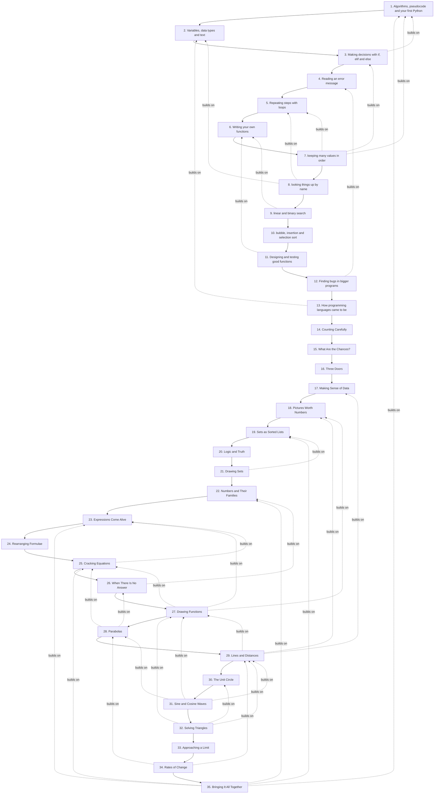

# Curriculum map

**Generated — do not edit by hand.** `python3 dev/curriculum_map.py`
rebuilds it from three files, and CI fails if this one is out of date:

- `planning/curriculum/outcomes.yaml` — every learning outcome in the
  QQI module descriptors.
- each tutorial's `covers:` frontmatter — which outcome each section
  teaches, and which it only uses.
- `planning/curriculum/out-of-scope.yaml` — what we have decided not to
  teach, so a decision stops looking like a gap.

Every link below goes to the section of the live site that does the work,
so this doubles as a way of finding where anything is taught.

## Where we stand

**115 of 116** outcomes are in place.

- 🟩 **113 taught** — a tutorial section teaches it.
- 🟦 **2 taught in part** — deliberately narrowed, and the narrowed version is written.
- 🟨 **0 used but not taught** — students meet it in passing without it ever being the subject. These are the quiet gaps: they look covered from a distance.
- 🟥 **1 not covered** — nothing in dewlab touches it.

**1 of the 1 outcomes still to write have no proposal**: `WA-LO12`. These are the ones nobody has decided how to teach yet.

### By strand

| Strand | 🟩 Taught | 🟦 Part, by choice | 🟨 Used only | 🟥 Not covered | ⬜ Out of scope |
|---|---:|---:|---:|---:|---:|
| **algebra** | 7 | 1 | 0 | 0 | 0 |
| **algorithms** | 9 | 0 | 0 | 0 | 0 |
| **calculus** | 2 | 1 | 0 | 0 | 0 |
| **complexity** | 2 | 0 | 0 | 0 | 0 |
| **css** | 1 | 0 | 0 | 0 | 0 |
| **data-entry** | 1 | 0 | 0 | 0 | 0 |
| **data-import** | 1 | 0 | 0 | 0 | 0 |
| **data-structures** | 1 | 0 | 0 | 0 | 0 |
| **database-concepts** | 2 | 0 | 0 | 0 | 0 |
| **design** | 2 | 0 | 0 | 0 | 0 |
| **design-principles** | 3 | 0 | 0 | 0 | 0 |
| **functions** | 3 | 0 | 0 | 0 | 0 |
| **geometry** | 6 | 0 | 0 | 0 | 0 |
| **html-tags** | 2 | 0 | 0 | 0 | 0 |
| **independence** | 1 | 0 | 0 | 0 | 0 |
| **linear-algebra** | 1 | 0 | 0 | 0 | 0 |
| **logic** | 2 | 0 | 0 | 0 | 0 |
| **modelling** | 2 | 0 | 0 | 0 | 0 |
| **number** | 2 | 0 | 0 | 0 | 0 |
| **oop** | 4 | 0 | 0 | 0 | 0 |
| **probability** | 10 | 0 | 0 | 0 | 0 |
| **problem-solving** | 3 | 0 | 0 | 0 | 0 |
| **process** | 2 | 0 | 0 | 0 | 0 |
| **programming** | 18 | 0 | 0 | 0 | 0 |
| **querying** | 3 | 0 | 0 | 0 | 0 |
| **reflection** | 2 | 0 | 0 | 0 | 0 |
| **reporting** | 1 | 0 | 0 | 0 | 0 |
| **sets** | 3 | 0 | 0 | 0 | 0 |
| **simulation** | 1 | 0 | 0 | 0 | 0 |
| **statistics** | 5 | 0 | 0 | 0 | 0 |
| **testing** | 1 | 0 | 0 | 0 | 0 |
| **tooling** | 2 | 0 | 0 | 1 | 0 |
| **trigonometry** | 7 | 0 | 0 | 0 | 0 |
| **web-history** | 1 | 0 | 0 | 0 | 0 |

```mermaid
graph LR
  algebra["algebra<br/>8 of 8 in place"]
  algorithms["algorithms<br/>9 of 9 in place"]
  calculus["calculus<br/>3 of 3 in place"]
  complexity["complexity<br/>2 of 2 in place"]
  css["css<br/>1 of 1 in place"]
  data_entry["data-entry<br/>1 of 1 in place"]
  data_import["data-import<br/>1 of 1 in place"]
  data_structures["data-structures<br/>1 of 1 in place"]
  database_concepts["database-concepts<br/>2 of 2 in place"]
  design["design<br/>2 of 2 in place"]
  design_principles["design-principles<br/>3 of 3 in place"]
  functions["functions<br/>3 of 3 in place"]
  geometry["geometry<br/>6 of 6 in place"]
  html_tags["html-tags<br/>2 of 2 in place"]
  independence["independence<br/>1 of 1 in place"]
  linear_algebra["linear-algebra<br/>1 of 1 in place"]
  logic["logic<br/>2 of 2 in place"]
  modelling["modelling<br/>2 of 2 in place"]
  number["number<br/>2 of 2 in place"]
  oop["oop<br/>4 of 4 in place"]
  probability["probability<br/>10 of 10 in place"]
  problem_solving["problem-solving<br/>3 of 3 in place"]
  process["process<br/>2 of 2 in place"]
  programming["programming<br/>18 of 18 in place"]
  querying["querying<br/>3 of 3 in place"]
  reflection["reflection<br/>2 of 2 in place"]
  reporting["reporting<br/>1 of 1 in place"]
  sets["sets<br/>3 of 3 in place"]
  simulation["simulation<br/>1 of 1 in place"]
  statistics["statistics<br/>5 of 5 in place"]
  testing["testing<br/>1 of 1 in place"]
  tooling["tooling<br/>2 of 3 in place"]
  trigonometry["trigonometry<br/>7 of 7 in place"]
  web_history["web-history<br/>1 of 1 in place"]

  classDef full fill:#edf7f0,stroke:#1f6b3f,color:#1f6b3f;
  classDef part fill:#fdf6ec,stroke:#b5651d,color:#7a4310;
  classDef none fill:#fdf0ef,stroke:#9b2226,color:#9b2226;
  class algebra,algorithms,calculus,complexity,css,data_entry,data_import,data_structures,database_concepts,design,design_principles,functions,geometry,html_tags,independence,linear_algebra,logic,modelling,number,oop,probability,problem_solving,process,programming,querying,reflection,reporting,sets,simulation,statistics,testing,trigonometry,web_history full;
  class tooling part;
```



## The series as it stands

Solid arrows are the reading order. A dashed arrow means the later
tutorial names the earlier one in its own text — evidence of a real
dependency rather than an intention, found by reading the tutorials
themselves. A tutorial with several dashed arrows into it is
load-bearing and expensive to move; one with none is cheap to move, and
possibly not pulling its weight where it is.



## What is missing, and where it would go

Dashed boxes are proposed. Placement is argued in
`planning/curriculum/proposed.yaml` and each has an outline in
`planning/outlines/`.

```mermaid
graph TD
  T1["1. Algorithms, pseudocode and your first Python"]
  T2["2. Variables, data types and text"]
  T3["3. Making decisions with if, elif and else"]
  T4["4. Reading an error message"]
  T5["5. Repeating steps with loops"]
  T6["6. Writing your own functions"]
  T7["7. keeping many values in order"]
  T8["8. looking things up by name"]
  T9["9. linear and binary search"]
  T10["10. bubble, insertion and selection sort"]
  T11["11. Designing and testing good functions"]
  T12["12. Finding bugs in bigger programs"]
  T13["13. How programming languages came to be"]
  T14["14. Counting Carefully"]
  T15["15. What Are the Chances?"]
  T16["16. Three Doors"]
  T17["17. Making Sense of Data"]
  T18["18. Pictures Worth Numbers"]
  T19["19. Sets as Sorted Lists"]
  T20["20. Logic and Truth"]
  T21["21. Drawing Sets"]
  T22["22. Numbers and Their Families"]
  T23["23. Expressions Come Alive"]
  T24["24. Rearranging Formulae"]
  T25["25. Cracking Equations"]
  T26["26. When There Is No Answer"]
  T27["27. Drawing Functions"]
  T28["28. Parabolas"]
  T29["29. Lines and Distances"]
  T30["30. The Unit Circle"]
  T31["31. Sine and Cosine Waves"]
  T32["32. Solving Triangles"]
  T33["33. Approaching a Limit"]
  T34["34. Rates of Change"]
  T35["35. Bringing It All Together"]

  T1 --> T2
  T2 --> T3
  T3 --> T4
  T4 --> T5
  T5 --> T6
  T6 --> T7
  T7 --> T8
  T8 --> T9
  T9 --> T10
  T10 --> T11
  T11 --> T12
  T12 --> T13
  T13 --> T14
  T14 --> T15
  T15 --> T16
  T16 --> T17
  T17 --> T18
  T18 --> T19
  T19 --> T20
  T20 --> T21
  T21 --> T22
  T22 --> T23
  T23 --> T24
  T24 --> T25
  T25 --> T26
  T26 --> T27
  T27 --> T28
  T28 --> T29
  T29 --> T30
  T30 --> T31
  T31 --> T32
  T32 --> T33
  T33 --> T34
  T34 --> T35


  classDef new fill:#fdf6ec,stroke:#b5651d,color:#7a4310,stroke-dasharray:4 3;
  class  new;
```

| Proposed | Goes after | Closes | Size |
|---|---|---|---|

## Every outcome

### Maths for Information Technology 5N18396

#### 1. Basic Arithmetic and Algebra

| Outcome | | Where |
|---|---|---|
| `MIT-1.1` Operations in N, Z, Q, R; powers (the syllabus says indices) and logarithms | 🟩 | [Making decisions with if, elif and else — Classifying Numbers: A Mathematical Application](https://deweydex.github.io/dewlab/tutorials/making-decisions.html#classifying-numbers-a-mathematical-application)<br/>[Numbers and Their Families — Powers and Their Rules](https://deweydex.github.io/dewlab/tutorials/numbers-and-their-families.html#powers-and-their-rules)<br/>[Numbers and Their Families — Logarithms: The Inverse of Powers](https://deweydex.github.io/dewlab/tutorials/numbers-and-their-families.html#logarithms-the-inverse-of-powers) |
| `MIT-1.2` Area and perimeter: square, rectangle, triangle, circle | 🟩 | [Numbers and Their Families — Practical Geometry: Formulas as Functions](https://deweydex.github.io/dewlab/tutorials/numbers-and-their-families.html#practical-geometry-formulas-as-functions) |
| `MIT-1.3` Volume and surface area: cube, cylinder, cone, sphere | 🟩 | [Numbers and Their Families — Practical Geometry: Formulas as Functions](https://deweydex.github.io/dewlab/tutorials/numbers-and-their-families.html#practical-geometry-formulas-as-functions) |
| `MIT-1.4` Binary and hexadecimal arithmetic and conversion | 🟩 | [Variables, data types and text — Number Systems: How Computers Count](https://deweydex.github.io/dewlab/tutorials/storing-and-computing.html#number-systems-how-computers-count)<br/>_used in:_ [How programming languages came to be — The Only Language the Machine Understands](https://deweydex.github.io/dewlab/tutorials/how-we-got-here.html#the-only-language-the-machine-understands)<br/>_used in:_ [How programming languages came to be — Assembly, and Why Hexadecimal Exists](https://deweydex.github.io/dewlab/tutorials/how-we-got-here.html#assembly-and-why-hexadecimal-exists) |
| `MIT-1.5` Distinguish an expression from an equation | 🟦 | [Expressions Come Alive — Expressions versus Equations](https://deweydex.github.io/dewlab/tutorials/expressions-come-alive.html#expressions-versus-equations)<br/>**Narrowed:** not the formal expression-versus-equation distinction as an assessed item |
| `MIT-1.6` Evaluate, expand and simplify expressions | 🟩 | [Expressions Come Alive — Representing Polynomials](https://deweydex.github.io/dewlab/tutorials/expressions-come-alive.html#representing-polynomials)<br/>[Expressions Come Alive — Evaluating Polynomials](https://deweydex.github.io/dewlab/tutorials/expressions-come-alive.html#evaluating-polynomials)<br/>[Expressions Come Alive — Displaying Polynomials](https://deweydex.github.io/dewlab/tutorials/expressions-come-alive.html#displaying-polynomials)<br/>[Expressions Come Alive — Adding Polynomials](https://deweydex.github.io/dewlab/tutorials/expressions-come-alive.html#adding-polynomials)<br/>[Expressions Come Alive — Subtracting and Scaling](https://deweydex.github.io/dewlab/tutorials/expressions-come-alive.html#subtracting-and-scaling)<br/>_used in:_ [Bringing It All Together — Problem 1: The Polynomial Workshop](https://deweydex.github.io/dewlab/tutorials/bringing-it-all-together.html#problem-1-the-polynomial-workshop) |
| `MIT-1.7` Transpose formulae; operate on rational algebraic expressions | 🟩 | [Rearranging Formulae — The Same Formula, Five Ways](https://deweydex.github.io/dewlab/tutorials/rearranging-formulae.html#the-same-formula-five-ways)<br/>[Rearranging Formulae — The Moves](https://deweydex.github.io/dewlab/tutorials/rearranging-formulae.html#the-moves)<br/>[Rearranging Formulae — When the Unknown Is Underneath](https://deweydex.github.io/dewlab/tutorials/rearranging-formulae.html#when-the-unknown-is-underneath)<br/>[Rearranging Formulae — Checking Yourself](https://deweydex.github.io/dewlab/tutorials/rearranging-formulae.html#checking-yourself)<br/>_used in:_ [Cracking Equations — Solving Linear Equations](https://deweydex.github.io/dewlab/tutorials/cracking-equations.html#solving-linear-equations) |
| `MIT-1.8` Multiply linear expressions into quadratics and cubics | 🟩 | [Expressions Come Alive — Multiplying Polynomials](https://deweydex.github.io/dewlab/tutorials/expressions-come-alive.html#multiplying-polynomials)<br/>_used in:_ [Bringing It All Together — Problem 1: The Polynomial Workshop](https://deweydex.github.io/dewlab/tutorials/bringing-it-all-together.html#problem-1-the-polynomial-workshop) |
| `MIT-1.9` Factor quadratics by inspection and solve them | 🟩 | [Cracking Equations — Factorisation](https://deweydex.github.io/dewlab/tutorials/cracking-equations.html#factorisation) |
| `MIT-1.10` Solve quadratics, including complex roots | 🟩 | [When There Is No Answer — The Cliff Edge](https://deweydex.github.io/dewlab/tutorials/complex-roots.html#the-cliff-edge)<br/>[When There Is No Answer — Inventing a Number](https://deweydex.github.io/dewlab/tutorials/complex-roots.html#inventing-a-number)<br/>[When There Is No Answer — Roots That Are Not Real](https://deweydex.github.io/dewlab/tutorials/complex-roots.html#roots-that-are-not-real)<br/>[When There Is No Answer — They Come in Pairs](https://deweydex.github.io/dewlab/tutorials/complex-roots.html#they-come-in-pairs)<br/>_used in:_ [Cracking Equations — The Quadratic Formula](https://deweydex.github.io/dewlab/tutorials/cracking-equations.html#the-quadratic-formula) |
| `MIT-1.11` Solve linear inequalities | 🟩 | [Cracking Equations — Solving Inequalities](https://deweydex.github.io/dewlab/tutorials/cracking-equations.html#solving-inequalities) |
| `MIT-1.12` Simultaneous equations in two and three unknowns | 🟩 | [Cracking Equations — Simultaneous Equations](https://deweydex.github.io/dewlab/tutorials/cracking-equations.html#simultaneous-equations)<br/>_used in:_ [Bringing It All Together — Problem 2: Where Do They Meet?](https://deweydex.github.io/dewlab/tutorials/bringing-it-all-together.html#problem-2-where-do-they-meet)<br/>_used in:_ [Systems of equations: solving them with matrices — Three unknowns, row by row](https://deweydex.github.io/dewlab/tutorials/solving-systems.html#three-unknowns-row-by-row) |

#### 2. Set Theory and Boolean Logic

| Outcome | | Where |
|---|---|---|
| `MIT-2.1` Set language: N, Z, Q, R, C, the empty set; finite, infinite, cardinality | 🟩 | [Numbers and Their Families — The Number Domains](https://deweydex.github.io/dewlab/tutorials/numbers-and-their-families.html#the-number-domains)<br/>[Sets as Sorted Lists — Making a Set](https://deweydex.github.io/dewlab/tutorials/sets-as-sorted-lists.html#making-a-set)<br/>[Sets as Sorted Lists — Membership Testing](https://deweydex.github.io/dewlab/tutorials/sets-as-sorted-lists.html#membership-testing)<br/>[Sets as Sorted Lists — Set Language and Notation](https://deweydex.github.io/dewlab/tutorials/sets-as-sorted-lists.html#set-language-and-notation)<br/>_used in:_ [When There Is No Answer — Inventing a Number](https://deweydex.github.io/dewlab/tutorials/complex-roots.html#inventing-a-number) |
| `MIT-2.2` Set operations: union, intersection, complement, symmetric difference, Cartesian product, power set | 🟩 | [Sets as Sorted Lists — Set Operations: The Merge Pattern](https://deweydex.github.io/dewlab/tutorials/sets-as-sorted-lists.html#set-operations-the-merge-pattern)<br/>[Sets as Sorted Lists — Sets in Practice](https://deweydex.github.io/dewlab/tutorials/sets-as-sorted-lists.html#sets-in-practice)<br/>_used in:_ [Bringing It All Together — Problem 3: Sets of Solutions](https://deweydex.github.io/dewlab/tutorials/bringing-it-all-together.html#problem-3-sets-of-solutions) |
| `MIT-2.3` Venn diagrams for two and three sets | 🟩 | [Drawing Sets — Two Circles, from Real Sets](https://deweydex.github.io/dewlab/tutorials/venn-diagrams.html#two-circles-from-real-sets)<br/>[Drawing Sets — The Regions Have Names You Already Know](https://deweydex.github.io/dewlab/tutorials/venn-diagrams.html#the-regions-have-names-you-already-know)<br/>[Drawing Sets — Three Sets, Which Is Where It Earns Its Place](https://deweydex.github.io/dewlab/tutorials/venn-diagrams.html#three-sets-which-is-where-it-earns-its-place)<br/>[Drawing Sets — The Same Laws, in a Different Notation](https://deweydex.github.io/dewlab/tutorials/venn-diagrams.html#the-same-laws-in-a-different-notation) |
| `MIT-2.4` Truth tables: AND, NOT, OR, XOR | 🟩 | [Logic and Truth — Every Possible Case](https://deweydex.github.io/dewlab/tutorials/logic-and-truth.html#every-possible-case)<br/>[Logic and Truth — Exclusive Or](https://deweydex.github.io/dewlab/tutorials/logic-and-truth.html#exclusive-or)<br/>_used in:_ [Making decisions with if, elif and else — Boolean Operators: Combining Conditions](https://deweydex.github.io/dewlab/tutorials/making-decisions.html#boolean-operators-combining-conditions) |
| `MIT-2.5` De Morgan's Laws | 🟩 | [Logic and Truth — De Morgan's Laws](https://deweydex.github.io/dewlab/tutorials/logic-and-truth.html#de-morgans-laws)<br/>[Logic and Truth — Where You Have Already Used This](https://deweydex.github.io/dewlab/tutorials/logic-and-truth.html#where-you-have-already-used-this)<br/>[Logic and Truth — The Same Shapes, on Sets](https://deweydex.github.io/dewlab/tutorials/logic-and-truth.html#the-same-shapes-on-sets) |

#### 3. Functions and Calculus

| Outcome | | Where |
|---|---|---|
| `MIT-3.1` The function and inverse function concept | 🟩 | [Drawing Functions — A Function Is a Machine](https://deweydex.github.io/dewlab/tutorials/drawing-functions.html#a-function-is-a-machine)<br/>[Drawing Functions — Undoing a Function](https://deweydex.github.io/dewlab/tutorials/drawing-functions.html#undoing-a-function)<br/>_used in:_ [Writing your own functions — Functions as Input-Output Machines](https://deweydex.github.io/dewlab/tutorials/writing-your-own-functions.html#functions-as-input-output-machines) |
| `MIT-3.2` Graph linear, quadratic and cubic functions; solve from a graph | 🟩 | [Drawing Functions — A Machine Has a Picture](https://deweydex.github.io/dewlab/tutorials/drawing-functions.html#a-machine-has-a-picture)<br/>[Drawing Functions — Straight Lines](https://deweydex.github.io/dewlab/tutorials/drawing-functions.html#straight-lines)<br/>[Drawing Functions — Curves That Bend](https://deweydex.github.io/dewlab/tutorials/drawing-functions.html#curves-that-bend)<br/>[Drawing Functions — Reading an Answer Off the Picture](https://deweydex.github.io/dewlab/tutorials/drawing-functions.html#reading-an-answer-off-the-picture)<br/>_used in:_ [Matrix transformations: what a matrix does to a picture — Where do the corners go?](https://deweydex.github.io/dewlab/tutorials/what-a-matrix-does-to-a-picture.html#where-do-the-corners-go) |
| `MIT-3.3` Define and graph the trigonometric functions | 🟩 | [Sine and Cosine Waves — Unrolling the Circle](https://deweydex.github.io/dewlab/tutorials/sine-and-cosine-waves.html#unrolling-the-circle)<br/>[Sine and Cosine Waves — Why It Repeats](https://deweydex.github.io/dewlab/tutorials/sine-and-cosine-waves.html#why-it-repeats)<br/>[Sine and Cosine Waves — The Four Numbers](https://deweydex.github.io/dewlab/tutorials/sine-and-cosine-waves.html#the-four-numbers)<br/>[Sine and Cosine Waves — Where a Wave Comes From](https://deweydex.github.io/dewlab/tutorials/sine-and-cosine-waves.html#where-a-wave-comes-from) |
| `MIT-3.4` Complete the square to find roots and vertex | 🟩 | [Parabolas — Every Quadratic Is the Same Curve](https://deweydex.github.io/dewlab/tutorials/parabolas.html#every-quadratic-is-the-same-curve)<br/>[Parabolas — The Form That Tells You Where the Bottom Is](https://deweydex.github.io/dewlab/tutorials/parabolas.html#the-form-that-tells-you-where-the-bottom-is)<br/>[Parabolas — Doing the Rearrangement](https://deweydex.github.io/dewlab/tutorials/parabolas.html#doing-the-rearrangement)<br/>[Parabolas — Roots from the Same Form](https://deweydex.github.io/dewlab/tutorials/parabolas.html#roots-from-the-same-form) |
| `MIT-3.5` The limit of a function | 🟩 | [Approaching a Limit — A Hole in a Line](https://deweydex.github.io/dewlab/tutorials/approaching-a-limit.html#a-hole-in-a-line)<br/>[Approaching a Limit — Getting Closer Without Arriving](https://deweydex.github.io/dewlab/tutorials/approaching-a-limit.html#getting-closer-without-arriving)<br/>[Approaching a Limit — When There Is No Limit](https://deweydex.github.io/dewlab/tutorials/approaching-a-limit.html#when-there-is-no-limit)<br/>[Approaching a Limit — Why Anybody Needs This](https://deweydex.github.io/dewlab/tutorials/approaching-a-limit.html#why-anybody-needs-this) |
| `MIT-3.6` The derivative as a limit, a tangent slope, a rate of change | 🟩 | [Rates of Change — The Slope of Something That Is Not Straight](https://deweydex.github.io/dewlab/tutorials/rates-of-change.html#the-slope-of-something-that-is-not-straight)<br/>[Rates of Change — Three Descriptions of One Number](https://deweydex.github.io/dewlab/tutorials/rates-of-change.html#three-descriptions-of-one-number)<br/>[Rates of Change — The Derivative as a Function](https://deweydex.github.io/dewlab/tutorials/rates-of-change.html#the-derivative-as-a-function) |
| `MIT-3.7` Sum, product, quotient and chain rules | 🟦 | [Rates of Change — Rules Instead of Limits](https://deweydex.github.io/dewlab/tutorials/rates-of-change.html#rules-instead-of-limits)<br/>[Rates of Change — The Chain Rule](https://deweydex.github.io/dewlab/tutorials/rates-of-change.html#the-chain-rule)<br/>**Narrowed:** not the quotient rule, and integration by parts |

#### 4. Geometry and Trigonometry

| Outcome | | Where |
|---|---|---|
| `MIT-4.1` Linear equations in the form ax + by + c = 0 | 🟩 | [Lines and Distances — A Line You Have Already Written](https://deweydex.github.io/dewlab/tutorials/lines-and-distances.html#a-line-you-have-already-written)<br/>[Lines and Distances — The Line That Breaks the Formula](https://deweydex.github.io/dewlab/tutorials/lines-and-distances.html#the-line-that-breaks-the-formula) |
| `MIT-4.2` Slope; parallel and perpendicular lines | 🟩 | [Lines and Distances — Slope, as How Fast Something Changes](https://deweydex.github.io/dewlab/tutorials/lines-and-distances.html#slope-as-how-fast-something-changes)<br/>[Lines and Distances — Parallel and Perpendicular](https://deweydex.github.io/dewlab/tutorials/lines-and-distances.html#parallel-and-perpendicular) |
| `MIT-4.3` Midpoint and length of a line segment | 🟩 | [Lines and Distances — Midpoint, Which Needs No Theory](https://deweydex.github.io/dewlab/tutorials/lines-and-distances.html#midpoint-which-needs-no-theory)<br/>[Lines and Distances — How Far Apart, and the Theorem That Answers It](https://deweydex.github.io/dewlab/tutorials/lines-and-distances.html#how-far-apart-and-the-theorem-that-answers-it) |
| `MIT-4.4` The Pythagorean theorem | 🟩 | [Lines and Distances — How Far Apart, and the Theorem That Answers It](https://deweydex.github.io/dewlab/tutorials/lines-and-distances.html#how-far-apart-and-the-theorem-that-answers-it) |
| `MIT-4.5` Degree and radian measure | 🟩 | [The Unit Circle — Measuring the Walk](https://deweydex.github.io/dewlab/tutorials/the-unit-circle.html#measuring-the-walk) |
| `MIT-4.6` sin, cos, tan and the unit circle: amplitude, phase, period | 🟩 | [The Unit Circle — Going Round in Circles](https://deweydex.github.io/dewlab/tutorials/the-unit-circle.html#going-round-in-circles)<br/>[The Unit Circle — The Names for Those Two Columns](https://deweydex.github.io/dewlab/tutorials/the-unit-circle.html#the-names-for-those-two-columns)<br/>[The Unit Circle — Tangent, Which Is a Slope](https://deweydex.github.io/dewlab/tutorials/the-unit-circle.html#tangent-which-is-a-slope)<br/>_used in:_ [3D animation: a camera and a ball in orbit — A Ball in Orbit](https://deweydex.github.io/dewlab/tutorials/a-ball-in-orbit.html#a-ball-in-orbit)<br/>_used in:_ [Homogeneous coordinates and the projection matrix — Field of View](https://deweydex.github.io/dewlab/tutorials/the-fourth-number.html#field-of-view)<br/>_used in:_ [The rotation matrix: turning a cube in 3D — A Matrix That Turns](https://deweydex.github.io/dewlab/tutorials/turning-a-cube.html#a-matrix-that-turns) |
| `MIT-4.7` Trigonometric ratios in surd form | 🟩 | [The Unit Circle — The Landmark Points](https://deweydex.github.io/dewlab/tutorials/the-unit-circle.html#the-landmark-points) |
| `MIT-4.8` Triangle area as one half a b sin theta | 🟩 | [Solving Triangles — Area, and the Height Nobody Drew](https://deweydex.github.io/dewlab/tutorials/solving-triangles.html#area-and-the-height-nobody-drew) |
| `MIT-4.9` Practical right-triangle trigonometry | 🟩 | [Solving Triangles — When There Is a Right Angle](https://deweydex.github.io/dewlab/tutorials/solving-triangles.html#when-there-is-a-right-angle)<br/>[Solving Triangles — Putting It Together](https://deweydex.github.io/dewlab/tutorials/solving-triangles.html#putting-it-together) |
| `MIT-4.10` The Sine Rule and the Cosine Rule | 🟩 | [Solving Triangles — The Cosine Rule](https://deweydex.github.io/dewlab/tutorials/solving-triangles.html#the-cosine-rule)<br/>[Solving Triangles — The Sine Rule, and Its Two Answers](https://deweydex.github.io/dewlab/tutorials/solving-triangles.html#the-sine-rule-and-its-two-answers)<br/>[Solving Triangles — Putting It Together](https://deweydex.github.io/dewlab/tutorials/solving-triangles.html#putting-it-together) |

#### 5. Probability and Statistics

| Outcome | | Where |
|---|---|---|
| `MIT-5.1` List the outcomes of an experiment | 🟩 | [What Are the Chances? — Basic Probability](https://deweydex.github.io/dewlab/tutorials/what-are-the-chances.html#basic-probability) |
| `MIT-5.2` The fundamental principle of counting | 🟩 | [Counting Carefully — A Practical Application: Password Strength](https://deweydex.github.io/dewlab/tutorials/counting-carefully.html#a-practical-application-password-strength) |
| `MIT-5.3` Arrangements of n objects (n factorial) | 🟩 | [Counting Carefully — Factorials: The Foundation](https://deweydex.github.io/dewlab/tutorials/counting-carefully.html#factorials-the-foundation) |
| `MIT-5.4` Permutations P(n, r) | 🟩 | [Counting Carefully — Permutations: Order Matters](https://deweydex.github.io/dewlab/tutorials/counting-carefully.html#permutations-order-matters) |
| `MIT-5.5` Combinations C(n, r) | 🟩 | [Counting Carefully — Combinations: Order Does Not Matter](https://deweydex.github.io/dewlab/tutorials/counting-carefully.html#combinations-order-does-not-matter) |
| `MIT-5.6` Probability as a scale from 0 to 1 | 🟩 | [What Are the Chances? — Basic Probability](https://deweydex.github.io/dewlab/tutorials/what-are-the-chances.html#basic-probability)<br/>_used in:_ [Three Doors — Why staying feels fine](https://deweydex.github.io/dewlab/tutorials/three-doors.html#why-staying-feels-fine)<br/>_used in:_ [Three Doors — Playing it ten thousand times](https://deweydex.github.io/dewlab/tutorials/three-doors.html#playing-it-ten-thousand-times) |
| `MIT-5.7` Probability from equally likely outcomes | 🟩 | [Three Doors — Three cases you can count](https://deweydex.github.io/dewlab/tutorials/three-doors.html#three-cases-you-can-count)<br/>[What Are the Chances? — Basic Probability](https://deweydex.github.io/dewlab/tutorials/what-are-the-chances.html#basic-probability)<br/>_used in:_ [Three Doors — Playing it ten thousand times](https://deweydex.github.io/dewlab/tutorials/three-doors.html#playing-it-ten-thousand-times)<br/>_used in:_ [Three Doors — A host who is not paying attention](https://deweydex.github.io/dewlab/tutorials/three-doors.html#a-host-who-is-not-paying-attention)<br/>_used in:_ [What Are the Chances? — Simulation: Testing Probability with Code](https://deweydex.github.io/dewlab/tutorials/what-are-the-chances.html#simulation-testing-probability-with-code) |
| `MIT-5.8` Compound probability: independent and mutually exclusive events | 🟩 | [What Are the Chances? — Compound Events](https://deweydex.github.io/dewlab/tutorials/what-are-the-chances.html#compound-events)<br/>[What Are the Chances? — Conditional Probability](https://deweydex.github.io/dewlab/tutorials/what-are-the-chances.html#conditional-probability) |
| `MIT-5.9` Data types: nominal, ordinal, discrete, continuous | 🟩 | [Making Sense of Data — Data Types](https://deweydex.github.io/dewlab/tutorials/making-sense-of-data.html#data-types) |
| `MIT-5.10` Effectiveness of displays: pie, histogram, stem-and-leaf | 🟩 | [Making Sense of Data — Visualization with matplotlib](https://deweydex.github.io/dewlab/tutorials/making-sense-of-data.html#visualization-with-matplotlib)<br/>[Pictures Worth Numbers — Why Visualize?](https://deweydex.github.io/dewlab/tutorials/pictures-worth-numbers.html#why-visualize)<br/>[Pictures Worth Numbers — Choosing the Right Chart](https://deweydex.github.io/dewlab/tutorials/pictures-worth-numbers.html#choosing-the-right-chart)<br/>[Pictures Worth Numbers — Good Practices for Visualization](https://deweydex.github.io/dewlab/tutorials/pictures-worth-numbers.html#good-practices-for-visualization) |
| `MIT-5.11` Frequency tables and histograms | 🟩 | [Making Sense of Data — Frequency Distributions](https://deweydex.github.io/dewlab/tutorials/making-sense-of-data.html#frequency-distributions) |
| `MIT-5.12` Mean, median, mode, range, standard deviation | 🟩 | [Making Sense of Data — Measures of Central Tendency](https://deweydex.github.io/dewlab/tutorials/making-sense-of-data.html#measures-of-central-tendency)<br/>[Making Sense of Data — Measures of Spread](https://deweydex.github.io/dewlab/tutorials/making-sense-of-data.html#measures-of-spread)<br/>[Pictures Worth Numbers — Combining Statistics and Visualization](https://deweydex.github.io/dewlab/tutorials/pictures-worth-numbers.html#combining-statistics-and-visualization) |
| `MIT-5.13` Merits and limitations of the averages with skewed data | 🟩 | [Making Sense of Data — A note on limitations](https://deweydex.github.io/dewlab/tutorials/making-sense-of-data.html#a-note-on-limitations) |

#### 6. Algorithms and Computations

| Outcome | | Where |
|---|---|---|
| `MIT-6.1` The concept of an algorithm | 🟩 | [Algorithms, pseudocode and your first Python — What is an Algorithm?](https://deweydex.github.io/dewlab/tutorials/first-steps.html#what-is-an-algorithm) |
| `MIT-6.2` An algorithm as a function on a domain of inputs | 🟩 | [Lists: keeping many values in order — Mathematical Sequences as Functions](https://deweydex.github.io/dewlab/tutorials/lists-and-sequences.html#mathematical-sequences-as-functions)<br/>[Writing your own functions — Functions as Input-Output Machines](https://deweydex.github.io/dewlab/tutorials/writing-your-own-functions.html#functions-as-input-output-machines) |
| `MIT-6.3` Manipulate lists and arrays, including addition and multiplication | 🟩 | [Lists: keeping many values in order — Lists: Ordered Collections](https://deweydex.github.io/dewlab/tutorials/lists-and-sequences.html#lists-ordered-collections)<br/>[Lists: keeping many values in order — Building Lists with Loops](https://deweydex.github.io/dewlab/tutorials/lists-and-sequences.html#building-lists-with-loops)<br/>[Lists: keeping many values in order — Comprehensions: A Loop That Builds a List](https://deweydex.github.io/dewlab/tutorials/lists-and-sequences.html#comprehensions-a-loop-that-builds-a-list)<br/>[Lists: keeping many values in order — The Dot Product: Lists Meet Arithmetic](https://deweydex.github.io/dewlab/tutorials/lists-and-sequences.html#the-dot-product-lists-meet-arithmetic)<br/>_used in:_ [Matrices: adding, scaling and transposing a grid of numbers — A grid that draws a picture](https://deweydex.github.io/dewlab/tutorials/grid-of-numbers.html#a-grid-that-draws-a-picture) |
| `MIT-6.4` Index, sigma and pi notation | 🟩 | [Repeating steps with loops — Sigma Notation: Mathematics Meets Loops](https://deweydex.github.io/dewlab/tutorials/repeating-yourself.html#sigma-notation-mathematics-meets-loops) |
| `MIT-6.5` Lists and arrays applied to simple problems | 🟩 | [Lists: keeping many values in order — Looping Over Lists](https://deweydex.github.io/dewlab/tutorials/lists-and-sequences.html#looping-over-lists) |
| `MIT-6.6` Divide and conquer | 🟩 | [Searching a list: linear and binary search — Divide and Conquer](https://deweydex.github.io/dewlab/tutorials/finding-things.html#divide-and-conquer) |
| `MIT-6.7` Iterate over a one-dimensional array by index | 🟩 | [Lists: keeping many values in order — Building Lists with Loops](https://deweydex.github.io/dewlab/tutorials/lists-and-sequences.html#building-lists-with-loops)<br/>[Lists: keeping many values in order — Looping Over Lists](https://deweydex.github.io/dewlab/tutorials/lists-and-sequences.html#looping-over-lists)<br/>[Repeating steps with loops — For Loops: When You Know How Many Times](https://deweydex.github.io/dewlab/tutorials/repeating-yourself.html#for-loops-when-you-know-how-many-times)<br/>[Repeating steps with loops — Building Up Gradually: Counting with Conditions](https://deweydex.github.io/dewlab/tutorials/repeating-yourself.html#building-up-gradually-counting-with-conditions) |
| `MIT-6.8` Recursion; linear and binary search; bubble, insertion, selection and shell sort | 🟩 | [Searching a list: linear and binary search — Linear Search: The Straightforward Approach](https://deweydex.github.io/dewlab/tutorials/finding-things.html#linear-search-the-straightforward-approach)<br/>[Searching a list: linear and binary search — Binary Search: The Power of Sorted Data](https://deweydex.github.io/dewlab/tutorials/finding-things.html#binary-search-the-power-of-sorted-data)<br/>[Sorting a list: bubble, insertion and selection sort — Bubble Sort: Let Things Rise](https://deweydex.github.io/dewlab/tutorials/putting-things-in-order.html#bubble-sort-let-things-rise)<br/>[Sorting a list: bubble, insertion and selection sort — Insertion Sort: Sort Like You Sort Cards](https://deweydex.github.io/dewlab/tutorials/putting-things-in-order.html#insertion-sort-sort-like-you-sort-cards)<br/>[Sorting a list: bubble, insertion and selection sort — Selection Sort: Find the Smallest](https://deweydex.github.io/dewlab/tutorials/putting-things-in-order.html#selection-sort-find-the-smallest)<br/>[Sorting a list: bubble, insertion and selection sort — Comparing Our Sorts](https://deweydex.github.io/dewlab/tutorials/putting-things-in-order.html#comparing-our-sorts)<br/>_used in:_ [Sorting a list: bubble, insertion and selection sort — Optional Challenges](https://deweydex.github.io/dewlab/tutorials/putting-things-in-order.html#optional-challenges) |

### Programming and Design Principles 5N2927

| Outcome | | Where |
|---|---|---|
| `PDP-LO1` The history of computer programming | 🟩 | [How programming languages came to be — Before There Were Computers](https://deweydex.github.io/dewlab/tutorials/how-we-got-here.html#before-there-were-computers)<br/>[How programming languages came to be — The Only Language the Machine Understands](https://deweydex.github.io/dewlab/tutorials/how-we-got-here.html#the-only-language-the-machine-understands)<br/>[How programming languages came to be — Assembly, and Why Hexadecimal Exists](https://deweydex.github.io/dewlab/tutorials/how-we-got-here.html#assembly-and-why-hexadecimal-exists)<br/>[How programming languages came to be — Languages People Can Read](https://deweydex.github.io/dewlab/tutorials/how-we-got-here.html#languages-people-can-read) |
| `PDP-LO2` Algorithms and their real-world application | 🟩 | [Algorithms, pseudocode and your first Python — What is an Algorithm?](https://deweydex.github.io/dewlab/tutorials/first-steps.html#what-is-an-algorithm) |
| `PDP-LO3` Differentiate programming languages by their characteristics | 🟩 | [How programming languages came to be — Languages People Can Read](https://deweydex.github.io/dewlab/tutorials/how-we-got-here.html#languages-people-can-read)<br/>[How programming languages came to be — The Same Problem, Four Ways](https://deweydex.github.io/dewlab/tutorials/how-we-got-here.html#the-same-problem-four-ways) |
| `PDP-LO4` Procedural syntax: storage, expressions, statements, input and output, keywords, operators | 🟩 | [Algorithms, pseudocode and your first Python — A Few More Things Python Can Do](https://deweydex.github.io/dewlab/tutorials/first-steps.html#a-few-more-things-python-can-do)<br/>[Variables, data types and text — Variables: Giving Names to Things](https://deweydex.github.io/dewlab/tutorials/storing-and-computing.html#variables-giving-names-to-things)<br/>[Variables, data types and text — Data Types: Different Kinds of Information](https://deweydex.github.io/dewlab/tutorials/storing-and-computing.html#data-types-different-kinds-of-information)<br/>[Variables, data types and text — Type Conversion](https://deweydex.github.io/dewlab/tutorials/storing-and-computing.html#type-conversion)<br/>[Variables, data types and text — Putting Values into Text](https://deweydex.github.io/dewlab/tutorials/storing-and-computing.html#putting-values-into-text)<br/>_used in:_ [Dictionaries: looking things up by name — Making a Dictionary](https://deweydex.github.io/dewlab/tutorials/looking-things-up-by-name.html#making-a-dictionary) |
| `PDP-LO5` The sequential nature of problem solving | 🟩 | [Algorithms, pseudocode and your first Python — Pseudocode: Planning Before Coding](https://deweydex.github.io/dewlab/tutorials/first-steps.html#pseudocode-planning-before-coding) |
| `PDP-LO6` Structured design: pseudocode, storage, selection and iteration | 🟩 | [Algorithms, pseudocode and your first Python — Pseudocode: Planning Before Coding](https://deweydex.github.io/dewlab/tutorials/first-steps.html#pseudocode-planning-before-coding)<br/>[Making decisions with if, elif and else — Comparisons: True or False?](https://deweydex.github.io/dewlab/tutorials/making-decisions.html#comparisons-true-or-false)<br/>[Making decisions with if, elif and else — If Statements: Choosing a Path](https://deweydex.github.io/dewlab/tutorials/making-decisions.html#if-statements-choosing-a-path)<br/>[Making decisions with if, elif and else — If-Else: Two Paths](https://deweydex.github.io/dewlab/tutorials/making-decisions.html#if-else-two-paths)<br/>[Making decisions with if, elif and else — Elif: Multiple Paths](https://deweydex.github.io/dewlab/tutorials/making-decisions.html#elif-multiple-paths)<br/>[Making decisions with if, elif and else — Boolean Operators: Combining Conditions](https://deweydex.github.io/dewlab/tutorials/making-decisions.html#boolean-operators-combining-conditions)<br/>[Repeating steps with loops — While Loops: Repeat Until Done](https://deweydex.github.io/dewlab/tutorials/repeating-yourself.html#while-loops-repeat-until-done)<br/>[Repeating steps with loops — For Loops: When You Know How Many Times](https://deweydex.github.io/dewlab/tutorials/repeating-yourself.html#for-loops-when-you-know-how-many-times)<br/>[Repeating steps with loops — Nested Loops](https://deweydex.github.io/dewlab/tutorials/repeating-yourself.html#nested-loops) |
| `PDP-LO7` Develop documented programs for familiar and unfamiliar problems | 🟩 | [Designing and testing good functions — Handling Edge Cases](https://deweydex.github.io/dewlab/tutorials/building-reusable-tools.html#handling-edge-cases)<br/>[Variables, data types and text — Putting It Together: A Small Program](https://deweydex.github.io/dewlab/tutorials/storing-and-computing.html#putting-it-together-a-small-program) |
| `PDP-LO8` Modularisation: functions, procedures, scope, parameter passing | 🟩 | [Designing and testing good functions — What Makes a Good Function?](https://deweydex.github.io/dewlab/tutorials/building-reusable-tools.html#what-makes-a-good-function)<br/>[Designing and testing good functions — Functions Calling Functions](https://deweydex.github.io/dewlab/tutorials/building-reusable-tools.html#functions-calling-functions)<br/>[Designing and testing good functions — Variable Scope Revisited](https://deweydex.github.io/dewlab/tutorials/building-reusable-tools.html#variable-scope-revisited)<br/>[Pictures Worth Numbers — Writing Reusable Plotting Functions](https://deweydex.github.io/dewlab/tutorials/pictures-worth-numbers.html#writing-reusable-plotting-functions)<br/>[Writing your own functions — Defining a Function](https://deweydex.github.io/dewlab/tutorials/writing-your-own-functions.html#defining-a-function)<br/>[Writing your own functions — Giving a Value Back: return](https://deweydex.github.io/dewlab/tutorials/writing-your-own-functions.html#giving-a-value-back-return)<br/>[Writing your own functions — Return or Print?](https://deweydex.github.io/dewlab/tutorials/writing-your-own-functions.html#return-or-print)<br/>[Writing your own functions — Functions That Use Other Functions](https://deweydex.github.io/dewlab/tutorials/writing-your-own-functions.html#functions-that-use-other-functions)<br/>[Writing your own functions — Scope: Where Variables Live](https://deweydex.github.io/dewlab/tutorials/writing-your-own-functions.html#scope-where-variables-live) |
| `PDP-LO9` Interpret compiler and linker messages and react appropriately | 🟩 | [Reading an error message — Three Kinds of Wrong](https://deweydex.github.io/dewlab/tutorials/reading-an-error-message.html#three-kinds-of-wrong)<br/>[Reading an error message — Errors Python Catches Before It Starts](https://deweydex.github.io/dewlab/tutorials/reading-an-error-message.html#errors-python-catches-before-it-starts)<br/>[Reading an error message — Errors That Happen While It Runs](https://deweydex.github.io/dewlab/tutorials/reading-an-error-message.html#errors-that-happen-while-it-runs)<br/>[Reading an error message — Reading a Traceback](https://deweydex.github.io/dewlab/tutorials/reading-an-error-message.html#reading-a-traceback)<br/>[Reading an error message — When Nothing Looks Wrong](https://deweydex.github.io/dewlab/tutorials/reading-an-error-message.html#when-nothing-looks-wrong)<br/>[Finding bugs in bigger programs — Errors From Lists and Dictionaries](https://deweydex.github.io/dewlab/tutorials/when-it-goes-wrong.html#errors-from-lists-and-dictionaries)<br/>[Finding bugs in bigger programs — Tracebacks Through Several Functions](https://deweydex.github.io/dewlab/tutorials/when-it-goes-wrong.html#tracebacks-through-several-functions)<br/>[Finding bugs in bigger programs — The Dangerous Kind](https://deweydex.github.io/dewlab/tutorials/when-it-goes-wrong.html#the-dangerous-kind)<br/>[Finding bugs in bigger programs — Debugging Habits](https://deweydex.github.io/dewlab/tutorials/when-it-goes-wrong.html#debugging-habits) |
| `PDP-LO10` The testing process: structured walkthroughs and debugging tools | 🟩 | [Bringing It All Together — Problem 4: Building and Verifying](https://deweydex.github.io/dewlab/tutorials/bringing-it-all-together.html#problem-4-building-and-verifying)<br/>[Designing and testing good functions — Testing as a Habit](https://deweydex.github.io/dewlab/tutorials/building-reusable-tools.html#testing-as-a-habit)<br/>_used in:_ [Finding bugs in bigger programs — Debugging Habits](https://deweydex.github.io/dewlab/tutorials/when-it-goes-wrong.html#debugging-habits) |
| `PDP-LO11` Coding standards: comments, indentation, variable naming | 🟩 | [Designing and testing good functions — What Makes a Good Function?](https://deweydex.github.io/dewlab/tutorials/building-reusable-tools.html#what-makes-a-good-function)<br/>[Reviewing code and reflecting on your work — Part 1: Reading Your Own Code](https://deweydex.github.io/dewlab/tutorials/critique-and-reflection.html#part-1-reading-your-own-code)<br/>[Reviewing code and reflecting on your work — Part 2: Reading Someone Else's Code](https://deweydex.github.io/dewlab/tutorials/critique-and-reflection.html#part-2-reading-someone-elses-code)<br/>[Variables, data types and text — Variables: Giving Names to Things](https://deweydex.github.io/dewlab/tutorials/storing-and-computing.html#variables-giving-names-to-things) |
| `PDP-LO12` Team programming: design, develop, release and review over time, in teams of three to five | 🟩 | [The Team Project — What You Are Being Asked to Do](https://deweydex.github.io/dewlab/tutorials/the-team-project.html#what-you-are-being-asked-to-do)<br/>[The Team Project — Three Releases, Not One Deadline](https://deweydex.github.io/dewlab/tutorials/the-team-project.html#three-releases-not-one-deadline)<br/>[The Team Project — Working on One Thing at Once](https://deweydex.github.io/dewlab/tutorials/the-team-project.html#working-on-one-thing-at-once)<br/>[The Team Project — Reviewing Each Other's Work](https://deweydex.github.io/dewlab/tutorials/the-team-project.html#reviewing-each-others-work) |

### Computational Methods and Problem Solving 5N0554

| Outcome | | Where |
|---|---|---|
| `CMPS-LO1` Data structures and representations — arrays, lists, matrices, trees — and the difference between iterative and recursive algorithms | 🟩 | [A Markov chain from a whole book: a dictionary of dictionaries — Too Many Words for a Grid](https://deweydex.github.io/dewlab/tutorials/a-chain-reads-a-book.html#too-many-words-for-a-grid)<br/>[Recursion: finding every file in a folder tree — A Structure That Branches](https://deweydex.github.io/dewlab/tutorials/finding-everything-inside-a-folder.html#a-structure-that-branches)<br/>[Recursion: finding every file in a folder tree — Walking It With Recursion](https://deweydex.github.io/dewlab/tutorials/finding-everything-inside-a-folder.html#walking-it-with-recursion)<br/>[Recursion: finding every file in a folder tree — Walking It Without Recursion](https://deweydex.github.io/dewlab/tutorials/finding-everything-inside-a-folder.html#walking-it-without-recursion)<br/>_used in:_ [A Markov chain from a whole book: a dictionary of dictionaries — Loading a Real Book](https://deweydex.github.io/dewlab/tutorials/a-chain-reads-a-book.html#loading-a-real-book)<br/>_used in:_ [Matrices: adding, scaling and transposing a grid of numbers — A grid that draws a picture](https://deweydex.github.io/dewlab/tutorials/grid-of-numbers.html#a-grid-that-draws-a-picture)<br/>_used in:_ [N-grams: a Markov chain that remembers more words — Comparing What Each One Writes](https://deweydex.github.io/dewlab/tutorials/how-much-it-remembers.html#comparing-what-each-one-writes)<br/>_used in:_ [Markov chains: where repeated steps settle — Words that follow words](https://deweydex.github.io/dewlab/tutorials/where-chains-lead.html#words-that-follow-words)<br/>_used in:_ [Writing style: comparing two writers with Markov chains — Cleaning Two Different Books](https://deweydex.github.io/dewlab/tutorials/whose-voice-is-this.html#cleaning-two-different-books) |
| `CMPS-LO2` Elementary probability and information theory: distributions, sample statistics, dependent and independent events, conditional probability, and randomness in computing | 🟩 | [Random numbers: pseudo-random numbers and seeds — Asking the Machine for a Number](https://deweydex.github.io/dewlab/tutorials/leaving-it-to-chance.html#asking-the-machine-for-a-number)<br/>[Random numbers: pseudo-random numbers and seeds — The Same Numbers Twice](https://deweydex.github.io/dewlab/tutorials/leaving-it-to-chance.html#the-same-numbers-twice)<br/>[Random numbers: pseudo-random numbers and seeds — What Random Is Good Enough For](https://deweydex.github.io/dewlab/tutorials/leaving-it-to-chance.html#what-random-is-good-enough-for)<br/>[Random numbers: pseudo-random numbers and seeds — Choosing From a List](https://deweydex.github.io/dewlab/tutorials/leaving-it-to-chance.html#choosing-from-a-list)<br/>_used in:_ [Markov chains: where repeated steps settle — A weather machine](https://deweydex.github.io/dewlab/tutorials/where-chains-lead.html#a-weather-machine)<br/>_used in:_ [Writing style: comparing two writers with Markov chains — Investigating the Difference](https://deweydex.github.io/dewlab/tutorials/whose-voice-is-this.html#investigating-the-difference) |
| `CMPS-LO3` Basic computational and numerical methods for computer simulation | 🟩 | [Monte Carlo simulation: estimating π with random darts — A Question You Can Answer by Throwing Things](https://deweydex.github.io/dewlab/tutorials/counting-darts.html#a-question-you-can-answer-by-throwing-things)<br/>[Monte Carlo simulation: estimating π with random darts — One Dart at a Time](https://deweydex.github.io/dewlab/tutorials/counting-darts.html#one-dart-at-a-time)<br/>[Monte Carlo simulation: estimating π with random darts — Watching It Settle](https://deweydex.github.io/dewlab/tutorials/counting-darts.html#watching-it-settle)<br/>[Monte Carlo simulation: estimating π with random darts — More Is Not Reliably Better](https://deweydex.github.io/dewlab/tutorials/counting-darts.html#more-is-not-reliably-better)<br/>_used in:_ [Random numbers: pseudo-random numbers and seeds — What Random Is Good Enough For](https://deweydex.github.io/dewlab/tutorials/leaving-it-to-chance.html#what-random-is-good-enough-for) |
| `CMPS-LO4` Apply array and matrix representations to real-world computational problems | 🟩 | [3D animation: a camera and a ball in orbit — Where the Camera Stands](https://deweydex.github.io/dewlab/tutorials/a-ball-in-orbit.html#where-the-camera-stands)<br/>[3D animation: a camera and a ball in orbit — A Ball in Orbit](https://deweydex.github.io/dewlab/tutorials/a-ball-in-orbit.html#a-ball-in-orbit)<br/>[A Markov chain from a whole book: a dictionary of dictionaries — A Dictionary of Dictionaries](https://deweydex.github.io/dewlab/tutorials/a-chain-reads-a-book.html#a-dictionary-of-dictionaries)<br/>[Perspective projection: dividing by depth — A Road of Posts](https://deweydex.github.io/dewlab/tutorials/a-point-on-the-screen.html#a-road-of-posts)<br/>[Perspective projection: dividing by depth — Why Dividing Works](https://deweydex.github.io/dewlab/tutorials/a-point-on-the-screen.html#why-dividing-works)<br/>[N-grams: a Markov chain that remembers more words — Keying On More Than One Word](https://deweydex.github.io/dewlab/tutorials/how-much-it-remembers.html#keying-on-more-than-one-word)<br/>[Systems of equations: solving them with matrices — Three unknowns, row by row](https://deweydex.github.io/dewlab/tutorials/solving-systems.html#three-unknowns-row-by-row)<br/>[Systems of equations: solving them with matrices — Reading off the answer](https://deweydex.github.io/dewlab/tutorials/solving-systems.html#reading-off-the-answer)<br/>[Systems of equations: solving them with matrices — Checking your work](https://deweydex.github.io/dewlab/tutorials/solving-systems.html#checking-your-work)<br/>[Homogeneous coordinates and the projection matrix — A Move No Matrix Can Make](https://deweydex.github.io/dewlab/tutorials/the-fourth-number.html#a-move-no-matrix-can-make)<br/>[Homogeneous coordinates and the projection matrix — One More Row](https://deweydex.github.io/dewlab/tutorials/the-fourth-number.html#one-more-row)<br/>[Homogeneous coordinates and the projection matrix — Everything in One Matrix](https://deweydex.github.io/dewlab/tutorials/the-fourth-number.html#everything-in-one-matrix)<br/>[Homogeneous coordinates and the projection matrix — The Divide as a Matrix](https://deweydex.github.io/dewlab/tutorials/the-fourth-number.html#the-divide-as-a-matrix)<br/>[Homogeneous coordinates and the projection matrix — Field of View](https://deweydex.github.io/dewlab/tutorials/the-fourth-number.html#field-of-view)<br/>[The rotation matrix: turning a cube in 3D — Eight Corners, Twelve Edges](https://deweydex.github.io/dewlab/tutorials/turning-a-cube.html#eight-corners-twelve-edges)<br/>[The rotation matrix: turning a cube in 3D — A Matrix That Turns](https://deweydex.github.io/dewlab/tutorials/turning-a-cube.html#a-matrix-that-turns)<br/>[The rotation matrix: turning a cube in 3D — A Flip-Book](https://deweydex.github.io/dewlab/tutorials/turning-a-cube.html#a-flip-book)<br/>[The rotation matrix: turning a cube in 3D — Two Turns at Once](https://deweydex.github.io/dewlab/tutorials/turning-a-cube.html#two-turns-at-once)<br/>[Inverse matrices: undoing a transformation — Undoing a transformation](https://deweydex.github.io/dewlab/tutorials/undoing-it.html#undoing-a-transformation)<br/>[Inverse matrices: undoing a transformation — Which ones can be undone?](https://deweydex.github.io/dewlab/tutorials/undoing-it.html#which-ones-can-be-undone)<br/>[Matrix transformations: what a matrix does to a picture — Where do the corners go?](https://deweydex.github.io/dewlab/tutorials/what-a-matrix-does-to-a-picture.html#where-do-the-corners-go)<br/>[Matrix transformations: what a matrix does to a picture — A small gallery](https://deweydex.github.io/dewlab/tutorials/what-a-matrix-does-to-a-picture.html#a-small-gallery)<br/>[Matrix transformations: what a matrix does to a picture — Guess the matrix](https://deweydex.github.io/dewlab/tutorials/what-a-matrix-does-to-a-picture.html#guess-the-matrix)<br/>[Markov chains: where repeated steps settle — A weather machine](https://deweydex.github.io/dewlab/tutorials/where-chains-lead.html#a-weather-machine)<br/>[Markov chains: where repeated steps settle — Watching it settle](https://deweydex.github.io/dewlab/tutorials/where-chains-lead.html#watching-it-settle)<br/>[Markov chains: where repeated steps settle — Words that follow words](https://deweydex.github.io/dewlab/tutorials/where-chains-lead.html#words-that-follow-words)<br/>[Markov chains: where repeated steps settle — Ranking a small web](https://deweydex.github.io/dewlab/tutorials/where-chains-lead.html#ranking-a-small-web)<br/>[Writing style: comparing two writers with Markov chains — Two Writers, Two Chains](https://deweydex.github.io/dewlab/tutorials/whose-voice-is-this.html#two-writers-two-chains)<br/>_used in:_ [3D animation: a camera and a ball in orbit — Through the Camera](https://deweydex.github.io/dewlab/tutorials/a-ball-in-orbit.html#through-the-camera)<br/>_used in:_ [Matrices: adding, scaling and transposing a grid of numbers — Two grids, added together](https://deweydex.github.io/dewlab/tutorials/grid-of-numbers.html#two-grids-added-together)<br/>_used in:_ [Matrices: adding, scaling and transposing a grid of numbers — Scaling and the shape rule](https://deweydex.github.io/dewlab/tutorials/grid-of-numbers.html#scaling-and-the-shape-rule)<br/>_used in:_ [Matrices: adding, scaling and transposing a grid of numbers — Turning it sideways: the transpose](https://deweydex.github.io/dewlab/tutorials/grid-of-numbers.html#turning-it-sideways-the-transpose)<br/>_used in:_ [Matrix multiplication: rows times columns — The dot product first](https://deweydex.github.io/dewlab/tutorials/multiplying-grids.html#the-dot-product-first)<br/>_used in:_ [Matrix multiplication: rows times columns — Multiplying two grids](https://deweydex.github.io/dewlab/tutorials/multiplying-grids.html#multiplying-two-grids)<br/>_used in:_ [Matrix multiplication: rows times columns — Order matters](https://deweydex.github.io/dewlab/tutorials/multiplying-grids.html#order-matters)<br/>_used in:_ [Matrix multiplication: rows times columns — The matrix that does nothing](https://deweydex.github.io/dewlab/tutorials/multiplying-grids.html#the-matrix-that-does-nothing)<br/>_used in:_ [Systems of equations: solving them with matrices — A system you can already solve](https://deweydex.github.io/dewlab/tutorials/solving-systems.html#a-system-you-can-already-solve)<br/>_used in:_ [Inverse matrices: undoing a transformation — Measuring the square](https://deweydex.github.io/dewlab/tutorials/undoing-it.html#measuring-the-square)<br/>_used in:_ [Inverse matrices: undoing a transformation — When the square collapses](https://deweydex.github.io/dewlab/tutorials/undoing-it.html#when-the-square-collapses) |
| `CMPS-LO5` Assess an algorithm or computational approach for speed, efficiency, and best/expected/worst-case behaviour | 🟩 | [Searching a list: linear and binary search — Linear Search: The Straightforward Approach](https://deweydex.github.io/dewlab/tutorials/finding-things.html#linear-search-the-straightforward-approach)<br/>[Searching a list: linear and binary search — Binary Search: The Power of Sorted Data](https://deweydex.github.io/dewlab/tutorials/finding-things.html#binary-search-the-power-of-sorted-data)<br/>[Searching a list: linear and binary search — Putting It Together](https://deweydex.github.io/dewlab/tutorials/finding-things.html#putting-it-together)<br/>[Sorting a list: bubble, insertion and selection sort — Comparing Our Sorts](https://deweydex.github.io/dewlab/tutorials/putting-things-in-order.html#comparing-our-sorts)<br/>_used in:_ [Making change: brute force, memoization and greedy algorithms — Remembering What We Already Worked Out](https://deweydex.github.io/dewlab/tutorials/three-ways-to-make-change.html#remembering-what-we-already-worked-out)<br/>_used in:_ [Making change: brute force, memoization and greedy algorithms — The Greedy Shortcut](https://deweydex.github.io/dewlab/tutorials/three-ways-to-make-change.html#the-greedy-shortcut) |
| `CMPS-LO6` Apply probability and information theory to computational approaches to real-world problems | 🟩 | [Simulating a queue: stable and unstable queues — Arrivals You Cannot Predict, One at a Time](https://deweydex.github.io/dewlab/tutorials/when-a-queue-never-clears.html#arrivals-you-cannot-predict-one-at-a-time)<br/>[Simulating a queue: stable and unstable queues — A Queue That Clears](https://deweydex.github.io/dewlab/tutorials/when-a-queue-never-clears.html#a-queue-that-clears)<br/>[Simulating a queue: stable and unstable queues — A Queue That Never Clears](https://deweydex.github.io/dewlab/tutorials/when-a-queue-never-clears.html#a-queue-that-never-clears)<br/>[Simulating a queue: stable and unstable queues — Predicting It Before Running It](https://deweydex.github.io/dewlab/tutorials/when-a-queue-never-clears.html#predicting-it-before-running-it) |
| `CMPS-LO7` Differentiate modelling from simulation, and the abstraction that lets a machine address a real-world problem | 🟩 | [The perceptron: a model that learns from its mistakes — A Model That Starts Out Wrong](https://deweydex.github.io/dewlab/tutorials/a-model-that-corrects-itself.html#a-model-that-starts-out-wrong)<br/>[The perceptron: a model that learns from its mistakes — Running It Again and Again](https://deweydex.github.io/dewlab/tutorials/a-model-that-corrects-itself.html#running-it-again-and-again)<br/>[The perceptron: a model that learns from its mistakes — What the Model Learned](https://deweydex.github.io/dewlab/tutorials/a-model-that-corrects-itself.html#what-the-model-learned) |
| `CMPS-LO8` Identify approaches to problem definition, solution design, testing and evaluation | 🟩 | [Debugging a wrong answer: from symptom to cause — Deciding What Done Means](https://deweydex.github.io/dewlab/tutorials/finding-where-it-went-wrong.html#deciding-what-done-means)<br/>[Debugging a wrong answer: from symptom to cause — Building the Pipeline](https://deweydex.github.io/dewlab/tutorials/finding-where-it-went-wrong.html#building-the-pipeline) |
| `CMPS-LO9` Strengths, weaknesses and areas of application of contemporary problem definition and analysis techniques | 🟩 | [Making change: brute force, memoization and greedy algorithms — Trying Every Combination](https://deweydex.github.io/dewlab/tutorials/three-ways-to-make-change.html#trying-every-combination)<br/>[Making change: brute force, memoization and greedy algorithms — Remembering What We Already Worked Out](https://deweydex.github.io/dewlab/tutorials/three-ways-to-make-change.html#remembering-what-we-already-worked-out)<br/>[Making change: brute force, memoization and greedy algorithms — The Greedy Shortcut](https://deweydex.github.io/dewlab/tutorials/three-ways-to-make-change.html#the-greedy-shortcut)<br/>[Making change: brute force, memoization and greedy algorithms — Choosing a Strategy](https://deweydex.github.io/dewlab/tutorials/three-ways-to-make-change.html#choosing-a-strategy) |
| `CMPS-LO10` Distinguish pragmatic problem-solving (treating the symptom) from semantic analysis (finding the root cause) | 🟩 | [Debugging a wrong answer: from symptom to cause — The Symptom Is Not the Cause](https://deweydex.github.io/dewlab/tutorials/finding-where-it-went-wrong.html#the-symptom-is-not-the-cause)<br/>_used in:_ [Debugging a wrong answer: from symptom to cause — Building the Pipeline](https://deweydex.github.io/dewlab/tutorials/finding-where-it-went-wrong.html#building-the-pipeline) |
| `CMPS-LO11` An iterative process of model creation and validation against the real-world situation being modelled | 🟩 | [The perceptron: a model that learns from its mistakes — Checking It Against Patterns It Has Never Seen](https://deweydex.github.io/dewlab/tutorials/a-model-that-corrects-itself.html#checking-it-against-patterns-it-has-never-seen)<br/>_used in:_ [The perceptron: a model that learns from its mistakes — Running It Again and Again](https://deweydex.github.io/dewlab/tutorials/a-model-that-corrects-itself.html#running-it-again-and-again) |
| `CMPS-LO12` The role of personal attributes — initiative, a methodical approach, logical reasoning, persistence, lateral thinking — in preventing and resolving problems | 🟩 | [Debugging a wrong answer: from symptom to cause — What Finding It Took](https://deweydex.github.io/dewlab/tutorials/finding-where-it-went-wrong.html#what-finding-it-took) |
| `CMPS-LO13` Reflect on the impact of numerical and logical thinking in the real world: accuracy, precision, and decisions made from computational models and simulations | 🟩 | [Monte Carlo simulation: estimating π with random darts — More Is Not Reliably Better](https://deweydex.github.io/dewlab/tutorials/counting-darts.html#more-is-not-reliably-better) |

### Fundamentals of Object Oriented Programming 5N0541

| Outcome | | Where |
|---|---|---|
| `FOOP-LO1` Data types used in object oriented programs | 🟩 | [Classes and objects: keeping data and actions together — One thing, many parts](https://deweydex.github.io/dewlab/tutorials/objects-and-classes.html#one-thing-many-parts) |
| `FOOP-LO2` The fundamental set of instructions in a program, and using them to design and construct programs that solve problems | 🟩 | [The moves you already know, inside a class — The handful of moves](https://deweydex.github.io/dewlab/tutorials/the-moves-you-already-know.html#the-handful-of-moves)<br/>[The moves you already know, inside a class — The same moves, inside a class](https://deweydex.github.io/dewlab/tutorials/the-moves-you-already-know.html#the-same-moves-inside-a-class)<br/>[The moves you already know, inside a class — One method, several moves](https://deweydex.github.io/dewlab/tutorials/the-moves-you-already-know.html#one-method-several-moves) |
| `FOOP-LO3` Basic object oriented constructs: classes, objects, methods, fields, encapsulation, abstraction, inheritance | 🟩 | [Encapsulation: keeping an object's data behind its methods — One place for the rules](https://deweydex.github.io/dewlab/tutorials/keeping-details-inside-an-object.html#one-place-for-the-rules)<br/>[Encapsulation: keeping an object's data behind its methods — Reaching in from outside](https://deweydex.github.io/dewlab/tutorials/keeping-details-inside-an-object.html#reaching-in-from-outside)<br/>[Encapsulation: keeping an object's data behind its methods — What a caller needs to know](https://deweydex.github.io/dewlab/tutorials/keeping-details-inside-an-object.html#what-a-caller-needs-to-know)<br/>[Classes and objects: keeping data and actions together — One thing, many parts](https://deweydex.github.io/dewlab/tutorials/objects-and-classes.html#one-thing-many-parts)<br/>[Classes and objects: keeping data and actions together — Printing an object](https://deweydex.github.io/dewlab/tutorials/objects-and-classes.html#printing-an-object)<br/>[Classes and objects: keeping data and actions together — Class attributes and instance attributes](https://deweydex.github.io/dewlab/tutorials/objects-and-classes.html#class-attributes-and-instance-attributes)<br/>[Inheritance: one class built on another — A class built on another class](https://deweydex.github.io/dewlab/tutorials/one-parent-many-children.html#a-class-built-on-another-class) |
| `FOOP-LO4` Design and construct modular, reusable code blocks | 🟩 | [Reusable methods: one class that does many jobs — From loose functions to one class](https://deweydex.github.io/dewlab/tutorials/one-class-many-methods.html#from-loose-functions-to-one-class)<br/>[Reusable methods: one class that does many jobs — Giving it more to do](https://deweydex.github.io/dewlab/tutorials/one-class-many-methods.html#giving-it-more-to-do)<br/>_used in:_ [Encapsulation: keeping an object's data behind its methods — What a caller needs to know](https://deweydex.github.io/dewlab/tutorials/keeping-details-inside-an-object.html#what-a-caller-needs-to-know) |
| `FOOP-LO5` Work within a modern integrated development environment | 🟩 | [Your development environment: the tools around your code — An environment you are already in](https://deweydex.github.io/dewlab/tutorials/the-tools-around-your-code.html#an-environment-you-are-already-in)<br/>[Your development environment: the tools around your code — Errors worth reading](https://deweydex.github.io/dewlab/tutorials/the-tools-around-your-code.html#errors-worth-reading)<br/>[Your development environment: the tools around your code — What the editor already knows](https://deweydex.github.io/dewlab/tutorials/the-tools-around-your-code.html#what-the-editor-already-knows)<br/>[Your development environment: the tools around your code — Where a bigger project lives](https://deweydex.github.io/dewlab/tutorials/the-tools-around-your-code.html#where-a-bigger-project-lives) |
| `FOOP-LO6` Construct larger programs from smaller ones | 🟩 | [Composition: objects inside other objects — Is a, or has a?](https://deweydex.github.io/dewlab/tutorials/objects-inside-objects.html#is-a-or-has-a)<br/>[Composition: objects inside other objects — Accounts of every kind](https://deweydex.github.io/dewlab/tutorials/objects-inside-objects.html#accounts-of-every-kind)<br/>[Inheritance: one class built on another — A class built on another class](https://deweydex.github.io/dewlab/tutorials/one-parent-many-children.html#a-class-built-on-another-class)<br/>[Inheritance: one class built on another — Another kind of account](https://deweydex.github.io/dewlab/tutorials/one-parent-many-children.html#another-kind-of-account)<br/>[Inheritance: one class built on another — Many kinds, one loop](https://deweydex.github.io/dewlab/tutorials/one-parent-many-children.html#many-kinds-one-loop) |
| `FOOP-LO7` Model real-world objects to build object oriented programs that model real-world activities | 🟩 | [Composition: objects inside other objects — A bank holds its accounts](https://deweydex.github.io/dewlab/tutorials/objects-inside-objects.html#a-bank-holds-its-accounts)<br/>[Composition: objects inside other objects — Is a, or has a?](https://deweydex.github.io/dewlab/tutorials/objects-inside-objects.html#is-a-or-has-a)<br/>[Inheritance: one class built on another — Many kinds, one loop](https://deweydex.github.io/dewlab/tutorials/one-parent-many-children.html#many-kinds-one-loop) |
| `FOOP-LO8` Ways to organise and structure data | 🟩 | [Reusable methods: one class that does many jobs — Data that belongs together](https://deweydex.github.io/dewlab/tutorials/one-class-many-methods.html#data-that-belongs-together)<br/>_used in:_ [Classes and objects: keeping data and actions together — Class attributes and instance attributes](https://deweydex.github.io/dewlab/tutorials/objects-and-classes.html#class-attributes-and-instance-attributes) |
| `FOOP-LO9` Document program code properly | 🟩 | [Documenting a class with docstrings — A class docstring](https://deweydex.github.io/dewlab/tutorials/documenting-a-class.html#a-class-docstring)<br/>[Documenting a class with docstrings — Documenting each method](https://deweydex.github.io/dewlab/tutorials/documenting-a-class.html#documenting-each-method)<br/>[Documenting a class with docstrings — Keeping documentation honest](https://deweydex.github.io/dewlab/tutorials/documenting-a-class.html#keeping-documentation-honest) |
| `FOOP-LO10` Debug and test programs | 🟩 | [Testing a class with assert — A bug that hides in another class](https://deweydex.github.io/dewlab/tutorials/testing-what-a-class-does.html#a-bug-that-hides-in-another-class)<br/>[Testing a class with assert — Writing a test for one method](https://deweydex.github.io/dewlab/tutorials/testing-what-a-class-does.html#writing-a-test-for-one-method)<br/>[Testing a class with assert — A few tests, run together](https://deweydex.github.io/dewlab/tutorials/testing-what-a-class-does.html#a-few-tests-run-together) |
| `FOOP-LO11` Deploy a program to the end user via a front end | 🟩 | [A front end: a text menu for a class — A program only its author can use](https://deweydex.github.io/dewlab/tutorials/a-front-end-for-a-class.html#a-program-only-its-author-can-use)<br/>[A front end: a text menu for a class — A menu loop](https://deweydex.github.io/dewlab/tutorials/a-front-end-for-a-class.html#a-menu-loop)<br/>[A front end: a text menu for a class — Leaving the loop cleanly](https://deweydex.github.io/dewlab/tutorials/a-front-end-for-a-class.html#leaving-the-loop-cleanly) |

### Database Methods 5N0783

| Outcome | | Where |
|---|---|---|
| `DBM-LO1` Typical uses for databases, in everyday life and in business decision-making | 🟩 | [A Table Is a List of Rows — Where databases already show up](https://deweydex.github.io/dewlab/tutorials/a-table-is-a-list-of-rows.html#where-databases-already-show-up) |
| `DBM-LO2` Essential database concepts: tables, rows, columns, statements, queries | 🟩 | [A Table Is a List of Rows — Three instructions, one script](https://deweydex.github.io/dewlab/tutorials/a-table-is-a-list-of-rows.html#three-instructions-one-script)<br/>[Designing a Table Before You Build It — Naming a column and its type](https://deweydex.github.io/dewlab/tutorials/designing-a-table-before-you-build-it.html#naming-a-column-and-its-type)<br/>_used in:_ [The Library Loans Quiz — Task 1: authors and books](https://deweydex.github.io/dewlab/tutorials/the-library-loans-quiz.html#task-1-authors-and-books)<br/>_used in:_ [The Library Loans Quiz — Task 3: members and loans](https://deweydex.github.io/dewlab/tutorials/the-library-loans-quiz.html#task-3-members-and-loans) |
| `DBM-LO3` Explain what a query does, and read and write one in SQL (the descriptor's own list — design view, datasheet view, pivot table, pivot chart — names a GUI tool's views; dewlab teaches the query language directly instead) | 🟩 | [Asking Questions of a Table — Naming columns](https://deweydex.github.io/dewlab/tutorials/asking-questions-of-a-table.html#naming-columns)<br/>_used in:_ [SQL Practice — Exercise 1: naming columns](https://deweydex.github.io/dewlab/tutorials/sql-practice.html#exercise-1-naming-columns) |
| `DBM-LO4` Open an existing table and carry out routine operations on it: reading, adding, editing, deleting, sorting and filtering rows | 🟩 | [Updating and Deleting Rows — UPDATE: changing a value](https://deweydex.github.io/dewlab/tutorials/changing-what-is-in-it.html#update-changing-a-value)<br/>[Updating and Deleting Rows — DELETE: removing a row](https://deweydex.github.io/dewlab/tutorials/changing-what-is-in-it.html#delete-removing-a-row)<br/>_used in:_ [SQL Practice — Exercise 3: INSERT](https://deweydex.github.io/dewlab/tutorials/sql-practice.html#exercise-3-insert)<br/>_used in:_ [The Tentacular Plushies Quiz — Task 3: add products](https://deweydex.github.io/dewlab/tutorials/the-tentacular-plushies-quiz.html#task-3-add-products) |
| `DBM-LO5` Retrieve chosen data from one or more tables by writing a query, saved as the reader's own work for reuse | 🟩 | [A College Timetable — Finding a clash](https://deweydex.github.io/dewlab/tutorials/a-college-timetable.html#finding-a-clash)<br/>[A Second Table and a Join — JOIN: querying across both tables](https://deweydex.github.io/dewlab/tutorials/a-second-table-and-a-join.html#join-querying-across-both-tables)<br/>[Asking Questions of a Table — WHERE: keeping only some rows](https://deweydex.github.io/dewlab/tutorials/asking-questions-of-a-table.html#where-keeping-only-some-rows)<br/>[Joining Two Real Tables — The join that loses a row](https://deweydex.github.io/dewlab/tutorials/joining-two-real-tables.html#the-join-that-loses-a-row)<br/>_used in:_ [A College Timetable — Asking it real questions](https://deweydex.github.io/dewlab/tutorials/a-college-timetable.html#asking-it-real-questions)<br/>_used in:_ [A College Timetable — The same idea, for a teacher](https://deweydex.github.io/dewlab/tutorials/a-college-timetable.html#the-same-idea-for-a-teacher)<br/>_used in:_ [Asking Questions of a Table — ORDER BY: choosing an order](https://deweydex.github.io/dewlab/tutorials/asking-questions-of-a-table.html#order-by-choosing-an-order)<br/>_used in:_ [Charting a Query's Result — From SELECT to DataFrame](https://deweydex.github.io/dewlab/tutorials/charting-a-querys-result.html#from-select-to-dataframe)<br/>_used in:_ [Loading a Real Dataset — Querying it as SQL](https://deweydex.github.io/dewlab/tutorials/loading-a-real-dataset.html#querying-it-as-sql)<br/>_used in:_ [SQL Practice — Exercise 2: WHERE](https://deweydex.github.io/dewlab/tutorials/sql-practice.html#exercise-2-where)<br/>_used in:_ [SQL Practice — Exercise 4: ORDER BY](https://deweydex.github.io/dewlab/tutorials/sql-practice.html#exercise-4-order-by)<br/>_used in:_ [SQL Practice — Exercise 5: COUNT](https://deweydex.github.io/dewlab/tutorials/sql-practice.html#exercise-5-count)<br/>_used in:_ [The Library Loans Quiz — Task 6: two questions for your database](https://deweydex.github.io/dewlab/tutorials/the-library-loans-quiz.html#task-6-two-questions-for-your-database)<br/>_used in:_ [The Tentacular Plushies Quiz — Task 5: query the data](https://deweydex.github.io/dewlab/tutorials/the-tentacular-plushies-quiz.html#task-5-query-the-data)<br/>_used in:_ [A table in Python, with pandas — Keeping only some rows](https://deweydex.github.io/dewlab/tutorials/working-with-tables.html#keeping-only-some-rows) |
| `DBM-LO6` Write the query a data-entry submission would run against a table (the descriptor's own form is a GUI data-entry screen; dewlab covers the query side here and the HTML side in Web Authoring) | 🟩 | [A Form That Writes a Row — The row a submission would add](https://deweydex.github.io/dewlab/tutorials/a-form-that-writes-a-row.html#the-row-a-submission-would-add) |
| `DBM-LO7` Present selected information from a database in a format suitable for sharing or printing (the descriptor's own GUI report builder; dewlab teaches a CSV export and a chart instead) | 🟩 | [Exporting a Query to a File — Saving it as a file](https://deweydex.github.io/dewlab/tutorials/exporting-a-query-to-a-file.html#saving-it-as-a-file)<br/>_used in:_ [Charting a Query's Result — One line per country](https://deweydex.github.io/dewlab/tutorials/charting-a-querys-result.html#one-line-per-country) |
| `DBM-LO8` Import external data, such as a CSV file, into a table | 🟩 | [Loading a Real Dataset — Fetching a CSV from a Python cell](https://deweydex.github.io/dewlab/tutorials/loading-a-real-dataset.html#fetching-a-csv-from-a-python-cell) |
| `DBM-LO9` Design a database to a brief: tables, primary keys, and the relationships between tables | 🟩 | [A College Timetable — Five tables for one timetable](https://deweydex.github.io/dewlab/tutorials/a-college-timetable.html#five-tables-for-one-timetable)<br/>[Designing a Table Before You Build It — What goes in which table](https://deweydex.github.io/dewlab/tutorials/designing-a-table-before-you-build-it.html#what-goes-in-which-table)<br/>[Designing a Table Before You Build It — One row can point at many](https://deweydex.github.io/dewlab/tutorials/designing-a-table-before-you-build-it.html#one-row-can-point-at-many)<br/>[The Library Loans Quiz — Task 2: a book can have more than one author](https://deweydex.github.io/dewlab/tutorials/the-library-loans-quiz.html#task-2-a-book-can-have-more-than-one-author)<br/>_used in:_ [A College Timetable — Finding a clash](https://deweydex.github.io/dewlab/tutorials/a-college-timetable.html#finding-a-clash)<br/>_used in:_ [A Second Table and a Join — JOIN: querying across both tables](https://deweydex.github.io/dewlab/tutorials/a-second-table-and-a-join.html#join-querying-across-both-tables)<br/>_used in:_ [Joining Two Real Tables — A second table, written by hand](https://deweydex.github.io/dewlab/tutorials/joining-two-real-tables.html#a-second-table-written-by-hand) |
| `DBM-LO10` Build a database to a brief: create its tables, load or enter data, and write the queries it needs | 🟩 | [A College Timetable — Building it](https://deweydex.github.io/dewlab/tutorials/a-college-timetable.html#building-it)<br/>[The Library Loans Quiz — Task 4: add authors, books, and authorships](https://deweydex.github.io/dewlab/tutorials/the-library-loans-quiz.html#task-4-add-authors-books-and-authorships)<br/>[The Tentacular Plushies Quiz — Task 1: a products table](https://deweydex.github.io/dewlab/tutorials/the-tentacular-plushies-quiz.html#task-1-a-products-table)<br/>[The Tentacular Plushies Quiz — Task 2: a transactions table](https://deweydex.github.io/dewlab/tutorials/the-tentacular-plushies-quiz.html#task-2-a-transactions-table)<br/>_used in:_ [A College Timetable — Your turn](https://deweydex.github.io/dewlab/tutorials/a-college-timetable.html#your-turn)<br/>_used in:_ [The Library Loans Quiz — Task 5: add members and loans](https://deweydex.github.io/dewlab/tutorials/the-library-loans-quiz.html#task-5-add-members-and-loans) |
| `DBM-LO11` Use hints, error messages and self-checks to work through an unfamiliar database problem | 🟩 | [The Library Loans Quiz — Task 2: a book can have more than one author](https://deweydex.github.io/dewlab/tutorials/the-library-loans-quiz.html#task-2-a-book-can-have-more-than-one-author)<br/>[The Tentacular Plushies Quiz — Task 1: a products table](https://deweydex.github.io/dewlab/tutorials/the-tentacular-plushies-quiz.html#task-1-a-products-table)<br/>_used in:_ [A College Timetable — Your turn](https://deweydex.github.io/dewlab/tutorials/a-college-timetable.html#your-turn) |

### Web Authoring 5N1910

| Outcome | | Where |
|---|---|---|
| `WA-LO1` The development of HTML and CSS, through the versions of each standard | 🟩 | [Where to go next: beyond HTML and CSS — Where HTML and CSS came from](https://deweydex.github.io/dewlab/tutorials/conclusions-and-next-steps.html#where-html-and-css-came-from) |
| `WA-LO2` The use, purpose and attributes of a range of HTML tags, and how browsers render them | 🟩 | [HTML: tags, elements and attributes — Why does this happen?](https://deweydex.github.io/dewlab/tutorials/a-page-is-files.html#why-does-this-happen)<br/>[Describing an image with alt text — Why does this happen?](https://deweydex.github.io/dewlab/tutorials/describing-an-image.html#why-does-this-happen)<br/>[Headings, paragraphs and emphasis — Why does this happen?](https://deweydex.github.io/dewlab/tutorials/headings-and-emphasis.html#why-does-this-happen)<br/>[Placing an image, and the path that finds it — Why does this happen?](https://deweydex.github.io/dewlab/tutorials/images-and-alt-text.html#why-does-this-happen)<br/>[A menu that jumps to each section — Why does this happen?](https://deweydex.github.io/dewlab/tutorials/navigation.html#why-does-this-happen)<br/>[Semantic HTML: tags that describe their content — Why does this happen?](https://deweydex.github.io/dewlab/tutorials/sections-that-mean-something.html#why-does-this-happen)<br/>[The head and body of a page — Why does this happen?](https://deweydex.github.io/dewlab/tutorials/the-skeleton.html#why-does-this-happen)<br/>[Links to pages, other sites and email — Why does this happen?](https://deweydex.github.io/dewlab/tutorials/three-kinds-of-link.html#why-does-this-happen)<br/>_used in:_ [A cube in CSS — Why does this happen?](https://deweydex.github.io/dewlab/tutorials/a-cube-in-css.html#why-does-this-happen)<br/>_used in:_ [A turning cube drawn on a canvas — Why does this happen?](https://deweydex.github.io/dewlab/tutorials/a-cube-on-a-canvas.html#why-does-this-happen)<br/>_used in:_ [A turning cube drawn on a canvas — Now add your own](https://deweydex.github.io/dewlab/tutorials/a-cube-on-a-canvas.html#now-add-your-own)<br/>_used in:_ [A contact form — Why does this happen?](https://deweydex.github.io/dewlab/tutorials/a-form.html#why-does-this-happen)<br/>_used in:_ [CSS rules and stylesheets — Why does this happen?](https://deweydex.github.io/dewlab/tutorials/a-rule-and-where-it-lives.html#why-does-this-happen)<br/>_used in:_ [Drawing frames with JavaScript — Why does this happen?](https://deweydex.github.io/dewlab/tutorials/drawing-frames-with-javascript.html#why-does-this-happen)<br/>_used in:_ [Drawing frames with JavaScript — Now add your own](https://deweydex.github.io/dewlab/tutorials/drawing-frames-with-javascript.html#now-add-your-own)<br/>_used in:_ [Images and file size — Now in your own site](https://deweydex.github.io/dewlab/tutorials/images-and-file-size.html#now-in-your-own-site)<br/>_used in:_ [One navigation bar across several pages — Why does this happen?](https://deweydex.github.io/dewlab/tutorials/pages-and-navigation.html#why-does-this-happen)<br/>_used in:_ [Quick reference — HTML](https://deweydex.github.io/dewlab/tutorials/quick-reference.html#html)<br/>_used in:_ [Opening and closing content with a checkbox — Why does this happen?](https://deweydex.github.io/dewlab/tutorials/the-checkbox-hack.html#why-does-this-happen)<br/>_used in:_ [Opening and closing content with a checkbox — Now add your own](https://deweydex.github.io/dewlab/tutorials/the-checkbox-hack.html#now-add-your-own) |
| `WA-LO3` Explore available HTML and CSS editors and development tools (the descriptor's own contrast is a WYSIWYG editor against a text editor; dewlab explores its own in-browser site editor against a plain-text editor instead) | 🟩 | [Choosing an editor — VS Code, on your own computer](https://deweydex.github.io/dewlab/tutorials/an-editor.html#vs-code-on-your-own-computer)<br/>[Choosing an editor — GitHub's editor, with nothing to install](https://deweydex.github.io/dewlab/tutorials/an-editor.html#githubs-editor-with-nothing-to-install)<br/>_used in:_ [Making your own copy of the starter — Three ways to open it](https://deweydex.github.io/dewlab/tutorials/your-copy-of-the-starter.html#three-ways-to-open-it) |
| `WA-LO4` The principles of good website design: target audience, site objectives, navigation, structure, interface and access speed | 🟩 | [Images and file size — Choosing a format](https://deweydex.github.io/dewlab/tutorials/images-and-file-size.html#choosing-a-format)<br/>[Images and file size — Keeping file size down](https://deweydex.github.io/dewlab/tutorials/images-and-file-size.html#keeping-file-size-down)<br/>[Planning a site — Two site maps](https://deweydex.github.io/dewlab/tutorials/planning-a-site.html#two-site-maps)<br/>[Planning a site — Three questions for a plan](https://deweydex.github.io/dewlab/tutorials/planning-a-site.html#three-questions-for-a-plan)<br/>_used in:_ [Images and file size — Now in your own site](https://deweydex.github.io/dewlab/tutorials/images-and-file-size.html#now-in-your-own-site)<br/>_used in:_ [One navigation bar across several pages — Why does this happen?](https://deweydex.github.io/dewlab/tutorials/pages-and-navigation.html#why-does-this-happen)<br/>_used in:_ [Planning a site — Plan your own site](https://deweydex.github.io/dewlab/tutorials/planning-a-site.html#plan-your-own-site)<br/>_used in:_ [Project ideas — Making any of them easy to read](https://deweydex.github.io/dewlab/tutorials/project-ideas.html#making-any-of-them-easy-to-read)<br/>_used in:_ [Your copy of the project starter — Start with the planning document](https://deweydex.github.io/dewlab/tutorials/your-copy-of-the-project-starter.html#start-with-the-planning-document) |
| `WA-LO5` Investigate available web authoring tools, including desktop publishing programs and website management systems (the descriptor's own examples — Dreamweaver, Photoshop, Joomla, WordPress — are commercial GUI tools; dewlab discusses GitHub Pages, WordPress and two modern single-page builders against the hand-written HTML and CSS this course actually teaches) | 🟩 | [Where to go next: beyond HTML and CSS — Other ways to build a website](https://deweydex.github.io/dewlab/tutorials/conclusions-and-next-steps.html#other-ways-to-build-a-website)<br/>_used in:_ [Where to go next: beyond HTML and CSS — Give it a try](https://deweydex.github.io/dewlab/tutorials/conclusions-and-next-steps.html#give-it-a-try) |
| `WA-LO6` Keep evidence of a web authoring project: its own research, requirements, and an evaluation of the finished site | 🟩 | [Documenting what you built — What readme.md is for](https://deweydex.github.io/dewlab/tutorials/documenting-what-you-built.html#what-readmemd-is-for)<br/>_used in:_ [Documenting what you built — Now in your own site](https://deweydex.github.io/dewlab/tutorials/documenting-what-you-built.html#now-in-your-own-site) |
| `WA-LO7` Plan a design and user interface for a specified website, documenting each stage of the process (the descriptor's own outcome also has the learner selecting an authoring tool; dewlab's own tool is a given, not a choice) | 🟩 | [Planning a site — Three questions for a plan](https://deweydex.github.io/dewlab/tutorials/planning-a-site.html#three-questions-for-a-plan)<br/>_used in:_ [Planning a site — Plan your own site](https://deweydex.github.io/dewlab/tutorials/planning-a-site.html#plan-your-own-site) |
| `WA-LO8` Use HTML tags to build a standards-conformant page or site to a given design | 🟩 | [HTML: tags, elements and attributes — Now in your own site](https://deweydex.github.io/dewlab/tutorials/a-page-is-files.html#now-in-your-own-site)<br/>_used in:_ [A contact form — Now in your own site](https://deweydex.github.io/dewlab/tutorials/a-form.html#now-in-your-own-site)<br/>_used in:_ [Describing an image with alt text — Now in your own site](https://deweydex.github.io/dewlab/tutorials/describing-an-image.html#now-in-your-own-site)<br/>_used in:_ [Headings, paragraphs and emphasis — Now in your own site](https://deweydex.github.io/dewlab/tutorials/headings-and-emphasis.html#now-in-your-own-site)<br/>_used in:_ [Placing an image, and the path that finds it — Now in your own site](https://deweydex.github.io/dewlab/tutorials/images-and-alt-text.html#now-in-your-own-site)<br/>_used in:_ [Images and file size — An images folder](https://deweydex.github.io/dewlab/tutorials/images-and-file-size.html#an-images-folder)<br/>_used in:_ [A menu that jumps to each section — Now in your own site](https://deweydex.github.io/dewlab/tutorials/navigation.html#now-in-your-own-site)<br/>_used in:_ [One navigation bar across several pages — Now in your own site](https://deweydex.github.io/dewlab/tutorials/pages-and-navigation.html#now-in-your-own-site)<br/>_used in:_ [Project ideas — After you fork the starter](https://deweydex.github.io/dewlab/tutorials/project-ideas.html#after-you-fork-the-starter)<br/>_used in:_ [Semantic HTML: tags that describe their content — Now in your own site](https://deweydex.github.io/dewlab/tutorials/sections-that-mean-something.html#now-in-your-own-site)<br/>_used in:_ [The head and body of a page — Now in your own site](https://deweydex.github.io/dewlab/tutorials/the-skeleton.html#now-in-your-own-site)<br/>_used in:_ [Links to pages, other sites and email — Now in your own site](https://deweydex.github.io/dewlab/tutorials/three-kinds-of-link.html#now-in-your-own-site) |
| `WA-LO9` Use CSS to style a standards-conformant page or site to a given design | 🟩 | [A ball that keeps facing you — Why does this happen?](https://deweydex.github.io/dewlab/tutorials/a-ball-that-faces-you.html#why-does-this-happen)<br/>[A cube in CSS — Why does this happen?](https://deweydex.github.io/dewlab/tutorials/a-cube-in-css.html#why-does-this-happen)<br/>[CSS rules and stylesheets — Why does this happen?](https://deweydex.github.io/dewlab/tutorials/a-rule-and-where-it-lives.html#why-does-this-happen)<br/>[An orbit in pure CSS — Why does this happen?](https://deweydex.github.io/dewlab/tutorials/an-orbit-in-css.html#why-does-this-happen)<br/>[Naming classes so they stay tidy (BEM) — Why does this happen?](https://deweydex.github.io/dewlab/tutorials/css-variables-and-bem.html#why-does-this-happen)<br/>[Lining boxes up in a row with Flexbox — Why does this happen?](https://deweydex.github.io/dewlab/tutorials/flexbox-first-steps.html#why-does-this-happen)<br/>[Images that shrink to fit the screen — Why does this happen?](https://deweydex.github.io/dewlab/tutorials/flexible-images.html#why-does-this-happen)<br/>[A footer that sits at the bottom of a short page — Why does this happen?](https://deweydex.github.io/dewlab/tutorials/footer-at-the-bottom.html#why-does-this-happen)<br/>[Styling what the visitor points at: hover and focus — Why does this happen?](https://deweydex.github.io/dewlab/tutorials/hover-and-focus.html#why-does-this-happen)<br/>[Animation with keyframes — Why does this happen?](https://deweydex.github.io/dewlab/tutorials/keyframes-and-the-checkbox-hack.html#why-does-this-happen)<br/>[Changing the layout for phones: media queries — Why does this happen?](https://deweydex.github.io/dewlab/tutorials/media-queries.html#why-does-this-happen)<br/>[Laying out a page with grid areas — Why does this happen?](https://deweydex.github.io/dewlab/tutorials/named-grid-areas.html#why-does-this-happen)<br/>[A header that stays in view as you scroll — Why does this happen?](https://deweydex.github.io/dewlab/tutorials/position-and-the-sticky-header.html#why-does-this-happen)<br/>[Choosing what to style: selectors and classes — Why does this happen?](https://deweydex.github.io/dewlab/tutorials/selectors-and-classes.html#why-does-this-happen)<br/>[Text size, units and alignment — Why does this happen?](https://deweydex.github.io/dewlab/tutorials/text-and-units.html#why-does-this-happen)<br/>[The box model: padding, border and margin — Why does this happen?](https://deweydex.github.io/dewlab/tutorials/the-box.html#why-does-this-happen)<br/>[Opening and closing content with a checkbox — Why does this happen?](https://deweydex.github.io/dewlab/tutorials/the-checkbox-hack.html#why-does-this-happen)<br/>[A readable width, centred on the page — Why does this happen?](https://deweydex.github.io/dewlab/tutorials/the-container.html#why-does-this-happen)<br/>[Moving things smoothly: transforms and transitions — Why does this happen?](https://deweydex.github.io/dewlab/tutorials/transitions-and-transforms.html#why-does-this-happen)<br/>[Colours, and naming them with variables — Why does this happen?](https://deweydex.github.io/dewlab/tutorials/variables-and-colour.html#why-does-this-happen)<br/>_used in:_ [A ball that keeps facing you — Now add your own](https://deweydex.github.io/dewlab/tutorials/a-ball-that-faces-you.html#now-add-your-own)<br/>_used in:_ [A cube in CSS — Now add your own](https://deweydex.github.io/dewlab/tutorials/a-cube-in-css.html#now-add-your-own)<br/>_used in:_ [A contact form — Why does this happen?](https://deweydex.github.io/dewlab/tutorials/a-form.html#why-does-this-happen)<br/>_used in:_ [A grid gallery — Why does this happen?](https://deweydex.github.io/dewlab/tutorials/a-grid-gallery.html#why-does-this-happen)<br/>_used in:_ [A grid gallery — Now in your own site](https://deweydex.github.io/dewlab/tutorials/a-grid-gallery.html#now-in-your-own-site)<br/>_used in:_ [An orbit in pure CSS — Now add your own](https://deweydex.github.io/dewlab/tutorials/an-orbit-in-css.html#now-add-your-own)<br/>_used in:_ [Cards in a row — Why does this happen?](https://deweydex.github.io/dewlab/tutorials/cards-in-a-row.html#why-does-this-happen)<br/>_used in:_ [Cards in a row — Now in your own site](https://deweydex.github.io/dewlab/tutorials/cards-in-a-row.html#now-in-your-own-site)<br/>_used in:_ [Naming classes so they stay tidy (BEM) — Now add a third button](https://deweydex.github.io/dewlab/tutorials/css-variables-and-bem.html#now-add-a-third-button)<br/>_used in:_ [Drawing frames with JavaScript — Why does this happen?](https://deweydex.github.io/dewlab/tutorials/drawing-frames-with-javascript.html#why-does-this-happen)<br/>_used in:_ [Lining boxes up in a row with Flexbox — Now in your own site](https://deweydex.github.io/dewlab/tutorials/flexbox-first-steps.html#now-in-your-own-site)<br/>_used in:_ [Images that shrink to fit the screen — Now in your own site](https://deweydex.github.io/dewlab/tutorials/flexible-images.html#now-in-your-own-site)<br/>_used in:_ [A footer that sits at the bottom of a short page — Now in your own site](https://deweydex.github.io/dewlab/tutorials/footer-at-the-bottom.html#now-in-your-own-site)<br/>_used in:_ [Styling what the visitor points at: hover and focus — Now in your own site](https://deweydex.github.io/dewlab/tutorials/hover-and-focus.html#now-in-your-own-site)<br/>_used in:_ [Animation with keyframes — Now add your own](https://deweydex.github.io/dewlab/tutorials/keyframes-and-the-checkbox-hack.html#now-add-your-own)<br/>_used in:_ [Changing the layout for phones: media queries — Now in your own site](https://deweydex.github.io/dewlab/tutorials/media-queries.html#now-in-your-own-site)<br/>_used in:_ [Laying out a page with grid areas — Now add a sidebar](https://deweydex.github.io/dewlab/tutorials/named-grid-areas.html#now-add-a-sidebar)<br/>_used in:_ [A navigation that works on a phone — Why does this happen?](https://deweydex.github.io/dewlab/tutorials/navigation-on-a-phone.html#why-does-this-happen)<br/>_used in:_ [A navigation that works on a phone — Now in your own site](https://deweydex.github.io/dewlab/tutorials/navigation-on-a-phone.html#now-in-your-own-site)<br/>_used in:_ [Changing the order of boxes on screen — Why does this happen?](https://deweydex.github.io/dewlab/tutorials/order-on-screen.html#why-does-this-happen)<br/>_used in:_ [A header that stays in view as you scroll — Now in your own site](https://deweydex.github.io/dewlab/tutorials/position-and-the-sticky-header.html#now-in-your-own-site)<br/>_used in:_ [Project ideas — After Flexbox and Grid](https://deweydex.github.io/dewlab/tutorials/project-ideas.html#after-flexbox-and-grid)<br/>_used in:_ [Quick reference — CSS](https://deweydex.github.io/dewlab/tutorials/quick-reference.html#css)<br/>_used in:_ [Choosing what to style: selectors and classes — Now in your own site](https://deweydex.github.io/dewlab/tutorials/selectors-and-classes.html#now-in-your-own-site)<br/>_used in:_ [Text size, units and alignment — Now in your own site](https://deweydex.github.io/dewlab/tutorials/text-and-units.html#now-in-your-own-site)<br/>_used in:_ [The box model: padding, border and margin — Now in your own site](https://deweydex.github.io/dewlab/tutorials/the-box.html#now-in-your-own-site)<br/>_used in:_ [Opening and closing content with a checkbox — Now add your own](https://deweydex.github.io/dewlab/tutorials/the-checkbox-hack.html#now-add-your-own)<br/>_used in:_ [A readable width, centred on the page — Now in your own site](https://deweydex.github.io/dewlab/tutorials/the-container.html#now-in-your-own-site)<br/>_used in:_ [Moving things smoothly: transforms and transitions — Now in your own site](https://deweydex.github.io/dewlab/tutorials/transitions-and-transforms.html#now-in-your-own-site)<br/>_used in:_ [Colours, and naming them with variables — Now in your own site](https://deweydex.github.io/dewlab/tutorials/variables-and-colour.html#now-in-your-own-site) |
| `WA-LO10` Test a website's functioning and fix any issues found (the descriptor's own outcome also names cross-browser testing; dewlab teaches diagnosis with a single browser's own developer tools instead) | 🟩 | [Looking inside a page with the inspector — The Elements tab: how the page is built](https://deweydex.github.io/dewlab/tutorials/the-inspector.html#the-elements-tab-how-the-page-is-built)<br/>[Looking inside a page with the inspector — The Console tab: where errors show up](https://deweydex.github.io/dewlab/tutorials/the-inspector.html#the-console-tab-where-errors-show-up)<br/>[Troubleshooting — A page or a style doesn't look right](https://deweydex.github.io/dewlab/tutorials/troubleshooting.html#a-page-or-a-style-doesnt-look-right)<br/>[Troubleshooting — My code has a mistake I can't find](https://deweydex.github.io/dewlab/tutorials/troubleshooting.html#my-code-has-a-mistake-i-cant-find)<br/>_used in:_ [A contact form — Now in your own site](https://deweydex.github.io/dewlab/tutorials/a-form.html#now-in-your-own-site)<br/>_used in:_ [A navigation that works on a phone — Why does this happen?](https://deweydex.github.io/dewlab/tutorials/navigation-on-a-phone.html#why-does-this-happen)<br/>_used in:_ [A navigation that works on a phone — Now in your own site](https://deweydex.github.io/dewlab/tutorials/navigation-on-a-phone.html#now-in-your-own-site)<br/>_used in:_ [Looking inside a page with the inspector — Opening the inspector](https://deweydex.github.io/dewlab/tutorials/the-inspector.html#opening-the-inspector) |
| `WA-LO11` Recommend how a website should be upgraded, maintained and tested in future | 🟩 | [Documenting what you built — What maintenance.md is for](https://deweydex.github.io/dewlab/tutorials/documenting-what-you-built.html#what-maintenancemd-is-for)<br/>_used in:_ [Documenting what you built — Now in your own site](https://deweydex.github.io/dewlab/tutorials/documenting-what-you-built.html#now-in-your-own-site) |
| `WA-LO12` Use HTML and CSS code generators and judge how well they work (dewlab teaches HTML and CSS by hand instead of a generator — not yet covered by anything in dewlab) | 🟥 | — |
| `WA-LO13` Work independently to design, build and publish webpages, without needing an ISP's own hosting (dewlab's own equivalent of the descriptor's own phrase is GitHub Pages, free and independent of any commercial host) | 🟩 | [Publishing your site with GitHub Pages — Turning it on](https://deweydex.github.io/dewlab/tutorials/publish-it.html#turning-it-on)<br/>[Publishing your site with GitHub Pages — Keeping it up to date](https://deweydex.github.io/dewlab/tutorials/publish-it.html#keeping-it-up-to-date)<br/>_used in:_ [Creating a GitHub account — What GitHub does](https://deweydex.github.io/dewlab/tutorials/a-github-account.html#what-github-does)<br/>_used in:_ [Choosing an editor — GitHub's editor, with nothing to install](https://deweydex.github.io/dewlab/tutorials/an-editor.html#githubs-editor-with-nothing-to-install)<br/>_used in:_ [The tools for building a website — From a change to a published page](https://deweydex.github.io/dewlab/tutorials/how-the-pieces-fit.html#from-a-change-to-a-published-page)<br/>_used in:_ [Publishing your site with GitHub Pages — Why the address looks the way it does](https://deweydex.github.io/dewlab/tutorials/publish-it.html#why-the-address-looks-the-way-it-does)<br/>_used in:_ [Saving and publishing a change — On your computer: save and refresh](https://deweydex.github.io/dewlab/tutorials/the-two-loops.html#on-your-computer-save-and-refresh)<br/>_used in:_ [Saving and publishing a change — On GitHub: commit, push and wait](https://deweydex.github.io/dewlab/tutorials/the-two-loops.html#on-github-commit-push-and-wait)<br/>_used in:_ [Saving and publishing a change — Why is my change not showing?](https://deweydex.github.io/dewlab/tutorials/the-two-loops.html#why-is-my-change-not-showing) |
| `WA-LO14` Apply the principles of good website design when building a real page or site | 🟩 | [Project ideas — Making any of them easy to read](https://deweydex.github.io/dewlab/tutorials/project-ideas.html#making-any-of-them-easy-to-read)<br/>_used in:_ [Documenting what you built — Now in your own site](https://deweydex.github.io/dewlab/tutorials/documenting-what-you-built.html#now-in-your-own-site) |

## Vocabulary

The tutorials mark a term being introduced by putting it in italics the first time it means something particular. **168 terms** are marked that way, and asking two questions of them is free.

### Introduced more than once

The same word presented as new in two places. Either it is being introduced twice, or the two places mean different things by it — nothing here can tell which, and a person reading both decides. `index` was the second kind and cost a rewrite.

| Term | Introduced in tutorials |
|---|---|
| *cracking equations* | 23, 26, 27, 28, 35 |
| *drawing functions* | 28, 29, 31, 32 |
| *expressions come alive* | 24, 25, 27, 35 |
| *function* | 1, 6, 27 |
| *how* | 12, 13 |
| *index* | 5, 7, 22 |
| *iteration* | 3, 5 |
| *lines and distances* | 30, 31, 32, 34 |
| *making sense of data* | 18, 29 |
| *numbers and their families* | 26, 35 |
| *parabolas* | 31, 34 |
| *pictures worth numbers* | 27, 29 |
| *responsible* | 4, 12 |
| *see* | 21, 33 |
| *set* | 19, 25 |
| *sets as sorted lists* | 20, 21, 35 |
| *solve* | 23, 25 |
| *storing and computing* | 24, 33 |
| *what* | 12, 13 |
| *zahlen* | 2, 22 |

### Used before it was introduced

A word appearing in an earlier tutorial than the one that stops to explain it. Some are ordinary English doing ordinary work and can be ignored; the rest are places a student met a term as though they already knew it.

| Term | First appears in | Introduced in |
|---|---:|---:|
| *after* | 1 | 4 |
| *before* | 1 | 13 |
| *between* | 1 | 32 |
| *binary search* | 5 | 9 |
| *bug* | 11 | 12 |
| *call* | 2 | 6 |
| *counting carefully* | 14 | 15 |
| *design* | 9 | 11 |
| *drawing functions* | 27 | 28 |
| *equation* | 19 | 23 |
| *expression* | 5 | 23 |
| *expressions come alive* | 23 | 24 |
| *gap* | 7 | 10 |
| *how* | 1 | 12 |
| *inside* | 1 | 32 |
| *key* | 2 | 8 |
| *lines and distances* | 27 | 30 |
| *list* | 1 | 7 |
| *local* | 6 | 34 |
| *logic and truth* | 20 | 21 |
| *making decisions* | 3 | 20 |
| *making sense of data* | 17 | 18 |
| *new* | 1 | 6 |
| *numbers and their families* | 22 | 26 |
| *opposite* | 13 | 32 |
| *parabolas* | 28 | 31 |
| *pictures worth numbers* | 18 | 27 |
| *power* | 1 | 22 |
| *reaches* | 3 | 33 |
| *repetition* | 3 | 14 |
| *representation* | 21 | 23 |
| *same* | 1 | 7 |
| *see* | 1 | 21 |
| *selection sort* | 5 | 10 |
| *sequence* | 3 | 7 |
| *set* | 1 | 19 |
| *sets as sorted lists* | 19 | 20 |
| *solve* | 6 | 23 |
| *the unit circle* | 29 | 32 |
| *tools* | 1 | 11 |
| *value* | 2 | 8 |
| *what* | 1 | 12 |
| *wrong* | 1 | 30 |

## Scope questions, settled

Kept rather than deleted: a decision is worth as much as the question it answered, and the next person to wonder will wonder the same thing.

- **MIT-4.4, MIT-4.9 — Pythagoras and right-triangle trigonometry** — In scope in full.
- **MIT-4.5, MIT-4.6 — radians and the unit circle** — In scope in full.
- **MIT-4.1, MIT-4.2, MIT-4.3 — coordinate geometry** — In scope in full.
- **Expansion scope** — Modularity and comprehensive coverage are prioritized; additional focused tutorials are preferred over congested composite units.
