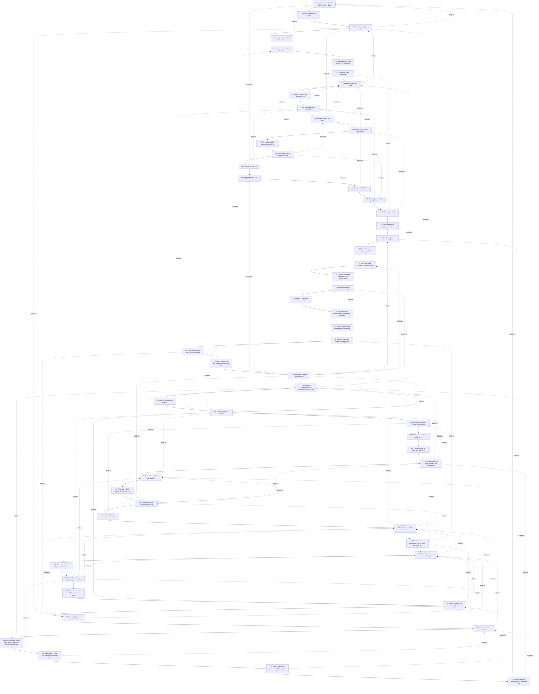

# Curriculum map

**Generated — do not edit by hand.** `python3 dev/curriculum_map.py`
rebuilds it from three files, and CI fails if this one is out of date:

- `planning/curriculum/outcomes.yaml` — every learning outcome in the
  QQI module descriptors.
- each tutorial's `covers:` frontmatter — which outcome each section
  teaches, and which it only uses.
- `planning/curriculum/out-of-scope.yaml` — what we have decided not to
  teach, so a decision stops looking like a gap.

Every link below goes to the section of the live site that does the work,
so this doubles as a way of finding where anything is taught.

## Where we stand

**115 of 116** outcomes are in place.

- 🟩 **113 taught** — a tutorial section teaches it.
- 🟦 **2 taught in part** — deliberately narrowed, and the narrowed version is written.
- 🟨 **0 used but not taught** — students meet it in passing without it ever being the subject. These are the quiet gaps: they look covered from a distance.
- 🟥 **1 not covered** — nothing in dewlab touches it.

**1 of the 1 outcomes still to write have no proposal**: `WA-LO12`. These are the ones nobody has decided how to teach yet.

### By strand

| Strand | 🟩 Taught | 🟦 Part, by choice | 🟨 Used only | 🟥 Not covered | ⬜ Out of scope |
|---|---:|---:|---:|---:|---:|
| **algebra** | 7 | 1 | 0 | 0 | 0 |
| **algorithms** | 9 | 0 | 0 | 0 | 0 |
| **calculus** | 2 | 1 | 0 | 0 | 0 |
| **complexity** | 2 | 0 | 0 | 0 | 0 |
| **css** | 1 | 0 | 0 | 0 | 0 |
| **data-entry** | 1 | 0 | 0 | 0 | 0 |
| **data-import** | 1 | 0 | 0 | 0 | 0 |
| **data-structures** | 1 | 0 | 0 | 0 | 0 |
| **database-concepts** | 2 | 0 | 0 | 0 | 0 |
| **design** | 2 | 0 | 0 | 0 | 0 |
| **design-principles** | 3 | 0 | 0 | 0 | 0 |
| **functions** | 3 | 0 | 0 | 0 | 0 |
| **geometry** | 6 | 0 | 0 | 0 | 0 |
| **html-tags** | 2 | 0 | 0 | 0 | 0 |
| **independence** | 1 | 0 | 0 | 0 | 0 |
| **linear-algebra** | 1 | 0 | 0 | 0 | 0 |
| **logic** | 2 | 0 | 0 | 0 | 0 |
| **modelling** | 2 | 0 | 0 | 0 | 0 |
| **number** | 2 | 0 | 0 | 0 | 0 |
| **oop** | 4 | 0 | 0 | 0 | 0 |
| **probability** | 10 | 0 | 0 | 0 | 0 |
| **problem-solving** | 3 | 0 | 0 | 0 | 0 |
| **process** | 2 | 0 | 0 | 0 | 0 |
| **programming** | 18 | 0 | 0 | 0 | 0 |
| **querying** | 3 | 0 | 0 | 0 | 0 |
| **reflection** | 2 | 0 | 0 | 0 | 0 |
| **reporting** | 1 | 0 | 0 | 0 | 0 |
| **sets** | 3 | 0 | 0 | 0 | 0 |
| **simulation** | 1 | 0 | 0 | 0 | 0 |
| **statistics** | 5 | 0 | 0 | 0 | 0 |
| **testing** | 1 | 0 | 0 | 0 | 0 |
| **tooling** | 2 | 0 | 0 | 1 | 0 |
| **trigonometry** | 7 | 0 | 0 | 0 | 0 |
| **web-history** | 1 | 0 | 0 | 0 | 0 |

```mermaid
graph LR
  algebra["algebra<br/>8 of 8 in place"]
  algorithms["algorithms<br/>9 of 9 in place"]
  calculus["calculus<br/>3 of 3 in place"]
  complexity["complexity<br/>2 of 2 in place"]
  css["css<br/>1 of 1 in place"]
  data_entry["data-entry<br/>1 of 1 in place"]
  data_import["data-import<br/>1 of 1 in place"]
  data_structures["data-structures<br/>1 of 1 in place"]
  database_concepts["database-concepts<br/>2 of 2 in place"]
  design["design<br/>2 of 2 in place"]
  design_principles["design-principles<br/>3 of 3 in place"]
  functions["functions<br/>3 of 3 in place"]
  geometry["geometry<br/>6 of 6 in place"]
  html_tags["html-tags<br/>2 of 2 in place"]
  independence["independence<br/>1 of 1 in place"]
  linear_algebra["linear-algebra<br/>1 of 1 in place"]
  logic["logic<br/>2 of 2 in place"]
  modelling["modelling<br/>2 of 2 in place"]
  number["number<br/>2 of 2 in place"]
  oop["oop<br/>4 of 4 in place"]
  probability["probability<br/>10 of 10 in place"]
  problem_solving["problem-solving<br/>3 of 3 in place"]
  process["process<br/>2 of 2 in place"]
  programming["programming<br/>18 of 18 in place"]
  querying["querying<br/>3 of 3 in place"]
  reflection["reflection<br/>2 of 2 in place"]
  reporting["reporting<br/>1 of 1 in place"]
  sets["sets<br/>3 of 3 in place"]
  simulation["simulation<br/>1 of 1 in place"]
  statistics["statistics<br/>5 of 5 in place"]
  testing["testing<br/>1 of 1 in place"]
  tooling["tooling<br/>2 of 3 in place"]
  trigonometry["trigonometry<br/>7 of 7 in place"]
  web_history["web-history<br/>1 of 1 in place"]

  classDef full fill:#edf7f0,stroke:#1f6b3f,color:#1f6b3f;
  classDef part fill:#fdf6ec,stroke:#b5651d,color:#7a4310;
  classDef none fill:#fdf0ef,stroke:#9b2226,color:#9b2226;
  class algebra,algorithms,calculus,complexity,css,data_entry,data_import,data_structures,database_concepts,design,design_principles,functions,geometry,html_tags,independence,linear_algebra,logic,modelling,number,oop,probability,problem_solving,process,programming,querying,reflection,reporting,sets,simulation,statistics,testing,trigonometry,web_history full;
  class tooling part;
```



## The series as it stands

Solid arrows are the reading order. A dashed arrow means the later
tutorial names the earlier one in its own text — evidence of a real
dependency rather than an intention, found by reading the tutorials
themselves. A tutorial with several dashed arrows into it is
load-bearing and expensive to move; one with none is cheap to move, and
possibly not pulling its weight where it is.



## What is missing, and where it would go

Dashed boxes are proposed. Placement is argued in
`planning/curriculum/proposed.yaml` and each has an outline in
`planning/outlines/`.

```mermaid
graph TD
  T1["1. Algorithms, pseudocode and your first Python"]
  T2["2. Powers: a closer look at ** and ^"]
  T3["3. Variables, data types and text"]
  T4["4. Dividing: a closer look at //, / and 0.1"]
  T5["5. Making decisions with if, elif and else"]
  T6["6. The equals sign: a closer look at =, == and maths"]
  T7["7. Reading an error message"]
  T8["8. Repeating steps with loops"]
  T9["9. Starting a total: a closer look at total = 0"]
  T10["10. Writing your own functions"]
  T11["11. Lists and looping over them"]
  T12["12. Comprehensions, grids and aliasing"]
  T13["13. Two names, one list: a closer look at copying"]
  T14["14. Dictionaries: looking things up by name"]
  T15["15. A program of your own"]
  T16["16. Searching a list: linear and binary search"]
  T17["17. Sorting a list: bubble, insertion and selection sort"]
  T18["18. Designing and testing good functions"]
  T19["19. Finding bugs in bigger programs"]
  T20["20. How programming languages came to be"]
  T21["21. Sets: building them from sorted lists"]
  T22["22. Venn diagrams: drawing sets and their overlaps"]
  T23["23. Logic: truth tables, XOR and De Morgan's laws"]
  T24["24. Counting: factorials, permutations and combinations"]
  T25["25. Probability: simple, compound and conditional"]
  T26["26. Chance: a closer look at small samples"]
  T27["27. The Monty Hall problem: three doors and a simulation"]
  T28["28. Checking: a closer look at two methods that agree"]
  T29["29. Statistics: averages, spread and frequency"]
  T30["30. Charts: choosing the right chart for your data"]
  T31["31. Make it: a chart that tells the truth, and one that lies"]
  T32["32. Number types, powers and logarithms"]
  T33["33. Polynomials: representing and combining them in Python"]
  T34["34. Squaring: a closer look at (a + b)²"]
  T35["35. Functions and their graphs"]
  T36["36. Rearranging formulae: changing the subject"]
  T37["37. Dividing: a closer look at (2x + 6) / 2"]
  T38["38. The fraction line: a closer look at v - u / a"]
  T39["39. Solving equations: linear, quadratic and simultaneous"]
  T40["40. Parabolas: completing the square"]
  T41["41. Parabolas: a closer look at the sign in (x - h)²"]
  T42["42. Complex numbers: roots that are not real"]
  T43["43. Make it: a tool of your own, built from formulas"]
  T44["44. Straight lines: slope, and the line that breaks the formula"]
  T45["45. Distance and Pythagoras: how far apart two points are"]
  T46["46. The unit circle: sine, cosine and tangent"]
  T47["47. Angles: a closer look at degrees and radians"]
  T48["48. Sine and cosine waves: amplitude, period and shift"]
  T49["49. The seasons: a closer look at the Earth and the Sun"]
  T50["50. Solving triangles: the sine rule and the cosine rule"]
  T51["51. Limits: getting closer without arriving"]
  T52["52. Derivatives: the rate of change of a curve"]
  T53["53. Derivative rules: power, sum, product and chain, found by experiment"]
  T54["54. The slope of a wave: how fast daylight and tides change"]
  T55["55. Make it: a model of your own, built from angles and waves"]
  T56["56. Review problems: polynomials, equations and sets"]

  T1 --> T2
  T2 --> T3
  T3 --> T4
  T4 --> T5
  T5 --> T6
  T6 --> T7
  T7 --> T8
  T8 --> T9
  T9 --> T10
  T10 --> T11
  T11 --> T12
  T12 --> T13
  T13 --> T14
  T14 --> T15
  T15 --> T16
  T16 --> T17
  T17 --> T18
  T18 --> T19
  T19 --> T20
  T20 --> T21
  T21 --> T22
  T22 --> T23
  T23 --> T24
  T24 --> T25
  T25 --> T26
  T26 --> T27
  T27 --> T28
  T28 --> T29
  T29 --> T30
  T30 --> T31
  T31 --> T32
  T32 --> T33
  T33 --> T34
  T34 --> T35
  T35 --> T36
  T36 --> T37
  T37 --> T38
  T38 --> T39
  T39 --> T40
  T40 --> T41
  T41 --> T42
  T42 --> T43
  T43 --> T44
  T44 --> T45
  T45 --> T46
  T46 --> T47
  T47 --> T48
  T48 --> T49
  T49 --> T50
  T50 --> T51
  T51 --> T52
  T52 --> T53
  T53 --> T54
  T54 --> T55
  T55 --> T56


  classDef new fill:#fdf6ec,stroke:#b5651d,color:#7a4310,stroke-dasharray:4 3;
  class  new;
```

| Proposed | Goes after | Closes | Size |
|---|---|---|---|

## Every outcome

### Maths for Information Technology 5N18396

#### 1. Basic Arithmetic and Algebra

| Outcome | | Where |
|---|---|---|
| `MIT-1.1` Operations in N, Z, Q, R; powers (the syllabus says indices) and logarithms | 🟩 | [Doubling and halving: powers and logarithms at work — A rumour that doubles](https://deweydex.github.io/dewlab/tutorials/doubling-and-halving.html#a-rumour-that-doubles)<br/>[Doubling and halving: powers and logarithms at work — Grains on a chessboard](https://deweydex.github.io/dewlab/tutorials/doubling-and-halving.html#grains-on-a-chessboard)<br/>[Doubling and halving: powers and logarithms at work — Doublings add up](https://deweydex.github.io/dewlab/tutorials/doubling-and-halving.html#doublings-add-up)<br/>[Doubling and halving: powers and logarithms at work — How long to double?](https://deweydex.github.io/dewlab/tutorials/doubling-and-halving.html#how-long-to-double)<br/>[Doubling and halving: powers and logarithms at work — Halving down to 1](https://deweydex.github.io/dewlab/tutorials/doubling-and-halving.html#halving-down-to-1)<br/>[Doubling and halving: powers and logarithms at work — Why binary search is so quick](https://deweydex.github.io/dewlab/tutorials/doubling-and-halving.html#why-binary-search-is-so-quick)<br/>[Finding things fast: linear and binary search — How many halvings?](https://deweydex.github.io/dewlab/tutorials/finding-things-fast.html#how-many-halvings)<br/>[Making decisions with if, elif and else — Classifying numbers: a mathematical application](https://deweydex.github.io/dewlab/tutorials/making-decisions.html#classifying-numbers-a-mathematical-application)<br/>[Numbers a computer can hold — Families of numbers](https://deweydex.github.io/dewlab/tutorials/numbers-a-computer-can-hold.html#families-of-numbers)<br/>[Numbers a computer can hold — Two kinds of number in Python](https://deweydex.github.io/dewlab/tutorials/numbers-a-computer-can-hold.html#two-kinds-of-number-in-python)<br/>[Numbers a computer can hold — Powers, and how many times](https://deweydex.github.io/dewlab/tutorials/numbers-a-computer-can-hold.html#powers-and-how-many-times)<br/>[Number types, powers and logarithms — Powers and their rules](https://deweydex.github.io/dewlab/tutorials/numbers-and-their-families.html#powers-and-their-rules)<br/>[Number types, powers and logarithms — Logarithms: the inverse of powers](https://deweydex.github.io/dewlab/tutorials/numbers-and-their-families.html#logarithms-the-inverse-of-powers)<br/>_used in:_ [Counting every outfit: lists of outcomes — Too many to list: PINs and passwords](https://deweydex.github.io/dewlab/tutorials/counting-every-outfit.html#too-many-to-list-pins-and-passwords)<br/>_used in:_ [Drawing a rule: graphs of functions — Rules with gaps, and rules that race](https://deweydex.github.io/dewlab/tutorials/drawing-a-rule.html#rules-with-gaps-and-rules-that-race)<br/>_used in:_ [Everything is ones and zeros — From a number to its bits](https://deweydex.github.io/dewlab/tutorials/everything-is-ones-and-zeros.html#from-a-number-to-its-bits)<br/>_used in:_ [Everything is ones and zeros — How many bits is enough?](https://deweydex.github.io/dewlab/tutorials/everything-is-ones-and-zeros.html#how-many-bits-is-enough)<br/>_used in:_ [Everything is ones and zeros — Why 0.1 + 0.2 is not 0.3](https://deweydex.github.io/dewlab/tutorials/everything-is-ones-and-zeros.html#why-01-02-is-not-03)<br/>_used in:_ [Finding things fast: linear and binary search — Watching the steps grow](https://deweydex.github.io/dewlab/tutorials/finding-things-fast.html#watching-the-steps-grow)<br/>_used in:_ [Four questions for any puzzle — The same move in a different space](https://deweydex.github.io/dewlab/tutorials/four-questions.html#the-same-move-in-a-different-space)<br/>_used in:_ [Getting closer: limits — Halfway to the door](https://deweydex.github.io/dewlab/tutorials/getting-closer.html#halfway-to-the-door)<br/>_used in:_ [Getting closer: limits — A limit at infinity](https://deweydex.github.io/dewlab/tutorials/getting-closer.html#a-limit-at-infinity)<br/>_used in:_ [Numbers a computer can hold — The row and column of a pixel](https://deweydex.github.io/dewlab/tutorials/numbers-a-computer-can-hold.html#the-row-and-column-of-a-pixel)<br/>_used in:_ [Solving by computing: bisection and Newton's method — Bisection: binary search on a number line](https://deweydex.github.io/dewlab/tutorials/solving-by-computing.html#bisection-binary-search-on-a-number-line)<br/>_used in:_ [True, false and every case: truth tables — How many rows?](https://deweydex.github.io/dewlab/tutorials/true-false-and-every-case.html#how-many-rows)<br/>_used in:_ [Waves: sine, cosine and sound — Higher notes: an octave is a doubling](https://deweydex.github.io/dewlab/tutorials/waves.html#higher-notes-an-octave-is-a-doubling) |
| `MIT-1.2` Area and perimeter: square, rectangle, triangle, circle | 🟩 | [Measuring rooms and tins: area, perimeter and volume — Around the edge: perimeter](https://deweydex.github.io/dewlab/tutorials/measuring-rooms-and-tins.html#around-the-edge-perimeter)<br/>[Measuring rooms and tins: area, perimeter and volume — Covering a surface: area](https://deweydex.github.io/dewlab/tutorials/measuring-rooms-and-tins.html#covering-a-surface-area)<br/>[Measuring rooms and tins: area, perimeter and volume — Triangles: half a rectangle](https://deweydex.github.io/dewlab/tutorials/measuring-rooms-and-tins.html#triangles-half-a-rectangle)<br/>[Measuring rooms and tins: area, perimeter and volume — Circles and pi](https://deweydex.github.io/dewlab/tutorials/measuring-rooms-and-tins.html#circles-and-pi)<br/>[Number types, powers and logarithms — Formulas as functions](https://deweydex.github.io/dewlab/tutorials/numbers-and-their-families.html#formulas-as-functions)<br/>_used in:_ [How far apart? Distance, midpoint and Pythagoras — Squares on the sides: Pythagoras](https://deweydex.github.io/dewlab/tutorials/how-far-apart.html#squares-on-the-sides-pythagoras)<br/>_used in:_ [Measuring rooms and tins: area, perimeter and volume — Tools for flat shapes](https://deweydex.github.io/dewlab/tutorials/measuring-rooms-and-tins.html#tools-for-flat-shapes)<br/>_used in:_ [Measuring rooms and tins: area, perimeter and volume — How much paint does the room need?](https://deweydex.github.io/dewlab/tutorials/measuring-rooms-and-tins.html#how-much-paint-does-the-room-need) |
| `MIT-1.3` Volume and surface area: cube, cylinder, cone, sphere | 🟩 | [Measuring rooms and tins: area, perimeter and volume — How much a tin holds: volume](https://deweydex.github.io/dewlab/tutorials/measuring-rooms-and-tins.html#how-much-a-tin-holds-volume)<br/>[Measuring rooms and tins: area, perimeter and volume — Wrapping it: surface area](https://deweydex.github.io/dewlab/tutorials/measuring-rooms-and-tins.html#wrapping-it-surface-area)<br/>[Number types, powers and logarithms — Formulas as functions](https://deweydex.github.io/dewlab/tutorials/numbers-and-their-families.html#formulas-as-functions)<br/>_used in:_ [Measuring rooms and tins: area, perimeter and volume — Tools for solid shapes](https://deweydex.github.io/dewlab/tutorials/measuring-rooms-and-tins.html#tools-for-solid-shapes)<br/>_used in:_ [Rules for change: the sum, product, quotient and chain rules — Multiplying rules: the product rule](https://deweydex.github.io/dewlab/tutorials/rules-for-change.html#multiplying-rules-the-product-rule) |
| `MIT-1.4` Binary and hexadecimal arithmetic and conversion | 🟩 | [Bits that flip: XOR and parity — XOR on whole numbers](https://deweydex.github.io/dewlab/tutorials/bits-that-flip.html#xor-on-whole-numbers)<br/>[Bits that flip: XOR and parity — Counting the 1s: parity](https://deweydex.github.io/dewlab/tutorials/bits-that-flip.html#counting-the-1s-parity)<br/>[Everything is ones and zeros — Counting with two digits](https://deweydex.github.io/dewlab/tutorials/everything-is-ones-and-zeros.html#counting-with-two-digits)<br/>[Everything is ones and zeros — From a number to its bits](https://deweydex.github.io/dewlab/tutorials/everything-is-ones-and-zeros.html#from-a-number-to-its-bits)<br/>[Everything is ones and zeros — How many bits is enough?](https://deweydex.github.io/dewlab/tutorials/everything-is-ones-and-zeros.html#how-many-bits-is-enough)<br/>[Everything is ones and zeros — Adding in binary](https://deweydex.github.io/dewlab/tutorials/everything-is-ones-and-zeros.html#adding-in-binary)<br/>[Everything is ones and zeros — Hexadecimal: binary, written short](https://deweydex.github.io/dewlab/tutorials/everything-is-ones-and-zeros.html#hexadecimal-binary-written-short)<br/>[Everything is ones and zeros — A digit drawn in pixels](https://deweydex.github.io/dewlab/tutorials/everything-is-ones-and-zeros.html#a-digit-drawn-in-pixels)<br/>[Everything is ones and zeros — How #FF8800 makes orange](https://deweydex.github.io/dewlab/tutorials/everything-is-ones-and-zeros.html#how-ff8800-makes-orange)<br/>[Everything is ones and zeros — Why 0.1 + 0.2 is not 0.3](https://deweydex.github.io/dewlab/tutorials/everything-is-ones-and-zeros.html#why-01-02-is-not-03)<br/>[How programming languages came to be — The only language the machine understands](https://deweydex.github.io/dewlab/tutorials/how-we-got-here.html#the-only-language-the-machine-understands)<br/>[How programming languages came to be — Assembly, and why hexadecimal exists](https://deweydex.github.io/dewlab/tutorials/how-we-got-here.html#assembly-and-why-hexadecimal-exists)<br/>_used in:_ [Bits that flip: XOR and parity — Catching a flipped bit](https://deweydex.github.io/dewlab/tutorials/bits-that-flip.html#catching-a-flipped-bit)<br/>_used in:_ [Counting every outfit: lists of outcomes — Every pixel, every colour](https://deweydex.github.io/dewlab/tutorials/counting-every-outfit.html#every-pixel-every-colour)<br/>_used in:_ [Does it work? Testing, walkthroughs and naming — Close enough](https://deweydex.github.io/dewlab/tutorials/does-it-work.html#close-enough)<br/>_used in:_ [Doubling and halving: powers and logarithms at work — Grains on a chessboard](https://deweydex.github.io/dewlab/tutorials/doubling-and-halving.html#grains-on-a-chessboard)<br/>_used in:_ [Doubling and halving: powers and logarithms at work — Halving down to 1](https://deweydex.github.io/dewlab/tutorials/doubling-and-halving.html#halving-down-to-1)<br/>_used in:_ [Everything is ones and zeros — Tools for your toolkit](https://deweydex.github.io/dewlab/tutorials/everything-is-ones-and-zeros.html#tools-for-your-toolkit)<br/>_used in:_ [Getting closer: limits — When the floats run out](https://deweydex.github.io/dewlab/tutorials/getting-closer.html#when-the-floats-run-out)<br/>_used in:_ [How fast, right now? The derivative — Why the step cannot be 0, or too small](https://deweydex.github.io/dewlab/tutorials/how-fast-right-now.html#why-the-step-cannot-be-0-or-too-small)<br/>_used in:_ [True, false and every case: truth tables — How many rows?](https://deweydex.github.io/dewlab/tutorials/true-false-and-every-case.html#how-many-rows) |
| `MIT-1.5` Distinguish an expression from an equation | 🟦 | [Polynomials: representing and combining them in Python — Expressions versus equations](https://deweydex.github.io/dewlab/tutorials/expressions-come-alive.html#expressions-versus-equations)<br/>[Rules with letters in them: expressions, equations and identities — A rule, a question and a promise](https://deweydex.github.io/dewlab/tutorials/rules-with-letters-in-them.html#a-rule-a-question-and-a-promise)<br/>**Narrowed:** not the formal expression-versus-equation distinction as an assessed item |
| `MIT-1.6` Evaluate, expand and simplify expressions | 🟩 | [Polynomials: representing and combining them in Python — Representing polynomials](https://deweydex.github.io/dewlab/tutorials/expressions-come-alive.html#representing-polynomials)<br/>[Polynomials: representing and combining them in Python — Evaluating polynomials](https://deweydex.github.io/dewlab/tutorials/expressions-come-alive.html#evaluating-polynomials)<br/>[Polynomials: representing and combining them in Python — Displaying polynomials](https://deweydex.github.io/dewlab/tutorials/expressions-come-alive.html#displaying-polynomials)<br/>[Polynomials: representing and combining them in Python — Adding polynomials](https://deweydex.github.io/dewlab/tutorials/expressions-come-alive.html#adding-polynomials)<br/>[Polynomials: representing and combining them in Python — Subtracting and scaling](https://deweydex.github.io/dewlab/tutorials/expressions-come-alive.html#subtracting-and-scaling)<br/>[Rules with letters in them: expressions, equations and identities — Putting a number in for the letter](https://deweydex.github.io/dewlab/tutorials/rules-with-letters-in-them.html#putting-a-number-in-for-the-letter)<br/>[Rules with letters in them: expressions, equations and identities — Collecting like terms](https://deweydex.github.io/dewlab/tutorials/rules-with-letters-in-them.html#collecting-like-terms)<br/>[Rules with letters in them: expressions, equations and identities — Expanding brackets is a loop](https://deweydex.github.io/dewlab/tutorials/rules-with-letters-in-them.html#expanding-brackets-is-a-loop)<br/>_used in:_ [Review problems: polynomials, equations and sets — Problem 1: The polynomial workshop](https://deweydex.github.io/dewlab/tutorials/bringing-it-all-together.html#problem-1-the-polynomial-workshop) |
| `MIT-1.7` Transpose formulae; operate on rational algebraic expressions | 🟩 | [Rearranging formulae: changing the subject — The same formula, four ways](https://deweydex.github.io/dewlab/tutorials/rearranging-formulae.html#the-same-formula-four-ways)<br/>[Rearranging formulae: changing the subject — The moves](https://deweydex.github.io/dewlab/tutorials/rearranging-formulae.html#the-moves)<br/>[Rearranging formulae: changing the subject — When the subject is behind a minus sign](https://deweydex.github.io/dewlab/tutorials/rearranging-formulae.html#when-the-subject-is-behind-a-minus-sign)<br/>[Rearranging formulae: changing the subject — When the subject appears twice](https://deweydex.github.io/dewlab/tutorials/rearranging-formulae.html#when-the-subject-appears-twice)<br/>[Rearranging formulae: changing the subject — When the unknown is underneath](https://deweydex.github.io/dewlab/tutorials/rearranging-formulae.html#when-the-unknown-is-underneath)<br/>[Rearranging formulae: changing the subject — Checking yourself](https://deweydex.github.io/dewlab/tutorials/rearranging-formulae.html#checking-yourself)<br/>[Running a formula backwards: rearranging and inverses — One formula, three questions](https://deweydex.github.io/dewlab/tutorials/running-a-formula-backwards.html#one-formula-three-questions)<br/>[Running a formula backwards: rearranging and inverses — The same move on both sides](https://deweydex.github.io/dewlab/tutorials/running-a-formula-backwards.html#the-same-move-on-both-sides)<br/>[Running a formula backwards: rearranging and inverses — Undoing, in reverse order](https://deweydex.github.io/dewlab/tutorials/running-a-formula-backwards.html#undoing-in-reverse-order)<br/>[Running a formula backwards: rearranging and inverses — When the way back needs care](https://deweydex.github.io/dewlab/tutorials/running-a-formula-backwards.html#when-the-way-back-needs-care)<br/>[Running a formula backwards: rearranging and inverses — Fractions with letters in them](https://deweydex.github.io/dewlab/tutorials/running-a-formula-backwards.html#fractions-with-letters-in-them)<br/>_used in:_ [Solving equations: linear, quadratic and simultaneous — Solving linear equations](https://deweydex.github.io/dewlab/tutorials/cracking-equations.html#solving-linear-equations)<br/>_used in:_ [How fast, right now? The derivative — Average speed over a chord](https://deweydex.github.io/dewlab/tutorials/how-fast-right-now.html#average-speed-over-a-chord)<br/>_used in:_ [Solving triangles: how tall is that tree? — Going backwards: from sides to an angle](https://deweydex.github.io/dewlab/tutorials/how-tall-is-that-tree.html#going-backwards-from-sides-to-an-angle)<br/>_used in:_ [Running a formula backwards: rearranging and inverses — Tools for any trip](https://deweydex.github.io/dewlab/tutorials/running-a-formula-backwards.html#tools-for-any-trip)<br/>_used in:_ [Solving for x: linear and quadratic equations — When are two servers equally fast?](https://deweydex.github.io/dewlab/tutorials/solving-for-x.html#when-are-two-servers-equally-fast)<br/>_used in:_ [Straight lines: slope and gradient — How steep is a ramp?](https://deweydex.github.io/dewlab/tutorials/straight-lines.html#how-steep-is-a-ramp)<br/>_used in:_ [Straight lines: slope and gradient — The rule for a ramp](https://deweydex.github.io/dewlab/tutorials/straight-lines.html#the-rule-for-a-ramp)<br/>_used in:_ [Straight lines: slope and gradient — Every line at once: ax + by + c = 0](https://deweydex.github.io/dewlab/tutorials/straight-lines.html#every-line-at-once-ax-by-c-0) |
| `MIT-1.8` Multiply linear expressions into quadratics and cubics | 🟩 | [Polynomials: representing and combining them in Python — Multiplying polynomials](https://deweydex.github.io/dewlab/tutorials/expressions-come-alive.html#multiplying-polynomials)<br/>[Rules with letters in them: expressions, equations and identities — Expanding brackets is a loop](https://deweydex.github.io/dewlab/tutorials/rules-with-letters-in-them.html#expanding-brackets-is-a-loop)<br/>_used in:_ [Review problems: polynomials, equations and sets — Problem 1: The polynomial workshop](https://deweydex.github.io/dewlab/tutorials/bringing-it-all-together.html#problem-1-the-polynomial-workshop)<br/>_used in:_ [Drawing a rule: graphs of functions — Curves that bend: parabolas and cubics](https://deweydex.github.io/dewlab/tutorials/drawing-a-rule.html#curves-that-bend-parabolas-and-cubics)<br/>_used in:_ [Rules for change: the sum, product, quotient and chain rules — Adding rules: the sum rule](https://deweydex.github.io/dewlab/tutorials/rules-for-change.html#adding-rules-the-sum-rule)<br/>_used in:_ [The top of the curve: maximum and minimum — A letter that sits below the line](https://deweydex.github.io/dewlab/tutorials/the-top-of-the-curve.html#a-letter-that-sits-below-the-line) |
| `MIT-1.9` Factor quadratics by inspection and solve them | 🟩 | [Solving equations: linear, quadratic and simultaneous — Factorisation](https://deweydex.github.io/dewlab/tutorials/cracking-equations.html#factorisation)<br/>[Solving for x: linear and quadratic equations — When are two servers equally fast?](https://deweydex.github.io/dewlab/tutorials/solving-for-x.html#when-are-two-servers-equally-fast)<br/>[Solving for x: linear and quadratic equations — A tool for any straight-line equation](https://deweydex.github.io/dewlab/tutorials/solving-for-x.html#a-tool-for-any-straight-line-equation)<br/>[Solving for x: linear and quadratic equations — When the unknown is squared](https://deweydex.github.io/dewlab/tutorials/solving-for-x.html#when-the-unknown-is-squared)<br/>[Solving for x: linear and quadratic equations — Factorising by inspection](https://deweydex.github.io/dewlab/tutorials/solving-for-x.html#factorising-by-inspection)<br/>[Solving for x: linear and quadratic equations — The quadratic formula](https://deweydex.github.io/dewlab/tutorials/solving-for-x.html#the-quadratic-formula)<br/>[Solving for x: linear and quadratic equations — How many answers? The discriminant](https://deweydex.github.io/dewlab/tutorials/solving-for-x.html#how-many-answers-the-discriminant)<br/>_used in:_ [Rules for change: the sum, product, quotient and chain rules — Back to the top of the curve](https://deweydex.github.io/dewlab/tutorials/rules-for-change.html#back-to-the-top-of-the-curve)<br/>_used in:_ [The top of the curve: maximum and minimum — Halfway between the roots](https://deweydex.github.io/dewlab/tutorials/the-top-of-the-curve.html#halfway-between-the-roots) |
| `MIT-1.10` Solve quadratics, including complex roots | 🟩 | [Complex numbers: roots that are not real — Where the solver stops](https://deweydex.github.io/dewlab/tutorials/complex-roots.html#where-the-solver-stops)<br/>[Complex numbers: roots that are not real — Inventing a new number](https://deweydex.github.io/dewlab/tutorials/complex-roots.html#inventing-a-new-number)<br/>[Complex numbers: roots that are not real — Roots that are not real](https://deweydex.github.io/dewlab/tutorials/complex-roots.html#roots-that-are-not-real)<br/>[Complex numbers: roots that are not real — Complex roots come in pairs](https://deweydex.github.io/dewlab/tutorials/complex-roots.html#complex-roots-come-in-pairs)<br/>[When there is no real answer: complex numbers — A question with no answer here](https://deweydex.github.io/dewlab/tutorials/when-there-is-no-real-answer.html#a-question-with-no-answer-here)<br/>[When there is no real answer: complex numbers — Python's j](https://deweydex.github.io/dewlab/tutorials/when-there-is-no-real-answer.html#pythons-j)<br/>[When there is no real answer: complex numbers — The old moves in the new space](https://deweydex.github.io/dewlab/tutorials/when-there-is-no-real-answer.html#the-old-moves-in-the-new-space)<br/>[When there is no real answer: complex numbers — Numbers on a plane](https://deweydex.github.io/dewlab/tutorials/when-there-is-no-real-answer.html#numbers-on-a-plane)<br/>[When there is no real answer: complex numbers — Every quadratic has roots here](https://deweydex.github.io/dewlab/tutorials/when-there-is-no-real-answer.html#every-quadratic-has-roots-here)<br/>_used in:_ [Solving equations: linear, quadratic and simultaneous — The quadratic formula](https://deweydex.github.io/dewlab/tutorials/cracking-equations.html#the-quadratic-formula)<br/>_used in:_ [Solving for x: linear and quadratic equations — When the square root says no](https://deweydex.github.io/dewlab/tutorials/solving-for-x.html#when-the-square-root-says-no)<br/>_used in:_ [When there is no real answer: complex numbers — What the bigger space costs](https://deweydex.github.io/dewlab/tutorials/when-there-is-no-real-answer.html#what-the-bigger-space-costs) |
| `MIT-1.11` Solve linear inequalities | 🟩 | [Choosing a path: if, elif and else — Solving an inequality](https://deweydex.github.io/dewlab/tutorials/choosing-a-path.html#solving-an-inequality)<br/>[Choosing a path: if, elif and else — A move that turns the sign round](https://deweydex.github.io/dewlab/tutorials/choosing-a-path.html#a-move-that-turns-the-sign-round)<br/>[Solving equations: linear, quadratic and simultaneous — Solving inequalities](https://deweydex.github.io/dewlab/tutorials/cracking-equations.html#solving-inequalities)<br/>_used in:_ [Choosing a path: if, elif and else — Pictures on a number line](https://deweydex.github.io/dewlab/tutorials/choosing-a-path.html#pictures-on-a-number-line)<br/>_used in:_ [Choosing a path: if, elif and else — A tool of your own: between](https://deweydex.github.io/dewlab/tutorials/choosing-a-path.html#a-tool-of-your-own-between)<br/>_used in:_ [Untangling a condition: De Morgan's laws — Not between](https://deweydex.github.io/dewlab/tutorials/untangling-a-condition.html#not-between) |
| `MIT-1.12` Simultaneous equations in two and three unknowns | 🟩 | [Solving equations: linear, quadratic and simultaneous — Simultaneous equations](https://deweydex.github.io/dewlab/tutorials/cracking-equations.html#simultaneous-equations)<br/>[Several unknowns at once: simultaneous equations — Two facts, two unknowns](https://deweydex.github.io/dewlab/tutorials/several-unknowns-at-once.html#two-facts-two-unknowns)<br/>[Several unknowns at once: simultaneous equations — Two lines that cross](https://deweydex.github.io/dewlab/tutorials/several-unknowns-at-once.html#two-lines-that-cross)<br/>[Several unknowns at once: simultaneous equations — Elimination: one unknown at a time](https://deweydex.github.io/dewlab/tutorials/several-unknowns-at-once.html#elimination-one-unknown-at-a-time)<br/>[Several unknowns at once: simultaneous equations — One formula for every pair](https://deweydex.github.io/dewlab/tutorials/several-unknowns-at-once.html#one-formula-for-every-pair)<br/>[Several unknowns at once: simultaneous equations — When there is no single answer](https://deweydex.github.io/dewlab/tutorials/several-unknowns-at-once.html#when-there-is-no-single-answer)<br/>[Several unknowns at once: simultaneous equations — Three unknowns](https://deweydex.github.io/dewlab/tutorials/several-unknowns-at-once.html#three-unknowns)<br/>_used in:_ [Review problems: polynomials, equations and sets — Problem 2: Where do they meet?](https://deweydex.github.io/dewlab/tutorials/bringing-it-all-together.html#problem-2-where-do-they-meet)<br/>_used in:_ [Systems of equations: solving them with matrices — Three unknowns, row by row](https://deweydex.github.io/dewlab/tutorials/solving-systems.html#three-unknowns-row-by-row) |

#### 2. Set Theory and Boolean Logic

| Outcome | | Where |
|---|---|---|
| `MIT-2.1` Set language: N, Z, Q, R, C, the empty set; finite, infinite, cardinality | 🟩 | [Collections without repeats: sets — Two playlists](https://deweydex.github.io/dewlab/tutorials/collections-without-repeats.html#two-playlists)<br/>[Collections without repeats: sets — Is it in the set?](https://deweydex.github.io/dewlab/tutorials/collections-without-repeats.html#is-it-in-the-set)<br/>[Collections without repeats: sets — Sets too big to list](https://deweydex.github.io/dewlab/tutorials/collections-without-repeats.html#sets-too-big-to-list)<br/>[Number types, powers and logarithms — The number domains](https://deweydex.github.io/dewlab/tutorials/numbers-and-their-families.html#the-number-domains)<br/>[Sets: building them from sorted lists — Making a set](https://deweydex.github.io/dewlab/tutorials/sets-as-sorted-lists.html#making-a-set)<br/>[Sets: building them from sorted lists — Membership testing](https://deweydex.github.io/dewlab/tutorials/sets-as-sorted-lists.html#membership-testing)<br/>[Sets: building them from sorted lists — Set language and notation](https://deweydex.github.io/dewlab/tutorials/sets-as-sorted-lists.html#set-language-and-notation)<br/>_used in:_ [Collections without repeats: sets — Two books, thousands of words](https://deweydex.github.io/dewlab/tutorials/collections-without-repeats.html#two-books-thousands-of-words)<br/>_used in:_ [Complex numbers: roots that are not real — Inventing a new number](https://deweydex.github.io/dewlab/tutorials/complex-roots.html#inventing-a-new-number) |
| `MIT-2.2` Set operations: union, intersection, complement, symmetric difference, Cartesian product, power set | 🟩 | [Collections without repeats: sets — On both lists: intersection](https://deweydex.github.io/dewlab/tutorials/collections-without-repeats.html#on-both-lists-intersection)<br/>[Collections without repeats: sets — On either list: union](https://deweydex.github.io/dewlab/tutorials/collections-without-repeats.html#on-either-list-union)<br/>[Collections without repeats: sets — On one list only: difference](https://deweydex.github.io/dewlab/tutorials/collections-without-repeats.html#on-one-list-only-difference)<br/>[Collections without repeats: sets — Everything else: the complement](https://deweydex.github.io/dewlab/tutorials/collections-without-repeats.html#everything-else-the-complement)<br/>[Collections without repeats: sets — Two books, thousands of words](https://deweydex.github.io/dewlab/tutorials/collections-without-repeats.html#two-books-thousands-of-words)<br/>[Collections without repeats: sets — Every pair, and every smaller set](https://deweydex.github.io/dewlab/tutorials/collections-without-repeats.html#every-pair-and-every-smaller-set)<br/>[Sets: building them from sorted lists — Set operations: the merge pattern](https://deweydex.github.io/dewlab/tutorials/sets-as-sorted-lists.html#set-operations-the-merge-pattern)<br/>[Sets: building them from sorted lists — Sets in the worlds](https://deweydex.github.io/dewlab/tutorials/sets-as-sorted-lists.html#sets-in-the-worlds)<br/>_used in:_ [Review problems: polynomials, equations and sets — Problem 3: Sets of solutions](https://deweydex.github.io/dewlab/tutorials/bringing-it-all-together.html#problem-3-sets-of-solutions)<br/>_used in:_ [Circles that overlap: Venn diagrams — Two circles in a box](https://deweydex.github.io/dewlab/tutorials/circles-that-overlap.html#two-circles-in-a-box)<br/>_used in:_ [Collections without repeats: sets — From sets to databases](https://deweydex.github.io/dewlab/tutorials/collections-without-repeats.html#from-sets-to-databases) |
| `MIT-2.3` Venn diagrams for two and three sets | 🟩 | [Circles that overlap: Venn diagrams — Two circles in a box](https://deweydex.github.io/dewlab/tutorials/circles-that-overlap.html#two-circles-in-a-box)<br/>[Circles that overlap: Venn diagrams — Counting either: inclusion-exclusion](https://deweydex.github.io/dewlab/tutorials/circles-that-overlap.html#counting-either-inclusion-exclusion)<br/>[Circles that overlap: Venn diagrams — Three circles, eight regions](https://deweydex.github.io/dewlab/tutorials/circles-that-overlap.html#three-circles-eight-regions)<br/>[Circles that overlap: Venn diagrams — Exactly two of the three](https://deweydex.github.io/dewlab/tutorials/circles-that-overlap.html#exactly-two-of-the-three)<br/>[Circles that overlap: Venn diagrams — Inclusion-exclusion for three sets](https://deweydex.github.io/dewlab/tutorials/circles-that-overlap.html#inclusion-exclusion-for-three-sets)<br/>[Circles that overlap: Venn diagrams — Filling a diagram from the totals](https://deweydex.github.io/dewlab/tutorials/circles-that-overlap.html#filling-a-diagram-from-the-totals)<br/>[Venn diagrams: drawing sets and their overlaps — Two circles, from real sets](https://deweydex.github.io/dewlab/tutorials/venn-diagrams.html#two-circles-from-real-sets)<br/>[Venn diagrams: drawing sets and their overlaps — The regions have names you already know](https://deweydex.github.io/dewlab/tutorials/venn-diagrams.html#the-regions-have-names-you-already-know)<br/>[Venn diagrams: drawing sets and their overlaps — Three sets, which is where it earns its place](https://deweydex.github.io/dewlab/tutorials/venn-diagrams.html#three-sets-which-is-where-it-earns-its-place)<br/>[Venn diagrams: drawing sets and their overlaps — Outside a set](https://deweydex.github.io/dewlab/tutorials/venn-diagrams.html#outside-a-set) |
| `MIT-2.4` Truth tables: AND, NOT, OR, XOR | 🟩 | [Bits that flip: XOR and parity — XOR on single bits](https://deweydex.github.io/dewlab/tutorials/bits-that-flip.html#xor-on-single-bits)<br/>[Bits that flip: XOR and parity — A switch that flips](https://deweydex.github.io/dewlab/tutorials/bits-that-flip.html#a-switch-that-flips)<br/>[Bits that flip: XOR and parity — Counting the 1s: parity](https://deweydex.github.io/dewlab/tutorials/bits-that-flip.html#counting-the-1s-parity)<br/>[Logic: truth tables, XOR and De Morgan's laws — Every possible case](https://deweydex.github.io/dewlab/tutorials/logic-and-truth.html#every-possible-case)<br/>[Logic: truth tables, XOR and De Morgan's laws — Exclusive or](https://deweydex.github.io/dewlab/tutorials/logic-and-truth.html#exclusive-or)<br/>[True, false and every case: truth tables — And: both must be true](https://deweydex.github.io/dewlab/tutorials/true-false-and-every-case.html#and-both-must-be-true)<br/>[True, false and every case: truth tables — Or: at least one is true](https://deweydex.github.io/dewlab/tutorials/true-false-and-every-case.html#or-at-least-one-is-true)<br/>[True, false and every case: truth tables — Not: the opposite](https://deweydex.github.io/dewlab/tutorials/true-false-and-every-case.html#not-the-opposite)<br/>[True, false and every case: truth tables — Exclusive or: exactly one](https://deweydex.github.io/dewlab/tutorials/true-false-and-every-case.html#exclusive-or-exactly-one)<br/>[True, false and every case: truth tables — How many rows?](https://deweydex.github.io/dewlab/tutorials/true-false-and-every-case.html#how-many-rows)<br/>_used in:_ [Bits that flip: XOR and parity — XOR on whole numbers](https://deweydex.github.io/dewlab/tutorials/bits-that-flip.html#xor-on-whole-numbers)<br/>_used in:_ [Chances that combine: and, or, and the birthday problem — When both can happen](https://deweydex.github.io/dewlab/tutorials/chances-that-combine.html#when-both-can-happen)<br/>_used in:_ [Collections without repeats: sets — On one list only: difference](https://deweydex.github.io/dewlab/tutorials/collections-without-repeats.html#on-one-list-only-difference)<br/>_used in:_ [Making decisions with if, elif and else — Boolean operators: combining conditions](https://deweydex.github.io/dewlab/tutorials/making-decisions.html#boolean-operators-combining-conditions)<br/>_used in:_ [True, false and every case: truth tables — True and false are values](https://deweydex.github.io/dewlab/tutorials/true-false-and-every-case.html#true-and-false-are-values)<br/>_used in:_ [True, false and every case: truth tables — A tool for any rule](https://deweydex.github.io/dewlab/tutorials/true-false-and-every-case.html#a-tool-for-any-rule)<br/>_used in:_ [True, false and every case: truth tables — Brackets change the rule](https://deweydex.github.io/dewlab/tutorials/true-false-and-every-case.html#brackets-change-the-rule)<br/>_used in:_ [Untangling a condition: De Morgan's laws — Two ways to grey out a button](https://deweydex.github.io/dewlab/tutorials/untangling-a-condition.html#two-ways-to-grey-out-a-button)<br/>_used in:_ [Untangling a condition: De Morgan's laws — Checking every row with one function](https://deweydex.github.io/dewlab/tutorials/untangling-a-condition.html#checking-every-row-with-one-function) |
| `MIT-2.5` De Morgan's Laws | 🟩 | [Logic: truth tables, XOR and De Morgan's laws — De Morgan's laws](https://deweydex.github.io/dewlab/tutorials/logic-and-truth.html#de-morgans-laws)<br/>[Logic: truth tables, XOR and De Morgan's laws — Where you have already used this](https://deweydex.github.io/dewlab/tutorials/logic-and-truth.html#where-you-have-already-used-this)<br/>[Logic: truth tables, XOR and De Morgan's laws — The same shapes, on sets](https://deweydex.github.io/dewlab/tutorials/logic-and-truth.html#the-same-shapes-on-sets)<br/>[Untangling a condition: De Morgan's laws — A move from arithmetic](https://deweydex.github.io/dewlab/tutorials/untangling-a-condition.html#a-move-from-arithmetic)<br/>[Untangling a condition: De Morgan's laws — De Morgan's laws](https://deweydex.github.io/dewlab/tutorials/untangling-a-condition.html#de-morgans-laws)<br/>[Untangling a condition: De Morgan's laws — Not between](https://deweydex.github.io/dewlab/tutorials/untangling-a-condition.html#not-between)<br/>[Untangling a condition: De Morgan's laws — Untangling a real condition](https://deweydex.github.io/dewlab/tutorials/untangling-a-condition.html#untangling-a-real-condition) |

#### 3. Functions and Calculus

| Outcome | | Where |
|---|---|---|
| `MIT-3.1` The function and inverse function concept | 🟩 | [Functions and their graphs — A function is a machine](https://deweydex.github.io/dewlab/tutorials/drawing-functions.html#a-function-is-a-machine)<br/>[Functions and their graphs — Undoing a function](https://deweydex.github.io/dewlab/tutorials/drawing-functions.html#undoing-a-function)<br/>[Machines that take a number: functions in maths and code — A machine with one slot](https://deweydex.github.io/dewlab/tutorials/machines-that-take-a-number.html#a-machine-with-one-slot)<br/>[Machines that take a number: functions in maths and code — What goes in and what comes out](https://deweydex.github.io/dewlab/tutorials/machines-that-take-a-number.html#what-goes-in-and-what-comes-out)<br/>[Machines that take a number: functions in maths and code — Running it backwards: the inverse](https://deweydex.github.io/dewlab/tutorials/machines-that-take-a-number.html#running-it-backwards-the-inverse)<br/>[Machines that take a number: functions in maths and code — Machines in a row: composition](https://deweydex.github.io/dewlab/tutorials/machines-that-take-a-number.html#machines-in-a-row-composition)<br/>[Running a formula backwards: rearranging and inverses — Undoing, in reverse order](https://deweydex.github.io/dewlab/tutorials/running-a-formula-backwards.html#undoing-in-reverse-order)<br/>[Running a formula backwards: rearranging and inverses — The promise run backwards](https://deweydex.github.io/dewlab/tutorials/running-a-formula-backwards.html#the-promise-run-backwards)<br/>[Running a formula backwards: rearranging and inverses — When the way back needs care](https://deweydex.github.io/dewlab/tutorials/running-a-formula-backwards.html#when-the-way-back-needs-care)<br/>_used in:_ [Drawing a rule: graphs of functions — A table, then a picture](https://deweydex.github.io/dewlab/tutorials/drawing-a-rule.html#a-table-then-a-picture)<br/>_used in:_ [Drawing a rule: graphs of functions — Rules with gaps, and rules that race](https://deweydex.github.io/dewlab/tutorials/drawing-a-rule.html#rules-with-gaps-and-rules-that-race)<br/>_used in:_ [Solving triangles: how tall is that tree? — Going backwards: from sides to an angle](https://deweydex.github.io/dewlab/tutorials/how-tall-is-that-tree.html#going-backwards-from-sides-to-an-angle)<br/>_used in:_ [Straight lines: slope and gradient — A line as a rule: y = mx + c](https://deweydex.github.io/dewlab/tutorials/straight-lines.html#a-line-as-a-rule-y-mx-c)<br/>_used in:_ [What a function can see: scope and parameters — A function made inside a function](https://deweydex.github.io/dewlab/tutorials/what-a-function-can-see.html#a-function-made-inside-a-function)<br/>_used in:_ [Writing your own functions — Functions as input-output machines](https://deweydex.github.io/dewlab/tutorials/writing-your-own-functions.html#functions-as-input-output-machines) |
| `MIT-3.2` Graph linear, quadratic and cubic functions; solve from a graph | 🟩 | [Drawing a rule: graphs of functions — A table, then a picture](https://deweydex.github.io/dewlab/tutorials/drawing-a-rule.html#a-table-then-a-picture)<br/>[Drawing a rule: graphs of functions — A tool that draws any rule](https://deweydex.github.io/dewlab/tutorials/drawing-a-rule.html#a-tool-that-draws-any-rule)<br/>[Drawing a rule: graphs of functions — Straight lines, and where two meet](https://deweydex.github.io/dewlab/tutorials/drawing-a-rule.html#straight-lines-and-where-two-meet)<br/>[Drawing a rule: graphs of functions — Curves that bend: parabolas and cubics](https://deweydex.github.io/dewlab/tutorials/drawing-a-rule.html#curves-that-bend-parabolas-and-cubics)<br/>[Drawing a rule: graphs of functions — Rules with gaps, and rules that race](https://deweydex.github.io/dewlab/tutorials/drawing-a-rule.html#rules-with-gaps-and-rules-that-race)<br/>[Drawing a rule: graphs of functions — What a graph shows that a table hides](https://deweydex.github.io/dewlab/tutorials/drawing-a-rule.html#what-a-graph-shows-that-a-table-hides)<br/>[Functions and their graphs — A machine has a picture](https://deweydex.github.io/dewlab/tutorials/drawing-functions.html#a-machine-has-a-picture)<br/>[Functions and their graphs — Straight lines](https://deweydex.github.io/dewlab/tutorials/drawing-functions.html#straight-lines)<br/>[Functions and their graphs — Curves that bend](https://deweydex.github.io/dewlab/tutorials/drawing-functions.html#curves-that-bend)<br/>[Functions and their graphs — Reading an answer off the picture](https://deweydex.github.io/dewlab/tutorials/drawing-functions.html#reading-an-answer-off-the-picture)<br/>_used in:_ [Getting closer: limits — A rule with a hole in it](https://deweydex.github.io/dewlab/tutorials/getting-closer.html#a-rule-with-a-hole-in-it)<br/>_used in:_ [How fast, right now? The derivative — Distance at every second](https://deweydex.github.io/dewlab/tutorials/how-fast-right-now.html#distance-at-every-second)<br/>_used in:_ [Several unknowns at once: simultaneous equations — Two lines that cross](https://deweydex.github.io/dewlab/tutorials/several-unknowns-at-once.html#two-lines-that-cross)<br/>_used in:_ [Solving by computing: bisection and Newton's method — Squeezing a root between two guesses](https://deweydex.github.io/dewlab/tutorials/solving-by-computing.html#squeezing-a-root-between-two-guesses)<br/>_used in:_ [The top of the curve: maximum and minimum — A curve that turns](https://deweydex.github.io/dewlab/tutorials/the-top-of-the-curve.html#a-curve-that-turns)<br/>_used in:_ [Matrix transformations: what a matrix does to a picture — Where does a point go?](https://deweydex.github.io/dewlab/tutorials/what-a-matrix-does-to-a-picture.html#where-does-a-point-go) |
| `MIT-3.3` Define and graph the trigonometric functions | 🟩 | [Sine and cosine waves: amplitude, period and shift — Why it repeats](https://deweydex.github.io/dewlab/tutorials/sine-and-cosine-waves.html#why-it-repeats)<br/>[Sine and cosine waves: amplitude, period and shift — The four numbers](https://deweydex.github.io/dewlab/tutorials/sine-and-cosine-waves.html#the-four-numbers)<br/>[Sine and cosine waves: amplitude, period and shift — Where a wave comes from](https://deweydex.github.io/dewlab/tutorials/sine-and-cosine-waves.html#where-a-wave-comes-from)<br/>[Sine and cosine waves: amplitude, period and shift — Waves in your world](https://deweydex.github.io/dewlab/tutorials/sine-and-cosine-waves.html#waves-in-your-world)<br/>[The slope of a wave: how fast daylight and tides change — The slope of sine](https://deweydex.github.io/dewlab/tutorials/the-slope-of-a-wave.html#the-slope-of-sine)<br/>[The slope of a wave: how fast daylight and tides change — The slope of any wave](https://deweydex.github.io/dewlab/tutorials/the-slope-of-a-wave.html#the-slope-of-any-wave)<br/>[The slope of a wave: how fast daylight and tides change — How fast the days grow](https://deweydex.github.io/dewlab/tutorials/the-slope-of-a-wave.html#how-fast-the-days-grow)<br/>[The slope of a wave: how fast daylight and tides change — The slope in your world](https://deweydex.github.io/dewlab/tutorials/the-slope-of-a-wave.html#the-slope-in-your-world)<br/>[Waves: sine, cosine and sound — A point going round, drawn against time](https://deweydex.github.io/dewlab/tutorials/waves.html#a-point-going-round-drawn-against-time)<br/>[Waves: sine, cosine and sound — A tool for waves](https://deweydex.github.io/dewlab/tutorials/waves.html#a-tool-for-waves)<br/>[Waves: sine, cosine and sound — Tangent repeats but is not a wave](https://deweydex.github.io/dewlab/tutorials/waves.html#tangent-repeats-but-is-not-a-wave)<br/>_used in:_ [Waves: sine, cosine and sound — How high: amplitude](https://deweydex.github.io/dewlab/tutorials/waves.html#how-high-amplitude)<br/>_used in:_ [Waves: sine, cosine and sound — How often: frequency and period](https://deweydex.github.io/dewlab/tutorials/waves.html#how-often-frequency-and-period)<br/>_used in:_ [Waves: sine, cosine and sound — Starting late: phase](https://deweydex.github.io/dewlab/tutorials/waves.html#starting-late-phase) |
| `MIT-3.4` Complete the square to find roots and vertex | 🟩 | [Parabolas: completing the square — Every quadratic is the same curve](https://deweydex.github.io/dewlab/tutorials/parabolas.html#every-quadratic-is-the-same-curve)<br/>[Parabolas: completing the square — The form that tells you where the bottom is](https://deweydex.github.io/dewlab/tutorials/parabolas.html#the-form-that-tells-you-where-the-bottom-is)<br/>[Parabolas: completing the square — Doing the rearrangement](https://deweydex.github.io/dewlab/tutorials/parabolas.html#doing-the-rearrangement)<br/>[Parabolas: completing the square — Roots from the same form](https://deweydex.github.io/dewlab/tutorials/parabolas.html#roots-from-the-same-form)<br/>[The top of the curve: maximum and minimum — A letter that sits below the line](https://deweydex.github.io/dewlab/tutorials/the-top-of-the-curve.html#a-letter-that-sits-below-the-line)<br/>[The top of the curve: maximum and minimum — A curve that turns](https://deweydex.github.io/dewlab/tutorials/the-top-of-the-curve.html#a-curve-that-turns)<br/>[The top of the curve: maximum and minimum — Halfway between the roots](https://deweydex.github.io/dewlab/tutorials/the-top-of-the-curve.html#halfway-between-the-roots)<br/>[The top of the curve: maximum and minimum — Completing the square](https://deweydex.github.io/dewlab/tutorials/the-top-of-the-curve.html#completing-the-square)<br/>[The top of the curve: maximum and minimum — A tool for the top](https://deweydex.github.io/dewlab/tutorials/the-top-of-the-curve.html#a-tool-for-the-top)<br/>[The top of the curve: maximum and minimum — Checking with a fine comb](https://deweydex.github.io/dewlab/tutorials/the-top-of-the-curve.html#checking-with-a-fine-comb)<br/>_used in:_ [Putting the derivative to work: choose a project — Project 1: Where does the letter sit?](https://deweydex.github.io/dewlab/tutorials/putting-the-derivative-to-work.html#project-1-where-does-the-letter-sit)<br/>_used in:_ [Rules for change: the sum, product, quotient and chain rules — Back to the top of the curve](https://deweydex.github.io/dewlab/tutorials/rules-for-change.html#back-to-the-top-of-the-curve) |
| `MIT-3.5` The limit of a function | 🟩 | [Limits: getting closer without arriving — A hole in a line](https://deweydex.github.io/dewlab/tutorials/approaching-a-limit.html#a-hole-in-a-line)<br/>[Limits: getting closer without arriving — Getting closer without arriving](https://deweydex.github.io/dewlab/tutorials/approaching-a-limit.html#getting-closer-without-arriving)<br/>[Limits: getting closer without arriving — When there is no limit](https://deweydex.github.io/dewlab/tutorials/approaching-a-limit.html#when-there-is-no-limit)<br/>[Limits: getting closer without arriving — Why we need limits](https://deweydex.github.io/dewlab/tutorials/approaching-a-limit.html#why-we-need-limits)<br/>[Limits: getting closer without arriving — Limits in your world](https://deweydex.github.io/dewlab/tutorials/approaching-a-limit.html#limits-in-your-world)<br/>[Getting closer: limits — Halfway to the door](https://deweydex.github.io/dewlab/tutorials/getting-closer.html#halfway-to-the-door)<br/>[Getting closer: limits — A rule with a hole in it](https://deweydex.github.io/dewlab/tutorials/getting-closer.html#a-rule-with-a-hole-in-it)<br/>[Getting closer: limits — Closer from both sides](https://deweydex.github.io/dewlab/tutorials/getting-closer.html#closer-from-both-sides)<br/>[Getting closer: limits — When the two sides disagree](https://deweydex.github.io/dewlab/tutorials/getting-closer.html#when-the-two-sides-disagree)<br/>[Getting closer: limits — A limit at infinity](https://deweydex.github.io/dewlab/tutorials/getting-closer.html#a-limit-at-infinity)<br/>[Getting closer: limits — When the floats run out](https://deweydex.github.io/dewlab/tutorials/getting-closer.html#when-the-floats-run-out)<br/>_used in:_ [How fast, right now? The derivative — Shrinking the chord](https://deweydex.github.io/dewlab/tutorials/how-fast-right-now.html#shrinking-the-chord)<br/>_used in:_ [How fast, right now? The derivative — The derivative is a limit](https://deweydex.github.io/dewlab/tutorials/how-fast-right-now.html#the-derivative-is-a-limit) |
| `MIT-3.6` The derivative as a limit, a tangent slope, a rate of change | 🟩 | [Derivative rules: power, sum, product and chain, found by experiment — Going further: running it backwards](https://deweydex.github.io/dewlab/tutorials/derivative-rules.html#going-further-running-it-backwards)<br/>[How fast, right now? The derivative — Distance at every second](https://deweydex.github.io/dewlab/tutorials/how-fast-right-now.html#distance-at-every-second)<br/>[How fast, right now? The derivative — Average speed over a chord](https://deweydex.github.io/dewlab/tutorials/how-fast-right-now.html#average-speed-over-a-chord)<br/>[How fast, right now? The derivative — Shrinking the chord](https://deweydex.github.io/dewlab/tutorials/how-fast-right-now.html#shrinking-the-chord)<br/>[How fast, right now? The derivative — The derivative is a limit](https://deweydex.github.io/dewlab/tutorials/how-fast-right-now.html#the-derivative-is-a-limit)<br/>[How fast, right now? The derivative — A tool for the slope at a point](https://deweydex.github.io/dewlab/tutorials/how-fast-right-now.html#a-tool-for-the-slope-at-a-point)<br/>[How fast, right now? The derivative — Why the step cannot be 0, or too small](https://deweydex.github.io/dewlab/tutorials/how-fast-right-now.html#why-the-step-cannot-be-0-or-too-small)<br/>[How fast, right now? The derivative — The tangent line](https://deweydex.github.io/dewlab/tutorials/how-fast-right-now.html#the-tangent-line)<br/>[Derivatives: the rate of change of a curve — The slope of something that is not straight](https://deweydex.github.io/dewlab/tutorials/rates-of-change.html#the-slope-of-something-that-is-not-straight)<br/>[Derivatives: the rate of change of a curve — Three descriptions of one number](https://deweydex.github.io/dewlab/tutorials/rates-of-change.html#three-descriptions-of-one-number)<br/>[Derivatives: the rate of change of a curve — The derivative as a function](https://deweydex.github.io/dewlab/tutorials/rates-of-change.html#the-derivative-as-a-function)<br/>[Derivatives: the rate of change of a curve — Derivatives in your world](https://deweydex.github.io/dewlab/tutorials/rates-of-change.html#derivatives-in-your-world)<br/>[Solving by computing: bisection and Newton's method — Following the tangent down: Newton's method](https://deweydex.github.io/dewlab/tutorials/solving-by-computing.html#following-the-tangent-down-newtons-method)<br/>[Solving by computing: bisection and Newton's method — A tool that follows tangents](https://deweydex.github.io/dewlab/tutorials/solving-by-computing.html#a-tool-that-follows-tangents)<br/>[Solving by computing: bisection and Newton's method — When the tangent is flat](https://deweydex.github.io/dewlab/tutorials/solving-by-computing.html#when-the-tangent-is-flat)<br/>[The slope of a wave: how fast daylight and tides change — The slope of sine](https://deweydex.github.io/dewlab/tutorials/the-slope-of-a-wave.html#the-slope-of-sine)<br/>[The slope of a wave: how fast daylight and tides change — Why the slope is cosine](https://deweydex.github.io/dewlab/tutorials/the-slope-of-a-wave.html#why-the-slope-is-cosine)<br/>[The slope of a wave: how fast daylight and tides change — How fast the days grow](https://deweydex.github.io/dewlab/tutorials/the-slope-of-a-wave.html#how-fast-the-days-grow)<br/>[The slope of a wave: how fast daylight and tides change — The slope in your world](https://deweydex.github.io/dewlab/tutorials/the-slope-of-a-wave.html#the-slope-in-your-world)<br/>_used in:_ [Putting the derivative to work: choose a project — One idea, four jobs](https://deweydex.github.io/dewlab/tutorials/putting-the-derivative-to-work.html#one-idea-four-jobs)<br/>_used in:_ [Putting the derivative to work: choose a project — Project 1: Where does the letter sit?](https://deweydex.github.io/dewlab/tutorials/putting-the-derivative-to-work.html#project-1-where-does-the-letter-sit)<br/>_used in:_ [Putting the derivative to work: choose a project — Project 2: Finding an edge](https://deweydex.github.io/dewlab/tutorials/putting-the-derivative-to-work.html#project-2-finding-an-edge)<br/>_used in:_ [Putting the derivative to work: choose a project — Project 4: Walking downhill](https://deweydex.github.io/dewlab/tutorials/putting-the-derivative-to-work.html#project-4-walking-downhill)<br/>_used in:_ [Rules for change: the sum, product, quotient and chain rules — A pattern in the slopes: the power rule](https://deweydex.github.io/dewlab/tutorials/rules-for-change.html#a-pattern-in-the-slopes-the-power-rule) |
| `MIT-3.7` Sum, product, quotient and chain rules | 🟦 | [Derivative rules: power, sum, product and chain, found by experiment — A pattern in the slopes](https://deweydex.github.io/dewlab/tutorials/derivative-rules.html#a-pattern-in-the-slopes)<br/>[Derivative rules: power, sum, product and chain, found by experiment — Adding things together](https://deweydex.github.io/dewlab/tutorials/derivative-rules.html#adding-things-together)<br/>[Derivative rules: power, sum, product and chain, found by experiment — Multiplying things together](https://deweydex.github.io/dewlab/tutorials/derivative-rules.html#multiplying-things-together)<br/>[Derivative rules: power, sum, product and chain, found by experiment — One function inside another](https://deweydex.github.io/dewlab/tutorials/derivative-rules.html#one-function-inside-another)<br/>[Derivative rules: power, sum, product and chain, found by experiment — Rules in your world](https://deweydex.github.io/dewlab/tutorials/derivative-rules.html#rules-in-your-world)<br/>[Rules for change: the sum, product, quotient and chain rules — A pattern in the slopes: the power rule](https://deweydex.github.io/dewlab/tutorials/rules-for-change.html#a-pattern-in-the-slopes-the-power-rule)<br/>[Rules for change: the sum, product, quotient and chain rules — Adding rules: the sum rule](https://deweydex.github.io/dewlab/tutorials/rules-for-change.html#adding-rules-the-sum-rule)<br/>[Rules for change: the sum, product, quotient and chain rules — Multiplying rules: the product rule](https://deweydex.github.io/dewlab/tutorials/rules-for-change.html#multiplying-rules-the-product-rule)<br/>[Rules for change: the sum, product, quotient and chain rules — Dividing rules: the quotient rule](https://deweydex.github.io/dewlab/tutorials/rules-for-change.html#dividing-rules-the-quotient-rule)<br/>[Rules for change: the sum, product, quotient and chain rules — A rule inside a rule: the chain rule](https://deweydex.github.io/dewlab/tutorials/rules-for-change.html#a-rule-inside-a-rule-the-chain-rule)<br/>[Rules for change: the sum, product, quotient and chain rules — Back to the top of the curve](https://deweydex.github.io/dewlab/tutorials/rules-for-change.html#back-to-the-top-of-the-curve)<br/>[The slope of a wave: how fast daylight and tides change — The slope of any wave](https://deweydex.github.io/dewlab/tutorials/the-slope-of-a-wave.html#the-slope-of-any-wave)<br/>_used in:_ [Putting the derivative to work: choose a project — Project 3: The best line through data](https://deweydex.github.io/dewlab/tutorials/putting-the-derivative-to-work.html#project-3-the-best-line-through-data)<br/>**Narrowed:** not the quotient rule, and integration by parts |

#### 4. Geometry and Trigonometry

| Outcome | | Where |
|---|---|---|
| `MIT-4.1` Linear equations in the form ax + by + c = 0 | 🟩 | [Straight lines: slope, and the line that breaks the formula — The line that breaks the formula](https://deweydex.github.io/dewlab/tutorials/slope-and-lines.html#the-line-that-breaks-the-formula)<br/>[Straight lines: slope and gradient — A line as a rule: y = mx + c](https://deweydex.github.io/dewlab/tutorials/straight-lines.html#a-line-as-a-rule-y-mx-c)<br/>[Straight lines: slope and gradient — Every line at once: ax + by + c = 0](https://deweydex.github.io/dewlab/tutorials/straight-lines.html#every-line-at-once-ax-by-c-0)<br/>_used in:_ [Going round in circles: angles, radians and the unit circle — Exact values, with Pythagoras](https://deweydex.github.io/dewlab/tutorials/going-round-in-circles.html#exact-values-with-pythagoras)<br/>_used in:_ [How fast, right now? The derivative — The tangent line](https://deweydex.github.io/dewlab/tutorials/how-fast-right-now.html#the-tangent-line) |
| `MIT-4.2` Slope; parallel and perpendicular lines | 🟩 | [Straight lines: slope, and the line that breaks the formula — Slope, as how fast something changes](https://deweydex.github.io/dewlab/tutorials/slope-and-lines.html#slope-as-how-fast-something-changes)<br/>[Straight lines: slope, and the line that breaks the formula — Slope in your world](https://deweydex.github.io/dewlab/tutorials/slope-and-lines.html#slope-in-your-world)<br/>[Straight lines: slope, and the line that breaks the formula — Parallel and perpendicular](https://deweydex.github.io/dewlab/tutorials/slope-and-lines.html#parallel-and-perpendicular)<br/>[Straight lines: slope and gradient — How steep is a ramp?](https://deweydex.github.io/dewlab/tutorials/straight-lines.html#how-steep-is-a-ramp)<br/>[Straight lines: slope and gradient — The rule for a ramp](https://deweydex.github.io/dewlab/tutorials/straight-lines.html#the-rule-for-a-ramp)<br/>[Straight lines: slope and gradient — Slope between any two points](https://deweydex.github.io/dewlab/tutorials/straight-lines.html#slope-between-any-two-points)<br/>[Straight lines: slope and gradient — A wall has no slope](https://deweydex.github.io/dewlab/tutorials/straight-lines.html#a-wall-has-no-slope)<br/>[Straight lines: slope and gradient — Parallel and perpendicular](https://deweydex.github.io/dewlab/tutorials/straight-lines.html#parallel-and-perpendicular)<br/>_used in:_ [How far apart? Distance, midpoint and Pythagoras — Halfway: the midpoint](https://deweydex.github.io/dewlab/tutorials/how-far-apart.html#halfway-the-midpoint)<br/>_used in:_ [How fast, right now? The derivative — Average speed over a chord](https://deweydex.github.io/dewlab/tutorials/how-fast-right-now.html#average-speed-over-a-chord)<br/>_used in:_ [Putting the derivative to work: choose a project — Project 3: The best line through data](https://deweydex.github.io/dewlab/tutorials/putting-the-derivative-to-work.html#project-3-the-best-line-through-data)<br/>_used in:_ [Solving by computing: bisection and Newton's method — Following the tangent down: Newton's method](https://deweydex.github.io/dewlab/tutorials/solving-by-computing.html#following-the-tangent-down-newtons-method) |
| `MIT-4.3` Midpoint and length of a line segment | 🟩 | [Distance and Pythagoras: how far apart two points are — How far apart](https://deweydex.github.io/dewlab/tutorials/distance-and-pythagoras.html#how-far-apart)<br/>[Distance and Pythagoras: how far apart two points are — Halfway: the midpoint](https://deweydex.github.io/dewlab/tutorials/distance-and-pythagoras.html#halfway-the-midpoint)<br/>[Distance and Pythagoras: how far apart two points are — Distance in your world](https://deweydex.github.io/dewlab/tutorials/distance-and-pythagoras.html#distance-in-your-world)<br/>[Distance and Pythagoras: how far apart two points are — Where you will meet this again](https://deweydex.github.io/dewlab/tutorials/distance-and-pythagoras.html#where-you-will-meet-this-again)<br/>[How far apart? Distance, midpoint and Pythagoras — Straight across and straight up](https://deweydex.github.io/dewlab/tutorials/how-far-apart.html#straight-across-and-straight-up)<br/>[How far apart? Distance, midpoint and Pythagoras — The distance between two points](https://deweydex.github.io/dewlab/tutorials/how-far-apart.html#the-distance-between-two-points)<br/>[How far apart? Distance, midpoint and Pythagoras — Halfway: the midpoint](https://deweydex.github.io/dewlab/tutorials/how-far-apart.html#halfway-the-midpoint)<br/>[How far apart? Distance, midpoint and Pythagoras — Did the ball hit the player?](https://deweydex.github.io/dewlab/tutorials/how-far-apart.html#did-the-ball-hit-the-player)<br/>_used in:_ [Going round in circles: angles, radians and the unit circle — A circle of radius 1](https://deweydex.github.io/dewlab/tutorials/going-round-in-circles.html#a-circle-of-radius-1)<br/>_used in:_ [Going round in circles: angles, radians and the unit circle — Exact values, with Pythagoras](https://deweydex.github.io/dewlab/tutorials/going-round-in-circles.html#exact-values-with-pythagoras) |
| `MIT-4.4` The Pythagorean theorem | 🟩 | [Distance and Pythagoras: how far apart two points are — How far apart](https://deweydex.github.io/dewlab/tutorials/distance-and-pythagoras.html#how-far-apart)<br/>[Distance and Pythagoras: how far apart two points are — Checking the theorem](https://deweydex.github.io/dewlab/tutorials/distance-and-pythagoras.html#checking-the-theorem)<br/>[Distance and Pythagoras: how far apart two points are — Distance in your world](https://deweydex.github.io/dewlab/tutorials/distance-and-pythagoras.html#distance-in-your-world)<br/>[How far apart? Distance, midpoint and Pythagoras — Squares on the sides: Pythagoras](https://deweydex.github.io/dewlab/tutorials/how-far-apart.html#squares-on-the-sides-pythagoras)<br/>[How far apart? Distance, midpoint and Pythagoras — The distance between two points](https://deweydex.github.io/dewlab/tutorials/how-far-apart.html#the-distance-between-two-points)<br/>_used in:_ [How far apart? Distance, midpoint and Pythagoras — Straight across and straight up](https://deweydex.github.io/dewlab/tutorials/how-far-apart.html#straight-across-and-straight-up) |
| `MIT-4.5` Degree and radian measure | 🟩 | [Going round in circles: angles, radians and the unit circle — A turn in 360 pieces](https://deweydex.github.io/dewlab/tutorials/going-round-in-circles.html#a-turn-in-360-pieces)<br/>[Going round in circles: angles, radians and the unit circle — Python measures angles another way](https://deweydex.github.io/dewlab/tutorials/going-round-in-circles.html#python-measures-angles-another-way)<br/>[The unit circle: sine, cosine and tangent — Measuring the walk](https://deweydex.github.io/dewlab/tutorials/the-unit-circle.html#measuring-the-walk)<br/>[The unit circle: sine, cosine and tangent — The circle in your world](https://deweydex.github.io/dewlab/tutorials/the-unit-circle.html#the-circle-in-your-world)<br/>_used in:_ [Going round in circles: angles, radians and the unit circle — Planets going round](https://deweydex.github.io/dewlab/tutorials/going-round-in-circles.html#planets-going-round) |
| `MIT-4.6` sin, cos, tan and the unit circle: amplitude, phase, period | 🟩 | [Going round in circles: angles, radians and the unit circle — A circle of radius 1](https://deweydex.github.io/dewlab/tutorials/going-round-in-circles.html#a-circle-of-radius-1)<br/>[Going round in circles: angles, radians and the unit circle — A tool for any point on a circle](https://deweydex.github.io/dewlab/tutorials/going-round-in-circles.html#a-tool-for-any-point-on-a-circle)<br/>[Going round in circles: angles, radians and the unit circle — Drawing the clock](https://deweydex.github.io/dewlab/tutorials/going-round-in-circles.html#drawing-the-clock)<br/>[Going round in circles: angles, radians and the unit circle — Planets going round](https://deweydex.github.io/dewlab/tutorials/going-round-in-circles.html#planets-going-round)<br/>[Going round in circles: angles, radians and the unit circle — Exact values, with Pythagoras](https://deweydex.github.io/dewlab/tutorials/going-round-in-circles.html#exact-values-with-pythagoras)<br/>[The slope of a wave: how fast daylight and tides change — Why the slope is cosine](https://deweydex.github.io/dewlab/tutorials/the-slope-of-a-wave.html#why-the-slope-is-cosine)<br/>[The unit circle: sine, cosine and tangent — Going round in circles](https://deweydex.github.io/dewlab/tutorials/the-unit-circle.html#going-round-in-circles)<br/>[The unit circle: sine, cosine and tangent — The names for those two columns](https://deweydex.github.io/dewlab/tutorials/the-unit-circle.html#the-names-for-those-two-columns)<br/>[The unit circle: sine, cosine and tangent — Tangent, which is a slope](https://deweydex.github.io/dewlab/tutorials/the-unit-circle.html#tangent-which-is-a-slope)<br/>[The unit circle: sine, cosine and tangent — The circle in your world](https://deweydex.github.io/dewlab/tutorials/the-unit-circle.html#the-circle-in-your-world)<br/>[Waves: sine, cosine and sound — A point going round, drawn against time](https://deweydex.github.io/dewlab/tutorials/waves.html#a-point-going-round-drawn-against-time)<br/>[Waves: sine, cosine and sound — How high: amplitude](https://deweydex.github.io/dewlab/tutorials/waves.html#how-high-amplitude)<br/>[Waves: sine, cosine and sound — How often: frequency and period](https://deweydex.github.io/dewlab/tutorials/waves.html#how-often-frequency-and-period)<br/>[Waves: sine, cosine and sound — Higher notes: an octave is a doubling](https://deweydex.github.io/dewlab/tutorials/waves.html#higher-notes-an-octave-is-a-doubling)<br/>[Waves: sine, cosine and sound — Starting late: phase](https://deweydex.github.io/dewlab/tutorials/waves.html#starting-late-phase)<br/>_used in:_ [3D animation: a camera and a ball in orbit — A ball in orbit](https://deweydex.github.io/dewlab/tutorials/a-ball-in-orbit.html#a-ball-in-orbit)<br/>_used in:_ [Homogeneous coordinates and the projection matrix — Field of view](https://deweydex.github.io/dewlab/tutorials/the-fourth-number.html#field-of-view)<br/>_used in:_ [The rotation matrix: turning a cube in 3D — A matrix that turns](https://deweydex.github.io/dewlab/tutorials/turning-a-cube.html#a-matrix-that-turns) |
| `MIT-4.7` Trigonometric ratios in surd form | 🟩 | [Going round in circles: angles, radians and the unit circle — Exact values, with Pythagoras](https://deweydex.github.io/dewlab/tutorials/going-round-in-circles.html#exact-values-with-pythagoras)<br/>[The unit circle: sine, cosine and tangent — The landmark points](https://deweydex.github.io/dewlab/tutorials/the-unit-circle.html#the-landmark-points) |
| `MIT-4.8` Triangle area as one half a b sin theta | 🟩 | [Solving triangles: how tall is that tree? — Area, from two sides and the angle between](https://deweydex.github.io/dewlab/tutorials/how-tall-is-that-tree.html#area-from-two-sides-and-the-angle-between)<br/>[Solving triangles: the sine rule and the cosine rule — Area, and the height nobody drew](https://deweydex.github.io/dewlab/tutorials/solving-triangles.html#area-and-the-height-nobody-drew) |
| `MIT-4.9` Practical right-triangle trigonometry | 🟩 | [Solving triangles: how tall is that tree? — Naming the sides from one angle](https://deweydex.github.io/dewlab/tutorials/how-tall-is-that-tree.html#naming-the-sides-from-one-angle)<br/>[Solving triangles: how tall is that tree? — How tall is that tree?](https://deweydex.github.io/dewlab/tutorials/how-tall-is-that-tree.html#how-tall-is-that-tree)<br/>[Solving triangles: how tall is that tree? — Going backwards: from sides to an angle](https://deweydex.github.io/dewlab/tutorials/how-tall-is-that-tree.html#going-backwards-from-sides-to-an-angle)<br/>[Solving triangles: the sine rule and the cosine rule — When there is a right angle](https://deweydex.github.io/dewlab/tutorials/solving-triangles.html#when-there-is-a-right-angle)<br/>[Solving triangles: the sine rule and the cosine rule — Heights you cannot reach](https://deweydex.github.io/dewlab/tutorials/solving-triangles.html#heights-you-cannot-reach)<br/>[Solving triangles: the sine rule and the cosine rule — Putting it together](https://deweydex.github.io/dewlab/tutorials/solving-triangles.html#putting-it-together)<br/>[Solving triangles: the sine rule and the cosine rule — Triangles in your world](https://deweydex.github.io/dewlab/tutorials/solving-triangles.html#triangles-in-your-world) |
| `MIT-4.10` The Sine Rule and the Cosine Rule | 🟩 | [Solving triangles: how tall is that tree? — The cosine rule](https://deweydex.github.io/dewlab/tutorials/how-tall-is-that-tree.html#the-cosine-rule)<br/>[Solving triangles: how tall is that tree? — A tool for the angle at a corner](https://deweydex.github.io/dewlab/tutorials/how-tall-is-that-tree.html#a-tool-for-the-angle-at-a-corner)<br/>[Solving triangles: how tall is that tree? — The sine rule: when you cannot reach the tree](https://deweydex.github.io/dewlab/tutorials/how-tall-is-that-tree.html#the-sine-rule-when-you-cannot-reach-the-tree)<br/>[Solving triangles: the sine rule and the cosine rule — The cosine rule](https://deweydex.github.io/dewlab/tutorials/solving-triangles.html#the-cosine-rule)<br/>[Solving triangles: the sine rule and the cosine rule — The sine rule, and its two answers](https://deweydex.github.io/dewlab/tutorials/solving-triangles.html#the-sine-rule-and-its-two-answers)<br/>[Solving triangles: the sine rule and the cosine rule — Putting it together](https://deweydex.github.io/dewlab/tutorials/solving-triangles.html#putting-it-together)<br/>[Solving triangles: the sine rule and the cosine rule — Triangles in your world](https://deweydex.github.io/dewlab/tutorials/solving-triangles.html#triangles-in-your-world) |

#### 5. Probability and Statistics

| Outcome | | Where |
|---|---|---|
| `MIT-5.1` List the outcomes of an experiment | 🟩 | [Counting every outfit: lists of outcomes — Every outfit, one by one](https://deweydex.github.io/dewlab/tutorials/counting-every-outfit.html#every-outfit-one-by-one)<br/>[Counting every outfit: lists of outcomes — Outcomes of an experiment](https://deweydex.github.io/dewlab/tutorials/counting-every-outfit.html#outcomes-of-an-experiment)<br/>[Counting every outfit: lists of outcomes — A tool that lists every pair](https://deweydex.github.io/dewlab/tutorials/counting-every-outfit.html#a-tool-that-lists-every-pair)<br/>[Counting every outfit: lists of outcomes — Every pixel, every colour](https://deweydex.github.io/dewlab/tutorials/counting-every-outfit.html#every-pixel-every-colour)<br/>[Probability: simple, compound and conditional — Counting the cases](https://deweydex.github.io/dewlab/tutorials/what-are-the-chances.html#counting-the-cases)<br/>_used in:_ [Chances that combine: and, or, and the birthday problem — Two sixes at once](https://deweydex.github.io/dewlab/tutorials/chances-that-combine.html#two-sixes-at-once)<br/>_used in:_ [How likely is it? Probability and simulation — Counting equally likely outcomes](https://deweydex.github.io/dewlab/tutorials/how-likely-is-it.html#counting-equally-likely-outcomes) |
| `MIT-5.2` The fundamental principle of counting | 🟩 | [Counting: factorials, permutations and combinations — A practical application: password strength](https://deweydex.github.io/dewlab/tutorials/counting-carefully.html#a-practical-application-password-strength)<br/>[Counting every outfit: lists of outcomes — The counting principle](https://deweydex.github.io/dewlab/tutorials/counting-every-outfit.html#the-counting-principle)<br/>[Counting every outfit: lists of outcomes — A tool that lists every pair](https://deweydex.github.io/dewlab/tutorials/counting-every-outfit.html#a-tool-that-lists-every-pair)<br/>[Counting every outfit: lists of outcomes — Every pixel, every colour](https://deweydex.github.io/dewlab/tutorials/counting-every-outfit.html#every-pixel-every-colour)<br/>[Counting every outfit: lists of outcomes — And multiplies, or adds](https://deweydex.github.io/dewlab/tutorials/counting-every-outfit.html#and-multiplies-or-adds)<br/>[Counting every outfit: lists of outcomes — Too many to list: PINs and passwords](https://deweydex.github.io/dewlab/tutorials/counting-every-outfit.html#too-many-to-list-pins-and-passwords)<br/>_used in:_ [Collections without repeats: sets — Every pair, and every smaller set](https://deweydex.github.io/dewlab/tutorials/collections-without-repeats.html#every-pair-and-every-smaller-set)<br/>_used in:_ [How likely is it? Probability and simulation — Counting equally likely outcomes](https://deweydex.github.io/dewlab/tutorials/how-likely-is-it.html#counting-equally-likely-outcomes)<br/>_used in:_ [Orders and choices: factorials, permutations and combinations — Three songs in a row](https://deweydex.github.io/dewlab/tutorials/orders-and-choices.html#three-songs-in-a-row)<br/>_used in:_ [Orders and choices: factorials, permutations and combinations — Which count do I need?](https://deweydex.github.io/dewlab/tutorials/orders-and-choices.html#which-count-do-i-need) |
| `MIT-5.3` Arrangements of n objects (n factorial) | 🟩 | [Counting: factorials, permutations and combinations — Factorials: the foundation](https://deweydex.github.io/dewlab/tutorials/counting-carefully.html#factorials-the-foundation)<br/>[Orders and choices: factorials, permutations and combinations — Three songs in a row](https://deweydex.github.io/dewlab/tutorials/orders-and-choices.html#three-songs-in-a-row)<br/>[Orders and choices: factorials, permutations and combinations — Factorial: a product that counts orders](https://deweydex.github.io/dewlab/tutorials/orders-and-choices.html#factorial-a-product-that-counts-orders) |
| `MIT-5.4` Permutations P(n, r) | 🟩 | [Counting: factorials, permutations and combinations — Permutations: order matters](https://deweydex.github.io/dewlab/tutorials/counting-carefully.html#permutations-order-matters)<br/>[Orders and choices: factorials, permutations and combinations — Only the first few places](https://deweydex.github.io/dewlab/tutorials/orders-and-choices.html#only-the-first-few-places)<br/>[Orders and choices: factorials, permutations and combinations — Which count do I need?](https://deweydex.github.io/dewlab/tutorials/orders-and-choices.html#which-count-do-i-need)<br/>_used in:_ [Chances that combine: and, or, and the birthday problem — When one changes the other](https://deweydex.github.io/dewlab/tutorials/chances-that-combine.html#when-one-changes-the-other) |
| `MIT-5.5` Combinations C(n, r) | 🟩 | [Counting: factorials, permutations and combinations — Combinations: order does not matter](https://deweydex.github.io/dewlab/tutorials/counting-carefully.html#combinations-order-does-not-matter)<br/>[Orders and choices: factorials, permutations and combinations — When order does not matter](https://deweydex.github.io/dewlab/tutorials/orders-and-choices.html#when-order-does-not-matter)<br/>[Orders and choices: factorials, permutations and combinations — Which count do I need?](https://deweydex.github.io/dewlab/tutorials/orders-and-choices.html#which-count-do-i-need)<br/>_used in:_ [Chances that combine: and, or, and the birthday problem — The birthday problem](https://deweydex.github.io/dewlab/tutorials/chances-that-combine.html#the-birthday-problem)<br/>_used in:_ [How likely is it? Probability and simulation — Seven heads in ten](https://deweydex.github.io/dewlab/tutorials/how-likely-is-it.html#seven-heads-in-ten) |
| `MIT-5.6` Probability as a scale from 0 to 1 | 🟩 | [How likely is it? Probability and simulation — A scale from 0 to 1](https://deweydex.github.io/dewlab/tutorials/how-likely-is-it.html#a-scale-from-0-to-1)<br/>[How likely is it? Probability and simulation — A tool that runs it many times](https://deweydex.github.io/dewlab/tutorials/how-likely-is-it.html#a-tool-that-runs-it-many-times)<br/>[How likely is it? Probability and simulation — Rain on a grid](https://deweydex.github.io/dewlab/tutorials/how-likely-is-it.html#rain-on-a-grid)<br/>[How likely is it? Probability and simulation — Why the two answers differ](https://deweydex.github.io/dewlab/tutorials/how-likely-is-it.html#why-the-two-answers-differ)<br/>[Probability: simple, compound and conditional — Counting the cases](https://deweydex.github.io/dewlab/tutorials/what-are-the-chances.html#counting-the-cases)<br/>_used in:_ [How likely is it? Probability and simulation — Letting Python toss the coin](https://deweydex.github.io/dewlab/tutorials/how-likely-is-it.html#letting-python-toss-the-coin)<br/>_used in:_ [Racing the sorts: counting steps — Lists to race on](https://deweydex.github.io/dewlab/tutorials/racing-the-sorts.html#lists-to-race-on)<br/>_used in:_ [The Monty Hall problem: three doors and a simulation — Why staying feels fine](https://deweydex.github.io/dewlab/tutorials/three-doors.html#why-staying-feels-fine)<br/>_used in:_ [The Monty Hall problem: three doors and a simulation — Playing it ten thousand times](https://deweydex.github.io/dewlab/tutorials/three-doors.html#playing-it-ten-thousand-times) |
| `MIT-5.7` Probability from equally likely outcomes | 🟩 | [How likely is it? Probability and simulation — Counting equally likely outcomes](https://deweydex.github.io/dewlab/tutorials/how-likely-is-it.html#counting-equally-likely-outcomes)<br/>[How likely is it? Probability and simulation — Seven heads in ten](https://deweydex.github.io/dewlab/tutorials/how-likely-is-it.html#seven-heads-in-ten)<br/>[The Monty Hall problem: three doors and a simulation — Three cases you can count](https://deweydex.github.io/dewlab/tutorials/three-doors.html#three-cases-you-can-count)<br/>[Probability: simple, compound and conditional — Counting the cases](https://deweydex.github.io/dewlab/tutorials/what-are-the-chances.html#counting-the-cases)<br/>_used in:_ [Chances that combine: and, or, and the birthday problem — Two sixes at once](https://deweydex.github.io/dewlab/tutorials/chances-that-combine.html#two-sixes-at-once)<br/>_used in:_ [The Monty Hall problem: three doors and a simulation — Playing it ten thousand times](https://deweydex.github.io/dewlab/tutorials/three-doors.html#playing-it-ten-thousand-times)<br/>_used in:_ [The Monty Hall problem: three doors and a simulation — A host who is not paying attention](https://deweydex.github.io/dewlab/tutorials/three-doors.html#a-host-who-is-not-paying-attention)<br/>_used in:_ [Probability: simple, compound and conditional — Rolling ten thousand times](https://deweydex.github.io/dewlab/tutorials/what-are-the-chances.html#rolling-ten-thousand-times) |
| `MIT-5.8` Compound probability: independent and mutually exclusive events | 🟩 | [Chances that combine: and, or, and the birthday problem — Two sixes at once](https://deweydex.github.io/dewlab/tutorials/chances-that-combine.html#two-sixes-at-once)<br/>[Chances that combine: and, or, and the birthday problem — When one changes the other](https://deweydex.github.io/dewlab/tutorials/chances-that-combine.html#when-one-changes-the-other)<br/>[Chances that combine: and, or, and the birthday problem — One or the other](https://deweydex.github.io/dewlab/tutorials/chances-that-combine.html#one-or-the-other)<br/>[Chances that combine: and, or, and the birthday problem — When both can happen](https://deweydex.github.io/dewlab/tutorials/chances-that-combine.html#when-both-can-happen)<br/>[Chances that combine: and, or, and the birthday problem — Not, and at least once](https://deweydex.github.io/dewlab/tutorials/chances-that-combine.html#not-and-at-least-once)<br/>[Chances that combine: and, or, and the birthday problem — The birthday problem](https://deweydex.github.io/dewlab/tutorials/chances-that-combine.html#the-birthday-problem)<br/>[Probability: simple, compound and conditional — Events are sets](https://deweydex.github.io/dewlab/tutorials/what-are-the-chances.html#events-are-sets)<br/>[Probability: simple, compound and conditional — A test for a rare disease](https://deweydex.github.io/dewlab/tutorials/what-are-the-chances.html#a-test-for-a-rare-disease)<br/>_used in:_ [Chances that combine: and, or, and the birthday problem — A tool for at least once](https://deweydex.github.io/dewlab/tutorials/chances-that-combine.html#a-tool-for-at-least-once)<br/>_used in:_ [Circles that overlap: Venn diagrams — Counting either: inclusion-exclusion](https://deweydex.github.io/dewlab/tutorials/circles-that-overlap.html#counting-either-inclusion-exclusion) |
| `MIT-5.9` Data types: nominal, ordinal, discrete, continuous | 🟩 | [Kinds of data, and honest charts — Four kinds of data](https://deweydex.github.io/dewlab/tutorials/kinds-of-data-and-honest-charts.html#four-kinds-of-data)<br/>[Statistics: averages, spread and frequency — Data types](https://deweydex.github.io/dewlab/tutorials/making-sense-of-data.html#data-types) |
| `MIT-5.10` Effectiveness of displays: pie, histogram, stem-and-leaf | 🟩 | [Kinds of data, and honest charts — Bars and pies, for categories](https://deweydex.github.io/dewlab/tutorials/kinds-of-data-and-honest-charts.html#bars-and-pies-for-categories)<br/>[Kinds of data, and honest charts — Histograms, for measured numbers](https://deweydex.github.io/dewlab/tutorials/kinds-of-data-and-honest-charts.html#histograms-for-measured-numbers)<br/>[Kinds of data, and honest charts — Stem-and-leaf: every value kept](https://deweydex.github.io/dewlab/tutorials/kinds-of-data-and-honest-charts.html#stem-and-leaf-every-value-kept)<br/>[Kinds of data, and honest charts — A chart that tells the truth](https://deweydex.github.io/dewlab/tutorials/kinds-of-data-and-honest-charts.html#a-chart-that-tells-the-truth)<br/>[Statistics: averages, spread and frequency — Frequency distributions](https://deweydex.github.io/dewlab/tutorials/making-sense-of-data.html#frequency-distributions)<br/>[Charts: choosing the right chart for your data — Why draw the data?](https://deweydex.github.io/dewlab/tutorials/pictures-worth-numbers.html#why-draw-the-data)<br/>[Charts: choosing the right chart for your data — Choosing the right chart](https://deweydex.github.io/dewlab/tutorials/pictures-worth-numbers.html#choosing-the-right-chart)<br/>[Charts: choosing the right chart for your data — How a chart can mislead](https://deweydex.github.io/dewlab/tutorials/pictures-worth-numbers.html#how-a-chart-can-mislead)<br/>_used in:_ [Kinds of data, and honest charts — Lines, for change over time](https://deweydex.github.io/dewlab/tutorials/kinds-of-data-and-honest-charts.html#lines-for-change-over-time) |
| `MIT-5.11` Frequency tables and histograms | 🟩 | [Kinds of data, and honest charts — Counting: a frequency table](https://deweydex.github.io/dewlab/tutorials/kinds-of-data-and-honest-charts.html#counting-a-frequency-table)<br/>[Kinds of data, and honest charts — A tool for counting](https://deweydex.github.io/dewlab/tutorials/kinds-of-data-and-honest-charts.html#a-tool-for-counting)<br/>[Kinds of data, and honest charts — Histograms, for measured numbers](https://deweydex.github.io/dewlab/tutorials/kinds-of-data-and-honest-charts.html#histograms-for-measured-numbers)<br/>[Statistics: averages, spread and frequency — Frequency distributions](https://deweydex.github.io/dewlab/tutorials/making-sense-of-data.html#frequency-distributions) |
| `MIT-5.12` Mean, median, mode, range, standard deviation | 🟩 | [Statistics: averages, spread and frequency — Measures of central tendency](https://deweydex.github.io/dewlab/tutorials/making-sense-of-data.html#measures-of-central-tendency)<br/>[Statistics: averages, spread and frequency — Measures of spread](https://deweydex.github.io/dewlab/tutorials/making-sense-of-data.html#measures-of-spread)<br/>[Charts: choosing the right chart for your data — Numbers and a chart together](https://deweydex.github.io/dewlab/tutorials/pictures-worth-numbers.html#numbers-and-a-chart-together)<br/>[What is typical? Mean, median, mode and spread — Share it out equally: the mean](https://deweydex.github.io/dewlab/tutorials/what-is-typical.html#share-it-out-equally-the-mean)<br/>[What is typical? Mean, median, mode and spread — The middle one in the line: the median](https://deweydex.github.io/dewlab/tutorials/what-is-typical.html#the-middle-one-in-the-line-the-median)<br/>[What is typical? Mean, median, mode and spread — The most common: the mode](https://deweydex.github.io/dewlab/tutorials/what-is-typical.html#the-most-common-the-mode)<br/>[What is typical? Mean, median, mode and spread — How spread out? The range](https://deweydex.github.io/dewlab/tutorials/what-is-typical.html#how-spread-out-the-range)<br/>[What is typical? Mean, median, mode and spread — How far from the mean, on average](https://deweydex.github.io/dewlab/tutorials/what-is-typical.html#how-far-from-the-mean-on-average)<br/>[What is typical? Mean, median, mode and spread — The standard deviation](https://deweydex.github.io/dewlab/tutorials/what-is-typical.html#the-standard-deviation)<br/>_used in:_ [Many languages, one idea — One job in Python](https://deweydex.github.io/dewlab/tutorials/many-languages-one-idea.html#one-job-in-python)<br/>_used in:_ [Many languages, one idea — The same job in SQL](https://deweydex.github.io/dewlab/tutorials/many-languages-one-idea.html#the-same-job-in-sql)<br/>_used in:_ [Putting the derivative to work: choose a project — Project 3: The best line through data](https://deweydex.github.io/dewlab/tutorials/putting-the-derivative-to-work.html#project-3-the-best-line-through-data) |
| `MIT-5.13` Merits and limitations of the averages with skewed data | 🟩 | [Statistics: averages, spread and frequency — When the mean misleads](https://deweydex.github.io/dewlab/tutorials/making-sense-of-data.html#when-the-mean-misleads)<br/>[What is typical? Mean, median, mode and spread — When the three disagree](https://deweydex.github.io/dewlab/tutorials/what-is-typical.html#when-the-three-disagree)<br/>[What is typical? Mean, median, mode and spread — A lopsided world](https://deweydex.github.io/dewlab/tutorials/what-is-typical.html#a-lopsided-world) |

#### 6. Algorithms and Computations

| Outcome | | Where |
|---|---|---|
| `MIT-6.1` The concept of an algorithm | 🟩 | [Algorithms, pseudocode and your first Python — What is an algorithm?](https://deweydex.github.io/dewlab/tutorials/first-steps.html#what-is-an-algorithm)<br/>[Four questions for any puzzle — A recipe](https://deweydex.github.io/dewlab/tutorials/four-questions.html#a-recipe)<br/>[Recipes are algorithms — Teaching a robot to make tea](https://deweydex.github.io/dewlab/tutorials/recipes-are-algorithms.html#teaching-a-robot-to-make-tea)<br/>[Recipes are algorithms — Algorithms outside the kitchen](https://deweydex.github.io/dewlab/tutorials/recipes-are-algorithms.html#algorithms-outside-the-kitchen) |
| `MIT-6.2` An algorithm as a function on a domain of inputs | 🟩 | [Comprehensions, grids and aliasing — Mathematical sequences as functions](https://deweydex.github.io/dewlab/tutorials/comprehensions-and-grids.html#mathematical-sequences-as-functions)<br/>[Machines that take a number: functions in maths and code — An algorithm is a function too](https://deweydex.github.io/dewlab/tutorials/machines-that-take-a-number.html#an-algorithm-is-a-function-too)<br/>[Writing your own functions — Functions as input-output machines](https://deweydex.github.io/dewlab/tutorials/writing-your-own-functions.html#functions-as-input-output-machines)<br/>_used in:_ [How far apart? Distance, midpoint and Pythagoras — Did the ball hit the player?](https://deweydex.github.io/dewlab/tutorials/how-far-apart.html#did-the-ball-hit-the-player)<br/>_used in:_ [Rules for change: the sum, product, quotient and chain rules — A rule inside a rule: the chain rule](https://deweydex.github.io/dewlab/tutorials/rules-for-change.html#a-rule-inside-a-rule-the-chain-rule) |
| `MIT-6.3` Manipulate lists and arrays, including addition and multiplication | 🟩 | [A row of numbers: lists — A week in one name](https://deweydex.github.io/dewlab/tutorials/a-row-of-numbers.html#a-week-in-one-name)<br/>[A row of numbers: lists — Counting from 0](https://deweydex.github.io/dewlab/tutorials/a-row-of-numbers.html#counting-from-0)<br/>[A row of numbers: lists — Counting from the end](https://deweydex.github.io/dewlab/tutorials/a-row-of-numbers.html#counting-from-the-end)<br/>[A row of numbers: lists — A slice of the week](https://deweydex.github.io/dewlab/tutorials/a-row-of-numbers.html#a-slice-of-the-week)<br/>[A row of numbers: lists — Changing a list](https://deweydex.github.io/dewlab/tutorials/a-row-of-numbers.html#changing-a-list)<br/>[A row of numbers: lists — Adding and multiplying lists](https://deweydex.github.io/dewlab/tutorials/a-row-of-numbers.html#adding-and-multiplying-lists)<br/>[A row of numbers: lists — Two names for one list](https://deweydex.github.io/dewlab/tutorials/a-row-of-numbers.html#two-names-for-one-list)<br/>[Comprehensions, grids and aliasing — Comprehensions: a loop that builds a list](https://deweydex.github.io/dewlab/tutorials/comprehensions-and-grids.html#comprehensions-a-loop-that-builds-a-list)<br/>[Comprehensions, grids and aliasing — A grid is a list of lists](https://deweydex.github.io/dewlab/tutorials/comprehensions-and-grids.html#a-grid-is-a-list-of-lists)<br/>[Comprehensions, grids and aliasing — Two names for one list](https://deweydex.github.io/dewlab/tutorials/comprehensions-and-grids.html#two-names-for-one-list)<br/>[Comprehensions, grids and aliasing — The dot product: lists meet arithmetic](https://deweydex.github.io/dewlab/tutorials/comprehensions-and-grids.html#the-dot-product-lists-meet-arithmetic)<br/>[Lists and looping over them — Lists: ordered collections](https://deweydex.github.io/dewlab/tutorials/lists-and-sequences.html#lists-ordered-collections)<br/>[Lists and looping over them — Changing a list](https://deweydex.github.io/dewlab/tutorials/lists-and-sequences.html#changing-a-list)<br/>[Lists and looping over them — Building lists with loops](https://deweydex.github.io/dewlab/tutorials/lists-and-sequences.html#building-lists-with-loops)<br/>_used in:_ [Matrices: adding, scaling and transposing a grid of numbers — A grid that draws a picture](https://deweydex.github.io/dewlab/tutorials/grid-of-numbers.html#a-grid-that-draws-a-picture)<br/>_used in:_ [Putting the derivative to work: choose a project — Project 2: Finding an edge](https://deweydex.github.io/dewlab/tutorials/putting-the-derivative-to-work.html#project-2-finding-an-edge) |
| `MIT-6.4` Index, sigma and pi notation | 🟩 | [Doing it again: loops, sums and products — Sigma: a loop written by mathematicians](https://deweydex.github.io/dewlab/tutorials/doing-it-again.html#sigma-a-loop-written-by-mathematicians)<br/>[Doing it again: loops, sums and products — Pi: multiplying instead of adding](https://deweydex.github.io/dewlab/tutorials/doing-it-again.html#pi-multiplying-instead-of-adding)<br/>[Repeating steps with loops — Sigma notation: mathematics meets loops](https://deweydex.github.io/dewlab/tutorials/repeating-yourself.html#sigma-notation-mathematics-meets-loops)<br/>_used in:_ [A row of numbers: lists — Counting from 0](https://deweydex.github.io/dewlab/tutorials/a-row-of-numbers.html#counting-from-0)<br/>_used in:_ [Chances that combine: and, or, and the birthday problem — The birthday problem](https://deweydex.github.io/dewlab/tutorials/chances-that-combine.html#the-birthday-problem)<br/>_used in:_ [Doing it again: loops, sums and products — Two tools for your toolkit](https://deweydex.github.io/dewlab/tutorials/doing-it-again.html#two-tools-for-your-toolkit)<br/>_used in:_ [Doubling and halving: powers and logarithms at work — Grains on a chessboard](https://deweydex.github.io/dewlab/tutorials/doubling-and-halving.html#grains-on-a-chessboard)<br/>_used in:_ [Measuring rooms and tins: area, perimeter and volume — Around the edge: perimeter](https://deweydex.github.io/dewlab/tutorials/measuring-rooms-and-tins.html#around-the-edge-perimeter)<br/>_used in:_ [Orders and choices: factorials, permutations and combinations — Factorial: a product that counts orders](https://deweydex.github.io/dewlab/tutorials/orders-and-choices.html#factorial-a-product-that-counts-orders)<br/>_used in:_ [Rules for change: the sum, product, quotient and chain rules — Adding rules: the sum rule](https://deweydex.github.io/dewlab/tutorials/rules-for-change.html#adding-rules-the-sum-rule)<br/>_used in:_ [Rules with letters in them: expressions, equations and identities — Putting a number in for the letter](https://deweydex.github.io/dewlab/tutorials/rules-with-letters-in-them.html#putting-a-number-in-for-the-letter)<br/>_used in:_ [Sorting a hand of cards: selection and insertion sort — Counting the comparisons](https://deweydex.github.io/dewlab/tutorials/sorting-a-hand-of-cards.html#counting-the-comparisons)<br/>_used in:_ [The top of the curve: maximum and minimum — A letter that sits below the line](https://deweydex.github.io/dewlab/tutorials/the-top-of-the-curve.html#a-letter-that-sits-below-the-line)<br/>_used in:_ [What is typical? Mean, median, mode and spread — Share it out equally: the mean](https://deweydex.github.io/dewlab/tutorials/what-is-typical.html#share-it-out-equally-the-mean)<br/>_used in:_ [What is typical? Mean, median, mode and spread — The standard deviation](https://deweydex.github.io/dewlab/tutorials/what-is-typical.html#the-standard-deviation)<br/>_used in:_ [Where programming came from: from Lovelace to Python — Note G, retold in Python](https://deweydex.github.io/dewlab/tutorials/where-programming-came-from.html#note-g-retold-in-python) |
| `MIT-6.5` Lists and arrays applied to simple problems | 🟩 | [A row of numbers: lists — Building a new list in a loop](https://deweydex.github.io/dewlab/tutorials/a-row-of-numbers.html#building-a-new-list-in-a-loop)<br/>[A row of numbers: lists — Three tools for your toolkit](https://deweydex.github.io/dewlab/tutorials/a-row-of-numbers.html#three-tools-for-your-toolkit)<br/>[A row of numbers: lists — A real list: Ireland since 1950](https://deweydex.github.io/dewlab/tutorials/a-row-of-numbers.html#a-real-list-ireland-since-1950)<br/>[Comprehensions, grids and aliasing — A grid is a list of lists](https://deweydex.github.io/dewlab/tutorials/comprehensions-and-grids.html#a-grid-is-a-list-of-lists)<br/>[Lists and looping over them — Building lists with loops](https://deweydex.github.io/dewlab/tutorials/lists-and-sequences.html#building-lists-with-loops)<br/>[Lists and looping over them — Looping over lists](https://deweydex.github.io/dewlab/tutorials/lists-and-sequences.html#looping-over-lists)<br/>_used in:_ [Doubling and halving: powers and logarithms at work — How long to double?](https://deweydex.github.io/dewlab/tutorials/doubling-and-halving.html#how-long-to-double)<br/>_used in:_ [The top of the curve: maximum and minimum — Checking with a fine comb](https://deweydex.github.io/dewlab/tutorials/the-top-of-the-curve.html#checking-with-a-fine-comb)<br/>_used in:_ [What is typical? Mean, median, mode and spread — A lopsided world](https://deweydex.github.io/dewlab/tutorials/what-is-typical.html#a-lopsided-world) |
| `MIT-6.6` Divide and conquer | 🟩 | [Searching a list: linear and binary search — Divide and conquer](https://deweydex.github.io/dewlab/tutorials/finding-things.html#divide-and-conquer)<br/>[Finding things fast: linear and binary search — The guessing game](https://deweydex.github.io/dewlab/tutorials/finding-things-fast.html#the-guessing-game)<br/>[Finding things fast: linear and binary search — Binary search: halve what is left](https://deweydex.github.io/dewlab/tutorials/finding-things-fast.html#binary-search-halve-what-is-left)<br/>[Solving by computing: bisection and Newton's method — Squeezing a root between two guesses](https://deweydex.github.io/dewlab/tutorials/solving-by-computing.html#squeezing-a-root-between-two-guesses)<br/>[Solving by computing: bisection and Newton's method — Bisection: binary search on a number line](https://deweydex.github.io/dewlab/tutorials/solving-by-computing.html#bisection-binary-search-on-a-number-line)<br/>[Solving by computing: bisection and Newton's method — A tool that halves](https://deweydex.github.io/dewlab/tutorials/solving-by-computing.html#a-tool-that-halves)<br/>[Solving by computing: bisection and Newton's method — A tool that follows tangents](https://deweydex.github.io/dewlab/tutorials/solving-by-computing.html#a-tool-that-follows-tangents)<br/>_used in:_ [Doubling and halving: powers and logarithms at work — Why binary search is so quick](https://deweydex.github.io/dewlab/tutorials/doubling-and-halving.html#why-binary-search-is-so-quick)<br/>_used in:_ [Several unknowns at once: simultaneous equations — Two facts, two unknowns](https://deweydex.github.io/dewlab/tutorials/several-unknowns-at-once.html#two-facts-two-unknowns) |
| `MIT-6.7` Iterate over a one-dimensional array by index | 🟩 | [A row of numbers: lists — Going through by index](https://deweydex.github.io/dewlab/tutorials/a-row-of-numbers.html#going-through-by-index)<br/>[A row of numbers: lists — Adding and multiplying lists](https://deweydex.github.io/dewlab/tutorials/a-row-of-numbers.html#adding-and-multiplying-lists)<br/>[A row of numbers: lists — A real list: Ireland since 1950](https://deweydex.github.io/dewlab/tutorials/a-row-of-numbers.html#a-real-list-ireland-since-1950)<br/>[Lists and looping over them — Looping over lists](https://deweydex.github.io/dewlab/tutorials/lists-and-sequences.html#looping-over-lists)<br/>[Repeating steps with loops — For loops: when you know how many times](https://deweydex.github.io/dewlab/tutorials/repeating-yourself.html#for-loops-when-you-know-how-many-times)<br/>[Repeating steps with loops — Building up gradually: counting with conditions](https://deweydex.github.io/dewlab/tutorials/repeating-yourself.html#building-up-gradually-counting-with-conditions)<br/>_used in:_ [Finding things fast: linear and binary search — One contact at a time](https://deweydex.github.io/dewlab/tutorials/finding-things-fast.html#one-contact-at-a-time)<br/>_used in:_ [Putting the derivative to work: choose a project — Project 2: Finding an edge](https://deweydex.github.io/dewlab/tutorials/putting-the-derivative-to-work.html#project-2-finding-an-edge)<br/>_used in:_ [Sorting a hand of cards: selection and insertion sort — Selection sort: find the smallest, again and again](https://deweydex.github.io/dewlab/tutorials/sorting-a-hand-of-cards.html#selection-sort-find-the-smallest-again-and-again)<br/>_used in:_ [Sorting a hand of cards: selection and insertion sort — Insertion sort: slide each card into place](https://deweydex.github.io/dewlab/tutorials/sorting-a-hand-of-cards.html#insertion-sort-slide-each-card-into-place)<br/>_used in:_ [What is typical? Mean, median, mode and spread — The middle one in the line: the median](https://deweydex.github.io/dewlab/tutorials/what-is-typical.html#the-middle-one-in-the-line-the-median) |
| `MIT-6.8` Recursion; linear and binary search; bubble, insertion, selection and shell sort | 🟩 | [A function that calls itself: recursion — A promise that uses itself](https://deweydex.github.io/dewlab/tutorials/a-function-that-calls-itself.html#a-promise-that-uses-itself)<br/>[A function that calls itself: recursion — What happens when: calls that wait](https://deweydex.github.io/dewlab/tutorials/a-function-that-calls-itself.html#what-happens-when-calls-that-wait)<br/>[A function that calls itself: recursion — Where the promise stops: the base case](https://deweydex.github.io/dewlab/tutorials/a-function-that-calls-itself.html#where-the-promise-stops-the-base-case)<br/>[A function that calls itself: recursion — Counting every file](https://deweydex.github.io/dewlab/tutorials/a-function-that-calls-itself.html#counting-every-file)<br/>[A function that calls itself: recursion — Recursion or a loop?](https://deweydex.github.io/dewlab/tutorials/a-function-that-calls-itself.html#recursion-or-a-loop)<br/>[Searching a list: linear and binary search — Linear search: the straightforward approach](https://deweydex.github.io/dewlab/tutorials/finding-things.html#linear-search-the-straightforward-approach)<br/>[Searching a list: linear and binary search — Binary search: the power of sorted data](https://deweydex.github.io/dewlab/tutorials/finding-things.html#binary-search-the-power-of-sorted-data)<br/>[Finding things fast: linear and binary search — One contact at a time](https://deweydex.github.io/dewlab/tutorials/finding-things-fast.html#one-contact-at-a-time)<br/>[Finding things fast: linear and binary search — Counting the looks](https://deweydex.github.io/dewlab/tutorials/finding-things-fast.html#counting-the-looks)<br/>[Finding things fast: linear and binary search — Binary search: halve what is left](https://deweydex.github.io/dewlab/tutorials/finding-things-fast.html#binary-search-halve-what-is-left)<br/>[Finding things fast: linear and binary search — Only in a sorted list](https://deweydex.github.io/dewlab/tutorials/finding-things-fast.html#only-in-a-sorted-list)<br/>[Finding things fast: linear and binary search — Watching the steps grow](https://deweydex.github.io/dewlab/tutorials/finding-things-fast.html#watching-the-steps-grow)<br/>[Sorting a list: bubble, insertion and selection sort — Bubble sort: let things rise](https://deweydex.github.io/dewlab/tutorials/putting-things-in-order.html#bubble-sort-let-things-rise)<br/>[Sorting a list: bubble, insertion and selection sort — Insertion sort: sort like you sort cards](https://deweydex.github.io/dewlab/tutorials/putting-things-in-order.html#insertion-sort-sort-like-you-sort-cards)<br/>[Sorting a list: bubble, insertion and selection sort — Selection sort: find the smallest](https://deweydex.github.io/dewlab/tutorials/putting-things-in-order.html#selection-sort-find-the-smallest)<br/>[Sorting a list: bubble, insertion and selection sort — Comparing our sorts](https://deweydex.github.io/dewlab/tutorials/putting-things-in-order.html#comparing-our-sorts)<br/>[Racing the sorts: counting steps — Lists to race on](https://deweydex.github.io/dewlab/tutorials/racing-the-sorts.html#lists-to-race-on)<br/>[Racing the sorts: counting steps — Ten, a hundred, a thousand](https://deweydex.github.io/dewlab/tutorials/racing-the-sorts.html#ten-a-hundred-a-thousand)<br/>[Racing the sorts: counting steps — A picture of the race](https://deweydex.github.io/dewlab/tutorials/racing-the-sorts.html#a-picture-of-the-race)<br/>[Racing the sorts: counting steps — A list that is nearly in order](https://deweydex.github.io/dewlab/tutorials/racing-the-sorts.html#a-list-that-is-nearly-in-order)<br/>[Racing the sorts: counting steps — Shell sort: long jumps first](https://deweydex.github.io/dewlab/tutorials/racing-the-sorts.html#shell-sort-long-jumps-first)<br/>[Racing the sorts: counting steps — A tool for your toolkit](https://deweydex.github.io/dewlab/tutorials/racing-the-sorts.html#a-tool-for-your-toolkit)<br/>[Racing the sorts: counting steps — Six thousand planets](https://deweydex.github.io/dewlab/tutorials/racing-the-sorts.html#six-thousand-planets)<br/>[Sorting a hand of cards: selection and insertion sort — Two ways to sort a hand](https://deweydex.github.io/dewlab/tutorials/sorting-a-hand-of-cards.html#two-ways-to-sort-a-hand)<br/>[Sorting a hand of cards: selection and insertion sort — Selection sort: find the smallest, again and again](https://deweydex.github.io/dewlab/tutorials/sorting-a-hand-of-cards.html#selection-sort-find-the-smallest-again-and-again)<br/>[Sorting a hand of cards: selection and insertion sort — Insertion sort: slide each card into place](https://deweydex.github.io/dewlab/tutorials/sorting-a-hand-of-cards.html#insertion-sort-slide-each-card-into-place)<br/>[Sorting a hand of cards: selection and insertion sort — Counting the comparisons](https://deweydex.github.io/dewlab/tutorials/sorting-a-hand-of-cards.html#counting-the-comparisons)<br/>[Sorting a hand of cards: selection and insertion sort — Two tools for your toolkit](https://deweydex.github.io/dewlab/tutorials/sorting-a-hand-of-cards.html#two-tools-for-your-toolkit)<br/>_used in:_ [A function that calls itself: recursion — Folders inside folders](https://deweydex.github.io/dewlab/tutorials/a-function-that-calls-itself.html#folders-inside-folders)<br/>_used in:_ [Doubling and halving: powers and logarithms at work — Why binary search is so quick](https://deweydex.github.io/dewlab/tutorials/doubling-and-halving.html#why-binary-search-is-so-quick)<br/>_used in:_ [Finding things fast: linear and binary search — Two tools for your toolkit](https://deweydex.github.io/dewlab/tutorials/finding-things-fast.html#two-tools-for-your-toolkit)<br/>_used in:_ [Racing the sorts: counting steps — The fourth racer: sorted()](https://deweydex.github.io/dewlab/tutorials/racing-the-sorts.html#the-fourth-racer-sorted)<br/>_used in:_ [Sorting a hand of cards: selection and insertion sort — Swapping two cards](https://deweydex.github.io/dewlab/tutorials/sorting-a-hand-of-cards.html#swapping-two-cards)<br/>_used in:_ [Sorting a hand of cards: selection and insertion sort — A new list, and the old one left alone](https://deweydex.github.io/dewlab/tutorials/sorting-a-hand-of-cards.html#a-new-list-and-the-old-one-left-alone)<br/>_used in:_ [Where programming came from: from Lovelace to Python — A timeline you can run](https://deweydex.github.io/dewlab/tutorials/where-programming-came-from.html#a-timeline-you-can-run) |

### Programming and Design Principles 5N2927

| Outcome | | Where |
|---|---|---|
| `PDP-LO1` The history of computer programming | 🟩 | [How programming languages came to be — Before there were computers](https://deweydex.github.io/dewlab/tutorials/how-we-got-here.html#before-there-were-computers)<br/>[How programming languages came to be — The only language the machine understands](https://deweydex.github.io/dewlab/tutorials/how-we-got-here.html#the-only-language-the-machine-understands)<br/>[How programming languages came to be — Assembly, and why hexadecimal exists](https://deweydex.github.io/dewlab/tutorials/how-we-got-here.html#assembly-and-why-hexadecimal-exists)<br/>[How programming languages came to be — Languages people can read](https://deweydex.github.io/dewlab/tutorials/how-we-got-here.html#languages-people-can-read)<br/>[Where programming came from: from Lovelace to Python — A machine that was never built](https://deweydex.github.io/dewlab/tutorials/where-programming-came-from.html#a-machine-that-was-never-built)<br/>[Where programming came from: from Lovelace to Python — Ada Lovelace's notes](https://deweydex.github.io/dewlab/tutorials/where-programming-came-from.html#ada-lovelaces-notes)<br/>[Where programming came from: from Lovelace to Python — Note G, retold in Python](https://deweydex.github.io/dewlab/tutorials/where-programming-came-from.html#note-g-retold-in-python)<br/>[Where programming came from: from Lovelace to Python — Six programmers and a wall of cables](https://deweydex.github.io/dewlab/tutorials/where-programming-came-from.html#six-programmers-and-a-wall-of-cables)<br/>[Where programming came from: from Lovelace to Python — A program that writes programs](https://deweydex.github.io/dewlab/tutorials/where-programming-came-from.html#a-program-that-writes-programs)<br/>[Where programming came from: from Lovelace to Python — BASIC: a language for beginners](https://deweydex.github.io/dewlab/tutorials/where-programming-came-from.html#basic-a-language-for-beginners)<br/>[Where programming came from: from Lovelace to Python — The web, JavaScript and Python](https://deweydex.github.io/dewlab/tutorials/where-programming-came-from.html#the-web-javascript-and-python)<br/>[Where programming came from: from Lovelace to Python — A timeline you can run](https://deweydex.github.io/dewlab/tutorials/where-programming-came-from.html#a-timeline-you-can-run) |
| `PDP-LO2` Algorithms and their real-world application | 🟩 | [Algorithms, pseudocode and your first Python — What is an algorithm?](https://deweydex.github.io/dewlab/tutorials/first-steps.html#what-is-an-algorithm)<br/>[Racing the sorts: counting steps — A list that is nearly in order](https://deweydex.github.io/dewlab/tutorials/racing-the-sorts.html#a-list-that-is-nearly-in-order)<br/>[Racing the sorts: counting steps — The fourth racer: sorted()](https://deweydex.github.io/dewlab/tutorials/racing-the-sorts.html#the-fourth-racer-sorted)<br/>[Racing the sorts: counting steps — Which sort, where?](https://deweydex.github.io/dewlab/tutorials/racing-the-sorts.html#which-sort-where)<br/>[Recipes are algorithms — Algorithms outside the kitchen](https://deweydex.github.io/dewlab/tutorials/recipes-are-algorithms.html#algorithms-outside-the-kitchen)<br/>_used in:_ [Putting the derivative to work: choose a project — Project 4: Walking downhill](https://deweydex.github.io/dewlab/tutorials/putting-the-derivative-to-work.html#project-4-walking-downhill)<br/>_used in:_ [Racing the sorts: counting steps — Six thousand planets](https://deweydex.github.io/dewlab/tutorials/racing-the-sorts.html#six-thousand-planets)<br/>_used in:_ [Sorting a hand of cards: selection and insertion sort — Two ways to sort a hand](https://deweydex.github.io/dewlab/tutorials/sorting-a-hand-of-cards.html#two-ways-to-sort-a-hand) |
| `PDP-LO3` Differentiate programming languages by their characteristics | 🟩 | [How programming languages came to be — Languages people can read](https://deweydex.github.io/dewlab/tutorials/how-we-got-here.html#languages-people-can-read)<br/>[How programming languages came to be — The same problem, four ways](https://deweydex.github.io/dewlab/tutorials/how-we-got-here.html#the-same-problem-four-ways)<br/>[Many languages, one idea — One job in Python](https://deweydex.github.io/dewlab/tutorials/many-languages-one-idea.html#one-job-in-python)<br/>[Many languages, one idea — The same job in SQL](https://deweydex.github.io/dewlab/tutorials/many-languages-one-idea.html#the-same-job-in-sql)<br/>[Many languages, one idea — The same job in JavaScript](https://deweydex.github.io/dewlab/tutorials/many-languages-one-idea.html#the-same-job-in-javascript)<br/>[Many languages, one idea — The same job in BASIC](https://deweydex.github.io/dewlab/tutorials/many-languages-one-idea.html#the-same-job-in-basic)<br/>[Many languages, one idea — What changes from one language to the next](https://deweydex.github.io/dewlab/tutorials/many-languages-one-idea.html#what-changes-from-one-language-to-the-next)<br/>[Many languages, one idea — What stays the same: the four questions](https://deweydex.github.io/dewlab/tutorials/many-languages-one-idea.html#what-stays-the-same-the-four-questions)<br/>[Where programming came from: from Lovelace to Python — A program that writes programs](https://deweydex.github.io/dewlab/tutorials/where-programming-came-from.html#a-program-that-writes-programs)<br/>[Where programming came from: from Lovelace to Python — BASIC: a language for beginners](https://deweydex.github.io/dewlab/tutorials/where-programming-came-from.html#basic-a-language-for-beginners)<br/>[Where programming came from: from Lovelace to Python — The web, JavaScript and Python](https://deweydex.github.io/dewlab/tutorials/where-programming-came-from.html#the-web-javascript-and-python) |
| `PDP-LO4` Procedural syntax: storage, expressions, statements, input and output, keywords, operators | 🟩 | [Choosing a path: if, elif and else — Asking Python a question](https://deweydex.github.io/dewlab/tutorials/choosing-a-path.html#asking-python-a-question)<br/>[Algorithms, pseudocode and your first Python — A few more things Python can do](https://deweydex.github.io/dewlab/tutorials/first-steps.html#a-few-more-things-python-can-do)<br/>[Numbers a computer can hold — The row and column of a pixel](https://deweydex.github.io/dewlab/tutorials/numbers-a-computer-can-hold.html#the-row-and-column-of-a-pixel)<br/>[Numbers a computer can hold — Two kinds of number in Python](https://deweydex.github.io/dewlab/tutorials/numbers-a-computer-can-hold.html#two-kinds-of-number-in-python)<br/>[Numbers a computer can hold — Which comes first](https://deweydex.github.io/dewlab/tutorials/numbers-a-computer-can-hold.html#which-comes-first)<br/>[Numbers a computer can hold — Taking a number apart](https://deweydex.github.io/dewlab/tutorials/numbers-a-computer-can-hold.html#taking-a-number-apart)<br/>[Variables, data types and text — Variables: giving names to things](https://deweydex.github.io/dewlab/tutorials/storing-and-computing.html#variables-giving-names-to-things)<br/>[Variables, data types and text — Data types: different kinds of information](https://deweydex.github.io/dewlab/tutorials/storing-and-computing.html#data-types-different-kinds-of-information)<br/>[Variables, data types and text — Type conversion](https://deweydex.github.io/dewlab/tutorials/storing-and-computing.html#type-conversion)<br/>[Variables, data types and text — Putting values into text](https://deweydex.github.io/dewlab/tutorials/storing-and-computing.html#putting-values-into-text)<br/>_used in:_ [Choosing a path: if, elif and else — Two paths: if and else](https://deweydex.github.io/dewlab/tutorials/choosing-a-path.html#two-paths-if-and-else)<br/>_used in:_ [Four questions for any puzzle — Your first cell](https://deweydex.github.io/dewlab/tutorials/four-questions.html#your-first-cell)<br/>_used in:_ [Four questions for any puzzle — The same move in Python](https://deweydex.github.io/dewlab/tutorials/four-questions.html#the-same-move-in-python)<br/>_used in:_ [Getting closer: limits — When the two sides disagree](https://deweydex.github.io/dewlab/tutorials/getting-closer.html#when-the-two-sides-disagree)<br/>_used in:_ [How likely is it? Probability and simulation — Letting Python toss the coin](https://deweydex.github.io/dewlab/tutorials/how-likely-is-it.html#letting-python-toss-the-coin)<br/>_used in:_ [Dictionaries: looking things up by name — Making a dictionary](https://deweydex.github.io/dewlab/tutorials/looking-things-up-by-name.html#making-a-dictionary)<br/>_used in:_ [Recipes are algorithms — Names that hold values](https://deweydex.github.io/dewlab/tutorials/recipes-are-algorithms.html#names-that-hold-values)<br/>_used in:_ [Rules with letters in them: expressions, equations and identities — A rule, a question and a promise](https://deweydex.github.io/dewlab/tutorials/rules-with-letters-in-them.html#a-rule-a-question-and-a-promise)<br/>_used in:_ [Untangling a condition: De Morgan's laws — Untangling a real condition](https://deweydex.github.io/dewlab/tutorials/untangling-a-condition.html#untangling-a-real-condition)<br/>_used in:_ [When Python says no: reading error messages — A move from another space](https://deweydex.github.io/dewlab/tutorials/when-python-says-no.html#a-move-from-another-space) |
| `PDP-LO5` The sequential nature of problem solving | 🟩 | [Algorithms, pseudocode and your first Python — Pseudocode: planning before coding](https://deweydex.github.io/dewlab/tutorials/first-steps.html#pseudocode-planning-before-coding)<br/>[Four questions for any puzzle — A game of Snakes and Ladders](https://deweydex.github.io/dewlab/tutorials/four-questions.html#a-game-of-snakes-and-ladders)<br/>[Four questions for any puzzle — A recipe](https://deweydex.github.io/dewlab/tutorials/four-questions.html#a-recipe)<br/>[Recipes are algorithms — Teaching a robot to make tea](https://deweydex.github.io/dewlab/tutorials/recipes-are-algorithms.html#teaching-a-robot-to-make-tea)<br/>[Recipes are algorithms — Steps that repeat and steps that choose](https://deweydex.github.io/dewlab/tutorials/recipes-are-algorithms.html#steps-that-repeat-and-steps-that-choose)<br/>[Recipes are algorithms — A name for a whole recipe](https://deweydex.github.io/dewlab/tutorials/recipes-are-algorithms.html#a-name-for-a-whole-recipe)<br/>_used in:_ [The team project: design, build, release and review — Design before code](https://deweydex.github.io/dewlab/tutorials/building-it-together.html#design-before-code)<br/>_used in:_ [Many languages, one idea — What stays the same: the four questions](https://deweydex.github.io/dewlab/tutorials/many-languages-one-idea.html#what-stays-the-same-the-four-questions)<br/>_used in:_ [When Python says no: reading error messages — Following the trail back](https://deweydex.github.io/dewlab/tutorials/when-python-says-no.html#following-the-trail-back) |
| `PDP-LO6` Structured design: pseudocode, storage, selection and iteration | 🟩 | [A program of your own — Planning before you code](https://deweydex.github.io/dewlab/tutorials/a-program-of-your-own.html#planning-before-you-code)<br/>[Choosing a path: if, elif and else — Two paths: if and else](https://deweydex.github.io/dewlab/tutorials/choosing-a-path.html#two-paths-if-and-else)<br/>[Choosing a path: if, elif and else — More than two paths: elif](https://deweydex.github.io/dewlab/tutorials/choosing-a-path.html#more-than-two-paths-elif)<br/>[Doing it again: loops, sums and products — Doing it for each](https://deweydex.github.io/dewlab/tutorials/doing-it-again.html#doing-it-for-each)<br/>[Doing it again: loops, sums and products — A running total](https://deweydex.github.io/dewlab/tutorials/doing-it-again.html#a-running-total)<br/>[Doing it again: loops, sums and products — Counting with range()](https://deweydex.github.io/dewlab/tutorials/doing-it-again.html#counting-with-range)<br/>[Doing it again: loops, sums and products — Until something is true: while](https://deweydex.github.io/dewlab/tutorials/doing-it-again.html#until-something-is-true-while)<br/>[Algorithms, pseudocode and your first Python — Pseudocode: planning before coding](https://deweydex.github.io/dewlab/tutorials/first-steps.html#pseudocode-planning-before-coding)<br/>[From cells to a program — A loop that waits for quit](https://deweydex.github.io/dewlab/tutorials/from-cells-to-a-program.html#a-loop-that-waits-for-quit)<br/>[Making decisions with if, elif and else — Comparisons: true or false?](https://deweydex.github.io/dewlab/tutorials/making-decisions.html#comparisons-true-or-false)<br/>[Making decisions with if, elif and else — If statements: choosing a path](https://deweydex.github.io/dewlab/tutorials/making-decisions.html#if-statements-choosing-a-path)<br/>[Making decisions with if, elif and else — If-else: two paths](https://deweydex.github.io/dewlab/tutorials/making-decisions.html#if-else-two-paths)<br/>[Making decisions with if, elif and else — Elif: multiple paths](https://deweydex.github.io/dewlab/tutorials/making-decisions.html#elif-multiple-paths)<br/>[Making decisions with if, elif and else — Boolean operators: combining conditions](https://deweydex.github.io/dewlab/tutorials/making-decisions.html#boolean-operators-combining-conditions)<br/>[Recipes are algorithms — Steps that repeat and steps that choose](https://deweydex.github.io/dewlab/tutorials/recipes-are-algorithms.html#steps-that-repeat-and-steps-that-choose)<br/>[Recipes are algorithms — Writing a plan in pseudocode](https://deweydex.github.io/dewlab/tutorials/recipes-are-algorithms.html#writing-a-plan-in-pseudocode)<br/>[Recipes are algorithms — Names that hold values](https://deweydex.github.io/dewlab/tutorials/recipes-are-algorithms.html#names-that-hold-values)<br/>[Repeating steps with loops — While loops: repeat until done](https://deweydex.github.io/dewlab/tutorials/repeating-yourself.html#while-loops-repeat-until-done)<br/>[Repeating steps with loops — For loops: when you know how many times](https://deweydex.github.io/dewlab/tutorials/repeating-yourself.html#for-loops-when-you-know-how-many-times)<br/>[Repeating steps with loops — Nested loops](https://deweydex.github.io/dewlab/tutorials/repeating-yourself.html#nested-loops)<br/>_used in:_ [A function that calls itself: recursion — Folders inside folders](https://deweydex.github.io/dewlab/tutorials/a-function-that-calls-itself.html#folders-inside-folders)<br/>_used in:_ [A function that calls itself: recursion — Recursion or a loop?](https://deweydex.github.io/dewlab/tutorials/a-function-that-calls-itself.html#recursion-or-a-loop)<br/>_used in:_ [A row of numbers: lists — Building a new list in a loop](https://deweydex.github.io/dewlab/tutorials/a-row-of-numbers.html#building-a-new-list-in-a-loop)<br/>_used in:_ [Chances that combine: and, or, and the birthday problem — The birthday problem](https://deweydex.github.io/dewlab/tutorials/chances-that-combine.html#the-birthday-problem)<br/>_used in:_ [Choosing a path: if, elif and else — A tool of your own: between](https://deweydex.github.io/dewlab/tutorials/choosing-a-path.html#a-tool-of-your-own-between)<br/>_used in:_ [Circles that overlap: Venn diagrams — Exactly two of the three](https://deweydex.github.io/dewlab/tutorials/circles-that-overlap.html#exactly-two-of-the-three)<br/>_used in:_ [Counting every outfit: lists of outcomes — Every outfit, one by one](https://deweydex.github.io/dewlab/tutorials/counting-every-outfit.html#every-outfit-one-by-one)<br/>_used in:_ [Doing it again: loops, sums and products — A ball that bounces](https://deweydex.github.io/dewlab/tutorials/doing-it-again.html#a-ball-that-bounces)<br/>_used in:_ [Doing it again: loops, sums and products — Two tools for your toolkit](https://deweydex.github.io/dewlab/tutorials/doing-it-again.html#two-tools-for-your-toolkit)<br/>_used in:_ [Doubling and halving: powers and logarithms at work — A rumour that doubles](https://deweydex.github.io/dewlab/tutorials/doubling-and-halving.html#a-rumour-that-doubles)<br/>_used in:_ [Getting closer: limits — Halfway to the door](https://deweydex.github.io/dewlab/tutorials/getting-closer.html#halfway-to-the-door)<br/>_used in:_ [How far apart? Distance, midpoint and Pythagoras — Did the ball hit the player?](https://deweydex.github.io/dewlab/tutorials/how-far-apart.html#did-the-ball-hit-the-player)<br/>_used in:_ [How fast, right now? The derivative — Shrinking the chord](https://deweydex.github.io/dewlab/tutorials/how-fast-right-now.html#shrinking-the-chord)<br/>_used in:_ [How likely is it? Probability and simulation — A tool that runs it many times](https://deweydex.github.io/dewlab/tutorials/how-likely-is-it.html#a-tool-that-runs-it-many-times)<br/>_used in:_ [How likely is it? Probability and simulation — Rain on a grid](https://deweydex.github.io/dewlab/tutorials/how-likely-is-it.html#rain-on-a-grid)<br/>_used in:_ [Machines that take a number: functions in maths and code — An algorithm is a function too](https://deweydex.github.io/dewlab/tutorials/machines-that-take-a-number.html#an-algorithm-is-a-function-too)<br/>_used in:_ [Many languages, one idea — One job in Python](https://deweydex.github.io/dewlab/tutorials/many-languages-one-idea.html#one-job-in-python)<br/>_used in:_ [Orders and choices: factorials, permutations and combinations — Three songs in a row](https://deweydex.github.io/dewlab/tutorials/orders-and-choices.html#three-songs-in-a-row)<br/>_used in:_ [Solving by computing: bisection and Newton's method — Bisection: binary search on a number line](https://deweydex.github.io/dewlab/tutorials/solving-by-computing.html#bisection-binary-search-on-a-number-line)<br/>_used in:_ [Straight lines: slope and gradient — The rule for a ramp](https://deweydex.github.io/dewlab/tutorials/straight-lines.html#the-rule-for-a-ramp)<br/>_used in:_ [True, false and every case: truth tables — And: both must be true](https://deweydex.github.io/dewlab/tutorials/true-false-and-every-case.html#and-both-must-be-true)<br/>_used in:_ [True, false and every case: truth tables — A tool for any rule](https://deweydex.github.io/dewlab/tutorials/true-false-and-every-case.html#a-tool-for-any-rule) |
| `PDP-LO7` Develop documented programs for familiar and unfamiliar problems | 🟩 | [A program of your own — Choosing what to build](https://deweydex.github.io/dewlab/tutorials/a-program-of-your-own.html#choosing-what-to-build)<br/>[A program of your own — Release 1](https://deweydex.github.io/dewlab/tutorials/a-program-of-your-own.html#release-1)<br/>[The team project: design, build, release and review — Choose a world](https://deweydex.github.io/dewlab/tutorials/building-it-together.html#choose-a-world)<br/>[The team project: design, build, release and review — Design before code](https://deweydex.github.io/dewlab/tutorials/building-it-together.html#design-before-code)<br/>[The team project: design, build, release and review — Releasing and reviewing](https://deweydex.github.io/dewlab/tutorials/building-it-together.html#releasing-and-reviewing)<br/>[Designing and testing good functions — Handling edge cases](https://deweydex.github.io/dewlab/tutorials/building-reusable-tools.html#handling-edge-cases)<br/>[Code other people can read: reviewing your toolkit — Changing the code, keeping the promise](https://deweydex.github.io/dewlab/tutorials/code-other-people-can-read.html#changing-the-code-keeping-the-promise)<br/>[Code other people can read: reviewing your toolkit — A docstring is a promise](https://deweydex.github.io/dewlab/tutorials/code-other-people-can-read.html#a-docstring-is-a-promise)<br/>[Code other people can read: reviewing your toolkit — Your toolkit, read by a stranger](https://deweydex.github.io/dewlab/tutorials/code-other-people-can-read.html#your-toolkit-read-by-a-stranger)<br/>[From cells to a program — Asking until the answer makes sense](https://deweydex.github.io/dewlab/tutorials/from-cells-to-a-program.html#asking-until-the-answer-makes-sense)<br/>[From cells to a program — Running it outside the page](https://deweydex.github.io/dewlab/tutorials/from-cells-to-a-program.html#running-it-outside-the-page)<br/>[Variables, data types and text — Putting it together: a small program](https://deweydex.github.io/dewlab/tutorials/storing-and-computing.html#putting-it-together-a-small-program) |
| `PDP-LO8` Modularisation: functions, procedures, scope, parameter passing | 🟩 | [A function that calls itself: recursion — What happens when: calls that wait](https://deweydex.github.io/dewlab/tutorials/a-function-that-calls-itself.html#what-happens-when-calls-that-wait)<br/>[A function that calls itself: recursion — Counting every file](https://deweydex.github.io/dewlab/tutorials/a-function-that-calls-itself.html#counting-every-file)<br/>[Designing and testing good functions — What makes a good function?](https://deweydex.github.io/dewlab/tutorials/building-reusable-tools.html#what-makes-a-good-function)<br/>[Designing and testing good functions — Functions calling functions](https://deweydex.github.io/dewlab/tutorials/building-reusable-tools.html#functions-calling-functions)<br/>[Designing and testing good functions — Variable scope revisited](https://deweydex.github.io/dewlab/tutorials/building-reusable-tools.html#variable-scope-revisited)<br/>[From cells to a program — One place to start: main()](https://deweydex.github.io/dewlab/tutorials/from-cells-to-a-program.html#one-place-to-start-main)<br/>[Machines that take a number: functions in maths and code — Functions that give back, and procedures that do](https://deweydex.github.io/dewlab/tutorials/machines-that-take-a-number.html#functions-that-give-back-and-procedures-that-do)<br/>[Machines that take a number: functions in maths and code — Machines in a row: composition](https://deweydex.github.io/dewlab/tutorials/machines-that-take-a-number.html#machines-in-a-row-composition)<br/>[Charts: choosing the right chart for your data — Writing reusable plotting functions](https://deweydex.github.io/dewlab/tutorials/pictures-worth-numbers.html#writing-reusable-plotting-functions)<br/>[What a function can see: scope and parameters — Names made inside a function](https://deweydex.github.io/dewlab/tutorials/what-a-function-can-see.html#names-made-inside-a-function)<br/>[What a function can see: scope and parameters — A fresh space for every call](https://deweydex.github.io/dewlab/tutorials/what-a-function-can-see.html#a-fresh-space-for-every-call)<br/>[What a function can see: scope and parameters — What a function can see from outside](https://deweydex.github.io/dewlab/tutorials/what-a-function-can-see.html#what-a-function-can-see-from-outside)<br/>[What a function can see: scope and parameters — Changing a name from inside](https://deweydex.github.io/dewlab/tutorials/what-a-function-can-see.html#changing-a-name-from-inside)<br/>[What a function can see: scope and parameters — Values in, by position and by name](https://deweydex.github.io/dewlab/tutorials/what-a-function-can-see.html#values-in-by-position-and-by-name)<br/>[What a function can see: scope and parameters — Handing over a list](https://deweydex.github.io/dewlab/tutorials/what-a-function-can-see.html#handing-over-a-list)<br/>[What a function can see: scope and parameters — A function made inside a function](https://deweydex.github.io/dewlab/tutorials/what-a-function-can-see.html#a-function-made-inside-a-function)<br/>[What a function can see: scope and parameters — What does a function need?](https://deweydex.github.io/dewlab/tutorials/what-a-function-can-see.html#what-does-a-function-need)<br/>[Writing your own functions — Defining a function](https://deweydex.github.io/dewlab/tutorials/writing-your-own-functions.html#defining-a-function)<br/>[Writing your own functions — Giving a value back: return](https://deweydex.github.io/dewlab/tutorials/writing-your-own-functions.html#giving-a-value-back-return)<br/>[Writing your own functions — Return or print?](https://deweydex.github.io/dewlab/tutorials/writing-your-own-functions.html#return-or-print)<br/>[Writing your own functions — Functions that use other functions](https://deweydex.github.io/dewlab/tutorials/writing-your-own-functions.html#functions-that-use-other-functions)<br/>[Writing your own functions — Scope: where variables live](https://deweydex.github.io/dewlab/tutorials/writing-your-own-functions.html#scope-where-variables-live)<br/>_used in:_ [A function that calls itself: recursion — A promise that uses itself](https://deweydex.github.io/dewlab/tutorials/a-function-that-calls-itself.html#a-promise-that-uses-itself)<br/>_used in:_ [A row of numbers: lists — Three tools for your toolkit](https://deweydex.github.io/dewlab/tutorials/a-row-of-numbers.html#three-tools-for-your-toolkit)<br/>_used in:_ [The team project: design, build, release and review — Choose a world](https://deweydex.github.io/dewlab/tutorials/building-it-together.html#choose-a-world)<br/>_used in:_ [Chances that combine: and, or, and the birthday problem — A tool for at least once](https://deweydex.github.io/dewlab/tutorials/chances-that-combine.html#a-tool-for-at-least-once)<br/>_used in:_ [Code other people can read: reviewing your toolkit — Reading code as a stranger](https://deweydex.github.io/dewlab/tutorials/code-other-people-can-read.html#reading-code-as-a-stranger)<br/>_used in:_ [Doubling and halving: powers and logarithms at work — Halving down to 1](https://deweydex.github.io/dewlab/tutorials/doubling-and-halving.html#halving-down-to-1)<br/>_used in:_ [Drawing a rule: graphs of functions — A tool that draws any rule](https://deweydex.github.io/dewlab/tutorials/drawing-a-rule.html#a-tool-that-draws-any-rule)<br/>_used in:_ [Finding things fast: linear and binary search — Two tools for your toolkit](https://deweydex.github.io/dewlab/tutorials/finding-things-fast.html#two-tools-for-your-toolkit)<br/>_used in:_ [Getting closer: limits — Closer from both sides](https://deweydex.github.io/dewlab/tutorials/getting-closer.html#closer-from-both-sides)<br/>_used in:_ [Going round in circles: angles, radians and the unit circle — A turn in 360 pieces](https://deweydex.github.io/dewlab/tutorials/going-round-in-circles.html#a-turn-in-360-pieces)<br/>_used in:_ [How far apart? Distance, midpoint and Pythagoras — The distance between two points](https://deweydex.github.io/dewlab/tutorials/how-far-apart.html#the-distance-between-two-points)<br/>_used in:_ [How fast, right now? The derivative — A tool for the slope at a point](https://deweydex.github.io/dewlab/tutorials/how-fast-right-now.html#a-tool-for-the-slope-at-a-point)<br/>_used in:_ [How likely is it? Probability and simulation — A tool that runs it many times](https://deweydex.github.io/dewlab/tutorials/how-likely-is-it.html#a-tool-that-runs-it-many-times)<br/>_used in:_ [Solving triangles: how tall is that tree? — A tool for the angle at a corner](https://deweydex.github.io/dewlab/tutorials/how-tall-is-that-tree.html#a-tool-for-the-angle-at-a-corner)<br/>_used in:_ [Kinds of data, and honest charts — A tool for counting](https://deweydex.github.io/dewlab/tutorials/kinds-of-data-and-honest-charts.html#a-tool-for-counting)<br/>_used in:_ [Machines that take a number: functions in maths and code — A machine with one slot](https://deweydex.github.io/dewlab/tutorials/machines-that-take-a-number.html#a-machine-with-one-slot)<br/>_used in:_ [Measuring rooms and tins: area, perimeter and volume — Tools for flat shapes](https://deweydex.github.io/dewlab/tutorials/measuring-rooms-and-tins.html#tools-for-flat-shapes)<br/>_used in:_ [Measuring rooms and tins: area, perimeter and volume — Tools for solid shapes](https://deweydex.github.io/dewlab/tutorials/measuring-rooms-and-tins.html#tools-for-solid-shapes)<br/>_used in:_ [Measuring rooms and tins: area, perimeter and volume — How much paint does the room need?](https://deweydex.github.io/dewlab/tutorials/measuring-rooms-and-tins.html#how-much-paint-does-the-room-need)<br/>_used in:_ [Recipes are algorithms — A name for a whole recipe](https://deweydex.github.io/dewlab/tutorials/recipes-are-algorithms.html#a-name-for-a-whole-recipe)<br/>_used in:_ [Rules for change: the sum, product, quotient and chain rules — A rule inside a rule: the chain rule](https://deweydex.github.io/dewlab/tutorials/rules-for-change.html#a-rule-inside-a-rule-the-chain-rule)<br/>_used in:_ [Running a formula backwards: rearranging and inverses — Tools for any trip](https://deweydex.github.io/dewlab/tutorials/running-a-formula-backwards.html#tools-for-any-trip)<br/>_used in:_ [Running a formula backwards: rearranging and inverses — The promise run backwards](https://deweydex.github.io/dewlab/tutorials/running-a-formula-backwards.html#the-promise-run-backwards)<br/>_used in:_ [Several unknowns at once: simultaneous equations — One formula for every pair](https://deweydex.github.io/dewlab/tutorials/several-unknowns-at-once.html#one-formula-for-every-pair)<br/>_used in:_ [Solving by computing: bisection and Newton's method — A tool that halves](https://deweydex.github.io/dewlab/tutorials/solving-by-computing.html#a-tool-that-halves)<br/>_used in:_ [Solving by computing: bisection and Newton's method — A tool that follows tangents](https://deweydex.github.io/dewlab/tutorials/solving-by-computing.html#a-tool-that-follows-tangents)<br/>_used in:_ [Solving for x: linear and quadratic equations — A tool for any straight-line equation](https://deweydex.github.io/dewlab/tutorials/solving-for-x.html#a-tool-for-any-straight-line-equation)<br/>_used in:_ [Solving for x: linear and quadratic equations — How many answers? The discriminant](https://deweydex.github.io/dewlab/tutorials/solving-for-x.html#how-many-answers-the-discriminant)<br/>_used in:_ [Sorting a hand of cards: selection and insertion sort — A new list, and the old one left alone](https://deweydex.github.io/dewlab/tutorials/sorting-a-hand-of-cards.html#a-new-list-and-the-old-one-left-alone)<br/>_used in:_ [Sorting a hand of cards: selection and insertion sort — Two tools for your toolkit](https://deweydex.github.io/dewlab/tutorials/sorting-a-hand-of-cards.html#two-tools-for-your-toolkit)<br/>_used in:_ [Straight lines: slope and gradient — Slope between any two points](https://deweydex.github.io/dewlab/tutorials/straight-lines.html#slope-between-any-two-points)<br/>_used in:_ [Straight lines: slope and gradient — A line as a rule: y = mx + c](https://deweydex.github.io/dewlab/tutorials/straight-lines.html#a-line-as-a-rule-y-mx-c)<br/>_used in:_ [The top of the curve: maximum and minimum — A tool for the top](https://deweydex.github.io/dewlab/tutorials/the-top-of-the-curve.html#a-tool-for-the-top)<br/>_used in:_ [When there is no real answer: complex numbers — Every quadratic has roots here](https://deweydex.github.io/dewlab/tutorials/when-there-is-no-real-answer.html#every-quadratic-has-roots-here)<br/>_used in:_ [Where programming came from: from Lovelace to Python — Note G, retold in Python](https://deweydex.github.io/dewlab/tutorials/where-programming-came-from.html#note-g-retold-in-python) |
| `PDP-LO9` Interpret compiler and linker messages and react appropriately | 🟩 | [Reading an error message — Three kinds of wrong](https://deweydex.github.io/dewlab/tutorials/reading-an-error-message.html#three-kinds-of-wrong)<br/>[Reading an error message — Errors Python catches before it starts](https://deweydex.github.io/dewlab/tutorials/reading-an-error-message.html#errors-python-catches-before-it-starts)<br/>[Reading an error message — Errors that happen while it runs](https://deweydex.github.io/dewlab/tutorials/reading-an-error-message.html#errors-that-happen-while-it-runs)<br/>[Reading an error message — Reading a traceback](https://deweydex.github.io/dewlab/tutorials/reading-an-error-message.html#reading-a-traceback)<br/>[Reading an error message — When nothing looks wrong](https://deweydex.github.io/dewlab/tutorials/reading-an-error-message.html#when-nothing-looks-wrong)<br/>[Finding bugs in bigger programs — Errors from lists and dictionaries](https://deweydex.github.io/dewlab/tutorials/when-it-goes-wrong.html#errors-from-lists-and-dictionaries)<br/>[Finding bugs in bigger programs — Tracebacks through several functions](https://deweydex.github.io/dewlab/tutorials/when-it-goes-wrong.html#tracebacks-through-several-functions)<br/>[Finding bugs in bigger programs — The dangerous kind](https://deweydex.github.io/dewlab/tutorials/when-it-goes-wrong.html#the-dangerous-kind)<br/>[Finding bugs in bigger programs — Debugging habits](https://deweydex.github.io/dewlab/tutorials/when-it-goes-wrong.html#debugging-habits)<br/>[When Python says no: reading error messages — The last line first](https://deweydex.github.io/dewlab/tutorials/when-python-says-no.html#the-last-line-first)<br/>[When Python says no: reading error messages — A move from another space](https://deweydex.github.io/dewlab/tutorials/when-python-says-no.html#a-move-from-another-space)<br/>[When Python says no: reading error messages — Following the trail back](https://deweydex.github.io/dewlab/tutorials/when-python-says-no.html#following-the-trail-back)<br/>[When Python says no: reading error messages — Mistakes Python finds before it starts](https://deweydex.github.io/dewlab/tutorials/when-python-says-no.html#mistakes-python-finds-before-it-starts)<br/>[When Python says no: reading error messages — Compilers, linkers and Python](https://deweydex.github.io/dewlab/tutorials/when-python-says-no.html#compilers-linkers-and-python)<br/>[When Python says no: reading error messages — Which question is the error asking?](https://deweydex.github.io/dewlab/tutorials/when-python-says-no.html#which-question-is-the-error-asking)<br/>_used in:_ [A function that calls itself: recursion — Where the promise stops: the base case](https://deweydex.github.io/dewlab/tutorials/a-function-that-calls-itself.html#where-the-promise-stops-the-base-case)<br/>_used in:_ [How fast, right now? The derivative — Why the step cannot be 0, or too small](https://deweydex.github.io/dewlab/tutorials/how-fast-right-now.html#why-the-step-cannot-be-0-or-too-small)<br/>_used in:_ [Machines that take a number: functions in maths and code — What goes in and what comes out](https://deweydex.github.io/dewlab/tutorials/machines-that-take-a-number.html#what-goes-in-and-what-comes-out)<br/>_used in:_ [Many languages, one idea — The same job in JavaScript](https://deweydex.github.io/dewlab/tutorials/many-languages-one-idea.html#the-same-job-in-javascript)<br/>_used in:_ [Solving by computing: bisection and Newton's method — When the tangent is flat](https://deweydex.github.io/dewlab/tutorials/solving-by-computing.html#when-the-tangent-is-flat)<br/>_used in:_ [Solving for x: linear and quadratic equations — When the square root says no](https://deweydex.github.io/dewlab/tutorials/solving-for-x.html#when-the-square-root-says-no)<br/>_used in:_ [Straight lines: slope and gradient — A wall has no slope](https://deweydex.github.io/dewlab/tutorials/straight-lines.html#a-wall-has-no-slope)<br/>_used in:_ [What a function can see: scope and parameters — Names made inside a function](https://deweydex.github.io/dewlab/tutorials/what-a-function-can-see.html#names-made-inside-a-function)<br/>_used in:_ [What a function can see: scope and parameters — Changing a name from inside](https://deweydex.github.io/dewlab/tutorials/what-a-function-can-see.html#changing-a-name-from-inside)<br/>_used in:_ [When there is no real answer: complex numbers — What the bigger space costs](https://deweydex.github.io/dewlab/tutorials/when-there-is-no-real-answer.html#what-the-bigger-space-costs) |
| `PDP-LO10` The testing process: structured walkthroughs and debugging tools | 🟩 | [Review problems: polynomials, equations and sets — Problem 4: Building and verifying](https://deweydex.github.io/dewlab/tutorials/bringing-it-all-together.html#problem-4-building-and-verifying)<br/>[The team project: design, build, release and review — Testing as you go](https://deweydex.github.io/dewlab/tutorials/building-it-together.html#testing-as-you-go)<br/>[Designing and testing good functions — Testing as a habit](https://deweydex.github.io/dewlab/tutorials/building-reusable-tools.html#testing-as-a-habit)<br/>[Does it work? Testing, walkthroughs and naming — Code that runs and code that works](https://deweydex.github.io/dewlab/tutorials/does-it-work.html#code-that-runs-and-code-that-works)<br/>[Does it work? Testing, walkthroughs and naming — Close enough](https://deweydex.github.io/dewlab/tutorials/does-it-work.html#close-enough)<br/>[Does it work? Testing, walkthroughs and naming — A walkthrough by hand](https://deweydex.github.io/dewlab/tutorials/does-it-work.html#a-walkthrough-by-hand)<br/>[Does it work? Testing, walkthroughs and naming — Stepping through with a debugger](https://deweydex.github.io/dewlab/tutorials/does-it-work.html#stepping-through-with-a-debugger)<br/>[Does it work? Testing, walkthroughs and naming — Your toolkit, reviewed](https://deweydex.github.io/dewlab/tutorials/does-it-work.html#your-toolkit-reviewed)<br/>_used in:_ [A row of numbers: lists — Three tools for your toolkit](https://deweydex.github.io/dewlab/tutorials/a-row-of-numbers.html#three-tools-for-your-toolkit)<br/>_used in:_ [Code other people can read: reviewing your toolkit — A checklist for a review](https://deweydex.github.io/dewlab/tutorials/code-other-people-can-read.html#a-checklist-for-a-review)<br/>_used in:_ [Code other people can read: reviewing your toolkit — Changing the code, keeping the promise](https://deweydex.github.io/dewlab/tutorials/code-other-people-can-read.html#changing-the-code-keeping-the-promise)<br/>_used in:_ [Code other people can read: reviewing your toolkit — A docstring is a promise](https://deweydex.github.io/dewlab/tutorials/code-other-people-can-read.html#a-docstring-is-a-promise)<br/>_used in:_ [Finding things fast: linear and binary search — Two tools for your toolkit](https://deweydex.github.io/dewlab/tutorials/finding-things-fast.html#two-tools-for-your-toolkit)<br/>_used in:_ [Going round in circles: angles, radians and the unit circle — A tool for any point on a circle](https://deweydex.github.io/dewlab/tutorials/going-round-in-circles.html#a-tool-for-any-point-on-a-circle)<br/>_used in:_ [Going round in circles: angles, radians and the unit circle — Planets going round](https://deweydex.github.io/dewlab/tutorials/going-round-in-circles.html#planets-going-round)<br/>_used in:_ [How far apart? Distance, midpoint and Pythagoras — Squares on the sides: Pythagoras](https://deweydex.github.io/dewlab/tutorials/how-far-apart.html#squares-on-the-sides-pythagoras)<br/>_used in:_ [How far apart? Distance, midpoint and Pythagoras — The distance between two points](https://deweydex.github.io/dewlab/tutorials/how-far-apart.html#the-distance-between-two-points)<br/>_used in:_ [How far apart? Distance, midpoint and Pythagoras — Halfway: the midpoint](https://deweydex.github.io/dewlab/tutorials/how-far-apart.html#halfway-the-midpoint)<br/>_used in:_ [How fast, right now? The derivative — A tool for the slope at a point](https://deweydex.github.io/dewlab/tutorials/how-fast-right-now.html#a-tool-for-the-slope-at-a-point)<br/>_used in:_ [Solving triangles: how tall is that tree? — A tool for the angle at a corner](https://deweydex.github.io/dewlab/tutorials/how-tall-is-that-tree.html#a-tool-for-the-angle-at-a-corner)<br/>_used in:_ [Racing the sorts: counting steps — A tool for your toolkit](https://deweydex.github.io/dewlab/tutorials/racing-the-sorts.html#a-tool-for-your-toolkit)<br/>_used in:_ [Solving by computing: bisection and Newton's method — A tool that halves](https://deweydex.github.io/dewlab/tutorials/solving-by-computing.html#a-tool-that-halves)<br/>_used in:_ [Solving by computing: bisection and Newton's method — A tool that follows tangents](https://deweydex.github.io/dewlab/tutorials/solving-by-computing.html#a-tool-that-follows-tangents)<br/>_used in:_ [Solving for x: linear and quadratic equations — How many answers? The discriminant](https://deweydex.github.io/dewlab/tutorials/solving-for-x.html#how-many-answers-the-discriminant)<br/>_used in:_ [Sorting a hand of cards: selection and insertion sort — Two tools for your toolkit](https://deweydex.github.io/dewlab/tutorials/sorting-a-hand-of-cards.html#two-tools-for-your-toolkit)<br/>_used in:_ [Straight lines: slope and gradient — Slope between any two points](https://deweydex.github.io/dewlab/tutorials/straight-lines.html#slope-between-any-two-points)<br/>_used in:_ [Waves: sine, cosine and sound — A tool for waves](https://deweydex.github.io/dewlab/tutorials/waves.html#a-tool-for-waves)<br/>_used in:_ [What a function can see: scope and parameters — What does a function need?](https://deweydex.github.io/dewlab/tutorials/what-a-function-can-see.html#what-does-a-function-need)<br/>_used in:_ [Finding bugs in bigger programs — Debugging habits](https://deweydex.github.io/dewlab/tutorials/when-it-goes-wrong.html#debugging-habits) |
| `PDP-LO11` Coding standards: comments, indentation, variable naming | 🟩 | [Designing and testing good functions — What makes a good function?](https://deweydex.github.io/dewlab/tutorials/building-reusable-tools.html#what-makes-a-good-function)<br/>[Code other people can read: reviewing your toolkit — Reading code as a stranger](https://deweydex.github.io/dewlab/tutorials/code-other-people-can-read.html#reading-code-as-a-stranger)<br/>[Code other people can read: reviewing your toolkit — A checklist for a review](https://deweydex.github.io/dewlab/tutorials/code-other-people-can-read.html#a-checklist-for-a-review)<br/>[Code other people can read: reviewing your toolkit — Rules a team agrees on](https://deweydex.github.io/dewlab/tutorials/code-other-people-can-read.html#rules-a-team-agrees-on)<br/>[Code other people can read: reviewing your toolkit — Your toolkit, read by a stranger](https://deweydex.github.io/dewlab/tutorials/code-other-people-can-read.html#your-toolkit-read-by-a-stranger)<br/>[Reviewing code and reflecting on your work — Part 1: reading your own code](https://deweydex.github.io/dewlab/tutorials/critique-and-reflection.html#part-1-reading-your-own-code)<br/>[Reviewing code and reflecting on your work — Part 2: reading someone else's code](https://deweydex.github.io/dewlab/tutorials/critique-and-reflection.html#part-2-reading-someone-elses-code)<br/>[Does it work? Testing, walkthroughs and naming — Names and comments a stranger can read](https://deweydex.github.io/dewlab/tutorials/does-it-work.html#names-and-comments-a-stranger-can-read)<br/>[Does it work? Testing, walkthroughs and naming — Your toolkit, reviewed](https://deweydex.github.io/dewlab/tutorials/does-it-work.html#your-toolkit-reviewed)<br/>[From cells to a program — One place to start: main()](https://deweydex.github.io/dewlab/tutorials/from-cells-to-a-program.html#one-place-to-start-main)<br/>[Variables, data types and text — Variables: giving names to things](https://deweydex.github.io/dewlab/tutorials/storing-and-computing.html#variables-giving-names-to-things)<br/>_used in:_ [The team project: design, build, release and review — Releasing and reviewing](https://deweydex.github.io/dewlab/tutorials/building-it-together.html#releasing-and-reviewing) |
| `PDP-LO12` Team programming: design, develop, release and review over time, in teams of three to five | 🟩 | [The team project: design, build, release and review — The brief](https://deweydex.github.io/dewlab/tutorials/building-it-together.html#the-brief)<br/>[The team project: design, build, release and review — Roles in the team](https://deweydex.github.io/dewlab/tutorials/building-it-together.html#roles-in-the-team)<br/>[The team project: design, build, release and review — Design before code](https://deweydex.github.io/dewlab/tutorials/building-it-together.html#design-before-code)<br/>[The team project: design, build, release and review — Building in small releases](https://deweydex.github.io/dewlab/tutorials/building-it-together.html#building-in-small-releases)<br/>[The team project: design, build, release and review — Releasing and reviewing](https://deweydex.github.io/dewlab/tutorials/building-it-together.html#releasing-and-reviewing)<br/>[The team project: design, build, release and review — Agreeing what done means](https://deweydex.github.io/dewlab/tutorials/building-it-together.html#agreeing-what-done-means)<br/>[The team project: design, build, release and review — Looking back](https://deweydex.github.io/dewlab/tutorials/building-it-together.html#looking-back)<br/>[From cells to a program — Three releases of a small game](https://deweydex.github.io/dewlab/tutorials/from-cells-to-a-program.html#three-releases-of-a-small-game)<br/>[From cells to a program — Templates for a team](https://deweydex.github.io/dewlab/tutorials/from-cells-to-a-program.html#templates-for-a-team)<br/>[The Team Project — What you are being asked to do](https://deweydex.github.io/dewlab/tutorials/the-team-project.html#what-you-are-being-asked-to-do)<br/>[The Team Project — Three releases, not one deadline](https://deweydex.github.io/dewlab/tutorials/the-team-project.html#three-releases-not-one-deadline)<br/>[The Team Project — Working on one thing at once](https://deweydex.github.io/dewlab/tutorials/the-team-project.html#working-on-one-thing-at-once)<br/>[The Team Project — Reviewing each other's work](https://deweydex.github.io/dewlab/tutorials/the-team-project.html#reviewing-each-others-work) |

### Computational Methods and Problem Solving 5N0554

| Outcome | | Where |
|---|---|---|
| `CMPS-LO1` Data structures and representations — arrays, lists, matrices, trees — and the difference between iterative and recursive algorithms | 🟩 | [A Markov chain from a whole book: a dictionary of dictionaries — Too many words for a grid](https://deweydex.github.io/dewlab/tutorials/a-chain-reads-a-book.html#too-many-words-for-a-grid)<br/>[Recursion: finding every file in a folder tree — A structure that branches](https://deweydex.github.io/dewlab/tutorials/finding-everything-inside-a-folder.html#a-structure-that-branches)<br/>[Recursion: finding every file in a folder tree — Walking it with recursion](https://deweydex.github.io/dewlab/tutorials/finding-everything-inside-a-folder.html#walking-it-with-recursion)<br/>[Recursion: finding every file in a folder tree — Walking it without recursion](https://deweydex.github.io/dewlab/tutorials/finding-everything-inside-a-folder.html#walking-it-without-recursion)<br/>_used in:_ [A Markov chain from a whole book: a dictionary of dictionaries — Loading a real book](https://deweydex.github.io/dewlab/tutorials/a-chain-reads-a-book.html#loading-a-real-book)<br/>_used in:_ [Matrices: adding, scaling and transposing a grid of numbers — A grid that draws a picture](https://deweydex.github.io/dewlab/tutorials/grid-of-numbers.html#a-grid-that-draws-a-picture)<br/>_used in:_ [N-grams: a Markov chain that remembers more words — Comparing what each one writes](https://deweydex.github.io/dewlab/tutorials/how-much-it-remembers.html#comparing-what-each-one-writes)<br/>_used in:_ [NumPy: everything you built, in one line each — One line each](https://deweydex.github.io/dewlab/tutorials/matrices-in-numpy.html#one-line-each)<br/>_used in:_ [Systems of equations: solving them with matrices — Elimination for any size](https://deweydex.github.io/dewlab/tutorials/solving-systems.html#elimination-for-any-size)<br/>_used in:_ [Markov chains: where repeated steps settle — Words that follow words](https://deweydex.github.io/dewlab/tutorials/where-chains-lead.html#words-that-follow-words)<br/>_used in:_ [Writing style: comparing two writers with Markov chains — Cleaning two different books](https://deweydex.github.io/dewlab/tutorials/whose-voice-is-this.html#cleaning-two-different-books) |
| `CMPS-LO2` Elementary probability and information theory: distributions, sample statistics, dependent and independent events, conditional probability, and randomness in computing | 🟩 | [Random numbers: pseudo-random numbers and seeds — Asking the machine for a number](https://deweydex.github.io/dewlab/tutorials/leaving-it-to-chance.html#asking-the-machine-for-a-number)<br/>[Random numbers: pseudo-random numbers and seeds — The same numbers twice](https://deweydex.github.io/dewlab/tutorials/leaving-it-to-chance.html#the-same-numbers-twice)<br/>[Random numbers: pseudo-random numbers and seeds — What random is good enough for](https://deweydex.github.io/dewlab/tutorials/leaving-it-to-chance.html#what-random-is-good-enough-for)<br/>[Random numbers: pseudo-random numbers and seeds — Choosing from a list](https://deweydex.github.io/dewlab/tutorials/leaving-it-to-chance.html#choosing-from-a-list)<br/>_used in:_ [Markov chains: where repeated steps settle — A weather machine](https://deweydex.github.io/dewlab/tutorials/where-chains-lead.html#a-weather-machine)<br/>_used in:_ [Writing style: comparing two writers with Markov chains — Investigating the difference](https://deweydex.github.io/dewlab/tutorials/whose-voice-is-this.html#investigating-the-difference) |
| `CMPS-LO3` Basic computational and numerical methods for computer simulation | 🟩 | [Monte Carlo simulation: estimating π with random darts — A question you can answer by throwing things](https://deweydex.github.io/dewlab/tutorials/counting-darts.html#a-question-you-can-answer-by-throwing-things)<br/>[Monte Carlo simulation: estimating π with random darts — One dart at a time](https://deweydex.github.io/dewlab/tutorials/counting-darts.html#one-dart-at-a-time)<br/>[Monte Carlo simulation: estimating π with random darts — Watching it settle](https://deweydex.github.io/dewlab/tutorials/counting-darts.html#watching-it-settle)<br/>[Monte Carlo simulation: estimating π with random darts — More darts, better on average](https://deweydex.github.io/dewlab/tutorials/counting-darts.html#more-darts-better-on-average)<br/>[Time steps: simulating a falling ball, one step at a time — Dropping a ball from Liberty Hall](https://deweydex.github.io/dewlab/tutorials/stepping-forward-in-time.html#dropping-a-ball-from-liberty-hall)<br/>[Time steps: simulating a falling ball, one step at a time — What one step does](https://deweydex.github.io/dewlab/tutorials/stepping-forward-in-time.html#what-one-step-does)<br/>[Time steps: simulating a falling ball, one step at a time — Smaller steps](https://deweydex.github.io/dewlab/tutorials/stepping-forward-in-time.html#smaller-steps)<br/>_used in:_ [Random numbers: pseudo-random numbers and seeds — What random is good enough for](https://deweydex.github.io/dewlab/tutorials/leaving-it-to-chance.html#what-random-is-good-enough-for)<br/>_used in:_ [Time steps: simulating a falling ball, one step at a time — A ball that bounces](https://deweydex.github.io/dewlab/tutorials/stepping-forward-in-time.html#a-ball-that-bounces) |
| `CMPS-LO4` Apply array and matrix representations to real-world computational problems | 🟩 | [3D animation: a camera and a ball in orbit — Where the camera stands](https://deweydex.github.io/dewlab/tutorials/a-ball-in-orbit.html#where-the-camera-stands)<br/>[3D animation: a camera and a ball in orbit — A ball in orbit](https://deweydex.github.io/dewlab/tutorials/a-ball-in-orbit.html#a-ball-in-orbit)<br/>[A Markov chain from a whole book: a dictionary of dictionaries — A dictionary of dictionaries](https://deweydex.github.io/dewlab/tutorials/a-chain-reads-a-book.html#a-dictionary-of-dictionaries)<br/>[A Markov chain from a whole book: a dictionary of dictionaries — A chain from your book](https://deweydex.github.io/dewlab/tutorials/a-chain-reads-a-book.html#a-chain-from-your-book)<br/>[Perspective projection: dividing by depth — A road of posts](https://deweydex.github.io/dewlab/tutorials/a-point-on-the-screen.html#a-road-of-posts)<br/>[Perspective projection: dividing by depth — Why dividing works](https://deweydex.github.io/dewlab/tutorials/a-point-on-the-screen.html#why-dividing-works)<br/>[N-grams: a Markov chain that remembers more words — Keying on more than one word](https://deweydex.github.io/dewlab/tutorials/how-much-it-remembers.html#keying-on-more-than-one-word)<br/>[NumPy: everything you built, in one line each — One line each](https://deweydex.github.io/dewlab/tutorials/matrices-in-numpy.html#one-line-each)<br/>[NumPy: everything you built, in one line each — Solving in one line](https://deweydex.github.io/dewlab/tutorials/matrices-in-numpy.html#solving-in-one-line)<br/>[Systems of equations: solving them with matrices — Lines that never meet](https://deweydex.github.io/dewlab/tutorials/solving-systems.html#lines-that-never-meet)<br/>[Systems of equations: solving them with matrices — Three unknowns, row by row](https://deweydex.github.io/dewlab/tutorials/solving-systems.html#three-unknowns-row-by-row)<br/>[Systems of equations: solving them with matrices — Back substitution](https://deweydex.github.io/dewlab/tutorials/solving-systems.html#back-substitution)<br/>[Systems of equations: solving them with matrices — Elimination for any size](https://deweydex.github.io/dewlab/tutorials/solving-systems.html#elimination-for-any-size)<br/>[Systems of equations: solving them with matrices — Checking your work](https://deweydex.github.io/dewlab/tutorials/solving-systems.html#checking-your-work)<br/>[Homogeneous coordinates and the projection matrix — A move no matrix can make](https://deweydex.github.io/dewlab/tutorials/the-fourth-number.html#a-move-no-matrix-can-make)<br/>[Homogeneous coordinates and the projection matrix — One more row](https://deweydex.github.io/dewlab/tutorials/the-fourth-number.html#one-more-row)<br/>[Homogeneous coordinates and the projection matrix — Everything in one matrix](https://deweydex.github.io/dewlab/tutorials/the-fourth-number.html#everything-in-one-matrix)<br/>[Homogeneous coordinates and the projection matrix — The divide as a matrix](https://deweydex.github.io/dewlab/tutorials/the-fourth-number.html#the-divide-as-a-matrix)<br/>[Homogeneous coordinates and the projection matrix — Field of view](https://deweydex.github.io/dewlab/tutorials/the-fourth-number.html#field-of-view)<br/>[The rotation matrix: turning a cube in 3D — Eight corners, twelve edges](https://deweydex.github.io/dewlab/tutorials/turning-a-cube.html#eight-corners-twelve-edges)<br/>[The rotation matrix: turning a cube in 3D — A matrix that turns](https://deweydex.github.io/dewlab/tutorials/turning-a-cube.html#a-matrix-that-turns)<br/>[The rotation matrix: turning a cube in 3D — A flip-book](https://deweydex.github.io/dewlab/tutorials/turning-a-cube.html#a-flip-book)<br/>[The rotation matrix: turning a cube in 3D — Two turns at once](https://deweydex.github.io/dewlab/tutorials/turning-a-cube.html#two-turns-at-once)<br/>[Inverse matrices: undoing a transformation — Undoing a transformation](https://deweydex.github.io/dewlab/tutorials/undoing-it.html#undoing-a-transformation)<br/>[Inverse matrices: undoing a transformation — Which ones can be undone?](https://deweydex.github.io/dewlab/tutorials/undoing-it.html#which-ones-can-be-undone)<br/>[Matrix transformations: what a matrix does to a picture — Where does a point go?](https://deweydex.github.io/dewlab/tutorials/what-a-matrix-does-to-a-picture.html#where-does-a-point-go)<br/>[Matrix transformations: what a matrix does to a picture — A playground](https://deweydex.github.io/dewlab/tutorials/what-a-matrix-does-to-a-picture.html#a-playground)<br/>[Matrix transformations: what a matrix does to a picture — Read the columns](https://deweydex.github.io/dewlab/tutorials/what-a-matrix-does-to-a-picture.html#read-the-columns)<br/>[Matrix transformations: what a matrix does to a picture — A matching game](https://deweydex.github.io/dewlab/tutorials/what-a-matrix-does-to-a-picture.html#a-matching-game)<br/>[Markov chains: where repeated steps settle — A weather machine](https://deweydex.github.io/dewlab/tutorials/where-chains-lead.html#a-weather-machine)<br/>[Markov chains: where repeated steps settle — Watching it settle](https://deweydex.github.io/dewlab/tutorials/where-chains-lead.html#watching-it-settle)<br/>[Markov chains: where repeated steps settle — A chain from real weather](https://deweydex.github.io/dewlab/tutorials/where-chains-lead.html#a-chain-from-real-weather)<br/>[Markov chains: where repeated steps settle — Words that follow words](https://deweydex.github.io/dewlab/tutorials/where-chains-lead.html#words-that-follow-words)<br/>[Markov chains: where repeated steps settle — Ranking a small web](https://deweydex.github.io/dewlab/tutorials/where-chains-lead.html#ranking-a-small-web)<br/>[Writing style: comparing two writers with Markov chains — Two writers, two chains](https://deweydex.github.io/dewlab/tutorials/whose-voice-is-this.html#two-writers-two-chains)<br/>_used in:_ [3D animation: a camera and a ball in orbit — Through the camera](https://deweydex.github.io/dewlab/tutorials/a-ball-in-orbit.html#through-the-camera)<br/>_used in:_ [Matrices: adding, scaling and transposing a grid of numbers — Darker: scaling a grid](https://deweydex.github.io/dewlab/tutorials/grid-of-numbers.html#darker-scaling-a-grid)<br/>_used in:_ [Matrices: adding, scaling and transposing a grid of numbers — Overlay: adding two grids](https://deweydex.github.io/dewlab/tutorials/grid-of-numbers.html#overlay-adding-two-grids)<br/>_used in:_ [Matrices: adding, scaling and transposing a grid of numbers — Corner to corner: the transpose](https://deweydex.github.io/dewlab/tutorials/grid-of-numbers.html#corner-to-corner-the-transpose)<br/>_used in:_ [N-grams: a Markov chain that remembers more words — Two words from your book](https://deweydex.github.io/dewlab/tutorials/how-much-it-remembers.html#two-words-from-your-book)<br/>_used in:_ [NumPy: everything you built, in one line each — Two kinds of times](https://deweydex.github.io/dewlab/tutorials/matrices-in-numpy.html#two-kinds-of-times)<br/>_used in:_ [NumPy: everything you built, in one line each — Many steps at once](https://deweydex.github.io/dewlab/tutorials/matrices-in-numpy.html#many-steps-at-once)<br/>_used in:_ [Matrix multiplication: rows times columns — One move after another](https://deweydex.github.io/dewlab/tutorials/multiplying-grids.html#one-move-after-another)<br/>_used in:_ [Matrix multiplication: rows times columns — Where the rule comes from](https://deweydex.github.io/dewlab/tutorials/multiplying-grids.html#where-the-rule-comes-from)<br/>_used in:_ [Matrix multiplication: rows times columns — Order matters](https://deweydex.github.io/dewlab/tutorials/multiplying-grids.html#order-matters)<br/>_used in:_ [Matrix multiplication: rows times columns — Every corner at once](https://deweydex.github.io/dewlab/tutorials/multiplying-grids.html#every-corner-at-once)<br/>_used in:_ [Matrix multiplication: rows times columns — The matrix that does nothing](https://deweydex.github.io/dewlab/tutorials/multiplying-grids.html#the-matrix-that-does-nothing)<br/>_used in:_ [Systems of equations: solving them with matrices — Two lines that cross](https://deweydex.github.io/dewlab/tutorials/solving-systems.html#two-lines-that-cross)<br/>_used in:_ [Inverse matrices: undoing a transformation — Measuring the F](https://deweydex.github.io/dewlab/tutorials/undoing-it.html#measuring-the-f)<br/>_used in:_ [Inverse matrices: undoing a transformation — One number from four](https://deweydex.github.io/dewlab/tutorials/undoing-it.html#one-number-from-four)<br/>_used in:_ [Inverse matrices: undoing a transformation — When the F collapses](https://deweydex.github.io/dewlab/tutorials/undoing-it.html#when-the-f-collapses) |
| `CMPS-LO5` Assess an algorithm or computational approach for speed, efficiency, and best/expected/worst-case behaviour | 🟩 | [NumPy: everything you built, in one line each — How much faster?](https://deweydex.github.io/dewlab/tutorials/matrices-in-numpy.html#how-much-faster)<br/>_used in:_ [Making change: brute force, memoization and greedy algorithms — Remembering what we already worked out](https://deweydex.github.io/dewlab/tutorials/three-ways-to-make-change.html#remembering-what-we-already-worked-out)<br/>_used in:_ [Making change: brute force, memoization and greedy algorithms — The greedy shortcut](https://deweydex.github.io/dewlab/tutorials/three-ways-to-make-change.html#the-greedy-shortcut) |
| `CMPS-LO6` Apply probability and information theory to computational approaches to real-world problems | 🟩 | [Simulating a queue: stable and unstable queues — Arrivals you cannot predict, one at a time](https://deweydex.github.io/dewlab/tutorials/when-a-queue-never-clears.html#arrivals-you-cannot-predict-one-at-a-time)<br/>[Simulating a queue: stable and unstable queues — A queue that clears](https://deweydex.github.io/dewlab/tutorials/when-a-queue-never-clears.html#a-queue-that-clears)<br/>[Simulating a queue: stable and unstable queues — A queue that never clears](https://deweydex.github.io/dewlab/tutorials/when-a-queue-never-clears.html#a-queue-that-never-clears)<br/>[Simulating a queue: stable and unstable queues — Predicting it before running it](https://deweydex.github.io/dewlab/tutorials/when-a-queue-never-clears.html#predicting-it-before-running-it)<br/>[Writing style: comparing two writers with Markov chains — Whose passage is it?](https://deweydex.github.io/dewlab/tutorials/whose-voice-is-this.html#whose-passage-is-it)<br/>_used in:_ [Markov chains: where repeated steps settle — A chain from real weather](https://deweydex.github.io/dewlab/tutorials/where-chains-lead.html#a-chain-from-real-weather) |
| `CMPS-LO7` Differentiate modelling from simulation, and the abstraction that lets a machine address a real-world problem | 🟩 | [The perceptron: a model that learns from its mistakes — A model that starts out wrong](https://deweydex.github.io/dewlab/tutorials/a-model-that-corrects-itself.html#a-model-that-starts-out-wrong)<br/>[The perceptron: a model that learns from its mistakes — Running it again and again](https://deweydex.github.io/dewlab/tutorials/a-model-that-corrects-itself.html#running-it-again-and-again)<br/>[The perceptron: a model that learns from its mistakes — What the model learned](https://deweydex.github.io/dewlab/tutorials/a-model-that-corrects-itself.html#what-the-model-learned)<br/>[Time steps: simulating a falling ball, one step at a time — Checking it against a formula](https://deweydex.github.io/dewlab/tutorials/stepping-forward-in-time.html#checking-it-against-a-formula) |
| `CMPS-LO8` Identify approaches to problem definition, solution design, testing and evaluation | 🟩 | [Debugging: from a report to the line that caused it — A star goes missing](https://deweydex.github.io/dewlab/tutorials/finding-where-it-went-wrong.html#a-star-goes-missing)<br/>[Debugging: from a report to the line that caused it — Keeping a log](https://deweydex.github.io/dewlab/tutorials/finding-where-it-went-wrong.html#keeping-a-log)<br/>[Debugging: from a report to the line that caused it — Four more reports](https://deweydex.github.io/dewlab/tutorials/finding-where-it-went-wrong.html#four-more-reports)<br/>[Debugging: from a report to the line that caused it — Checking halfway](https://deweydex.github.io/dewlab/tutorials/finding-where-it-went-wrong.html#checking-halfway)<br/>[Debugging: from a report to the line that caused it — The smallest example that still goes wrong](https://deweydex.github.io/dewlab/tutorials/finding-where-it-went-wrong.html#the-smallest-example-that-still-goes-wrong)<br/>_used in:_ [NumPy: everything you built, in one line each — One line each](https://deweydex.github.io/dewlab/tutorials/matrices-in-numpy.html#one-line-each) |
| `CMPS-LO9` Strengths, weaknesses and areas of application of contemporary problem definition and analysis techniques | 🟩 | [Making change: brute force, memoization and greedy algorithms — Trying every combination](https://deweydex.github.io/dewlab/tutorials/three-ways-to-make-change.html#trying-every-combination)<br/>[Making change: brute force, memoization and greedy algorithms — Remembering what we already worked out](https://deweydex.github.io/dewlab/tutorials/three-ways-to-make-change.html#remembering-what-we-already-worked-out)<br/>[Making change: brute force, memoization and greedy algorithms — The greedy shortcut](https://deweydex.github.io/dewlab/tutorials/three-ways-to-make-change.html#the-greedy-shortcut)<br/>[Making change: brute force, memoization and greedy algorithms — Choosing a strategy](https://deweydex.github.io/dewlab/tutorials/three-ways-to-make-change.html#choosing-a-strategy) |
| `CMPS-LO10` Distinguish pragmatic problem-solving (treating the symptom) from semantic analysis (finding the root cause) | 🟩 | [Debugging: from a report to the line that caused it — Fixing the symptom or the cause](https://deweydex.github.io/dewlab/tutorials/finding-where-it-went-wrong.html#fixing-the-symptom-or-the-cause) |
| `CMPS-LO11` An iterative process of model creation and validation against the real-world situation being modelled | 🟩 | [The perceptron: a model that learns from its mistakes — Checking it against patterns it has never seen](https://deweydex.github.io/dewlab/tutorials/a-model-that-corrects-itself.html#checking-it-against-patterns-it-has-never-seen)<br/>_used in:_ [The perceptron: a model that learns from its mistakes — Running it again and again](https://deweydex.github.io/dewlab/tutorials/a-model-that-corrects-itself.html#running-it-again-and-again)<br/>_used in:_ [Time steps: simulating a falling ball, one step at a time — Checking it against a formula](https://deweydex.github.io/dewlab/tutorials/stepping-forward-in-time.html#checking-it-against-a-formula) |
| `CMPS-LO12` The role of personal attributes — initiative, a methodical approach, logical reasoning, persistence, lateral thinking — in preventing and resolving problems | 🟩 | [Debugging: from a report to the line that caused it — Keeping a log](https://deweydex.github.io/dewlab/tutorials/finding-where-it-went-wrong.html#keeping-a-log)<br/>[Debugging: from a report to the line that caused it — Checking halfway](https://deweydex.github.io/dewlab/tutorials/finding-where-it-went-wrong.html#checking-halfway)<br/>[Debugging: from a report to the line that caused it — What you did has names](https://deweydex.github.io/dewlab/tutorials/finding-where-it-went-wrong.html#what-you-did-has-names) |
| `CMPS-LO13` Reflect on the impact of numerical and logical thinking in the real world: accuracy, precision, and decisions made from computational models and simulations | 🟩 | [Monte Carlo simulation: estimating π with random darts — More darts, better on average](https://deweydex.github.io/dewlab/tutorials/counting-darts.html#more-darts-better-on-average)<br/>[Time steps: simulating a falling ball, one step at a time — Smaller steps](https://deweydex.github.io/dewlab/tutorials/stepping-forward-in-time.html#smaller-steps)<br/>[Time steps: simulating a falling ball, one step at a time — A ball that bounces](https://deweydex.github.io/dewlab/tutorials/stepping-forward-in-time.html#a-ball-that-bounces) |

### Fundamentals of Object Oriented Programming 5N0541

| Outcome | | Where |
|---|---|---|
| `FOOP-LO1` Data types used in object oriented programs | 🟩 | [Classes and objects: keeping data and actions together — One thing, many parts](https://deweydex.github.io/dewlab/tutorials/objects-and-classes.html#one-thing-many-parts) |
| `FOOP-LO2` The fundamental set of instructions in a program, and using them to design and construct programs that solve problems | 🟩 | [Sequence, selection and iteration inside a class — The handful of moves](https://deweydex.github.io/dewlab/tutorials/the-moves-you-already-know.html#the-handful-of-moves)<br/>[Sequence, selection and iteration inside a class — Storing inside a class](https://deweydex.github.io/dewlab/tutorials/the-moves-you-already-know.html#storing-inside-a-class)<br/>[Sequence, selection and iteration inside a class — One method, several moves](https://deweydex.github.io/dewlab/tutorials/the-moves-you-already-know.html#one-method-several-moves) |
| `FOOP-LO3` Basic object oriented constructs: classes, objects, methods, fields, encapsulation, abstraction, inheritance | 🟩 | [A polynomial class: a project in many methods — A rule for the coefficients](https://deweydex.github.io/dewlab/tutorials/a-polynomial-class.html#a-rule-for-the-coefficients)<br/>[Encapsulation: keeping an object's data behind its methods — One place for the rules](https://deweydex.github.io/dewlab/tutorials/keeping-details-inside-an-object.html#one-place-for-the-rules)<br/>[Encapsulation: keeping an object's data behind its methods — Reaching in from outside](https://deweydex.github.io/dewlab/tutorials/keeping-details-inside-an-object.html#reaching-in-from-outside)<br/>[Encapsulation: keeping an object's data behind its methods — What a caller needs to know](https://deweydex.github.io/dewlab/tutorials/keeping-details-inside-an-object.html#what-a-caller-needs-to-know)<br/>[Classes and objects: keeping data and actions together — One thing, many parts](https://deweydex.github.io/dewlab/tutorials/objects-and-classes.html#one-thing-many-parts)<br/>[Classes and objects: keeping data and actions together — Printing an object](https://deweydex.github.io/dewlab/tutorials/objects-and-classes.html#printing-an-object)<br/>[A class with many methods: giving one class more to do — Class attributes and instance attributes](https://deweydex.github.io/dewlab/tutorials/one-class-many-methods.html#class-attributes-and-instance-attributes)<br/>[Inheritance: one class built on another — A class built on another class](https://deweydex.github.io/dewlab/tutorials/one-parent-many-children.html#a-class-built-on-another-class)<br/>[Inheritance: one class built on another — A limit of its own](https://deweydex.github.io/dewlab/tutorials/one-parent-many-children.html#a-limit-of-its-own) |
| `FOOP-LO4` Design and construct modular, reusable code blocks | 🟩 | [A polynomial class: a project in many methods — A ball in the air](https://deweydex.github.io/dewlab/tutorials/a-polynomial-class.html#a-ball-in-the-air)<br/>[A polynomial class: a project in many methods — The highest power](https://deweydex.github.io/dewlab/tutorials/a-polynomial-class.html#the-highest-power)<br/>[A polynomial class: a project in many methods — Printing it the way we write it](https://deweydex.github.io/dewlab/tutorials/a-polynomial-class.html#printing-it-the-way-we-write-it)<br/>[A polynomial class: a project in many methods — Polynomials that make polynomials](https://deweydex.github.io/dewlab/tutorials/a-polynomial-class.html#polynomials-that-make-polynomials)<br/>[A class with many methods: giving one class more to do — Giving it more to do](https://deweydex.github.io/dewlab/tutorials/one-class-many-methods.html#giving-it-more-to-do)<br/>_used in:_ [Encapsulation: keeping an object's data behind its methods — What a caller needs to know](https://deweydex.github.io/dewlab/tutorials/keeping-details-inside-an-object.html#what-a-caller-needs-to-know) |
| `FOOP-LO5` Work within a modern integrated development environment | 🟩 | [Your development environment: finding a bug inside a class — A bug two calls deep](https://deweydex.github.io/dewlab/tutorials/the-tools-around-your-code.html#a-bug-two-calls-deep)<br/>[Your development environment: finding a bug inside a class — Printing what you need to see](https://deweydex.github.io/dewlab/tutorials/the-tools-around-your-code.html#printing-what-you-need-to-see)<br/>[Your development environment: finding a bug inside a class — What the editor already knows](https://deweydex.github.io/dewlab/tutorials/the-tools-around-your-code.html#what-the-editor-already-knows)<br/>[Your development environment: finding a bug inside a class — Where a bigger project lives](https://deweydex.github.io/dewlab/tutorials/the-tools-around-your-code.html#where-a-bigger-project-lives) |
| `FOOP-LO6` Construct larger programs from smaller ones | 🟩 | [Composition: objects inside other objects — Is a, or has a?](https://deweydex.github.io/dewlab/tutorials/objects-inside-objects.html#is-a-or-has-a)<br/>[Composition: objects inside other objects — Cases that are not clear-cut](https://deweydex.github.io/dewlab/tutorials/objects-inside-objects.html#cases-that-are-not-clear-cut)<br/>[Inheritance: one class built on another — A class built on another class](https://deweydex.github.io/dewlab/tutorials/one-parent-many-children.html#a-class-built-on-another-class)<br/>[Inheritance: one class built on another — Another kind of creature](https://deweydex.github.io/dewlab/tutorials/one-parent-many-children.html#another-kind-of-creature)<br/>[Inheritance: one class built on another — Many kinds, one loop](https://deweydex.github.io/dewlab/tutorials/one-parent-many-children.html#many-kinds-one-loop)<br/>[Your world, playable: the whole series in one program — What you have](https://deweydex.github.io/dewlab/tutorials/your-world-playable.html#what-you-have)<br/>[Your world, playable: the whole series in one program — Your world, running](https://deweydex.github.io/dewlab/tutorials/your-world-playable.html#your-world-running)<br/>_used in:_ [Designing classes: from a description to classes — More than one good answer](https://deweydex.github.io/dewlab/tutorials/from-a-description-to-classes.html#more-than-one-good-answer) |
| `FOOP-LO7` Model real-world objects to build object oriented programs that model real-world activities | 🟩 | [Designing classes: from a description to classes — Reading a description](https://deweydex.github.io/dewlab/tutorials/from-a-description-to-classes.html#reading-a-description)<br/>[Designing classes: from a description to classes — A card for each class](https://deweydex.github.io/dewlab/tutorials/from-a-description-to-classes.html#a-card-for-each-class)<br/>[Designing classes: from a description to classes — More than one good answer](https://deweydex.github.io/dewlab/tutorials/from-a-description-to-classes.html#more-than-one-good-answer)<br/>[Designing classes: from a description to classes — From cards to skeletons](https://deweydex.github.io/dewlab/tutorials/from-a-description-to-classes.html#from-cards-to-skeletons)<br/>[Composition: objects inside other objects — A system holds its planets](https://deweydex.github.io/dewlab/tutorials/objects-inside-objects.html#a-system-holds-its-planets)<br/>[Composition: objects inside other objects — Is a, or has a?](https://deweydex.github.io/dewlab/tutorials/objects-inside-objects.html#is-a-or-has-a)<br/>[Composition: objects inside other objects — Cases that are not clear-cut](https://deweydex.github.io/dewlab/tutorials/objects-inside-objects.html#cases-that-are-not-clear-cut)<br/>[Inheritance: one class built on another — Many kinds, one loop](https://deweydex.github.io/dewlab/tutorials/one-parent-many-children.html#many-kinds-one-loop)<br/>[Your world, playable: the whole series in one program — What you have](https://deweydex.github.io/dewlab/tutorials/your-world-playable.html#what-you-have)<br/>[Your world, playable: the whole series in one program — Making it yours](https://deweydex.github.io/dewlab/tutorials/your-world-playable.html#making-it-yours) |
| `FOOP-LO8` Ways to organise and structure data | 🟩 | [A polynomial class: a project in many methods — Polynomials that make polynomials](https://deweydex.github.io/dewlab/tutorials/a-polynomial-class.html#polynomials-that-make-polynomials)<br/>[A class with many methods: giving one class more to do — Data that belongs together](https://deweydex.github.io/dewlab/tutorials/one-class-many-methods.html#data-that-belongs-together)<br/>_used in:_ [A class with many methods: giving one class more to do — Class attributes and instance attributes](https://deweydex.github.io/dewlab/tutorials/one-class-many-methods.html#class-attributes-and-instance-attributes) |
| `FOOP-LO9` Document program code properly | 🟩 | [Documenting a class with docstrings — A class docstring](https://deweydex.github.io/dewlab/tutorials/documenting-a-class.html#a-class-docstring)<br/>[Documenting a class with docstrings — What a method promises](https://deweydex.github.io/dewlab/tutorials/documenting-a-class.html#what-a-method-promises)<br/>[Documenting a class with docstrings — Examples Python can check](https://deweydex.github.io/dewlab/tutorials/documenting-a-class.html#examples-python-can-check) |
| `FOOP-LO10` Debug and test programs | 🟩 | [Testing a class: hunting for the bug — Five suspects](https://deweydex.github.io/dewlab/tutorials/testing-what-a-class-does.html#five-suspects)<br/>[Testing a class: hunting for the bug — Ten lines that run every test](https://deweydex.github.io/dewlab/tutorials/testing-what-a-class-does.html#ten-lines-that-run-every-test)<br/>[Testing a class: hunting for the bug — A test before the fix](https://deweydex.github.io/dewlab/tutorials/testing-what-a-class-does.html#a-test-before-the-fix)<br/>[Testing a class: hunting for the bug — Close enough](https://deweydex.github.io/dewlab/tutorials/testing-what-a-class-does.html#close-enough)<br/>[Your world, playable: the whole series in one program — Your world, running](https://deweydex.github.io/dewlab/tutorials/your-world-playable.html#your-world-running)<br/>_used in:_ [Documenting a class with docstrings — Examples Python can check](https://deweydex.github.io/dewlab/tutorials/documenting-a-class.html#examples-python-can-check) |
| `FOOP-LO11` Deploy a program to the end user via a front end | 🟩 | [A front end: letting someone use your classes — A program only its author can use](https://deweydex.github.io/dewlab/tutorials/a-front-end-for-a-class.html#a-program-only-its-author-can-use)<br/>[A front end: letting someone use your classes — Deciding, kept apart from asking](https://deweydex.github.io/dewlab/tutorials/a-front-end-for-a-class.html#deciding-kept-apart-from-asking)<br/>[A front end: letting someone use your classes — A loop that asks](https://deweydex.github.io/dewlab/tutorials/a-front-end-for-a-class.html#a-loop-that-asks)<br/>[A front end: letting someone use your classes — A menu to choose from](https://deweydex.github.io/dewlab/tutorials/a-front-end-for-a-class.html#a-menu-to-choose-from)<br/>[Your world, playable: the whole series in one program — Your world, running](https://deweydex.github.io/dewlab/tutorials/your-world-playable.html#your-world-running) |

### Database Methods 5N0783

| Outcome | | Where |
|---|---|---|
| `DBM-LO1` Typical uses for databases, in everyday life and in business decision-making | 🟩 | [Tables in SQL: CREATE TABLE, INSERT and SELECT — Where databases already show up](https://deweydex.github.io/dewlab/tutorials/a-table-is-a-list-of-rows.html#where-databases-already-show-up) |
| `DBM-LO2` Essential database concepts: tables, rows, columns, statements, queries | 🟩 | [Tables in SQL: CREATE TABLE, INSERT and SELECT — Three instructions, one script](https://deweydex.github.io/dewlab/tutorials/a-table-is-a-list-of-rows.html#three-instructions-one-script)<br/>[Designing tables: columns, types and one-to-many links — Naming a column and its type](https://deweydex.github.io/dewlab/tutorials/designing-a-table-before-you-build-it.html#naming-a-column-and-its-type)<br/>_used in:_ [The library loans quiz: books, authors and loans — Task 1: authors and books](https://deweydex.github.io/dewlab/tutorials/the-library-loans-quiz.html#task-1-authors-and-books)<br/>_used in:_ [The library loans quiz: books, authors and loans — Task 3: members and loans](https://deweydex.github.io/dewlab/tutorials/the-library-loans-quiz.html#task-3-members-and-loans) |
| `DBM-LO3` Explain what a query does, and read and write one in SQL (the descriptor's own list — design view, datasheet view, pivot table, pivot chart — names a GUI tool's views; dewlab teaches the query language directly instead) | 🟩 | [Filtering and sorting rows: WHERE and ORDER BY — Naming columns](https://deweydex.github.io/dewlab/tutorials/asking-questions-of-a-table.html#naming-columns)<br/>_used in:_ [SQL practice: five short exercises — Exercise 1: naming columns](https://deweydex.github.io/dewlab/tutorials/sql-practice.html#exercise-1-naming-columns) |
| `DBM-LO4` Open an existing table and carry out routine operations on it: reading, adding, editing, deleting, sorting and filtering rows | 🟩 | [Updating and deleting rows: UPDATE and DELETE — UPDATE: changing a value](https://deweydex.github.io/dewlab/tutorials/changing-what-is-in-it.html#update-changing-a-value)<br/>[Updating and deleting rows: UPDATE and DELETE — DELETE: removing a row](https://deweydex.github.io/dewlab/tutorials/changing-what-is-in-it.html#delete-removing-a-row)<br/>_used in:_ [SQL practice: five short exercises — Exercise 3: INSERT](https://deweydex.github.io/dewlab/tutorials/sql-practice.html#exercise-3-insert)<br/>_used in:_ [The Tentacular Plushies quiz: products and transactions — Task 3: add products](https://deweydex.github.io/dewlab/tutorials/the-tentacular-plushies-quiz.html#task-3-add-products) |
| `DBM-LO5` Retrieve chosen data from one or more tables by writing a query, saved as the reader's own work for reuse | 🟩 | [A college timetable: five tables and finding clashes — Finding a clash](https://deweydex.github.io/dewlab/tutorials/a-college-timetable.html#finding-a-clash)<br/>[Joining two tables: foreign keys and JOIN — JOIN: querying across both tables](https://deweydex.github.io/dewlab/tutorials/a-second-table-and-a-join.html#join-querying-across-both-tables)<br/>[Filtering and sorting rows: WHERE and ORDER BY — WHERE: keeping only some rows](https://deweydex.github.io/dewlab/tutorials/asking-questions-of-a-table.html#where-keeping-only-some-rows)<br/>[Joining real tables: the rows a JOIN drops — The join that loses a row](https://deweydex.github.io/dewlab/tutorials/joining-two-real-tables.html#the-join-that-loses-a-row)<br/>_used in:_ [A college timetable: five tables and finding clashes — Asking it real questions](https://deweydex.github.io/dewlab/tutorials/a-college-timetable.html#asking-it-real-questions)<br/>_used in:_ [A college timetable: five tables and finding clashes — The same idea, for a teacher](https://deweydex.github.io/dewlab/tutorials/a-college-timetable.html#the-same-idea-for-a-teacher)<br/>_used in:_ [Filtering and sorting rows: WHERE and ORDER BY — ORDER BY: choosing an order](https://deweydex.github.io/dewlab/tutorials/asking-questions-of-a-table.html#order-by-choosing-an-order)<br/>_used in:_ [Charting a query's result: one line per country — From SELECT to DataFrame](https://deweydex.github.io/dewlab/tutorials/charting-a-querys-result.html#from-select-to-dataframe)<br/>_used in:_ [Loading a CSV dataset into a SQL table — Querying it as SQL](https://deweydex.github.io/dewlab/tutorials/loading-a-real-dataset.html#querying-it-as-sql)<br/>_used in:_ [SQL practice: five short exercises — Exercise 2: WHERE](https://deweydex.github.io/dewlab/tutorials/sql-practice.html#exercise-2-where)<br/>_used in:_ [SQL practice: five short exercises — Exercise 4: ORDER BY](https://deweydex.github.io/dewlab/tutorials/sql-practice.html#exercise-4-order-by)<br/>_used in:_ [SQL practice: five short exercises — Exercise 5: COUNT](https://deweydex.github.io/dewlab/tutorials/sql-practice.html#exercise-5-count)<br/>_used in:_ [The library loans quiz: books, authors and loans — Task 6: two questions for your database](https://deweydex.github.io/dewlab/tutorials/the-library-loans-quiz.html#task-6-two-questions-for-your-database)<br/>_used in:_ [The Tentacular Plushies quiz: products and transactions — Task 5: query the data](https://deweydex.github.io/dewlab/tutorials/the-tentacular-plushies-quiz.html#task-5-query-the-data)<br/>_used in:_ [A table in Python, with pandas — Keeping only some rows](https://deweydex.github.io/dewlab/tutorials/working-with-tables.html#keeping-only-some-rows) |
| `DBM-LO6` Write the query a data-entry submission would run against a table (the descriptor's own form is a GUI data-entry screen; dewlab covers the query side here and the HTML side in Web Authoring) | 🟩 | [From a form to a database row — The row a submission would add](https://deweydex.github.io/dewlab/tutorials/a-form-that-writes-a-row.html#the-row-a-submission-would-add) |
| `DBM-LO7` Present selected information from a database in a format suitable for sharing or printing (the descriptor's own GUI report builder; dewlab teaches a CSV export and a chart instead) | 🟩 | [Exporting a query's result to a CSV file — Saving it as a file](https://deweydex.github.io/dewlab/tutorials/exporting-a-query-to-a-file.html#saving-it-as-a-file)<br/>_used in:_ [Charting a query's result: one line per country — One line per country](https://deweydex.github.io/dewlab/tutorials/charting-a-querys-result.html#one-line-per-country) |
| `DBM-LO8` Import external data, such as a CSV file, into a table | 🟩 | [Loading a CSV dataset into a SQL table — Fetching a CSV from a Python cell](https://deweydex.github.io/dewlab/tutorials/loading-a-real-dataset.html#fetching-a-csv-from-a-python-cell) |
| `DBM-LO9` Design a database to a brief: tables, primary keys, and the relationships between tables | 🟩 | [A college timetable: five tables and finding clashes — Five tables for one timetable](https://deweydex.github.io/dewlab/tutorials/a-college-timetable.html#five-tables-for-one-timetable)<br/>[Designing tables: columns, types and one-to-many links — What goes in which table](https://deweydex.github.io/dewlab/tutorials/designing-a-table-before-you-build-it.html#what-goes-in-which-table)<br/>[Designing tables: columns, types and one-to-many links — One row can point at many](https://deweydex.github.io/dewlab/tutorials/designing-a-table-before-you-build-it.html#one-row-can-point-at-many)<br/>[The library loans quiz: books, authors and loans — Task 2: a book can have more than one author](https://deweydex.github.io/dewlab/tutorials/the-library-loans-quiz.html#task-2-a-book-can-have-more-than-one-author)<br/>_used in:_ [A college timetable: five tables and finding clashes — Finding a clash](https://deweydex.github.io/dewlab/tutorials/a-college-timetable.html#finding-a-clash)<br/>_used in:_ [Joining two tables: foreign keys and JOIN — JOIN: querying across both tables](https://deweydex.github.io/dewlab/tutorials/a-second-table-and-a-join.html#join-querying-across-both-tables)<br/>_used in:_ [Joining real tables: the rows a JOIN drops — A second table, written by hand](https://deweydex.github.io/dewlab/tutorials/joining-two-real-tables.html#a-second-table-written-by-hand) |
| `DBM-LO10` Build a database to a brief: create its tables, load or enter data, and write the queries it needs | 🟩 | [A college timetable: five tables and finding clashes — Building it](https://deweydex.github.io/dewlab/tutorials/a-college-timetable.html#building-it)<br/>[The library loans quiz: books, authors and loans — Task 4: add authors, books, and authorships](https://deweydex.github.io/dewlab/tutorials/the-library-loans-quiz.html#task-4-add-authors-books-and-authorships)<br/>[The Tentacular Plushies quiz: products and transactions — Task 1: a products table](https://deweydex.github.io/dewlab/tutorials/the-tentacular-plushies-quiz.html#task-1-a-products-table)<br/>[The Tentacular Plushies quiz: products and transactions — Task 2: a transactions table](https://deweydex.github.io/dewlab/tutorials/the-tentacular-plushies-quiz.html#task-2-a-transactions-table)<br/>_used in:_ [A college timetable: five tables and finding clashes — Your turn](https://deweydex.github.io/dewlab/tutorials/a-college-timetable.html#your-turn)<br/>_used in:_ [The library loans quiz: books, authors and loans — Task 5: add members and loans](https://deweydex.github.io/dewlab/tutorials/the-library-loans-quiz.html#task-5-add-members-and-loans) |
| `DBM-LO11` Use hints, error messages and self-checks to work through an unfamiliar database problem | 🟩 | [The library loans quiz: books, authors and loans — Task 2: a book can have more than one author](https://deweydex.github.io/dewlab/tutorials/the-library-loans-quiz.html#task-2-a-book-can-have-more-than-one-author)<br/>[The Tentacular Plushies quiz: products and transactions — Task 1: a products table](https://deweydex.github.io/dewlab/tutorials/the-tentacular-plushies-quiz.html#task-1-a-products-table)<br/>_used in:_ [A college timetable: five tables and finding clashes — Your turn](https://deweydex.github.io/dewlab/tutorials/a-college-timetable.html#your-turn) |

### Web Authoring 5N1910

| Outcome | | Where |
|---|---|---|
| `WA-LO1` The development of HTML and CSS, through the versions of each standard | 🟩 | [Where to go next: beyond HTML and CSS — Where HTML and CSS came from](https://deweydex.github.io/dewlab/tutorials/conclusions-and-next-steps.html#where-html-and-css-came-from) |
| `WA-LO2` The use, purpose and attributes of a range of HTML tags, and how browsers render them | 🟩 | [HTML: tags, elements and attributes — Why does this happen?](https://deweydex.github.io/dewlab/tutorials/a-page-is-files.html#why-does-this-happen)<br/>[Describing an image with alt text — Why does this happen?](https://deweydex.github.io/dewlab/tutorials/describing-an-image.html#why-does-this-happen)<br/>[Headings, paragraphs and emphasis — Why does this happen?](https://deweydex.github.io/dewlab/tutorials/headings-and-emphasis.html#why-does-this-happen)<br/>[Placing an image, and the path that finds it — Why does this happen?](https://deweydex.github.io/dewlab/tutorials/images-and-alt-text.html#why-does-this-happen)<br/>[A menu that jumps to each section — Why does this happen?](https://deweydex.github.io/dewlab/tutorials/navigation.html#why-does-this-happen)<br/>[Semantic HTML: tags that describe their content — Why does this happen?](https://deweydex.github.io/dewlab/tutorials/sections-that-mean-something.html#why-does-this-happen)<br/>[The head and body of a page — Why does this happen?](https://deweydex.github.io/dewlab/tutorials/the-skeleton.html#why-does-this-happen)<br/>[Links to pages, other sites and email — Why does this happen?](https://deweydex.github.io/dewlab/tutorials/three-kinds-of-link.html#why-does-this-happen)<br/>_used in:_ [A 3D cube in CSS — Why does this happen?](https://deweydex.github.io/dewlab/tutorials/a-cube-in-css.html#why-does-this-happen)<br/>_used in:_ [A turning cube drawn on a canvas — Why does this happen?](https://deweydex.github.io/dewlab/tutorials/a-cube-on-a-canvas.html#why-does-this-happen)<br/>_used in:_ [A turning cube drawn on a canvas — Now add your own](https://deweydex.github.io/dewlab/tutorials/a-cube-on-a-canvas.html#now-add-your-own)<br/>_used in:_ [A contact form — Why does this happen?](https://deweydex.github.io/dewlab/tutorials/a-form.html#why-does-this-happen)<br/>_used in:_ [CSS rules and stylesheets — Why does this happen?](https://deweydex.github.io/dewlab/tutorials/a-rule-and-where-it-lives.html#why-does-this-happen)<br/>_used in:_ [Drawing frames with JavaScript — Why does this happen?](https://deweydex.github.io/dewlab/tutorials/drawing-frames-with-javascript.html#why-does-this-happen)<br/>_used in:_ [Drawing frames with JavaScript — Now add your own](https://deweydex.github.io/dewlab/tutorials/drawing-frames-with-javascript.html#now-add-your-own)<br/>_used in:_ [Images and file size — Now in your own site](https://deweydex.github.io/dewlab/tutorials/images-and-file-size.html#now-in-your-own-site)<br/>_used in:_ [One navigation bar across several pages — Why does this happen?](https://deweydex.github.io/dewlab/tutorials/pages-and-navigation.html#why-does-this-happen)<br/>_used in:_ [Quick reference — HTML](https://deweydex.github.io/dewlab/tutorials/quick-reference.html#html)<br/>_used in:_ [Opening and closing content with a checkbox — Why does this happen?](https://deweydex.github.io/dewlab/tutorials/the-checkbox-hack.html#why-does-this-happen)<br/>_used in:_ [Opening and closing content with a checkbox — Now add your own](https://deweydex.github.io/dewlab/tutorials/the-checkbox-hack.html#now-add-your-own) |
| `WA-LO3` Explore available HTML and CSS editors and development tools (the descriptor's own contrast is a WYSIWYG editor against a text editor; dewlab explores its own in-browser site editor against a plain-text editor instead) | 🟩 | [Choosing an editor — VS Code, on your own computer](https://deweydex.github.io/dewlab/tutorials/an-editor.html#vs-code-on-your-own-computer)<br/>[Choosing an editor — GitHub's editor, with nothing to install](https://deweydex.github.io/dewlab/tutorials/an-editor.html#githubs-editor-with-nothing-to-install)<br/>_used in:_ [Making your own copy of the starter — Three ways to open it](https://deweydex.github.io/dewlab/tutorials/your-copy-of-the-starter.html#three-ways-to-open-it) |
| `WA-LO4` The principles of good website design: target audience, site objectives, navigation, structure, interface and access speed | 🟩 | [Images and file size — Choosing a format](https://deweydex.github.io/dewlab/tutorials/images-and-file-size.html#choosing-a-format)<br/>[Images and file size — Keeping file size down](https://deweydex.github.io/dewlab/tutorials/images-and-file-size.html#keeping-file-size-down)<br/>[Planning a site — Two site maps](https://deweydex.github.io/dewlab/tutorials/planning-a-site.html#two-site-maps)<br/>[Planning a site — Three questions for a plan](https://deweydex.github.io/dewlab/tutorials/planning-a-site.html#three-questions-for-a-plan)<br/>_used in:_ [Images and file size — Now in your own site](https://deweydex.github.io/dewlab/tutorials/images-and-file-size.html#now-in-your-own-site)<br/>_used in:_ [One navigation bar across several pages — Why does this happen?](https://deweydex.github.io/dewlab/tutorials/pages-and-navigation.html#why-does-this-happen)<br/>_used in:_ [Planning a site — Plan your own site](https://deweydex.github.io/dewlab/tutorials/planning-a-site.html#plan-your-own-site)<br/>_used in:_ [Project ideas — Making any of them easy to read](https://deweydex.github.io/dewlab/tutorials/project-ideas.html#making-any-of-them-easy-to-read)<br/>_used in:_ [Your copy of the project starter — Start with the planning document](https://deweydex.github.io/dewlab/tutorials/your-copy-of-the-project-starter.html#start-with-the-planning-document) |
| `WA-LO5` Investigate available web authoring tools, including desktop publishing programs and website management systems (the descriptor's own examples — Dreamweaver, Photoshop, Joomla, WordPress — are commercial GUI tools; dewlab discusses GitHub Pages, WordPress and two modern single-page builders against the hand-written HTML and CSS this course actually teaches) | 🟩 | [Where to go next: beyond HTML and CSS — Other ways to build a website](https://deweydex.github.io/dewlab/tutorials/conclusions-and-next-steps.html#other-ways-to-build-a-website)<br/>_used in:_ [Where to go next: beyond HTML and CSS — Give it a try](https://deweydex.github.io/dewlab/tutorials/conclusions-and-next-steps.html#give-it-a-try) |
| `WA-LO6` Keep evidence of a web authoring project: its own research, requirements, and an evaluation of the finished site | 🟩 | [Documenting what you built — What readme.md is for](https://deweydex.github.io/dewlab/tutorials/documenting-what-you-built.html#what-readmemd-is-for)<br/>_used in:_ [Documenting what you built — Now in your own site](https://deweydex.github.io/dewlab/tutorials/documenting-what-you-built.html#now-in-your-own-site) |
| `WA-LO7` Plan a design and user interface for a specified website, documenting each stage of the process (the descriptor's own outcome also has the learner selecting an authoring tool; dewlab's own tool is a given, not a choice) | 🟩 | [Planning a site — Three questions for a plan](https://deweydex.github.io/dewlab/tutorials/planning-a-site.html#three-questions-for-a-plan)<br/>_used in:_ [Planning a site — Plan your own site](https://deweydex.github.io/dewlab/tutorials/planning-a-site.html#plan-your-own-site) |
| `WA-LO8` Use HTML tags to build a standards-conformant page or site to a given design | 🟩 | [HTML: tags, elements and attributes — Now in your own site](https://deweydex.github.io/dewlab/tutorials/a-page-is-files.html#now-in-your-own-site)<br/>_used in:_ [A contact form — Now in your own site](https://deweydex.github.io/dewlab/tutorials/a-form.html#now-in-your-own-site)<br/>_used in:_ [Describing an image with alt text — Now in your own site](https://deweydex.github.io/dewlab/tutorials/describing-an-image.html#now-in-your-own-site)<br/>_used in:_ [Headings, paragraphs and emphasis — Now in your own site](https://deweydex.github.io/dewlab/tutorials/headings-and-emphasis.html#now-in-your-own-site)<br/>_used in:_ [Placing an image, and the path that finds it — Now in your own site](https://deweydex.github.io/dewlab/tutorials/images-and-alt-text.html#now-in-your-own-site)<br/>_used in:_ [Images and file size — An images folder](https://deweydex.github.io/dewlab/tutorials/images-and-file-size.html#an-images-folder)<br/>_used in:_ [A menu that jumps to each section — Now in your own site](https://deweydex.github.io/dewlab/tutorials/navigation.html#now-in-your-own-site)<br/>_used in:_ [One navigation bar across several pages — Now in your own site](https://deweydex.github.io/dewlab/tutorials/pages-and-navigation.html#now-in-your-own-site)<br/>_used in:_ [Project ideas — After you fork the starter](https://deweydex.github.io/dewlab/tutorials/project-ideas.html#after-you-fork-the-starter)<br/>_used in:_ [Semantic HTML: tags that describe their content — Now in your own site](https://deweydex.github.io/dewlab/tutorials/sections-that-mean-something.html#now-in-your-own-site)<br/>_used in:_ [The head and body of a page — Now in your own site](https://deweydex.github.io/dewlab/tutorials/the-skeleton.html#now-in-your-own-site)<br/>_used in:_ [Links to pages, other sites and email — Now in your own site](https://deweydex.github.io/dewlab/tutorials/three-kinds-of-link.html#now-in-your-own-site) |
| `WA-LO9` Use CSS to style a standards-conformant page or site to a given design | 🟩 | [A ball that keeps facing you — Why does this happen?](https://deweydex.github.io/dewlab/tutorials/a-ball-that-faces-you.html#why-does-this-happen)<br/>[A 3D cube in CSS — Why does this happen?](https://deweydex.github.io/dewlab/tutorials/a-cube-in-css.html#why-does-this-happen)<br/>[CSS rules and stylesheets — Why does this happen?](https://deweydex.github.io/dewlab/tutorials/a-rule-and-where-it-lives.html#why-does-this-happen)<br/>[An orbit in pure CSS — Why does this happen?](https://deweydex.github.io/dewlab/tutorials/an-orbit-in-css.html#why-does-this-happen)<br/>[Naming classes so they stay tidy (BEM) — Why does this happen?](https://deweydex.github.io/dewlab/tutorials/css-variables-and-bem.html#why-does-this-happen)<br/>[Lining boxes up in a row with Flexbox — Why does this happen?](https://deweydex.github.io/dewlab/tutorials/flexbox-first-steps.html#why-does-this-happen)<br/>[Images that shrink to fit the screen — Why does this happen?](https://deweydex.github.io/dewlab/tutorials/flexible-images.html#why-does-this-happen)<br/>[A footer that sits at the bottom of a short page — Why does this happen?](https://deweydex.github.io/dewlab/tutorials/footer-at-the-bottom.html#why-does-this-happen)<br/>[Styling what the visitor points at: hover and focus — Why does this happen?](https://deweydex.github.io/dewlab/tutorials/hover-and-focus.html#why-does-this-happen)<br/>[Animation with keyframes — Why does this happen?](https://deweydex.github.io/dewlab/tutorials/keyframes-and-the-checkbox-hack.html#why-does-this-happen)<br/>[Changing the layout for phones: media queries — Why does this happen?](https://deweydex.github.io/dewlab/tutorials/media-queries.html#why-does-this-happen)<br/>[Laying out a page with grid areas — Why does this happen?](https://deweydex.github.io/dewlab/tutorials/named-grid-areas.html#why-does-this-happen)<br/>[A header that stays in view as you scroll — Why does this happen?](https://deweydex.github.io/dewlab/tutorials/position-and-the-sticky-header.html#why-does-this-happen)<br/>[Choosing what to style: selectors and classes — Why does this happen?](https://deweydex.github.io/dewlab/tutorials/selectors-and-classes.html#why-does-this-happen)<br/>[Text size, units and alignment — Why does this happen?](https://deweydex.github.io/dewlab/tutorials/text-and-units.html#why-does-this-happen)<br/>[The box model: padding, border and margin — Why does this happen?](https://deweydex.github.io/dewlab/tutorials/the-box.html#why-does-this-happen)<br/>[Opening and closing content with a checkbox — Why does this happen?](https://deweydex.github.io/dewlab/tutorials/the-checkbox-hack.html#why-does-this-happen)<br/>[A readable width, centred on the page — Why does this happen?](https://deweydex.github.io/dewlab/tutorials/the-container.html#why-does-this-happen)<br/>[Moving things smoothly: transforms and transitions — Why does this happen?](https://deweydex.github.io/dewlab/tutorials/transitions-and-transforms.html#why-does-this-happen)<br/>[Colours, and naming them with variables — Why does this happen?](https://deweydex.github.io/dewlab/tutorials/variables-and-colour.html#why-does-this-happen)<br/>_used in:_ [A ball that keeps facing you — Now add your own](https://deweydex.github.io/dewlab/tutorials/a-ball-that-faces-you.html#now-add-your-own)<br/>_used in:_ [A 3D cube in CSS — Now add your own](https://deweydex.github.io/dewlab/tutorials/a-cube-in-css.html#now-add-your-own)<br/>_used in:_ [A contact form — Why does this happen?](https://deweydex.github.io/dewlab/tutorials/a-form.html#why-does-this-happen)<br/>_used in:_ [A grid gallery that chooses its own columns — Why does this happen?](https://deweydex.github.io/dewlab/tutorials/a-grid-gallery.html#why-does-this-happen)<br/>_used in:_ [A grid gallery that chooses its own columns — Now in your own site](https://deweydex.github.io/dewlab/tutorials/a-grid-gallery.html#now-in-your-own-site)<br/>_used in:_ [An orbit in pure CSS — Now add your own](https://deweydex.github.io/dewlab/tutorials/an-orbit-in-css.html#now-add-your-own)<br/>_used in:_ [Cards in a row: grow, shrink and basis in Flexbox — Why does this happen?](https://deweydex.github.io/dewlab/tutorials/cards-in-a-row.html#why-does-this-happen)<br/>_used in:_ [Cards in a row: grow, shrink and basis in Flexbox — Now in your own site](https://deweydex.github.io/dewlab/tutorials/cards-in-a-row.html#now-in-your-own-site)<br/>_used in:_ [Naming classes so they stay tidy (BEM) — Now add a third button](https://deweydex.github.io/dewlab/tutorials/css-variables-and-bem.html#now-add-a-third-button)<br/>_used in:_ [Drawing frames with JavaScript — Why does this happen?](https://deweydex.github.io/dewlab/tutorials/drawing-frames-with-javascript.html#why-does-this-happen)<br/>_used in:_ [Lining boxes up in a row with Flexbox — Now in your own site](https://deweydex.github.io/dewlab/tutorials/flexbox-first-steps.html#now-in-your-own-site)<br/>_used in:_ [Images that shrink to fit the screen — Now in your own site](https://deweydex.github.io/dewlab/tutorials/flexible-images.html#now-in-your-own-site)<br/>_used in:_ [A footer that sits at the bottom of a short page — Now in your own site](https://deweydex.github.io/dewlab/tutorials/footer-at-the-bottom.html#now-in-your-own-site)<br/>_used in:_ [Styling what the visitor points at: hover and focus — Now in your own site](https://deweydex.github.io/dewlab/tutorials/hover-and-focus.html#now-in-your-own-site)<br/>_used in:_ [Animation with keyframes — Now add your own](https://deweydex.github.io/dewlab/tutorials/keyframes-and-the-checkbox-hack.html#now-add-your-own)<br/>_used in:_ [Changing the layout for phones: media queries — Now in your own site](https://deweydex.github.io/dewlab/tutorials/media-queries.html#now-in-your-own-site)<br/>_used in:_ [Laying out a page with grid areas — Now add a sidebar](https://deweydex.github.io/dewlab/tutorials/named-grid-areas.html#now-add-a-sidebar)<br/>_used in:_ [A navigation that works on a phone — Why does this happen?](https://deweydex.github.io/dewlab/tutorials/navigation-on-a-phone.html#why-does-this-happen)<br/>_used in:_ [A navigation that works on a phone — Now in your own site](https://deweydex.github.io/dewlab/tutorials/navigation-on-a-phone.html#now-in-your-own-site)<br/>_used in:_ [Changing the order of boxes on screen — Why does this happen?](https://deweydex.github.io/dewlab/tutorials/order-on-screen.html#why-does-this-happen)<br/>_used in:_ [A header that stays in view as you scroll — Now in your own site](https://deweydex.github.io/dewlab/tutorials/position-and-the-sticky-header.html#now-in-your-own-site)<br/>_used in:_ [Project ideas — After Flexbox and Grid](https://deweydex.github.io/dewlab/tutorials/project-ideas.html#after-flexbox-and-grid)<br/>_used in:_ [Quick reference — CSS](https://deweydex.github.io/dewlab/tutorials/quick-reference.html#css)<br/>_used in:_ [Choosing what to style: selectors and classes — Now in your own site](https://deweydex.github.io/dewlab/tutorials/selectors-and-classes.html#now-in-your-own-site)<br/>_used in:_ [Text size, units and alignment — Now in your own site](https://deweydex.github.io/dewlab/tutorials/text-and-units.html#now-in-your-own-site)<br/>_used in:_ [The box model: padding, border and margin — Now in your own site](https://deweydex.github.io/dewlab/tutorials/the-box.html#now-in-your-own-site)<br/>_used in:_ [Opening and closing content with a checkbox — Now add your own](https://deweydex.github.io/dewlab/tutorials/the-checkbox-hack.html#now-add-your-own)<br/>_used in:_ [A readable width, centred on the page — Now in your own site](https://deweydex.github.io/dewlab/tutorials/the-container.html#now-in-your-own-site)<br/>_used in:_ [Moving things smoothly: transforms and transitions — Now in your own site](https://deweydex.github.io/dewlab/tutorials/transitions-and-transforms.html#now-in-your-own-site)<br/>_used in:_ [Colours, and naming them with variables — Now in your own site](https://deweydex.github.io/dewlab/tutorials/variables-and-colour.html#now-in-your-own-site) |
| `WA-LO10` Test a website's functioning and fix any issues found (the descriptor's own outcome also names cross-browser testing; dewlab teaches diagnosis with a single browser's own developer tools instead) | 🟩 | [Looking inside a page with the inspector — The Elements tab: how the page is built](https://deweydex.github.io/dewlab/tutorials/the-inspector.html#the-elements-tab-how-the-page-is-built)<br/>[Looking inside a page with the inspector — The Console tab: where errors show up](https://deweydex.github.io/dewlab/tutorials/the-inspector.html#the-console-tab-where-errors-show-up)<br/>[Troubleshooting — A page or a style doesn't look right](https://deweydex.github.io/dewlab/tutorials/troubleshooting.html#a-page-or-a-style-doesnt-look-right)<br/>[Troubleshooting — My code has a mistake I can't find](https://deweydex.github.io/dewlab/tutorials/troubleshooting.html#my-code-has-a-mistake-i-cant-find)<br/>_used in:_ [A contact form — Now in your own site](https://deweydex.github.io/dewlab/tutorials/a-form.html#now-in-your-own-site)<br/>_used in:_ [A navigation that works on a phone — Why does this happen?](https://deweydex.github.io/dewlab/tutorials/navigation-on-a-phone.html#why-does-this-happen)<br/>_used in:_ [A navigation that works on a phone — Now in your own site](https://deweydex.github.io/dewlab/tutorials/navigation-on-a-phone.html#now-in-your-own-site)<br/>_used in:_ [Looking inside a page with the inspector — Opening the inspector](https://deweydex.github.io/dewlab/tutorials/the-inspector.html#opening-the-inspector) |
| `WA-LO11` Recommend how a website should be upgraded, maintained and tested in future | 🟩 | [Documenting what you built — What maintenance.md is for](https://deweydex.github.io/dewlab/tutorials/documenting-what-you-built.html#what-maintenancemd-is-for)<br/>_used in:_ [Documenting what you built — Now in your own site](https://deweydex.github.io/dewlab/tutorials/documenting-what-you-built.html#now-in-your-own-site) |
| `WA-LO12` Use HTML and CSS code generators and judge how well they work (dewlab teaches HTML and CSS by hand instead of a generator — not yet covered by anything in dewlab) | 🟥 | — |
| `WA-LO13` Work independently to design, build and publish webpages, without needing an ISP's own hosting (dewlab's own equivalent of the descriptor's own phrase is GitHub Pages, free and independent of any commercial host) | 🟩 | [Publishing your site with GitHub Pages — Turning it on](https://deweydex.github.io/dewlab/tutorials/publish-it.html#turning-it-on)<br/>[Publishing your site with GitHub Pages — Keeping it up to date](https://deweydex.github.io/dewlab/tutorials/publish-it.html#keeping-it-up-to-date)<br/>_used in:_ [Creating a GitHub account — What GitHub does](https://deweydex.github.io/dewlab/tutorials/a-github-account.html#what-github-does)<br/>_used in:_ [Choosing an editor — GitHub's editor, with nothing to install](https://deweydex.github.io/dewlab/tutorials/an-editor.html#githubs-editor-with-nothing-to-install)<br/>_used in:_ [The tools for building a website — From a change to a published page](https://deweydex.github.io/dewlab/tutorials/how-the-pieces-fit.html#from-a-change-to-a-published-page)<br/>_used in:_ [Publishing your site with GitHub Pages — Why the address looks the way it does](https://deweydex.github.io/dewlab/tutorials/publish-it.html#why-the-address-looks-the-way-it-does)<br/>_used in:_ [Saving and publishing a change — On your computer: save and refresh](https://deweydex.github.io/dewlab/tutorials/the-two-loops.html#on-your-computer-save-and-refresh)<br/>_used in:_ [Saving and publishing a change — On GitHub: commit, push and wait](https://deweydex.github.io/dewlab/tutorials/the-two-loops.html#on-github-commit-push-and-wait)<br/>_used in:_ [Saving and publishing a change — Why is my change not showing?](https://deweydex.github.io/dewlab/tutorials/the-two-loops.html#why-is-my-change-not-showing) |
| `WA-LO14` Apply the principles of good website design when building a real page or site | 🟩 | [Project ideas — Making any of them easy to read](https://deweydex.github.io/dewlab/tutorials/project-ideas.html#making-any-of-them-easy-to-read)<br/>_used in:_ [Documenting what you built — Now in your own site](https://deweydex.github.io/dewlab/tutorials/documenting-what-you-built.html#now-in-your-own-site) |

## Vocabulary

The tutorials mark a term being introduced by putting it in italics the first time it means something particular. **308 terms** are marked that way, and asking two questions of them is free.

### Introduced more than once

The same word presented as new in two places. Either it is being introduced twice, or the two places mean different things by it — nothing here can tell which, and a person reading both decides. `index` was the second kind and cost a rewrite.

| Term | Introduced in tutorials |
|---|---|
| *astronomical units* | 32, 45 |
| *bearing* | 50, 55 |
| *beats* | 36, 48 |
| *derivative* | 33, 52 |
| *frequency* | 29, 48 |
| *function* | 1, 10 |
| *how* | 19, 20, 51 |
| *index* | 8, 11, 32 |
| *pride and prejudice* | 21, 24, 30 |
| *range* | 18, 29, 35 |
| *see* | 22, 51 |
| *solve* | 33, 39 |
| *what* | 19, 20 |
| *zahlen* | 3, 32 |

### Used before it was introduced

A word appearing in an earlier tutorial than the one that stops to explain it. Some are ordinary English doing ordinary work and can be ignored; the rest are places a student met a term as though they already knew it.

| Term | First appears in | Introduced in |
|---|---:|---:|
| *after* | 1 | 7 |
| *aliasing* | 11 | 12 |
| *all* | 1 | 56 |
| *amplitude* | 46 | 48 |
| *any* | 2 | 56 |
| *argument* | 9 | 10 |
| *at* | 1 | 11 |
| *average* | 7 | 51 |
| *base* | 20 | 32 |
| *before* | 1 | 20 |
| *between* | 1 | 50 |
| *binary* | 4 | 20 |
| *binary search* | 8 | 16 |
| *binomial* | 29 | 39 |
| *bug* | 18 | 19 |
| *call* | 3 | 10 |
| *chord* | 48 | 52 |
| *closed* | 7 | 32 |
| *combination* | 23 | 24 |
| *cosine* | 42 | 46 |
| *cosine rule* | 45 | 50 |
| *difference* | 4 | 21 |
| *element* | 8 | 11 |
| *equal* | 3 | 21 |
| *expression* | 8 | 33 |
| *graph* | 12 | 35 |
| *how* | 1 | 19 |
| *identity* | 8 | 33 |
| *indices* | 11 | 32 |
| *inside* | 1 | 50 |
| *key* | 1 | 14 |
| *know* | 1 | 51 |
| *large* | 8 | 51 |
| *limit* | 30 | 51 |
| *linear* | 8 | 33 |
| *list* | 1 | 11 |
| *local* | 10 | 52 |
| *look* | 2 | 52 |
| *mean* | 3 | 29 |
| *median* | 19 | 29 |
| *merge* | 17 | 21 |
| *opposite* | 3 | 50 |
| *outcome* | 21 | 25 |
| *parallel* | 35 | 44 |
| *period* | 22 | 48 |
| *power* | 1 | 32 |
| *probability* | 21 | 25 |
| *range* | 16 | 18 |
| *reaches* | 5 | 51 |
| *root* | 10 | 35 |
| *scaling* | 12 | 33 |
| *see* | 1 | 22 |
| *selection sort* | 8 | 17 |
| *sequence* | 5 | 12 |
| *set* | 1 | 21 |
| *sine* | 42 | 46 |
| *sine rule* | 45 | 50 |
| *solution* | 10 | 39 |
| *solve* | 10 | 33 |
| *statistics* | 18 | 29 |
| *subject* | 8 | 36 |
| *symmetric* | 21 | 29 |
| *tangent* | 42 | 46 |
| *test* | 1 | 18 |
| *transposing* | 12 | 36 |
| *unit circle* | 42 | 46 |
| *value* | 3 | 14 |
| *what* | 1 | 19 |

## Scope questions, settled

Kept rather than deleted: a decision is worth as much as the question it answered, and the next person to wonder will wonder the same thing.

- **MIT-4.4, MIT-4.9 — Pythagoras and right-triangle trigonometry** — In scope in full.
- **MIT-4.5, MIT-4.6 — radians and the unit circle** — In scope in full.
- **MIT-4.1, MIT-4.2, MIT-4.3 — coordinate geometry** — In scope in full.
- **Expansion scope** — Modularity and comprehensive coverage are prioritized; additional focused tutorials are preferred over congested composite units.
