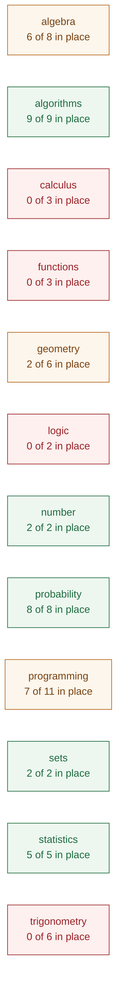
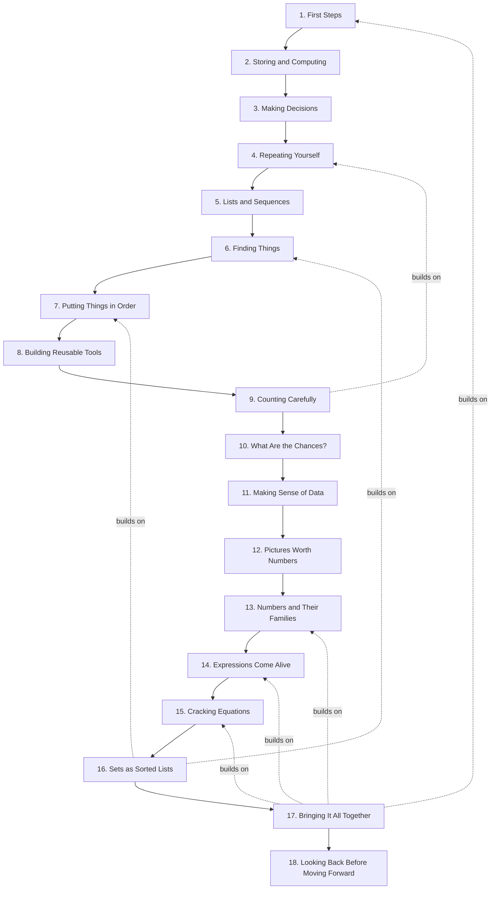
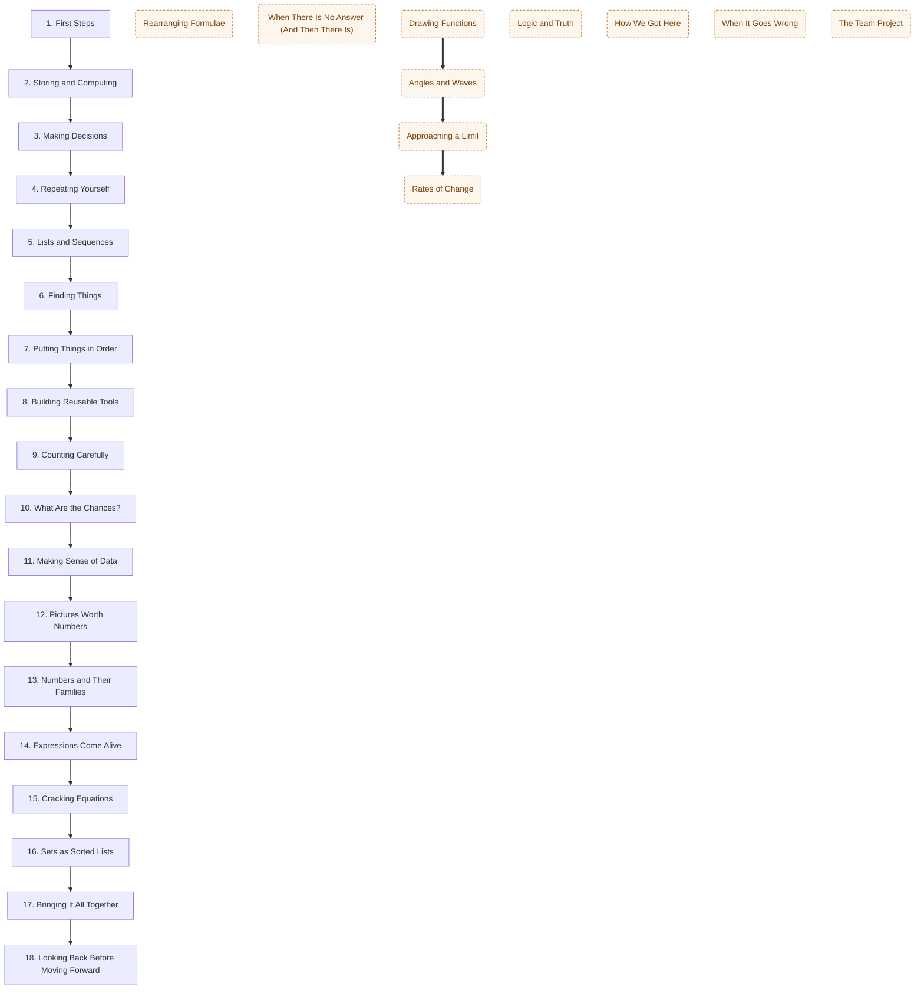

# Curriculum map

**Generated — do not edit by hand.** `python3 dev/curriculum_map.py`
rebuilds it from three files, and CI fails if this one is out of date:

- `planning/curriculum/outcomes.yaml` — every learning outcome in the two
  QQI module descriptors.
- each tutorial's `covers:` frontmatter — which outcome each section
  teaches, and which it only uses.
- `planning/curriculum/out-of-scope.yaml` — what we have decided not to
  teach, so a decision stops looking like a gap.

Every link below goes to the section of the live site that does the work,
so this doubles as a way of finding where anything is taught.

## Where we stand

**41 of 65** outcomes are in place, once the 2 we have ruled out are set aside.

- 🟩 **40 taught** — a tutorial section teaches it.
- 🟦 **1 taught in part** — deliberately narrowed, and the narrowed version is written.
- 🟨 **4 used but not taught** — students meet it in passing without it ever being the subject. These are the quiet gaps: they look covered from a distance.
- 🟥 **20 not covered** — nothing in dewlab touches it.
- ⬜ **2 out of scope** — see `planning/curriculum/out-of-scope.yaml` for why.

### By strand

| Strand | 🟩 Taught | 🟦 Part, by choice | 🟨 Used only | 🟥 Not covered | ⬜ Out of scope |
|---|---:|---:|---:|---:|---:|
| **algebra** | 5 | 1 | 2 | 0 | 0 |
| **algorithms** | 9 | 0 | 0 | 0 | 0 |
| **calculus** | 0 | 0 | 0 | 3 | 0 |
| **functions** | 0 | 0 | 1 | 2 | 0 |
| **geometry** | 2 | 0 | 0 | 4 | 0 |
| **logic** | 0 | 0 | 1 | 1 | 0 |
| **number** | 2 | 0 | 0 | 0 | 0 |
| **probability** | 8 | 0 | 0 | 0 | 0 |
| **programming** | 7 | 0 | 0 | 4 | 0 |
| **sets** | 2 | 0 | 0 | 0 | 1 |
| **statistics** | 5 | 0 | 0 | 0 | 0 |
| **trigonometry** | 0 | 0 | 0 | 6 | 1 |

## The series as it stands

Solid arrows are the reading order. A dashed arrow means the later
tutorial names the earlier one in its own text — evidence of a real
dependency rather than an intention, found by reading the tutorials
themselves. A tutorial with several dashed arrows into it is
load-bearing and expensive to move; one with none is cheap to move, and
possibly not pulling its weight where it is.

## What is missing, and where it would go

Dashed boxes are proposed. Placement is argued in
`planning/curriculum/proposed.yaml` and each has an outline in
`planning/outlines/`.

| Proposed | Goes after | Closes | Size |
|---|---|---|---|
| **Rearranging Formulae** | after tutorial-14-expressions-come-alive | `MIT-1.7` | short |
| **When There Is No Answer (And Then There Is)** | after tutorial-15-cracking-equations | `MIT-1.10` | short |
| **Drawing Functions** | after tutorial-15-cracking-equations | `MIT-3.1`, `MIT-3.2`, `MIT-3.4` _if kept:_ `MIT-4.1`, `MIT-4.2`, `MIT-4.3` | full |
| **Angles and Waves** | after drawing-functions | `MIT-3.3`, `MIT-4.5`, `MIT-4.6`, `MIT-4.8`, `MIT-4.10` _if kept:_ `MIT-4.4`, `MIT-4.9` | full |
| **Approaching a Limit** | after angles-and-waves | `MIT-3.5` | short |
| **Rates of Change** | after approaching-a-limit | `MIT-3.6`, `MIT-3.7` | full |
| **Logic and Truth** | after tutorial-16-sets-as-sorted-lists | `MIT-2.4`, `MIT-2.5` | short |
| **How We Got Here** | after tutorial-01-first-steps | `PDP-LO1`, `PDP-LO3` | full |
| **When It Goes Wrong** | after tutorial-03-making-decisions | `PDP-LO9` | full |
| **The Team Project** | after tutorial-17-bringing-it-all-together | `PDP-LO12` | not-a-tutorial |

## Every outcome

### Maths for Information Technology 5N18396

#### 1. Basic Arithmetic and Algebra

| Outcome | | Where |
|---|---|---|
| `MIT-1.1` Operations in N, Z, Q, R; powers (the syllabus says indices) and logarithms | 🟩 | [Making Decisions — Classifying Numbers: A Mathematical Application](https://deweydex.github.io/dewlab/tutorials/mit-pdp-maths-prog-integration/making-decisions.html#classifying-numbers-a-mathematical-application) [Numbers and Their Families — Powers and Their Rules](https://deweydex.github.io/dewlab/tutorials/mit-pdp-maths-prog-integration/numbers-and-their-families.html#powers-and-their-rules) [Numbers and Their Families — Logarithms: The Inverse of Powers](https://deweydex.github.io/dewlab/tutorials/mit-pdp-maths-prog-integration/numbers-and-their-families.html#logarithms-the-inverse-of-powers) |
| `MIT-1.2` Area and perimeter: square, rectangle, triangle, circle | 🟩 | [Numbers and Their Families — Practical Geometry: Formulas as Functions](https://deweydex.github.io/dewlab/tutorials/mit-pdp-maths-prog-integration/numbers-and-their-families.html#practical-geometry-formulas-as-functions) |
| `MIT-1.3` Volume and surface area: cube, cylinder, cone, sphere | 🟩 | [Numbers and Their Families — Practical Geometry: Formulas as Functions](https://deweydex.github.io/dewlab/tutorials/mit-pdp-maths-prog-integration/numbers-and-their-families.html#practical-geometry-formulas-as-functions) |
| `MIT-1.4` Binary and hexadecimal arithmetic and conversion | 🟩 | [Storing and Computing — Number Systems: How Computers Count](https://deweydex.github.io/dewlab/tutorials/mit-pdp-maths-prog-integration/storing-and-computing.html#number-systems-how-computers-count) |
| `MIT-1.5` Distinguish an expression from an equation | 🟦 | [Expressions Come Alive — Expressions versus Equations](https://deweydex.github.io/dewlab/tutorials/mit-pdp-maths-prog-integration/expressions-come-alive.html#expressions-versus-equations) **Narrowed:** not the formal expression-versus-equation distinction as an assessed item |
| `MIT-1.6` Evaluate, expand and simplify expressions | 🟩 | [Expressions Come Alive — Representing Polynomials](https://deweydex.github.io/dewlab/tutorials/mit-pdp-maths-prog-integration/expressions-come-alive.html#representing-polynomials) [Expressions Come Alive — Evaluating Polynomials](https://deweydex.github.io/dewlab/tutorials/mit-pdp-maths-prog-integration/expressions-come-alive.html#evaluating-polynomials) [Expressions Come Alive — Displaying Polynomials](https://deweydex.github.io/dewlab/tutorials/mit-pdp-maths-prog-integration/expressions-come-alive.html#displaying-polynomials) [Expressions Come Alive — Adding Polynomials](https://deweydex.github.io/dewlab/tutorials/mit-pdp-maths-prog-integration/expressions-come-alive.html#adding-polynomials) [Expressions Come Alive — Subtracting and Scaling](https://deweydex.github.io/dewlab/tutorials/mit-pdp-maths-prog-integration/expressions-come-alive.html#subtracting-and-scaling) _used in:_ [Bringing It All Together — Problem 1: The Polynomial Workshop](https://deweydex.github.io/dewlab/tutorials/mit-pdp-maths-prog-integration/bringing-it-all-together.html#problem-1-the-polynomial-workshop) |
| `MIT-1.7` Transpose formulae; operate on rational algebraic expressions | 🟨 | _used in:_ [Cracking Equations — Solving Linear Equations](https://deweydex.github.io/dewlab/tutorials/mit-pdp-maths-prog-integration/cracking-equations.html#solving-linear-equations) |
| `MIT-1.8` Multiply linear expressions into quadratics and cubics | 🟩 | [Expressions Come Alive — Multiplying Polynomials](https://deweydex.github.io/dewlab/tutorials/mit-pdp-maths-prog-integration/expressions-come-alive.html#multiplying-polynomials) _used in:_ [Bringing It All Together — Problem 1: The Polynomial Workshop](https://deweydex.github.io/dewlab/tutorials/mit-pdp-maths-prog-integration/bringing-it-all-together.html#problem-1-the-polynomial-workshop) |
| `MIT-1.9` Factor quadratics by inspection and solve them | 🟩 | [Cracking Equations — Factorisation](https://deweydex.github.io/dewlab/tutorials/mit-pdp-maths-prog-integration/cracking-equations.html#factorisation) |
| `MIT-1.10` Solve quadratics, including complex roots | 🟨 | _used in:_ [Cracking Equations — The Quadratic Formula](https://deweydex.github.io/dewlab/tutorials/mit-pdp-maths-prog-integration/cracking-equations.html#the-quadratic-formula) |
| `MIT-1.11` Solve linear inequalities | 🟩 | [Cracking Equations — Solving Inequalities](https://deweydex.github.io/dewlab/tutorials/mit-pdp-maths-prog-integration/cracking-equations.html#solving-inequalities) |
| `MIT-1.12` Simultaneous equations in two and three unknowns | 🟩 | [Cracking Equations — Simultaneous Equations](https://deweydex.github.io/dewlab/tutorials/mit-pdp-maths-prog-integration/cracking-equations.html#simultaneous-equations) _used in:_ [Bringing It All Together — Problem 2: Where Do They Meet?](https://deweydex.github.io/dewlab/tutorials/mit-pdp-maths-prog-integration/bringing-it-all-together.html#problem-2-where-do-they-meet) |

#### 2. Set Theory and Boolean Logic

| Outcome | | Where |
|---|---|---|
| `MIT-2.1` Set language: N, Z, Q, R, C, the empty set; finite, infinite, cardinality | 🟩 | [Numbers and Their Families — The Number Domains](https://deweydex.github.io/dewlab/tutorials/mit-pdp-maths-prog-integration/numbers-and-their-families.html#the-number-domains) [Sets as Sorted Lists — Making a Set](https://deweydex.github.io/dewlab/tutorials/mit-pdp-maths-prog-integration/sets-as-sorted-lists.html#making-a-set) [Sets as Sorted Lists — Membership Testing](https://deweydex.github.io/dewlab/tutorials/mit-pdp-maths-prog-integration/sets-as-sorted-lists.html#membership-testing) [Sets as Sorted Lists — Set Language and Notation](https://deweydex.github.io/dewlab/tutorials/mit-pdp-maths-prog-integration/sets-as-sorted-lists.html#set-language-and-notation) |
| `MIT-2.2` Set operations: union, intersection, complement, symmetric difference, Cartesian product, power set | 🟩 | [Sets as Sorted Lists — Set Operations: The Merge Pattern](https://deweydex.github.io/dewlab/tutorials/mit-pdp-maths-prog-integration/sets-as-sorted-lists.html#set-operations-the-merge-pattern) [Sets as Sorted Lists — Sets in Practice](https://deweydex.github.io/dewlab/tutorials/mit-pdp-maths-prog-integration/sets-as-sorted-lists.html#sets-in-practice) _used in:_ [Bringing It All Together — Problem 3: Sets of Solutions](https://deweydex.github.io/dewlab/tutorials/mit-pdp-maths-prog-integration/bringing-it-all-together.html#problem-3-sets-of-solutions) |
| `MIT-2.3` Venn diagrams for two and three sets | ⬜ | **Out of scope** — Venn diagrams. The set operations themselves are taught in Tutorial 16 and that is the part the students use. The diagram is a pen-and-paper convention that adds notation without adding understanding here. |
| `MIT-2.4` Truth tables: AND, NOT, OR, XOR | 🟨 | _used in:_ [Making Decisions — Boolean Operators: Combining Conditions](https://deweydex.github.io/dewlab/tutorials/mit-pdp-maths-prog-integration/making-decisions.html#boolean-operators-combining-conditions) |
| `MIT-2.5` De Morgan's Laws | 🟥 | — |

#### 3. Functions and Calculus

| Outcome | | Where |
|---|---|---|
| `MIT-3.1` The function and inverse function concept | 🟨 | _used in:_ [Finding Things — Functions as Input-Output Machines](https://deweydex.github.io/dewlab/tutorials/mit-pdp-maths-prog-integration/finding-things.html#functions-as-input-output-machines) |
| `MIT-3.2` Graph linear, quadratic and cubic functions; solve from a graph | 🟥 | — |
| `MIT-3.3` Define and graph the trigonometric functions | 🟥 | — |
| `MIT-3.4` Complete the square to find roots and vertex | 🟥 | — |
| `MIT-3.5` The limit of a function | 🟥 | — |
| `MIT-3.6` The derivative as a limit, a tangent slope, a rate of change | 🟥 | — |
| `MIT-3.7` Sum, product, quotient and chain rules | 🟥 | **Not written. When it is:** the sum and product rules as a tutorial of their own; integration by substitution as a second tutorial; the chain rule as a bonus section only, not the quotient rule, and integration by parts |

#### 4. Geometry and Trigonometry

| Outcome | | Where |
|---|---|---|
| `MIT-4.1` Linear equations in the form ax + by + c = 0 | 🟥 | — |
| `MIT-4.2` Slope; parallel and perpendicular lines | 🟥 | — |
| `MIT-4.3` Midpoint and length of a line segment | 🟥 | — |
| `MIT-4.4` The Pythagorean theorem | 🟥 | — |
| `MIT-4.5` Degree and radian measure | 🟥 | — |
| `MIT-4.6` sin, cos, tan and the unit circle: amplitude, phase, period | 🟥 | — |
| `MIT-4.7` Trigonometric ratios in surd form | ⬜ | **Out of scope** — Trigonometric ratios in surd form. Exact values from the special triangles are a hand-calculation skill; the trigonometry we want is the graphing and the two rules, both of which work in decimals. Note that the rest of Section 4 came back into scope on 2026-08-22 — this is now the only part of it left out. |
| `MIT-4.8` Triangle area as one half a b sin theta | 🟥 | — |
| `MIT-4.9` Practical right-triangle trigonometry | 🟥 | — |
| `MIT-4.10` The Sine Rule and the Cosine Rule | 🟥 | — |

#### 5. Probability and Statistics

| Outcome | | Where |
|---|---|---|
| `MIT-5.1` List the outcomes of an experiment | 🟩 | [What Are the Chances? — Basic Probability](https://deweydex.github.io/dewlab/tutorials/mit-pdp-maths-prog-integration/what-are-the-chances.html#basic-probability) |
| `MIT-5.2` The fundamental principle of counting | 🟩 | [Counting Carefully — A Practical Application: Password Strength](https://deweydex.github.io/dewlab/tutorials/mit-pdp-maths-prog-integration/counting-carefully.html#a-practical-application-password-strength) |
| `MIT-5.3` Arrangements of n objects (n factorial) | 🟩 | [Counting Carefully — Factorials: The Foundation](https://deweydex.github.io/dewlab/tutorials/mit-pdp-maths-prog-integration/counting-carefully.html#factorials-the-foundation) |
| `MIT-5.4` Permutations P(n, r) | 🟩 | [Counting Carefully — Permutations: Order Matters](https://deweydex.github.io/dewlab/tutorials/mit-pdp-maths-prog-integration/counting-carefully.html#permutations-order-matters) |
| `MIT-5.5` Combinations C(n, r) | 🟩 | [Counting Carefully — Combinations: Order Does Not Matter](https://deweydex.github.io/dewlab/tutorials/mit-pdp-maths-prog-integration/counting-carefully.html#combinations-order-does-not-matter) |
| `MIT-5.6` Probability as a scale from 0 to 1 | 🟩 | [What Are the Chances? — Basic Probability](https://deweydex.github.io/dewlab/tutorials/mit-pdp-maths-prog-integration/what-are-the-chances.html#basic-probability) |
| `MIT-5.7` Probability from equally likely outcomes | 🟩 | [What Are the Chances? — Basic Probability](https://deweydex.github.io/dewlab/tutorials/mit-pdp-maths-prog-integration/what-are-the-chances.html#basic-probability) _used in:_ [What Are the Chances? — Simulation: Testing Probability with Code](https://deweydex.github.io/dewlab/tutorials/mit-pdp-maths-prog-integration/what-are-the-chances.html#simulation-testing-probability-with-code) |
| `MIT-5.8` Compound probability: independent and mutually exclusive events | 🟩 | [What Are the Chances? — Compound Events](https://deweydex.github.io/dewlab/tutorials/mit-pdp-maths-prog-integration/what-are-the-chances.html#compound-events) [What Are the Chances? — Conditional Probability](https://deweydex.github.io/dewlab/tutorials/mit-pdp-maths-prog-integration/what-are-the-chances.html#conditional-probability) |
| `MIT-5.9` Data types: nominal, ordinal, discrete, continuous | 🟩 | [Making Sense of Data — Data Types](https://deweydex.github.io/dewlab/tutorials/mit-pdp-maths-prog-integration/making-sense-of-data.html#data-types) |
| `MIT-5.10` Effectiveness of displays: pie, histogram, stem-and-leaf | 🟩 | [Making Sense of Data — Visualisation with matplotlib](https://deweydex.github.io/dewlab/tutorials/mit-pdp-maths-prog-integration/making-sense-of-data.html#visualisation-with-matplotlib) [Pictures Worth Numbers — Why Visualise?](https://deweydex.github.io/dewlab/tutorials/mit-pdp-maths-prog-integration/pictures-worth-numbers.html#why-visualise) [Pictures Worth Numbers — Choosing the Right Chart](https://deweydex.github.io/dewlab/tutorials/mit-pdp-maths-prog-integration/pictures-worth-numbers.html#choosing-the-right-chart) [Pictures Worth Numbers — Good Practices for Visualisation](https://deweydex.github.io/dewlab/tutorials/mit-pdp-maths-prog-integration/pictures-worth-numbers.html#good-practices-for-visualisation) |
| `MIT-5.11` Frequency tables and histograms | 🟩 | [Making Sense of Data — Frequency Distributions](https://deweydex.github.io/dewlab/tutorials/mit-pdp-maths-prog-integration/making-sense-of-data.html#frequency-distributions) |
| `MIT-5.12` Mean, median, mode, range, standard deviation | 🟩 | [Making Sense of Data — Measures of Central Tendency](https://deweydex.github.io/dewlab/tutorials/mit-pdp-maths-prog-integration/making-sense-of-data.html#measures-of-central-tendency) [Making Sense of Data — Measures of Spread](https://deweydex.github.io/dewlab/tutorials/mit-pdp-maths-prog-integration/making-sense-of-data.html#measures-of-spread) [Pictures Worth Numbers — Combining Statistics and Visualisation](https://deweydex.github.io/dewlab/tutorials/mit-pdp-maths-prog-integration/pictures-worth-numbers.html#combining-statistics-and-visualisation) |
| `MIT-5.13` Merits and limitations of the averages with skewed data | 🟩 | [Making Sense of Data — A note on limitations](https://deweydex.github.io/dewlab/tutorials/mit-pdp-maths-prog-integration/making-sense-of-data.html#a-note-on-limitations) |

#### 6. Algorithms and Computations

| Outcome | | Where |
|---|---|---|
| `MIT-6.1` The concept of an algorithm | 🟩 | [First Steps — What is an Algorithm?](https://deweydex.github.io/dewlab/tutorials/mit-pdp-maths-prog-integration/first-steps.html#what-is-an-algorithm) |
| `MIT-6.2` An algorithm as a function on a domain of inputs | 🟩 | [Finding Things — Functions as Input-Output Machines](https://deweydex.github.io/dewlab/tutorials/mit-pdp-maths-prog-integration/finding-things.html#functions-as-input-output-machines) [Lists and Sequences — Mathematical Sequences as Functions](https://deweydex.github.io/dewlab/tutorials/mit-pdp-maths-prog-integration/lists-and-sequences.html#mathematical-sequences-as-functions) |
| `MIT-6.3` Manipulate lists and arrays, including addition and multiplication | 🟩 | [Lists and Sequences — Lists: Ordered Collections](https://deweydex.github.io/dewlab/tutorials/mit-pdp-maths-prog-integration/lists-and-sequences.html#lists-ordered-collections) [Lists and Sequences — Building Lists with Loops](https://deweydex.github.io/dewlab/tutorials/mit-pdp-maths-prog-integration/lists-and-sequences.html#building-lists-with-loops) [Lists and Sequences — The Dot Product: Lists Meet Arithmetic](https://deweydex.github.io/dewlab/tutorials/mit-pdp-maths-prog-integration/lists-and-sequences.html#the-dot-product-lists-meet-arithmetic) |
| `MIT-6.4` Index, sigma and pi notation | 🟩 | [Repeating Yourself — Sigma Notation: Mathematics Meets Loops](https://deweydex.github.io/dewlab/tutorials/mit-pdp-maths-prog-integration/repeating-yourself.html#sigma-notation-mathematics-meets-loops) |
| `MIT-6.5` Lists and arrays applied to simple problems | 🟩 | [Lists and Sequences — Looping Over Lists](https://deweydex.github.io/dewlab/tutorials/mit-pdp-maths-prog-integration/lists-and-sequences.html#looping-over-lists) |
| `MIT-6.6` Divide and conquer | 🟩 | [Finding Things — Divide and Conquer](https://deweydex.github.io/dewlab/tutorials/mit-pdp-maths-prog-integration/finding-things.html#divide-and-conquer) |
| `MIT-6.7` Iterate over a one-dimensional array by index | 🟩 | [Lists and Sequences — Building Lists with Loops](https://deweydex.github.io/dewlab/tutorials/mit-pdp-maths-prog-integration/lists-and-sequences.html#building-lists-with-loops) [Lists and Sequences — Looping Over Lists](https://deweydex.github.io/dewlab/tutorials/mit-pdp-maths-prog-integration/lists-and-sequences.html#looping-over-lists) [Repeating Yourself — For Loops: When You Know How Many Times](https://deweydex.github.io/dewlab/tutorials/mit-pdp-maths-prog-integration/repeating-yourself.html#for-loops-when-you-know-how-many-times) [Repeating Yourself — Building Up Gradually: Counting with Conditions](https://deweydex.github.io/dewlab/tutorials/mit-pdp-maths-prog-integration/repeating-yourself.html#building-up-gradually-counting-with-conditions) |
| `MIT-6.8` Recursion; linear and binary search; bubble, insertion, selection and shell sort | 🟩 | [Finding Things — Linear Search: The Straightforward Approach](https://deweydex.github.io/dewlab/tutorials/mit-pdp-maths-prog-integration/finding-things.html#linear-search-the-straightforward-approach) [Finding Things — Binary Search: The Power of Sorted Data](https://deweydex.github.io/dewlab/tutorials/mit-pdp-maths-prog-integration/finding-things.html#binary-search-the-power-of-sorted-data) [Putting Things in Order — Bubble Sort: Let Things Rise](https://deweydex.github.io/dewlab/tutorials/mit-pdp-maths-prog-integration/putting-things-in-order.html#bubble-sort-let-things-rise) [Putting Things in Order — Insertion Sort: Sort Like You Sort Cards](https://deweydex.github.io/dewlab/tutorials/mit-pdp-maths-prog-integration/putting-things-in-order.html#insertion-sort-sort-like-you-sort-cards) [Putting Things in Order — Selection Sort: Find the Smallest](https://deweydex.github.io/dewlab/tutorials/mit-pdp-maths-prog-integration/putting-things-in-order.html#selection-sort-find-the-smallest) [Putting Things in Order — Comparing Our Sorts](https://deweydex.github.io/dewlab/tutorials/mit-pdp-maths-prog-integration/putting-things-in-order.html#comparing-our-sorts) _used in:_ [Putting Things in Order — Optional Challenges](https://deweydex.github.io/dewlab/tutorials/mit-pdp-maths-prog-integration/putting-things-in-order.html#optional-challenges) |

### Programming and Design Principles 5N2927

| Outcome | | Where |
|---|---|---|
| `PDP-LO1` The history of computer programming | 🟥 | — |
| `PDP-LO2` Algorithms and their real-world application | 🟩 | [First Steps — What is an Algorithm?](https://deweydex.github.io/dewlab/tutorials/mit-pdp-maths-prog-integration/first-steps.html#what-is-an-algorithm) |
| `PDP-LO3` Differentiate programming languages by their characteristics | 🟥 | — |
| `PDP-LO4` Procedural syntax: storage, expressions, statements, input and output, keywords, operators | 🟩 | [First Steps — A Few More Things Python Can Do](https://deweydex.github.io/dewlab/tutorials/mit-pdp-maths-prog-integration/first-steps.html#a-few-more-things-python-can-do) [Storing and Computing — Variables: Giving Names to Things](https://deweydex.github.io/dewlab/tutorials/mit-pdp-maths-prog-integration/storing-and-computing.html#variables-giving-names-to-things) [Storing and Computing — Data Types: Different Kinds of Information](https://deweydex.github.io/dewlab/tutorials/mit-pdp-maths-prog-integration/storing-and-computing.html#data-types-different-kinds-of-information) [Storing and Computing — Type Conversion](https://deweydex.github.io/dewlab/tutorials/mit-pdp-maths-prog-integration/storing-and-computing.html#type-conversion) |
| `PDP-LO5` The sequential nature of problem solving | 🟩 | [First Steps — Pseudocode: Planning Before Coding](https://deweydex.github.io/dewlab/tutorials/mit-pdp-maths-prog-integration/first-steps.html#pseudocode-planning-before-coding) |
| `PDP-LO6` Structured design: pseudocode, storage, selection and iteration | 🟩 | [First Steps — Pseudocode: Planning Before Coding](https://deweydex.github.io/dewlab/tutorials/mit-pdp-maths-prog-integration/first-steps.html#pseudocode-planning-before-coding) [Making Decisions — Comparisons: True or False?](https://deweydex.github.io/dewlab/tutorials/mit-pdp-maths-prog-integration/making-decisions.html#comparisons-true-or-false) [Making Decisions — If Statements: Choosing a Path](https://deweydex.github.io/dewlab/tutorials/mit-pdp-maths-prog-integration/making-decisions.html#if-statements-choosing-a-path) [Making Decisions — If-Else: Two Paths](https://deweydex.github.io/dewlab/tutorials/mit-pdp-maths-prog-integration/making-decisions.html#if-else-two-paths) [Making Decisions — Elif: Multiple Paths](https://deweydex.github.io/dewlab/tutorials/mit-pdp-maths-prog-integration/making-decisions.html#elif-multiple-paths) [Making Decisions — Boolean Operators: Combining Conditions](https://deweydex.github.io/dewlab/tutorials/mit-pdp-maths-prog-integration/making-decisions.html#boolean-operators-combining-conditions) [Repeating Yourself — While Loops: Repeat Until Done](https://deweydex.github.io/dewlab/tutorials/mit-pdp-maths-prog-integration/repeating-yourself.html#while-loops-repeat-until-done) [Repeating Yourself — For Loops: When You Know How Many Times](https://deweydex.github.io/dewlab/tutorials/mit-pdp-maths-prog-integration/repeating-yourself.html#for-loops-when-you-know-how-many-times) [Repeating Yourself — Nested Loops](https://deweydex.github.io/dewlab/tutorials/mit-pdp-maths-prog-integration/repeating-yourself.html#nested-loops) |
| `PDP-LO7` Develop documented programs for familiar and unfamiliar problems | 🟩 | [Building Reusable Tools — Handling Edge Cases](https://deweydex.github.io/dewlab/tutorials/mit-pdp-maths-prog-integration/building-reusable-tools.html#handling-edge-cases) [Storing and Computing — Putting It Together: A Small Program](https://deweydex.github.io/dewlab/tutorials/mit-pdp-maths-prog-integration/storing-and-computing.html#putting-it-together-a-small-program) |
| `PDP-LO8` Modularisation: functions, procedures, scope, parameter passing | 🟩 | [Building Reusable Tools — What Makes a Good Function?](https://deweydex.github.io/dewlab/tutorials/mit-pdp-maths-prog-integration/building-reusable-tools.html#what-makes-a-good-function) [Building Reusable Tools — Functions Calling Functions](https://deweydex.github.io/dewlab/tutorials/mit-pdp-maths-prog-integration/building-reusable-tools.html#functions-calling-functions) [Building Reusable Tools — Variable Scope Revisited](https://deweydex.github.io/dewlab/tutorials/mit-pdp-maths-prog-integration/building-reusable-tools.html#variable-scope-revisited) [Finding Things — Scope: Where Variables Live](https://deweydex.github.io/dewlab/tutorials/mit-pdp-maths-prog-integration/finding-things.html#scope-where-variables-live) [Lists and Sequences — Functions: Reusable Algorithms](https://deweydex.github.io/dewlab/tutorials/mit-pdp-maths-prog-integration/lists-and-sequences.html#functions-reusable-algorithms) [Pictures Worth Numbers — Writing Reusable Plotting Functions](https://deweydex.github.io/dewlab/tutorials/mit-pdp-maths-prog-integration/pictures-worth-numbers.html#writing-reusable-plotting-functions) |
| `PDP-LO9` Interpret compiler and linker messages and react appropriately | 🟥 | — |
| `PDP-LO10` The testing process: structured walkthroughs and debugging tools | 🟩 | [Bringing It All Together — Problem 4: Building and Verifying](https://deweydex.github.io/dewlab/tutorials/mit-pdp-maths-prog-integration/bringing-it-all-together.html#problem-4-building-and-verifying) [Building Reusable Tools — Testing as a Habit](https://deweydex.github.io/dewlab/tutorials/mit-pdp-maths-prog-integration/building-reusable-tools.html#testing-as-a-habit) |
| `PDP-LO11` Coding standards: comments, indentation, variable naming | 🟩 | [Building Reusable Tools — What Makes a Good Function?](https://deweydex.github.io/dewlab/tutorials/mit-pdp-maths-prog-integration/building-reusable-tools.html#what-makes-a-good-function) [Looking Back Before Moving Forward — Part 1: Reading Your Own Code](https://deweydex.github.io/dewlab/tutorials/mit-pdp-maths-prog-integration/critique-and-reflection.html#part-1-reading-your-own-code) [Looking Back Before Moving Forward — Part 2: Reading Someone Else's Code](https://deweydex.github.io/dewlab/tutorials/mit-pdp-maths-prog-integration/critique-and-reflection.html#part-2-reading-someone-elses-code) [Storing and Computing — Variables: Giving Names to Things](https://deweydex.github.io/dewlab/tutorials/mit-pdp-maths-prog-integration/storing-and-computing.html#variables-giving-names-to-things) |
| `PDP-LO12` Team programming: design, develop, release and review over time, in teams of three to five | 🟥 | — |

## Vocabulary

The tutorials mark a term being introduced by putting it in italics the first time it means something particular. **73 terms** are marked that way, and asking two questions of them is free.

### Introduced more than once

The same word presented as new in two places. Either it is being introduced twice, or the two places mean different things by it — nothing here can tell which, and a person reading both decides. `index` was the second kind and cost a rewrite.

| Term | Introduced in tutorials |
|---|---|
| *cracking equations* | 14, 17 |
| *expressions come alive* | 15, 17 |
| *finding things* | 7, 16 |
| *index* | 4, 5, 13 |
| *modular* | 5, 18 |
| *set* | 15, 16 |
| *solve* | 14, 15 |
| *zahlen* | 2, 13 |

### Used before it was introduced

A word appearing in an earlier tutorial than the one that stops to explain it. Some are ordinary English doing ordinary work and can be ignored; the rest are places a student met a term as though they already knew it.

| Term | First appears in | Introduced in |
|---|---:|---:|
| *counting carefully* | 9 | 10 |
| *design* | 6 | 8 |
| *expression* | 1 | 14 |
| *expressions come alive* | 14 | 15 |
| *finding things* | 6 | 7 |
| *first steps* | 1 | 17 |
| *functions* | 2 | 5 |
| *independent* | 8 | 10 |
| *making sense of data* | 11 | 12 |
| *numbers and their families* | 13 | 17 |
| *parameters* | 5 | 8 |
| *power* | 2 | 13 |
| *putting things in order* | 7 | 16 |
| *repeating yourself* | 4 | 9 |
| *repetition* | 3 | 9 |
| *representation* | 2 | 14 |
| *return values* | 5 | 8 |
| *set* | 5 | 15 |
| *sets as sorted lists* | 16 | 17 |
| *solve* | 5 | 14 |
| *tools* | 3 | 8 |

## Scope questions, settled

Kept rather than deleted: a decision is worth as much as the question it answered, and the next person to wonder will wonder the same thing.

- **MIT-4.4, MIT-4.9 — Pythagoras and right-triangle trigonometry** — In scope, in full.
- **MIT-4.5, MIT-4.6 — radians and the unit circle** — In scope, in full. Radians taught properly rather than avoided.
- **MIT-4.1, MIT-4.2, MIT-4.3 — coordinate geometry** — In scope, in full.
- **How much material this adds** — Not a constraint. More tutorials is a good outcome rather than a cost — teachers pick which ones they use, and a student who is going well can go further. Tutorials may also be long, and may refer to each other freely.
