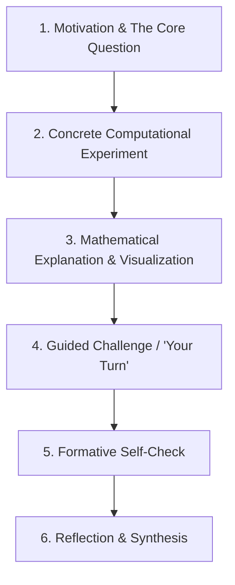

# Pedagogical Style Guide for dewlab Tutorials

A guide for authors, educators, and contributors on designing, structuring, and writing engaging, interactive computational tutorials in dewlab.

---

## 1. Our Core Teaching Philosophy

dewlab brings mathematics and programming together as mutual partners. Code is not merely a tool for automating calculations, and mathematics is not just abstract theory behind algorithms. In dewlab, **computing is an interactive laboratory for mathematical intuition**, and **mathematics provides the foundational structure for computational thinking**.

### Key Principles

#### 1. Discover First, Name Afterwards
Introduce students to concrete experiments and intuitive problem-solving *before* formalizing terminology, abstract definitions, or rigorous notation.
- *Example (Algorithms)*: Guide students through halving an ordered phonebook or sorted list step-by-step in code. Once they experience how fast the search space shrinks, introduce the formal names: **Binary Search** and **Divide-and-Conquer**.
- *Example (Linear Algebra)*: Multiply a 3×3 weather transition matrix repeatedly in Python and watch the state vector settle onto stable probabilities. Then, explain that this equilibrium is a **stationary distribution** of a **Markov chain**.
- *Example (Calculus)*: Compute secant line slopes between $(x, f(x))$ and $(x + h, f(x + h))$ for shrinking values of $h = 0.1, 0.01, 0.001$. Once students see the numbers converge to a tangent slope, introduce the limit definition of the **derivative**.

#### 2. Plain, Welcoming Language Over Academic Jargon
Adult learners and students meeting computing or higher mathematics for the first time often carry anxiety from previous educational experiences. 
- Choose **plain, descriptive titles**: *Lines and Distances* instead of *Coordinate Geometry*; *How We Got Here* instead of *The Computing Time Machine*.
- Demystify concepts using accessible analogies before introducing formal symbols.

#### 3. Respect Cognitive Load
- Keep executable code cells short, readable, and focused (typically 5–15 lines).
- Avoid overwhelming students with extraneous syntax or unmotivated configuration boilerplate.
- Frame error messages as helpful diagnostic feedback rather than failures.

---

## 2. The Anatomy of an Ideal dewlab Tutorial

Every tutorial follows a natural, predictable rhythm that builds confidence through hands-on experimentation:



### Step-by-Step Structure

### 1. Motivation & The Core Question
Open with a relatable question or computational challenge. Why does this concept matter? Where does it appear in software engineering, data analysis, graphics, or everyday life?

### 2. Concrete Computational Experiment
Provide a pre-written, runnable code cell that works immediately when the student clicks **Run**.
```python exec
id: intro-experiment-1
# Let's see what happens to a unit circle when we plot (cos θ, sin θ)
import numpy as np
import matplotlib.pyplot as plt

theta = np.linspace(0, 2 * np.pi, 200)
x = np.cos(theta)
y = np.sin(theta)

fig, ax = plt.subplots(figsize=(5, 5))
ax.plot(x, y, color="#1B2A4A", linewidth=2)
ax.set_aspect("equal")
ax.grid(True, linestyle="--", alpha=0.6)
plt.title("The Unit Circle: x² + y² = 1")
plt.show()
```

### 3. Mathematical Explanation & Visualization
Connect the code output directly to the mathematical ideas. Use clear KaTeX notation to formalize the relationship:
$$\cos^2(\theta) + \sin^2(\theta) = 1$$
Explain *why* the equation holds geometrically using the Pythagorean theorem on coordinates $(x, y)$.

### 4. Guided Challenge ("Your Turn")
Give the student an active task to modify the code or solve a related problem. Provide a clear starter cell with helpful comments.
```python exec
id: your-turn-1
hint: Remember that the hypotenuse is the distance from the origin (0, 0) to (x, y).
# Calculate the Euclidean distance between point A (2, 3) and point B (5, 7)
import numpy as np

p1 = np.array([2, 3])
p2 = np.array([5, 7])

# Your code here:
distance = ...
print("Calculated distance:", distance)
```

### 5. Formative Self-Check
Where appropriate, use `check()` from `tutorial_tools.py` to give instant, encouraging feedback without punitive scoring:
```python exec
id: check-distance-1
from tutorial_tools import check

# Verify your calculated distance
expected_distance = 5.0
check(distance, expected_distance, tolerance=1e-3)
```

### 6. Reflection & Synthesis
Conclude with a brief reflection prompt or connection to upcoming topics:
- *What surprised you about this behavior?*
- *How does this concept connect to what we built in the previous tutorial?*

---

## 3. Terminology & Style Conventions

To avoid confusion when moving between mathematics and programming, adhere to consistent terminology across all tutorials:

| Concept | Recommended Usage | Avoid / Deprecate | Rationale |
|---|---|---|---|
| Powers / Exponents | **Power** or **Exponent** ($x^2, 2^n$) | *Index / Indices* (for exponents) | Reserve *index* and *indices* strictly for sequence and list positioning (`list[i]`) or summation bounds ($\sum_{i=1}^n$). |
| Functions | Distinguish **Mathematical Function** ($f(x) = x^2$) from **Python Callable** (`def f(x):`) | Unclear conflation | Clarify whether discussing a pure mathematical mapping or a programmatic subroutine with possible side effects. |
| Data Spread vs Generator | **Spread / Dispersion** for data; **`range()`** for Python loops | Ambiguous "range" | Distinguishes descriptive statistical spread from Python iteration generators. |
| Discrete Sets | **Set** ($\{1, 2, 3\}$) | *List* (when unordered) | Emphasize uniqueness and unordered mathematical properties over sequential collections. |

---

## 4. Practice Sets & Self-Evaluation Guidelines

Practice problem pages (`<slug>-practice.md`) accompany core tutorials to reinforce mastery through deliberate practice:

### 1. In-Line Collapsible Solutions
Place answers directly beneath each problem in a collapsible `<details>` fold:
```markdown
**Problem 3:** Find the coordinates of the point on the unit circle at $\theta = \frac{\pi}{4}$ radians ($45^\circ$).

<details>
<summary>Check solution</summary>

At $\theta = \frac{\pi}{4}$:
$$x = \cos\left(\frac{\pi}{4}\right) = \frac{\sqrt{2}}{2} \approx 0.7071$$
$$y = \sin\left(\frac{\pi}{4}\right) = \frac{\sqrt{2}}{2} \approx 0.7071$$

The point is $\left(\frac{\sqrt{2}}{2}, \frac{\sqrt{2}}{2}\right)$.
</details>
```

### 2. Section-Level Python Verification Tools
Instead of creating dozens of individual code cells for minor arithmetic, provide one or two interactive Python scratchpads per section where students can test any calculation.

---

## 5. Author Checklist for New Tutorials

Before publishing a new tutorial, verify that it fulfills our pedagogical criteria:

- [ ] **Warm & Accessible Tone**: Is the opening welcoming and free of unmotivated jargon?
- [ ] **Interactive First Step**: Can a student click **Run** on the first cell within 60 seconds of opening the page?
- [ ] **Visual or Concrete Feedback**: Does the code produce visual plots, formatted tables, or tangible numbers?
- [ ] **Stable Cell IDs**: Are all executable cell IDs unique, lowercase, and hyphenated (`section-slug-n`)?
- [ ] **Clean Errors & Scaffolding**: Are hints provided for non-obvious tasks without giving away the full answer?
- [ ] **Explicit Learning Outcome Mapping**: Does the frontmatter declare all taught (`covers:`) and referenced (`touches:`) outcome codes?
