# Going round in circles: angles, radians and the unit circle

The clock on your phone knows the time: 10:10, say. To draw it, the app
has to draw two lines from the middle of the face. Each line ends at a
point on a circle. How does the app know where that point is?

We can ask the same question of the sky. Where are the planets? One
short tool of yours answers both.

On this page we:

- measure how far a clock hand has turned, in degrees
- put a point on a circle of radius 1, and name its two coordinates
  cosine and sine
- see why `math.cos(90)` is not 0, and meet radians
- add `point_on_circle` to the toolkit, and draw a clock with it
- send four planets round the Sun with it, on NASA's numbers
- find some points exactly, with Pythagoras
- draw a triangle on a ball whose angles add up to 270°

> **The space we're in.** A flat plane, with $x$ across and $y$ up, as
> on [Straight lines](tutorial:straight-lines) and
> [How far apart?](tutorial:how-far-apart). Your toolkit is loaded, with
> `distance` and `close_enough` ready. Maths measures a turn from the
> right, going anticlockwise, and a clock measures it from the top,
> going clockwise. Both work, but we have to say which one we mean.

## Warm-up

The first question is from
[Measuring rooms and tins](tutorial:measuring-rooms-and-tins#circles-and-pi),
and the second from
[How far apart?](tutorial:how-far-apart#the-distance-between-two-points).

```question
id: going-round-warm-up-1
type: fill-in-the-blank

The distance all the way round a circle of radius $r$ is its
circumference, $C = {2}\pi r$.
```

```question
id: going-round-warm-up-2
type: multiple-choice
answer: 3

How far is the point $(0.6, 0.8)$ from $(0, 0)$? Pythagoras gives
$\sqrt{0.6^2 + 0.8^2}$.

- 1.4
  - This adds 0.6 and 0.8, rather than squaring them first.
- 0.2
  - This takes 0.6 from 0.8.
- 1
  - 0.36 + 0.64 is 1, and the square root of 1 is 1.
- 0.48
  - This multiplies 0.6 by 0.8.
```

## A turn in 360 pieces

A whole turn is split into 360 equal pieces, called *degrees*, and
written $360^\circ$. A quarter turn is $90^\circ$, a right angle. Half a
turn is $180^\circ$.

In one hour, a clock's minute hand makes a whole turn: 360 degrees in 60
minutes. So each minute moves it $360 \div 60 = 6$ degrees. The hour
hand is slower. It makes a whole turn in 12 hours, so each hour moves it
$360 \div 12 = 30$ degrees, and each minute moves it half a degree.

Before you run the cell, where is the hour hand at 10:10? Is it on the
10, or a little past it?

```python exec
id: going-round-clock-1
def hand_angles(hours, minutes):
    """Return (hour hand, minute hand) as degrees turned clockwise from 12."""
    hour_angle = (hours % 12) * 30 + minutes * 0.5
    minute_angle = minutes * 6
    return (hour_angle, minute_angle)

print(hand_angles(3, 0))
print(hand_angles(10, 10))
print(hand_angles(12, 30))
```

At 3:00 the hour hand has turned $90^\circ$ and the minute hand $0^\circ$.
At 10:10 the hour hand has turned $305^\circ$: $300^\circ$ for the ten
hours, and $5^\circ$ more for the ten minutes. So it sits a little past
the 10. The `% 12` from
[Numbers a computer can hold](tutorial:numbers-a-computer-can-hold)
turns 12 o'clock into 0, since a hand at 12 has not turned at all.

### Your turn

1. What are the two angles at 6:45? Guess, then add a line to check.
2. At 3:00 the hands are $90^\circ$ apart. At what other time on the
   hour are they $90^\circ$ apart?

## A circle of radius 1

The app knows two angles. To draw a hand, it needs the point where the
hand ends, as $(x, y)$. Let's make the question small. Take a circle
with its centre at $(0, 0)$ and a radius of 1. This is the *unit
circle*. Start at $(1, 0)$, on the right, and turn anticlockwise, the
way maths measures angles.

Some points we can find with no code at all. A quarter turn takes us to
the top, $(0, 1)$. Where does half a turn take us?

```question
id: going-round-half-turn
type: multiple-choice
answer: 2

Start at $(1, 0)$ on the unit circle, and turn $180^\circ$
anticlockwise. Where are you?

- $(0, -1)$
  - That is a quarter turn clockwise, or three quarters anticlockwise.
- $(-1, 0)$
  - Half a turn takes you to the opposite side of the circle.
- $(1, 1)$
  - (1, 1) is not on the unit circle: it is further than 1 from the centre.
- $(0, 0)$
  - (0, 0) is the centre, not a point on the circle.
```

For angles in between, we need a name for each coordinate. For a point
on the unit circle at angle $\theta$ (the Greek letter theta, which
maths often uses for an angle):

- the *cosine* of $\theta$, written $\cos\theta$, is the point's $x$,
  how far across it is;
- the *sine* of $\theta$, written $\sin\theta$, is the point's $y$, how
  far up it is.



So the point is $(\cos\theta, \sin\theta)$, and from the quarter
turns, $\cos 90^\circ = 0$. Sine and cosine are functions, as on
[Machines that take a number](tutorial:machines-that-take-a-number). An
angle goes in, and a number between −1 and 1 comes out.

Every point is 1 from the centre. With
[Pythagoras](tutorial:how-far-apart#squares-on-the-sides-pythagoras),
that says
$\cos^2\theta + \sin^2\theta = 1$ for every angle. ($\cos^2\theta$
means $(\cos\theta)^2$.)

## Python measures angles another way

Python has sine and cosine in the `math` module, as `math.sin` and
`math.cos`. We know that $\cos 90^\circ = 0$. So what will this print?

```python exec
id: going-round-radians-1
import math

print(math.cos(90))
print(math.sin(90))
```

Python prints `-0.4480736161291701` and `0.8939966636005579`. The point
$(-0.448, 0.894)$ is up and to the left, not at the top. Nothing broke.
Python measures angles in a different unit.

Picture the point walking round the edge of the unit circle. Instead of
counting degrees, we could measure how far it has walked along the
edge. That walk is the angle in *radians*. One radian is the angle
where the walk along the edge is as long as the radius.

A whole turn walks the whole circumference, $2\pi r$. With $r = 1$,
that is $2\pi$, about 6.28. So:

$$360^\circ = 2\pi \text{ radians} \qquad 180^\circ = \pi \text{ radians} \qquad 90^\circ = \frac{\pi}{2} \text{ radians}$$



`math.cos(90)` walked 90 units round a circle whose whole edge is 6.28
long. That is more than 14 whole turns, and then a bit.

### Converting

Since $180^\circ = \pi$ radians, we turn degrees into radians by
multiplying by $\frac{\pi}{180}$. Python has this ready as
`math.radians`, and the way back as `math.degrees`. What do you expect
now?

```python exec
id: going-round-radians-2
quarter = math.radians(90)
print(quarter, math.pi / 2)
print(math.cos(quarter), math.sin(quarter))
print(math.degrees(1))
```

`math.radians(90)` is 1.5707963267948966, which is $\frac{\pi}{2}$, and
now the sine is `1.0`. One radian is about $57.3^\circ$.

The cosine is `6.123233995736766e-17`, a number so small it is 0 for
any clock. $\frac{\pi}{2}$ has endless digits, and a float keeps only
about 16 of them, so the angle is not quite exact, and nor is its
cosine.
The context page
[How a computer stores a number](tutorial:how-a-computer-stores-a-number#reading-e-16)
has the whole story. So we compare with `close_enough`, never
with `==`.

Why choose radians? An angle in radians is a distance walked, with no
360 chosen by people inside it, and much of later maths is shorter to
write that way. CSS lets you choose, too:
`rotate(90deg)`, `rotate(1.5708rad)` and `rotate(0.25turn)` all make
the same quarter turn.

<aside class="dl-note" id="going-round-note-radian">

**A word from Belfast.** The word *radian* first appeared in print in
1873, in exam questions set by James Thomson at Queen's College,
Belfast. He was the brother of the physicist Lord Kelvin. Mathematicians
had measured angles this way for more than a century before anyone
gave the unit a name.

</aside>

### Your turn

1. Print `math.radians(180)`. Which number is it?
2. Check that $\cos^2\theta + \sin^2\theta = 1$ for $\theta = 37^\circ$.
   Remember to convert first.

## A tool for any point on a circle

A clock hand has a length, so we need circles of any radius. A circle
of radius $r$ is the unit circle, scaled up $r$ times. So the point at
angle $\theta$ is

$$(r\cos\theta,\ r\sin\theta)$$

Here is the promise of a new tool. You write its body. Turn
`angle_degrees` into radians, then return the point.

```python exec
id: going-round-toolkit
toolkit: yes
import math

def point_on_circle(radius, angle_degrees):
    """Return the point (x, y) on a circle of this radius, centred at (0, 0).

    angle_degrees is measured anticlockwise from the positive x direction.
    point_on_circle(1, 90) is (0, 1), give or take a tiny rounding error.
    """
    ...
```

```python toolkit-reference
for: going-round-toolkit
import math

def point_on_circle(radius, angle_degrees):
    """Return the point (x, y) on a circle of this radius, centred at (0, 0).

    angle_degrees is measured anticlockwise from the positive x direction.
    point_on_circle(1, 90) is (0, 1), give or take a tiny rounding error.
    """
    angle = math.radians(angle_degrees)
    return (radius * math.cos(angle), radius * math.sin(angle))
```

Run the toolkit cell. Then how does your `point_on_circle` compare with
one way to write it? The table below runs the same calls on your
function and on a solution, side by side. Until the body is written,
your column shows `None`, because `...` returns `None`. The last two
rows walk round a circle of radius 5, a degree at a time, and use your
`distance` to find the nearest and the furthest of the 361 points from
the centre.

```inputs
for: going-round-toolkit
point_on_circle(1, 0)       # start on the right
point_on_circle(1, 90)      # a quarter turn: the top
point_on_circle(2, 180)     # half a turn, radius 2
min(distance((0, 0), point_on_circle(5, angle)) for angle in range(361))   # the nearest point to the centre...
max(distance((0, 0), point_on_circle(5, angle)) for angle in range(361))   # ...and the furthest: both 5
```

```solution
for: going-round-toolkit
import math

def point_on_circle(radius, angle_degrees):
    """Return the point (x, y) on a circle of this radius, centred at (0, 0).

    angle_degrees is measured anticlockwise from the positive x direction.
    point_on_circle(1, 90) is (0, 1), give or take a tiny rounding error.
    """
    angle = math.radians(angle_degrees)
    return (radius * math.cos(angle), radius * math.sin(angle))
```

A number such as `6.123233995736766e-17` is $6.1 \times 10^{-17}$, a
float's rounding, very close to 0. Where a row is different by more
than that, try that call on its own.

```hint
for: going-round-toolkit
after: 3 runs
Try `print(point_on_circle(1, 90))` on its own. What came back? Which
two things does the function need to give back, and in what brackets?
```

```hint
for: going-round-toolkit
after: 8 runs
title: some steps
1. Make a name `angle` for `math.radians(angle_degrees)`.
2. Give back a pair: `radius * math.cos(angle)` first, then
   `radius * math.sin(angle)`, in round brackets.

**Think about:** what would happen if you left out `math.radians`?
Which row would show it?
```

## Drawing the clock

The cells from here on use your `point_on_circle`, so write it first.
One problem is left, and it is a question of space. A clock measures
from 12, clockwise. `point_on_circle` measures from 3 o'clock,
anticlockwise. How do we turn one into the other?

12 o'clock is $90^\circ$ in maths. Each clockwise degree takes one away
from that. So a hand that has turned $a$ degrees clockwise from 12 is at
$90 - a$ degrees in maths. For 3 o'clock, $a = 90$, and $90 - 90 = 0$,
which is the right-hand side.

First the face. A drawing needs two lists, the $x$ values and the $y$
values, so a small helper turns a row of angles into those two lists.
Where will the dot for 3 o'clock be?

```python exec
id: going-round-clock-2
import matplotlib.pyplot as plt

def circle_points(radius, angles):
    """Return two lists: the x and the y of point_on_circle for each angle."""
    xs = []
    ys = []
    for angle in angles:
        x, y = point_on_circle(radius, angle)
        xs.append(x)
        ys.append(y)
    return xs, ys

def draw_face():
    """Draw a clock's rim, and a dot for each hour."""
    plt.figure(figsize=(4, 4))
    rim_x, rim_y = circle_points(1, range(0, 361, 2))
    plt.plot(rim_x, rim_y, color="grey")
    dots_x, dots_y = circle_points(0.9, range(0, 360, 30))
    plt.plot(dots_x, dots_y, "o", color="grey")
    plt.axis("equal")
    plt.axis("off")

draw_face()
```

The dots are $30^\circ$ apart, and the first, at $0^\circ$, sits at
3 o'clock. Now the hands. Each one is a line from $(0, 0)$ to a point
on a smaller circle: 0.5 long for the hour hand, 0.8 for the minute
hand. What will 10:10 look like?

```python exec
id: going-round-clock-3
def draw_clock(hours, minutes):
    """Draw a clock face showing hours:minutes."""
    draw_face()
    hour_angle, minute_angle = hand_angles(hours, minutes)
    for length, turned in [(0.5, hour_angle), (0.8, minute_angle)]:
        tip_x, tip_y = point_on_circle(length, 90 - turned)
        plt.plot([0, tip_x], [0, tip_y], linewidth=4)

draw_clock(10, 10)
```

The short hand points just past the 10, and the long hand at the 2.

### Your turn

1. Draw the clock at a time that matters to you: your bus, your
   lunch, the end of this page.
2. Add a seconds hand at 45 seconds. It turns 6 degrees a second.

## Planets going round

A clock hand turns at a steady speed round a circle. So, very nearly,
does a planet. Its path round the Sun is an *orbit*. Real orbits are
slightly stretched circles, Mercury's the most. We draw them as
circles. That is a model, and a close one.

The file `planet-orbits.csv` holds NASA's numbers for each planet: its
average distance from the Sun, in millions of kilometres, and how many
Earth days its year lasts. A planet turns $360^\circ$ in one year, so
after `day` days it has turned $360 \times \frac{\text{day}}{\text{year}}$
degrees, and `point_on_circle` does the rest.

The cell sends the four planets nearest the Sun round for one year on
Mars, 687 days. We start them all in a line on the right, which they
are not today. Before you run it, guess. While Mars goes round once, how many
times does Mercury go round? Afterwards, try `days_shown = 365`.

```python exec
id: going-round-planets-1
from matplotlib.animation import FuncAnimation

days_shown = 687     # one year on Mars: change it, then run the cell again

planets = await load_csv("planet-orbits.csv")
names = planets["planet"].tolist()[:4]
distances_km = planets["distance_million_km"].tolist()[:4]
year_days = planets["orbit_days"].tolist()[:4]
for name, year in zip(names, year_days):
    print(name, round(days_shown / year, 1), "turns")

figure, axes = plt.subplots(figsize=(2.8, 2.8))
axes.plot([0], [0], "*", color="goldenrod", markersize=14)   # the Sun
dots = []
for name, radius in zip(names, distances_km):
    rim_x, rim_y = circle_points(radius, range(0, 361, 5))
    axes.plot(rim_x, rim_y, color="lightgrey", antialiased=False)   # sharp edges keep the film small
    dot, = axes.plot([radius], [0], "o", label=name)
    dots.append(dot)
axes.set_aspect("equal")
axes.axis("off")
axes.legend(fontsize=7, loc="upper right")


def draw_frame(frame):
    day = frame * days_shown / 24
    for dot, radius, year in zip(dots, distances_km, year_days):
        x, y = point_on_circle(radius, 360 * day / year)
        dot.set_data([x], [y])


FuncAnimation(figure, draw_frame, frames=25, interval=250)
```

Mercury goes round 7.8 times while Mars goes round once, Venus 3.1
times and the Earth 1.9 times. The closer a planet is, the shorter its
path and the faster it moves along it, both at once. Kepler's rule
$T^2 = a^3$, on
[Mixed problems: algebra you can run](tutorial:mixed-algebra-you-can-run),
tied these numbers together. Here they move.

A Web Authoring page,
[3D animation: a camera and a ball in orbit](tutorial:a-ball-in-orbit),
moves a ball with the same $r\cos\theta$ and $r\sin\theta$, and
[A 3D cube in CSS](tutorial:a-cube-in-css) turns a cube with them.

## Exact values, with Pythagoras

`math.cos(math.radians(45))` gives `0.7071067811865476`. Where does
that come from? For three angles, a picture gives the exact answer.

**45 degrees.** Halfway between $0^\circ$ and $90^\circ$, the point is
as far across as it is up. Call both $a$. The point is 1 from the
centre, so Pythagoras says $a^2 + a^2 = 1$. Then $2a^2 = 1$,
$a^2 = \frac{1}{2}$, and

$$\cos 45^\circ = \sin 45^\circ = \sqrt{\tfrac{1}{2}} = \frac{\sqrt{2}}{2}$$

**60 degrees.** Join $(0, 0)$, $(1, 0)$ and the point at $60^\circ$.
Two sides are radii, so they are both 1, and the angle between them is
$60^\circ$. That makes all three angles $60^\circ$, and all three sides
1. It is an equilateral triangle. Its top corner is halfway across, so
$\cos 60^\circ = \frac{1}{2}$. Pythagoras gives the height:
$\sin 60^\circ = \sqrt{1 - \frac{1}{4}} = \frac{\sqrt{3}}{2}$.

**30 degrees** is 60 degrees seen in a mirror, the line $y = x$, with
across and up swapped. So $\cos 30^\circ = \frac{\sqrt{3}}{2}$ and
$\sin 30^\circ = \frac{1}{2}$.

A number like $\sqrt{2}$ or $\sqrt{3}$, left as a square root because it
has no exact decimal, is called a *surd*.
$\frac{\sqrt{2}}{2}$ is written in *surd form*. It is exact, and
`0.7071067811865476` is not. Do the surds agree with Python?

```python exec
id: going-round-exact-1
for angle, exact_x, exact_y in [(30, math.sqrt(3) / 2, 1 / 2),
                                (45, math.sqrt(2) / 2, math.sqrt(2) / 2),
                                (60, 1 / 2, math.sqrt(3) / 2)]:
    x, y = point_on_circle(1, angle)
    print(angle, close_enough(x, exact_x), close_enough(y, exact_y))

print((math.sqrt(2) / 2) ** 2)
```

All six agree. The last line should be exactly $\frac{1}{2}$, and
Python prints `0.5000000000000001`. The float was rounded before it was
squared, and the surd was not.

| angle | $0^\circ$ | $30^\circ$ | $45^\circ$ | $60^\circ$ | $90^\circ$ |
|---|---|---|---|---|---|
| $\cos$ | 1 | $\frac{\sqrt{3}}{2}$ | $\frac{\sqrt{2}}{2}$ | $\frac{1}{2}$ | 0 |
| $\sin$ | 0 | $\frac{1}{2}$ | $\frac{\sqrt{2}}{2}$ | $\frac{\sqrt{3}}{2}$ | 1 |

### A third name: tangent

Draw a line from the centre out to the point. Its rise is $\sin\theta$
and its run is $\cos\theta$, so its slope, from
[Straight lines](tutorial:straight-lines#slope-between-any-two-points),
is rise over run. This slope
has its own name, the *tangent*:

$$\tan\theta = \frac{\sin\theta}{\cos\theta}$$

At $45^\circ$ the rise and the run are equal, so $\tan 45^\circ = 1$.
At $90^\circ$ the run is 0, and the tangent has no value, as
[a wall has no slope](tutorial:straight-lines#a-wall-has-no-slope). Python has `math.tan`. Try
`math.tan(math.radians(60))` and compare it with `math.sqrt(3)`.
[Solving triangles](tutorial:how-tall-is-that-tree) uses the tangent to
measure a tree.

## Triangles on a ball

On flat paper, the three angles of any triangle add up to $180^\circ$.
Tear the three corners off a paper triangle and set them side by side,
and they make a straight line.

The Earth is not flat paper. Start at the North Pole and walk south
along a line of longitude to the equator. Turn left, a right angle, and
walk a quarter of the way round the equator. Turn left again, a right
angle, and walk north, back to the Pole. The two lines of longitude
meet there at a right angle too. What will the picture look like?

```python exec
id: going-round-sphere-1
ax = plt.figure(figsize=(5, 5)).add_subplot(projection="3d")
for angles, colour, width in [(range(0, 361, 5), "lightgrey", 1),
                              (range(0, 91, 5), "tab:orange", 3)]:
    across, up = circle_points(1, angles)
    flat = [0] * len(across)
    ax.plot(across, up, flat, color=colour, linewidth=width)   # the equator
    ax.plot(across, flat, up, color=colour, linewidth=width)   # a line of longitude
    ax.plot(flat, across, up, color=colour, linewidth=width)   # another one
ax.set_box_aspect((1, 1, 1))
ax.view_init(elev=20, azim=30)
ax.set_axis_off()
```

The orange triangle has three corners, and each is a right angle:
$90^\circ + 90^\circ + 90^\circ = 270^\circ$. I think that is a
wonderful number to see on a page about angles. Each side is a quarter
of a circle, drawn by `point_on_circle`.

The rule "180 degrees" belongs to the flat plane, and it needs one
thing the plane allows. On the plane, we can draw
[parallel lines](tutorial:straight-lines#parallel-and-perpendicular),
which never meet. On a ball, the straightest paths are the *great
circles*, the circles as big as the ball itself, like the equator and
the lines of longitude. Any two great circles meet. Our two lines of
longitude both cross the equator at right angles, and still they meet
at the Pole. The ball has no parallel lines.

A small triangle on a ball is almost flat, and its angles add up to
just over $180^\circ$. So a football pitch seems to keep the
flat rule, while a pilot crossing an ocean uses the rules of the ball.

<details class="dl-why"><summary>Why this way?</summary>

This page defined sine and cosine as the across and up of a point on a
circle. Many courses start with a right-angled triangle instead. There,
the sine is the opposite side over the longest side, and so on.

The triangle route is quick for measuring heights and distances, which
is what the ratios were first made for, and
[Solving triangles](tutorial:how-tall-is-that-tree) uses them that way,
after naming the sides inside this page's circle. Its cost is
that it stops at $90^\circ$. The other two corners of a right-angled
triangle are always smaller than that, so the ratios say nothing about
$120^\circ$ until they are stretched to fit.

We used the circle because a clock hand, a wheel and a sound all go
past $90^\circ$ and keep going. The circle gives one meaning for every
angle, and the triangle ratios come out of it too.

</details>

## Four questions, looking back

| The question | On this page |
|---|---|
| What is named here? | an angle, $\theta$; the point's $x$ and $y$, named cosine and sine; a unit, degrees or radians |
| What is promised? | `point_on_circle` promises the point at any angle, on any circle centred at $(0, 0)$; $\cos^2\theta + \sin^2\theta = 1$ |
| What happens when? | degrees become radians before the sine is taken; a clock's angle becomes a maths angle before drawing |
| What does this space let us do? | a flat plane has parallel lines, and triangles of $180^\circ$; a ball has neither; a float keeps $\frac{\sqrt{2}}{2}$ only roughly |

## What we have now

| Term or tool | What it means |
|---|---|
| degree, $^\circ$ | one 360th of a whole turn |
| unit circle | the circle of radius 1, centred at $(0, 0)$ |
| $\cos\theta$, $\sin\theta$ | the $x$ and $y$ of the point at angle $\theta$ on the unit circle |
| $\cos^2\theta + \sin^2\theta = 1$ | every point on the unit circle is 1 from the centre |
| radian | an angle measured by the distance walked round the unit circle; $180^\circ = \pi$ radians |
| `math.sin`, `math.cos`, `math.tan` | Python's sine, cosine and tangent, which take radians |
| `math.radians`, `math.degrees` | turn degrees into radians, and back |
| `point_on_circle(radius, angle_degrees)` | your toolkit tool: $(r\cos\theta, r\sin\theta)$ |
| surd, surd form | a root left as a root, such as $\frac{\sqrt{3}}{2}$, which is exact |
| $\tan\theta$ | $\frac{\sin\theta}{\cos\theta}$: the slope of the line out to the point |
| orbit | a planet's path round the Sun; very nearly a circle for the eight planets |
| great circle | a straightest path on a ball; any two meet, so a ball has no parallel lines |

## Where to read more

The dewlab page
[The unit circle: sine, cosine and tangent](tutorial:the-unit-circle)
walks round the same circle more slowly, with more about the tangent.

Veritasium (2023). *The SAT Question Everyone Got Wrong.*
<https://www.youtube.com/watch?v=FUHkTs-Ipfg>. One coin rolls around
another coin three times its size. How many times does it turn? None of the
answers on a famous test was correct. Veritasium explains the answer,
which is about radius and turning, like this page. About eighteen minutes.
