# What is typical? Mean, median, mode and spread

A website's status page says its average response time is 639
milliseconds: the time from your click until the page's answer arrives.
That is about two thirds of a second. But almost every page you load
comes back in about a fifth of a second. Is the status page lying? Or
is "average" hiding something?

One list of numbers can have three
different "typical" values, all honest, and they can disagree by more
than three times. The people who run the world's biggest websites know
this, and it changes which number they watch.

On this page we:

- find three different "typical" values for one list: the mean, the
  median and the mode
- add `mean`, `median` and `mode` to the toolkit
- see when the three disagree, and why, with response times and with
  real data from 261 places
- ask how spread out a list is: first the range, then "how far from the
  mean, on average", then the standard deviation
- add `std_dev` to the toolkit

> **The space we're in.** We work with a list of numbers, and now and
> then a list of words. Every value in a list counts once. We usually do
> not say it, but "the average" on a status page or in a newspaper is almost
> always the mean, and the mean is only one of several ways to say what
> is typical. Your
> toolkit is loaded, with `total`, `largest`, `smallest` and `count_if`
> ready.

## Warm-up

Two questions from earlier pages. The first is from
[A row of numbers](tutorial:a-row-of-numbers#counting-from-the-end),
and the second from
[Doing it again](tutorial:doing-it-again#two-tools-for-your-toolkit).

```question
id: typical-warm-up-1
type: fill-in-the-blank

`goals = [2, 0, 3, 1]`. Then `goals[-1]` is {1}, and `goals[0]` is
{2}.
```

```question
id: typical-warm-up-2
type: multiple-choice
answer: 3

Your toolkit's `total` adds up a list. What is `total([3, 5, 10])`?

- 3
  - 3 is the first value, and also how many values there are.
- 10
  - 10 is the largest value.
- 18
  - 3 + 5 + 10 = 18.
- 150
  - 3 × 5 × 10 = 150: multiplying, where `total` adds.
```

## Share it out equally: the mean

Here are the response times of eleven page loads, in *milliseconds*
(ms), thousandths of a second. The numbers are made up, but the shape
is the shape real response times have: most loads take about the same
time, and a few take far longer, perhaps because a server was busy.

```python exec
id: typical-response-1
response_ms = [210, 190, 3400, 180, 230, 190, 200, 1850, 170, 220, 190]
print(len(response_ms), "page loads")
print(total(response_ms), "ms, in all")
```

Picture this. All eleven loads put their time into one pot, 7,030 ms,
and then share it out equally. Each one gets the same. How much is that?
Guess before you read on.

That shared-out amount is the *mean*: the total of the values, divided
by how many values there are. In words: add them all up, then divide by
the count. Maths writes the mean of $x_1$ to $x_n$ as $\bar{x}$, said
"x bar":

$$\bar{x} = \frac{1}{n}\sum_{i=1}^{n} x_i = \frac{x_1 + x_2 + \dots + x_n}{n}$$

The sigma is the running total from
[Doing it again](tutorial:doing-it-again#sigma-a-loop-written-by-mathematicians),
and $n$ is the length of the list. So the mean is one line of Python.
Can you write it? Your toolkit has `total`, and Python has `len`.

```python exec
id: typical-toolkit-mean
toolkit: yes
def mean(values):
    """Return the mean of values: their total shared out equally.

    values is a list of at least one number.
    """
    ...
```

```python toolkit-reference
for: typical-toolkit-mean
def mean(values):
    """Return the mean of values: their total shared out equally.

    values is a list of at least one number.
    """
    return total(values) / len(values)
```

How does your `mean` compare with one way to write it? The table below
runs the same calls on your function and on a solution, side by side.
Rows three and four show the "share it out" meaning. If every load took
the mean, the pot would hold the same total as before. So the mean
times the count gives the total. Until your `mean` is written, the cells
below that use `mean` stop with an error, or show `None` where a number
should be.

```inputs
for: typical-toolkit-mean
mean([2, 4, 6])
mean([7])
mean(response_ms) * len(response_ms)    # the mean, times the count...
total(response_ms)                      # ...gives the total again
round(mean(response_ms), 2)             # the mean response time
```

```solution
for: typical-toolkit-mean
def mean(values):
    """Return the mean of values: their total shared out equally.

    values is a list of at least one number.
    """
    return total(values) / len(values)
```

```hint
for: typical-toolkit-mean
after: 3 runs
Which row is different? What does `print(mean([2, 4, 6]))` show? If it
shows `None`, the function has no `return` yet. The line to write
starts with `return`.
```

The mean response time is 639.09 ms, the number on the status page.
Now look back at the list. How many loads took longer than the mean?

```python exec
id: typical-response-2
def above_the_mean(milliseconds):
    """True when a response time is longer than the mean."""
    return milliseconds > mean(response_ms)


print(count_if(response_ms, above_the_mean), "of", len(response_ms))
```

Only two loads out of eleven took longer. The status page told the truth about the
mean, and the mean is not what most loads take. So what else could
"typical" mean?

## The middle one in the line: the median

Picture the eleven page loads standing in a line, from the quickest
to the slowest. The one in the middle has five loads on each side. Its
time is the *median*: the middle value, when the values are put in
order.

Python's `sorted()` returns a new list, in order from smallest to
largest. The old list stays as it was, like a slice in
[A row of numbers](tutorial:a-row-of-numbers#a-slice-of-the-week).
With 11 values, the middle one is at index 5: 5 values before it, and 5
after. Before you run the cell, which time do you think is in the
middle?

```python exec
id: typical-median-1
in_order = sorted(response_ms)
print(in_order)
print(in_order[5])
```

The median response time is 200 ms, a fifth of a second. Your pages
feel like that.

With an even count, there is no single middle value. For six values,
indexes 0 to 5, the middle falls between index 2 and index 3. Then the
median is the mean of those two: halfway between them.

Here is `median` for your toolkit, written for you. Read it line by
line. `len(in_order) // 2` is the index of the middle, or of the second
of the two middle values. `% 2 == 1` asks whether the count is odd, as
on [Numbers a computer can hold](tutorial:numbers-a-computer-can-hold).

```python exec
id: typical-toolkit-median
toolkit: yes
def median(values):
    """Return the median of values: the middle one when they are in order.

    With an even count, return the mean of the two middle values.
    values is a list of at least one number. It is not changed.
    """
    in_order = sorted(values)
    middle = len(in_order) // 2
    if len(in_order) % 2 == 1:
        return in_order[middle]
    return (in_order[middle - 1] + in_order[middle]) / 2
```

The table below runs some calls on `median` and on a solution, side by
side. Before you compare, find the second row by hand. Which two values
are in the middle?

```inputs
for: typical-toolkit-median
median([3, 1, 2])
median([4, 1, 3, 2])
median([7])
median(response_ms)
```

```solution
for: typical-toolkit-median
def median(values):
    """Return the median of values: the middle one when they are in order.

    With an even count, return the mean of the two middle values.
    values is a list of at least one number. It is not changed.
    """
    in_order = sorted(values)
    middle = len(in_order) // 2
    if len(in_order) % 2 == 1:
        return in_order[middle]
    return (in_order[middle - 1] + in_order[middle]) / 2
```

For `[4, 1, 3, 2]`, the values in order are 1, 2, 3 and 4. The two in
the middle are 2 and 3, and halfway between them is 2.5. A median does
not have to be one of the values.

## The most common: the mode

A third answer is the value that appears most often. The *mode* is the
most common value in a list. A list's `.count()` says how many times
one value appears in it. What do you expect?

```python exec
id: typical-mode-1
print(response_ms.count(190))
print(response_ms.count(200))
```

Three loads took 190 ms, and only one took 200 ms. No time appears
more than three times, so the mode is 190 ms.

The mode can do one thing the other two cannot. It works for words. There is
no mean of file types such as "jpg" and "pdf", and no median of them.
But there is a most common one.

Now write `mode` for your toolkit. Look at every value, and keep the
one whose count is highest so far. If two values are equally common,
the promise says to return the one that comes first in the list.

```python exec
id: typical-toolkit-mode
toolkit: yes
def mode(values):
    """Return the most common value in values, a list of at least one value.

    If several values are equally common, return the one that comes first.
    The values can be numbers or words.
    """
    ...
```

```python toolkit-reference
for: typical-toolkit-mode
def mode(values):
    """Return the most common value in values, a list of at least one value.

    If several values are equally common, return the one that comes first.
    The values can be numbers or words.
    """
    most_common = values[0]
    for value in values:
        if values.count(value) > values.count(most_common):
            most_common = value
    return most_common
```

```hint
after: 8 errors
title: some steps
1. Start with the first value as the most common so far, as `largest`
   starts with the first value as the biggest so far.
2. Go through every value in the list.
3. When `values.count(value)` is bigger than the count of the most
   common so far, keep the new value.
4. After the loop, return the most common so far.

**Think about:** why must the test be `>`, and not `>=`, to keep the
promise about ties?
```

How does your `mode` compare with one way to write it? The table below
runs the same calls on your function and on a solution. Where a row is
different, try that call on its own.

```inputs
for: typical-toolkit-mode
mode(response_ms)
mode(["png", "jpg", "pdf", "jpg", "txt"])
mode([3, 5, 5, 3])
mode([9])
```

```solution
for: typical-toolkit-mode
def mode(values):
    """Return the most common value in values, a list of at least one value.

    If several values are equally common, return the one that comes first.
    The values can be numbers or words.
    """
    most_common = values[0]
    for value in values:
        if values.count(value) > values.count(most_common):
            most_common = value
    return most_common
```

The third row is the tie: 3 and 5 each appear twice, and 3 comes first.

## When the three disagree

Here are the three answers for the response times, side by side. You
know them already. Which one would you call typical?

```python exec
id: typical-disagree-1
print("mean:  ", round(mean(response_ms), 2))
print("median:", median(response_ms))
print("mode:  ", mode(response_ms))
```

The mean is 639 ms, the median 200 ms, and the mode 190 ms. The mean
is more than three times the median. They disagree because of two slow
loads, at 1,850 ms and 3,400 ms. Try it: change the 3400 in the first
cell of this page to 250, and run the cells again. Before you do, guess
which of the three will move. The median does not move at all, and the
mean falls by more than 280 ms.

A value far away from the rest is called an *outlier*. A list is
*skewed* when its values are bunched up on one side, with a long tail
of a few values stretching out to the other. The response times are
skewed to the right: bunched at the quick end, with a tail of slow
loads.



Each average has its strengths and its limits:

| | Good at | Weak at |
|---|---|---|
| mean | uses every value; times the count, it gives the total | a few outliers pull it towards the tail |
| median | outliers barely move it; says what the middle person pays | ignores how far away the other values are |
| mode | works for words too; says what is most common | may be a tie; measurements such as 193.7 ms rarely repeat |

So the status page was not lying. It answered "if the waiting were
shared out equally, how long would each load take?" You asked "how
long does a typical load take?", and for skewed data like response
times, the median answers that better. When you read "the average", it
is worth asking which average, and whether the data is skewed.

<aside class="dl-note" id="typical-note-percentiles">

**What big websites watch.** Google's book *Site Reliability
Engineering* (2016), written by the engineers who keep its services
running, says they prefer percentiles to the mean for response times.
The 50th percentile is the median. The 99th percentile is the time that
99 loads in 100 beat, and it shows the slow tail that a mean hides.
Incomes and house prices are reported with the median for the same
reason.

</aside>

## A lopsided world

Skew can go the other way, and here it is in real data. The life
expectancy file from
[A row of numbers](tutorial:a-row-of-numbers#a-real-list-ireland-since-1950)
has a row for each place and year. This line keeps the rows for 2023,
and takes the life expectancy column as a list. The rows are mostly
countries, with some regions and groups, such as Europe and the World
as a whole. For this question, that mix changes little. The numbers
below come from the copy of the file saved on
{{snapshot: life-expectancy}}, and the line under the cell says whether
yours did too.

Before you run it, guess: is the mean higher or lower than the median
this time?

```python exec
id: typical-world-1
df = await load_csv("life-expectancy.csv")
life_2023 = df[df.year == 2023]["life_expectancy"].tolist()

print(len(life_2023), "places")
print("mean:  ", round(mean(life_2023), 2))
print("median:", median(life_2023))
print("lowest:", smallest(life_2023), " highest:", largest(life_2023))
```

Did you guess lower? This time the mean, 74.1 years, is lower than the
median, 75.1 years.
More than four places in five are bunched between 65 and 84 years, and a
tail of places reaching down to about 54 years pulls the mean down. The list is skewed to the left. The median is not pulled, so it
stays with the bunch.

Both examples give us a useful rule. The mean moves towards the
tail. If the mean is well above the median, look for a few very high
values. If it is well below, look for a few very low ones.

## How spread out? The range

A typical value does not tell us everything. Here are two internet connections.
Each list is seven *pings*: a ping sends a tiny message to a server and
times how long the answer takes to come back, in ms. The numbers are
made up. Before you run it, look at the two lists. Which connection
would you rather use for a video call?

```python exec
id: typical-spread-1
connection_a = [40, 50, 60, 50, 40, 60, 50]
connection_b = [10, 100, 20, 50, 90, 10, 70]

print("mean:  ", mean(connection_a), mean(connection_b))
print("median:", median(connection_a), median(connection_b))
```

Both connections have a mean of 50 ms, and a median of 50. But
connection A always answers in 40 to 60 ms, so sound and pictures
arrive at a steady pace. Connection B might answer in 10 ms or in 100,
and on a video call that shows as jumpy sound. The typical values are
the same, but the connections are different. Their *spread* is
different. The spread is how far apart the values are. Network engineers call the spread of
ping times *jitter*.

The simplest measure of spread is the *range*: the largest value minus
the smallest. The word has a second meaning here. On
[Machines that take a number](tutorial:machines-that-take-a-number#what-goes-in-and-what-comes-out),
a function's range was the outputs it can give. Your toolkit has both
parts of this one.

```python exec
id: typical-spread-2
print("range A:", largest(connection_a) - smallest(connection_a))
print("range B:", largest(connection_b) - smallest(connection_b))
```

Connection A's range is 20 ms, and connection B's is 90. The range is
quick, but it uses only two values. One very slow
ping would make connection A's range huge, even if every other ping was
the same. We would like a measure that uses every value.



## How far from the mean, on average

Here is one idea. For each ping, how far was it from the mean? Then
find the mean of those distances.

The difference between a value and the mean is its *deviation*. What do
you think the deviations add up to? Guess, then run it.

```python exec
id: typical-deviation-1
centre = mean(connection_b)
deviations = []
for milliseconds in connection_b:
    deviations.append(milliseconds - centre)
print(deviations)
print(total(deviations))
```

They add up to 0. That is a strange result, isn't it? And they always
do, for any list. The mean is the point
where the values balance. The amounts above it and below it cancel
each other. So the mean of the deviations is always 0, and says nothing about
spread.

The fix is to ask how far, and not in which direction. On
[How likely is it?](tutorial:how-likely-is-it#why-the-two-answers-differ)
we met `abs()`, the size of a number without its sign. Before you run
the cell, which connection will have the bigger answer?

```python exec
id: typical-deviation-2
def mean_distance(values):
    """Return how far the values are from their mean, on average."""
    centre = mean(values)
    distances = []
    for value in values:
        distances.append(abs(value - centre))
    return mean(distances)


print(round(mean_distance(connection_a), 2))
print(round(mean_distance(connection_b), 2))
```

Connection A's pings are about 5.71 ms from the mean, on average, and
connection B's are about 31.43 ms. Every ping counts this time. Connection
B is about five and a half times as spread out.
This measure is called the *mean absolute deviation*.

## The standard deviation

There is one more measure of spread, and it is the one you will meet
most often: on a calculator's σ button, in a science report, or in a
spreadsheet. It follows the same idea, with one change. Instead of
taking the size of each deviation with `abs()`, it squares it. A
square is never negative either.

Here it is in words:

1. Find the mean.
2. For each value, find its deviation from the mean, and square it.
3. Find the mean of those squares.
4. Take the square root.

The *standard deviation* is the result: the square root of the mean of
the squared deviations. The step 4 square root undoes the squaring, so
the answer is in ms again, not ms squared. Maths writes it
with the Greek letter σ, "sigma", in lower case:

$$\sigma = \sqrt{\frac{1}{n}\sum_{i=1}^{n} (x_i - \bar{x})^2}$$

Read it from the inside out, and you meet the four steps in order:
$\bar{x}$, then $(x_i - \bar{x})^2$, then $\frac{1}{n}\sum$, then
$\sqrt{\phantom{x}}$.

Now write it for your toolkit. `math.sqrt` from
[Machines that take a number](tutorial:machines-that-take-a-number#what-goes-in-and-what-comes-out)
is the square root, and your own `mean` can do step 3 as well as
step 1.

```python exec
id: typical-toolkit-std-dev
toolkit: yes
import math


def std_dev(values):
    """Return the standard deviation of values, a list of at least one number.

    It is the square root of the mean of the squared distances from the mean.
    """
    ...
```

```python toolkit-reference
for: typical-toolkit-std-dev
import math


def std_dev(values):
    """Return the standard deviation of values, a list of at least one number.

    It is the square root of the mean of the squared distances from the mean.
    """
    centre = mean(values)
    squares = []
    for value in values:
        squares.append((value - centre) ** 2)
    return math.sqrt(mean(squares))
```

```hint
after: 8 errors
title: some steps
1. Find the mean of `values` once, before the loop, and give it a name
   such as `centre`.
2. Build a list of squares: start with `[]`, and for each value append
   `(value - centre) ** 2`.
3. Return `math.sqrt(mean(squares))`.

**Think about:** how is this like `mean_distance` above, and which one
line is different?
```

How does your `std_dev` compare with one way to write it? The table
below runs the same calls on your function and on a solution, side by
side. Where a row is different, try that call on its own.

```inputs
for: typical-toolkit-std-dev
std_dev([5, 5, 5])
std_dev([2, 4, 4, 4, 5, 5, 7, 9])
std_dev(connection_a)
std_dev(connection_b)
std_dev(response_ms)
```

```solution
for: typical-toolkit-std-dev
import math


def std_dev(values):
    """Return the standard deviation of values, a list of at least one number.

    It is the square root of the mean of the squared distances from the mean.
    """
    centre = mean(values)
    squares = []
    for value in values:
        squares.append((value - centre) ** 2)
    return math.sqrt(mean(squares))
```

numpy has its own standard deviation, `np.std`. This cell prints
numpy's answers for the last two rows of the table. Are they the same
as yours?

```python exec
id: typical-std-dev-numpy
import numpy as np

print(np.std(connection_b))
print(np.std(response_ms))
```

Connection A's standard deviation is about 7.56 ms, and connection B's
about 35.05. They are a little bigger than the mean distances, 5.71 and
31.43, because squaring makes big deviations count for more. Connection
B is still roughly five times as spread out.

The first row is worth a look. When every value is the same, nothing
is spread out, and the standard deviation is 0.

One more note. Some calculators and spreadsheets have a second
standard deviation, often written $s$, that divides by $n - 1$ instead
of $n$. It is used when the list is a sample from a bigger group. For a
long list the two are close. On this page, and in your toolkit, we
divide by $n$.

### Your turn

1. Find the mean and standard deviation of `response_ms`. Is the
   standard deviation big or small compared with the mean? Which loads
   make it so big?
2. Take the two slow loads out with a slice of `sorted(response_ms)`,
   and find both again. Guess first: which one changes more?
3. Find the standard deviation of `life_2023`. Is life expectancy
   more spread out across the world, or across Ireland's years from
   1950 to 2023? Make Ireland's list the way
   [A row of numbers](tutorial:a-row-of-numbers#a-real-list-ireland-since-1950)
   did.

```python exec
id: typical-std-dev-your-turn
# Your spreads here
```

<details class="dl-why"><summary>Why this way?</summary>

This page reached the standard deviation in three steps: the range,
then the mean distance from the mean, then the standard deviation. Many
courses give the formula first, and then practise using it.

Giving the formula first is quicker, and it is what an exam or a
calculator asks for. A reader who only needs the number can get it
right away.

We took the longer way because the formula makes sense only as an
answer to a question. "How far from the mean, on average?" is a
question you can ask in words, and the mean distance answers it. The
standard deviation is the same answer with squares in place of `abs()`.
If you remember the question, you can rebuild the formula.

</details>

## Four questions, looking back

| The question | On this page |
|---|---|
| What is named here? | three typical values for one list, the mean $\bar{x}$, the median and the mode; spread, and the standard deviation $\sigma$ |
| What is promised? | the mean times the count gives the total; `median`, `mode` and `std_dev` keep the promises in their docstrings, ties included |
| What happens when? | the median sorts first, then takes the middle; the standard deviation runs four steps in order, read from the inside of its formula out |
| What does this space let us do? | the mean and median need numbers, and the mode works for words too; in skewed data the averages disagree, and asking "which average?" is always allowed |

## What we have now

| Term or tool | What it means |
|---|---|
| mean, $\bar{x}$ | the total shared out equally: $\frac{1}{n}\sum x_i$ |
| median | the middle value when the values are in order; with an even count, halfway between the two middle ones |
| `sorted()` | a new list, in order from smallest to largest |
| mode, `.count()` | the most common value; how many times one value is in a list |
| outlier | a value far away from the rest |
| skewed | bunched on one side, with a tail stretching out on the other; the mean moves towards the tail |
| spread, range | how far apart the values are; the largest minus the smallest |
| deviation | a value minus the mean; the deviations always add up to 0 |
| mean absolute deviation | how far the values are from the mean, on average |
| standard deviation, $\sigma$ | the square root of the mean of the squared deviations |
| `mean`, `median`, `mode`, `std_dev` | your four new toolkit tools |

The practice page is next. After it,
[Kinds of data, and honest charts](tutorial:kinds-of-data-and-honest-charts)
draws these lists as pictures, and asks when a picture tells the truth.

For another route through the same ideas, the integrated course has
[Statistics: averages, spread and frequency](tutorial:making-sense-of-data).

## Where to read more

Stand-up Maths (2020). *Does The Average Person Exist?*
<https://www.youtube.com/watch?v=NbiveCNBOxk>. If you are average in one
way, how likely are you to be average in many ways at once? Matt Parker
asks what a mean can and cannot tell us. About thirteen minutes.

CrashCourse (2018). *Mean, Median, and Mode: Measures of Central Tendency:
Crash Course Statistics #3.*
<https://www.youtube.com/watch?v=kn83BA7cRNM>. The three averages from
this page, and when each one gives the fairest picture. About eleven
minutes.
